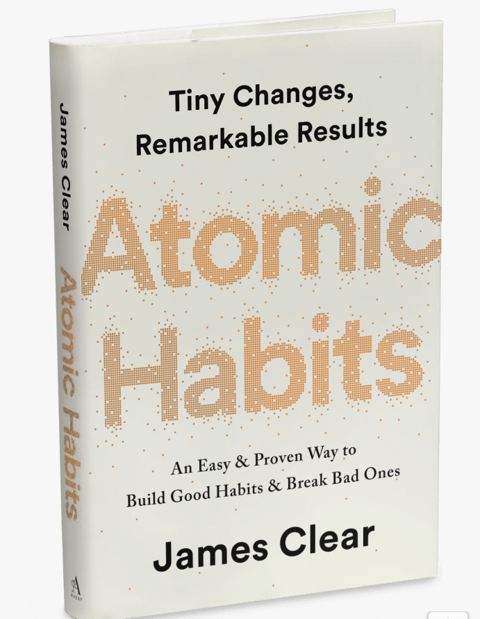
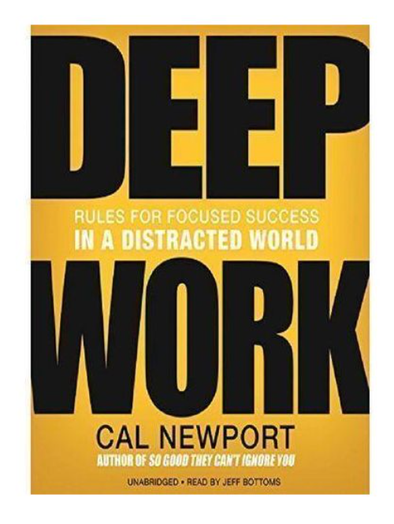
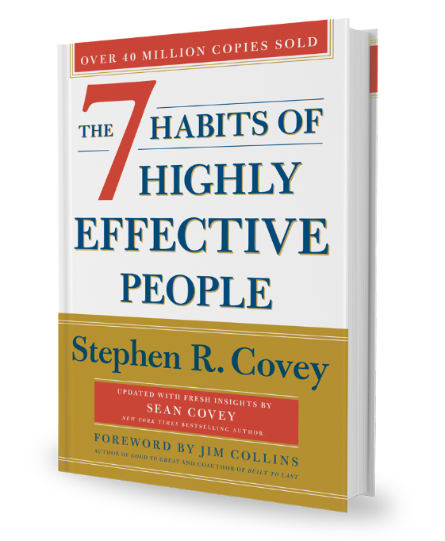
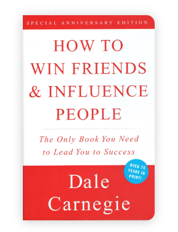
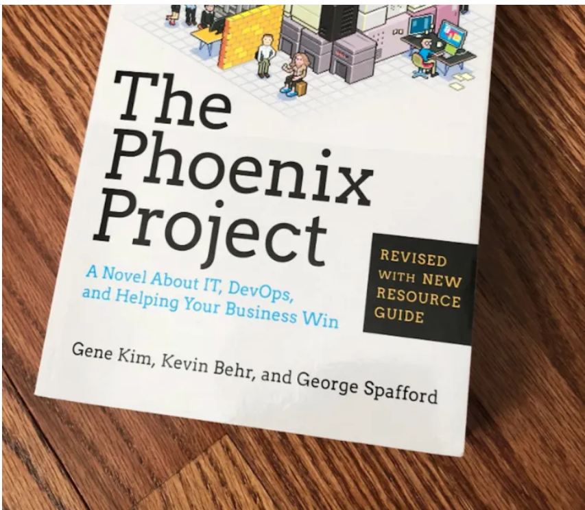
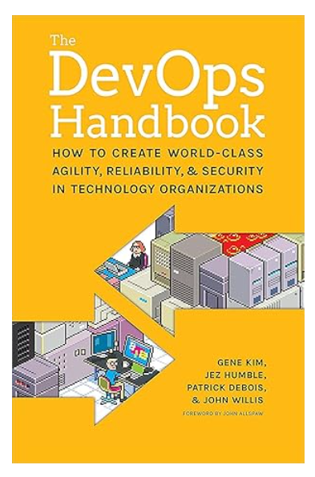
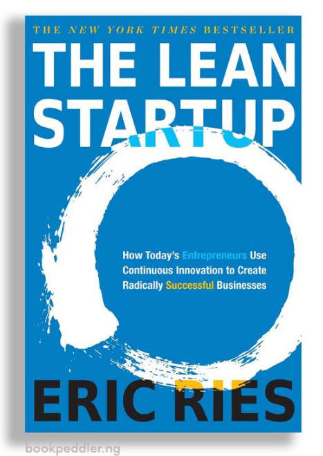
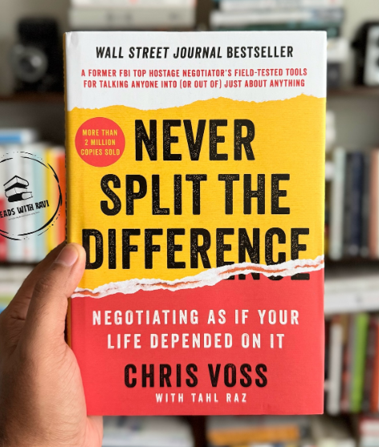
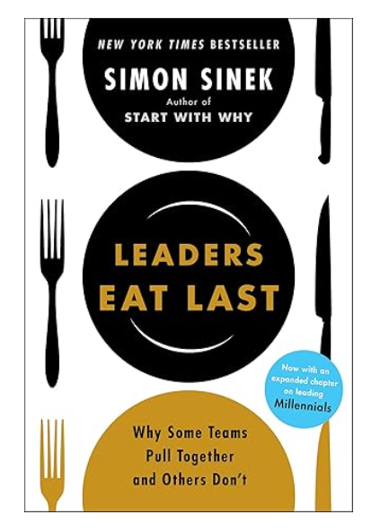

# Week 01 — Success Mindset (Mindset OS)

Part of the DevOps Micro Internship (DMI) Cohort 3 with Agentic AI

---

## Purpose (Read This First)

This week is not motivation homework.

This is you building your **Mindset OS** — the system you will use for the next 5 months (and honestly, for years).

### Expectations

* Be honest.
* Be specific.
* Be practical.
* Write like an adult professional: clear sentences, no one-liners.

You will reuse this in later weeks. So do it properly once.

---

# Assignment 1. What is something you believe to be true that most people around you would disagree with?

### Rules

* No "safe" answers.
* Must be your real belief (not copied from internet).
* Minimum 50 words.

**Hint:** What do you believe about career, money, learning, discipline, relationships, health, success, life, tech industry, etc. that most people don't agree with?

## Answer

I believe that in today's world, skills matter more than certificates or university degrees. Most people around me believe that collecting qualifications is the safest path to a good career, but I disagree. I've seen that employers increasingly value people who can demonstrate real ability through projects, portfolios, and practical experience. That's one reason I've invested so much time learning DevOps and cloud technologies by building things instead of only collecting certificates. I still respect education, but I believe continuous learning and practical skills create more opportunities than relying on qualifications alone.

---

# Assignment 2. What are the top 3 objective truths you discovered through experimentation and results?

### Definition

Objective truths do not depend on opinions. They hold true regardless of how people feel.

Write each truth in this format:

**Truth:** (1 sentence)

**Evidence from my life:** (2–4 lines: what you tried + what happened)

---

## Truth #1

### Truth

Skills improve only through repeated practice.

### Evidence from my life

At first, I only watched DevOps tutorials and felt like I understood Git. When I began using Git commands daily, I made mistakes, fixed them, and eventually became comfortable with branching, cloning, and pushing repositories. Watching alone never produced the same improvement.

---

## Truth #2

### Truth

You cannot permanently remember information that you never review.

### Evidence from my life

I noticed that after learning AWS services without taking notes, I forgot many details within weeks. After I began documenting concepts and reviewing them regularly, I retained much more information and could explain topics without checking my notes.

---

## Truth #3

### Truth

Results reveal whether a method works better than opinions do.

### Evidence from my life

While learning DevOps, I tried simply reading documentation and also tried building small projects. The projects exposed gaps in my understanding that reading alone never revealed, and I learned much faster once I started building instead of only studying.

---

# Assignment 3. What does your 2.0 version look like?

### Instructions

Write as if a journalist is writing about you **3 to 7 years from now** (not 20 years).

**Minimum 300 words.**

### Rules

* Write in past tense, like it already happened.
* Don't use "likes to / wants to / hopes to."
* Use specifics:

  * built
  * shipped
  * led
  * published
  * earned
  * relocated
  * contributed
* Include skills proof:

  * projects
  * portfolios
  * GitHub
  * blogs
  * certifications
  * job role
  * leadership
  * community contribution
* Add 1–3 images if you can (optional but powerful).

### Publish It Publicly On Any ONE

* LinkedIn
* Medium
* WordPress
* Blogspot
* Personal blog
* Portfolio page

Include this line:

> **P.S. This post is part of the DevOps Micro Internship (DMI) with Agentic AI — Cohort 3 — by [Pravin Mishra](https://www.linkedin.com/in/pravin-mishra-aws-trainer/). My graded progress is public: https://dmi.pravinmishra.com/s/YOUR-GITHUB-USERNAME.html · Start your DevOps journey: https://dmi.pravinmishra.com/?utm_source=student&utm_medium=ps-blog&utm_campaign=cohort3**

## Your Article

Every version tells a story. Here's mine.
Today, I'm excited to share Version 2.0 of my journey through my latest Hashnode article:
My Journey into Cloud & DevOps: From AWS re/Start to DMI Cohort 3
This version reflects how my journey has evolved—from completing AWS re/Start to actively strengthening my DevOps skills through the DevOps Micro-Internship (DMI) with Agentic AI—Cohort 3, mentored by Pravin Mishra.
In this article, I share:
 How AWS re/Start laid the foundation for my cloud journey.
 My first portfolio website deployed on Amazon S3.
 How DMI Cohort 3 is shaping my DevOps learning.
 My vision for the next stage of my career.
Growth should be visible.
Instead of waiting until I've "made it," I've chosen to learn in public, document my progress, and improve one project at a time.
This is Version 2.0 of my story, and I know there will be a Version 3.0, Version 4.0, and beyond as I continue learning, building, and sharing.
 Read the article here: https://lnkd.in/dChExa3X
I'm grateful to Pravin Mishra, Faith Samson, Anjana Muthunayake and the DevOps Micro Internship (DMI) with Agentic AI – Cohort 3 community for fostering a culture of hands-on learning and continuous improvement.
I'd love to hear your thoughts!
Building in public. Learning continuously. Growing one version at a time.

### Public Link

Paste your link here:

https://www.linkedin.com/posts/kingsley-erhatiemwonmon_devops-aws-cloudcomputing-share-7478083739001221121-pNYZ/?utm_source=share&utm_medium=member_desktop&rcm=ACoAAClDkSEBa4Zo6dTWVIEEl8FJLczvH_zPHtY

---

# Assignment 4. Have you ever cut corners (unethical / dishonest / shortcut behavior — not necessarily illegal)? If yes, how did it make you feel?

### Important

You don't need to write the full story.

Focus on the feeling:

* guilt
* fear
* shame
* stress
* regret
* numbness
* etc.

This is about self-awareness, not judgment.

### Answer Format

Yes 

If Yes:

**What emotion did you feel?** (minimum 50–100 words)

## Answer

Yes

I felt guilty and uneasy afterward. At first, taking the shortcut seemed like the easiest thing to do, but it didn't sit well with me. I kept thinking about whether I had done the right thing, and that made me feel stressed and disappointed in myself. Looking back, I realized that the temporary convenience wasn't worth the feeling that followed. The experience taught me the importance of being honest and taking responsibility for my actions, even when the right choice takes more time or effort.

---

# Assignment 5. What are 10 non-fiction books you plan to read in the next 1 year?

### Rules

* Mention **Title + Author**
* Any language allowed
* No fiction novels

### Tip

Choose books that improve:

* mindset
* communication
* productivity
* health
* money
* career
* leadership

## Book List

1. Atomic Habits — James Clear

2. Deep Work — Cal Newport

3. The 7 Habits of Highly Effective People — Stephen R. Covey

4. The Psychology of Money — Morgan Housel

5. How to Win Friends and Influence People — Dale Carnegie

6. The Phoenix Project — Gene Kim, Kevin Behr, and George Spafford

7. The DevOps Handbook — Gene Kim, Jez Humble, Patrick Debois, John Willis, and John Allspaw

8. The Lean Startup — Eric Ries

9. Never Split the Difference — Chris Voss

10. Leaders Eat Last — Simon Sinek

---

# Assignment 6. What are the things you will measure regularly in your life and career?

### Rules

List topics only. No need to share numbers.

### Must Include

* Learning / skill
* Output / proof
* Health / energy
* Time / focus
* Money / finance (personal or business)

### Example

* Learning hours per week
* Deep work sessions per week
* Projects shipped / documented
* Steps / workouts
* Sleep hours
* Spending tracker

## My Metrics

* Learning hours each week
* DevOps labs and hands-on practice completed
* GitHub projects and documentation
* Certifications completed
* Deep work sessions
* Time spent on focused learning
* Daily exercise or workouts
* Sleep hours
* Energy and productivity levels
* Personal spending and savings

---

# Assignment 7. Brain Dump + 5-Month System Plan

## Step 1: Brain Dump (Private)

Do a brain dump of everything in your mind into a notebook.

Examples:

* Bills
* Tasks
* Worries
* Goals
* Pending messages
* Ideas
* Responsibilities

### Did You Do It?

Yes

Answer:

I completed a brain dump by writing down everything that was on my mind, including tasks, goals, responsibilities, ideas, pending commitments, and personal concerns. This helped me organize my thoughts, identify priorities, and reduce mental clutter before creating a plan for the next five months

---

## Step 2: Your 5-Month Routine + Focus Blocks

Create a simple plan you can realistically follow for the next 5 months.

### Weekly Routine

Example:

* Mon–Thu: 60 min deep work
* Sat: DMI session
* Sun: Weekly review

#### My Weekly Routine

Monday–Friday: 2 hours of focused DevOps learning and hands-on practice
Monday–Friday: 30 minutes of reviewing notes and documenting key learnings
Tuesday & Thursday: Practice Git, GitHub, Linux, and AWS CLI commands
Wednesday & Friday: Build or improve a DevOps project and push updates to GitHub
Saturday: Attend DMI sessions, complete assignments, and revise the week's topics
Sunday: Review weekly progress, plan the coming week, update my portfolio, and prepare for upcoming interviews or job applications.

Focus Blocks
Learning & Skill Development: AWS, Linux, Git, Docker, Jenkins, Kubernetes, Terraform, and CI/CD
Hands-on Projects: Build real-world DevOps projects, document them, and maintain an active GitHub portfolio
Career Growth: Prepare for technical interviews, update my CV and LinkedIn profile, and apply for relevant opportunities
Health & Well-being: Exercise regularly, get enough sleep, and maintain a healthy work-life balance
Personal Development: Read technical articles, reflect on weekly progress, and continuously improve my problem-solving skills

---

### Focus Blocks

#### When Will You Do DMI Work? (Days + Time)

Monday – Friday: 7:00 PM – 9:00 PM (DMI lessons, hands-on practice, and assignments)
Saturday: 10:00 AM – 1:00 PM (Attend DMI sessions, complete assignments, and revise the week's topics)
Sunday: 5:00 PM – 6:00 PM (Review progress, organize notes, and plan the next week's learning)

#### How Many Sessions Per Week?

6 focused DMI sessions per week, with a weekly review and planning session on Sunday.

---

### Distraction Rules

Examples:

* Phone rules
* Social media rules
* Environment setup

#### My Distraction Rules

Keep my phone on Do Not Disturb during study sessions.
Avoid social media until I complete my daily learning goals.
Study in a quiet, organized workspace with minimal distractions.
Close unnecessary browser tabs and applications while studying.
Take short breaks between focus sessions instead of checking my phone frequently.
Keep only the learning materials needed for the current task open.

---

# Reflection – Week 1

### Biggest insight I got about myself this week

The biggest insight I gained this week is that achieving success is less about motivation and more about building the right mindset and systems. I realized that I often focused on short-term results instead of thinking about where my daily actions would lead me in the long run.

Learning about the DMI mindset pillars challenged me to start upgrading my identity by seeing myself as the kind of person who consistently learns, takes action, and keeps improving. It also made me reflect on the standards I set for myself and what I have been willing to tolerate, such as procrastination and inconsistency. Most importantly, I now understand that creating productive systems and a supportive environment will help me stay disciplined even on days when motivation is low.

This week has shifted my perspective from chasing quick wins to intentionally building habits and systems that will support my long-term growth as a DevOps Engineer.

### My biggest weakness/loop I noticed

One of the biggest weaknesses I noticed is that I sometimes rely too much on motivation instead of following a consistent system. When I feel motivated, I make good progress, but when that motivation drops, my productivity also declines. I also realized that I can become too focused on immediate results, which sometimes makes me impatient with the learning process.

This week's lessons helped me understand that lasting success comes from maintaining high standards, thinking long-term, and trusting well-designed systems rather than emotions. Going forward, I want to focus on building habits that keep me moving forward consistently, regardless of how I feel on a particular day.

### One system I will implement from this week (exact habit + time)

Starting this week, I will dedicate 7:00 PM to 9:00 PM every weekday to focused DevOps learning and hands-on practice. During this time, I will keep my phone on silent, close unnecessary tabs, and work through one learning objective at a time. At the end of each session, I will spend 10 minutes reviewing what I learned and planning my next task for the following day. This system will help me stay consistent and make steady progress toward my long-term goal of becoming a DevOps Engineer.

### LinkedIn Post

Paste your LinkedIn post link here:

https://www.linkedin.com/posts/kingsley-erhatiemwonmon_devops-learninginpublic-continuouslearning-share-7478319270989574144-0QL7/?utm_source=share&utm_medium=member_desktop&rcm=ACoAAClDkSEBa4Zo6dTWVIEEl8FJLczvH_zPHtY

---

## 10. Proof of Work

- LinkedIn Post URL: https://www.linkedin.com/posts/kingsley-erhatiemwonmon_devops-aws-cloudcomputing-share-7478083739001221121-pNYZ/?utm_source=share&utm_medium=member_desktop&rcm=ACoAAClDkSEBa4Zo6dTWVIEEl8FJLczvH_zPHtY
- Blog / Medium : https://kingzcloud.hashnode.dev/aws-restart-to-dmi-cohort-3-devops-journey 

---

## 📌 About DMI & CloudAdvisory

DevOps Micro Internship (DMI) is a project-based DevOps program run by Pravin Mishra (The CloudAdvisory) focused on real-world execution, systems thinking, and career readiness.

It helps learners build strong DevOps foundations with hands-on experience.

## 📌 Resources

- 🌐 **DMI Official Website:** https://pravinmishra.com/dmi  
- 🎓 **DevOps for Beginners (Udemy):** https://www.udemy.com/course/devops-for-beginners-docker-k8s-cloud-cicd-4-projects/  
- 🎓 **Ultimate Agentic AI DevOps with Clude Code** https://www.udemy.com/course/ultimate-agentic-ai-devops-with-claude-code/?referralCode=448389767BC96284087B
- 🎓 **DevOps with Claude Code: Terraform, EKS, ArgoCD & Helm** https://www.udemy.com/course/devops-with-claude-code-terraform-eks-argocd-helm/?referralCode=1C5B734505D65A010FA3
- ▶️ **YouTube Playlist (DMI Cohort 3):** https://www.youtube.com/playlist?list=PLFeSNDtI4Cho  
- 🔗 **Pravin Mishra (LinkedIn):** https://www.linkedin.com/in/pravin-mishra-aws-trainer/  
- 🏢 **CloudAdvisory (LinkedIn):** https://www.linkedin.com/company/thecloudadvisory/

---

*This submission is part of DevOps Micro Internship (DMI) Cohort 3 — Agentic AI Track*