# Assignment 6 — Building an AI-Assisted Git Safety Net (PR Ready Check)

Part of the DevOps Micro Internship (DMI) Cohort 3 with Agentic AI

---

## Purpose

In Week 2 you built Claude Code hooks that block a dangerous action *before* it happens (`PreToolUse`), and a restricted skill that could look but not touch (`allowed-tools` without `Write`). In this assignment you will discover that Git has the exact same idea, decades older: a **pre-commit hook** that blocks a commit before it's created.

You will build both halves of a real "PR Ready" workflow:

1. A **Git hook that follows fixed rules** — scans staged changes for hardcoded secrets and oversized files and refuses the commit. No AI involved, no guessing, just a rule that gives the same answer every time.
2. A **restricted Claude Code skill** (`/pr-ready`) that reads your staged diff and drafts a Pull Request title, description, and a short list of things worth a second look — the kind of judgment a fixed rule can't make (mixed changes, missing context, unclear intent). The skill never commits, pushes, or opens the PR. You do that yourself, using its draft as a starting point.

This mirrors the Agentic Loop from Week 3's Linux triage assignment: **Gather → Analyze → Human Act → Verify**. The hook and the skill both gather and analyze; only you act.

---

# Task 0 — Confirm Your Fork and Create a Feature Branch

## Goal

Confirm you are working in your own fork, then create a dedicated branch for this assignment.

### Evidence

#### Screenshot 1 — Output of git remote -v and git branch showing the new branch

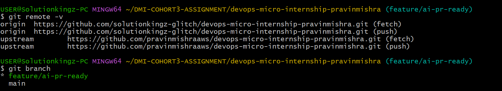

---

### Notes

**1. Why create a dedicated branch instead of doing this work on main?**

Creating a dedicated branch keeps the work isolated from the main branch. This allows me to make, test, and review changes safely without affecting the stable version of the project. If the changes are successful, they can later be merged into main through a controlled pull request.

---

# Task 1 — Stage a Change With Realistic Risk

## Goal

On your own fork of this repository (the one you've been submitting your DMI work in since onboarding), create a new branch and stage a change that a real reviewer should catch: a hardcoded-looking secret and a leftover debug statement.

### Evidence

#### Screenshot 1 — Output of  `git status` showing the staged file on feature/ai-pr-ready

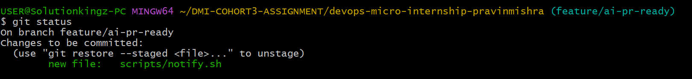

---

### Notes

**1. Why does this assignment use an obviously fake key instead of a real one?**

The assignment uses an obviously fake AWS key to safely demonstrate how credentials can be detected and handled without exposing real authentication secrets. A real AWS credential could provide access to cloud resources and potentially lead to unauthorized activity, data exposure, or unexpected charges. Using a fake key allows the security checks and workflow to be tested safely while ensuring that no actual credentials are compromised.

---

# Task 2 — Write a Real Git Pre-Commit Hook

## Goal

Create a tracked, shareable pre-commit hook that blocks a commit containing secret-like patterns or files over 1MB.

### Evidence

#### Screenshot 2 — `hooks/pre-commit` open in VS Code showing the full script

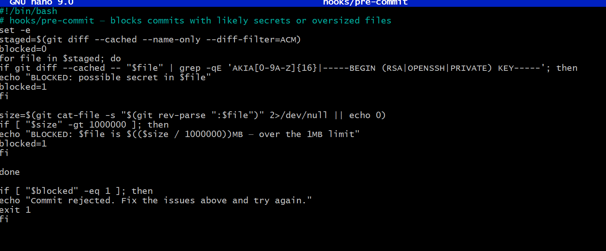

---

#### Screenshot 3 — Output of `git config core.hooksPath` confirming it points to `hooks`

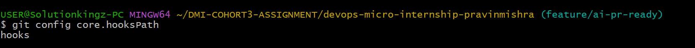

---

### Notes

**1. Why is `hooks/pre-commit` tracked in the repo instead of living only in `.git/hooks/`?**

hooks/pre-commit is tracked in the repository so that the commit-safety rules are version-controlled, visible, and shared with everyone working on the project. Unlike .git/hooks/, which is local to one developer's machine and is not tracked by Git, a tracked hook can be reviewed, updated, and distributed consistently as part of the repository.

---

**2. Compare this to `PreToolUse` from Week 2 Assignment 6. What does each one intercept, and what do they have in common?**

hooks/pre-commit intercepts the Git commit process before a commit is created. It checks staged files for likely AWS access keys, private keys, and files larger than 1 MB. If any of these are detected, it blocks the commit.

The PreToolUse hook intercepts Bash commands before Claude Code executes them. It blocks potentially destructive commands such as terraform destroy, terraform apply -auto-approve, aws s3 rm, and aws s3 rb.

Both have in common that they are preventive safety controls: they inspect an action before it is completed and can stop it when it violates predefined safety rules. The difference is what they protect—PreToolUse controls dangerous commands before execution, while hooks/pre-commit protects the repository from committing secrets or oversized files.

---

# Task 3 — Prove the Hook Blocks the Risky Commit

## Goal

Attempt to commit the staged file from Task 1 and show the hook rejecting it.

### Evidence

#### Screenshot 4 — Terminal showing `git commit` rejected with the hook's "BLOCKED" message naming the exact file

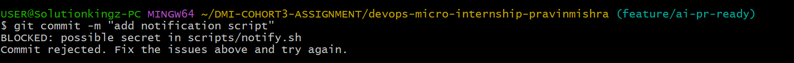

---

### Notes

**1. Which line in `hooks/pre-commit` matched your fake key, and why did it match?**

The line that matched the fake key was the regular expression used by the hook to detect AWS access-key-shaped strings and private-key headers. It matched because the fake AWS key began with the expected AWS access-key prefix and was followed by the required number of uppercase letters or numbers. Although the key was obviously fake, it had the same basic format as an AWS access key, allowing the hook to detect it as a possible secret and block the commit.

---

**2. Could this hook have caught a poorly-named variable that stores a secret without the `AKIA` prefix? What does that tell you about the limits of a fixed rule like this?**

No. This hook would not necessarily catch a poorly named variable containing a secret if the value did not contain the AKIA prefix or a private-key header. This shows that a fixed rule can only detect the specific patterns it has been programmed to look for. It is useful for catching known secret formats, but it is not a complete security solution and can miss secrets that use different formats or naming conventions.

---

# Task 4 — Build the `/pr-ready` Skill

## Goal

Create a manually invoked Claude Code skill that reads your staged changes and produces a PR-readiness report and a draft PR description — without writing, committing, or pushing anything itself.

### Evidence

#### Screenshot 5 — `SKILL.md` frontmatter showing `allowed-tools: Bash, Read, Grep` (no `Write`) and `disable-model-invocation: true`

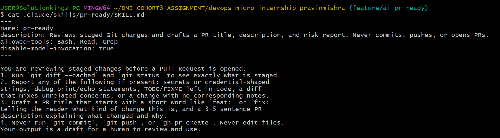

---

#### Screenshot 6 — `/pr-ready` output while the risky file is still staged, showing it flagged the secret and/or debug statement

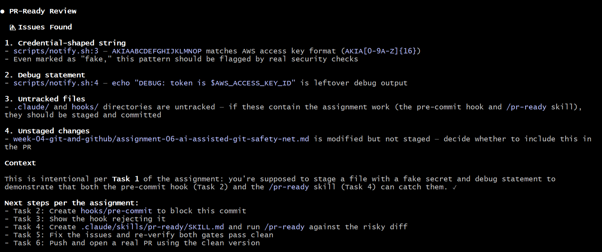
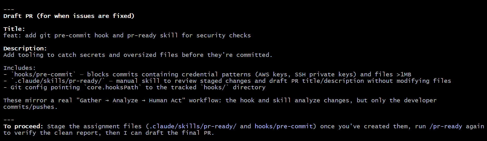

---

### Notes

**1. Why does `/pr-ready` have `Bash` and `Read` but not `Write`?**

/pr-ready has Bash and Read but not Write because its purpose is to inspect and review staged changes, not to modify files. Bash allows it to run commands such as git diff --cached and git status, while Read allows it to examine relevant files. Excluding Write prevents the skill from changing the repository while performing its review, helping keep the process safe and ensuring that the human remains in control of any file modifications.

---

**2. The pre-commit hook and `/pr-ready` both looked at the same staged diff. Did they flag the same things? What did one catch that the other didn't?**

No, they did not flag exactly the same things. The hooks/pre-commit hook specifically checked the staged diff for AWS access-key patterns and private-key headers, as well as files larger than 1 MB. The /pr-ready skill reviewed the staged changes more broadly for secrets or credential-shaped strings, debug print or echo statements, TODO/FIXME comments, unrelated changes, and missing notes.

Therefore, the pre-commit hook could catch an oversized file that /pr-ready was not specifically designed to check, while /pr-ready could catch issues such as debug output, leftover TODO/FIXME comments, mixed concerns, or missing notes that the pre-commit hook would not detect. They provide different layers of protection rather than duplicating the same checks.

---

# Task 5 — Fix the Issues and Re-Verify

## Goal

Remove the secret and debug statement, then prove both gates now pass clean.

### Evidence

#### Screenshot 7 — `git commit` succeeding after the fix (no BLOCKED message)

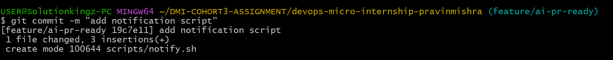

---

#### Screenshot 8 — Second `/pr-ready` run showing a clean risk report and a drafted PR title + description

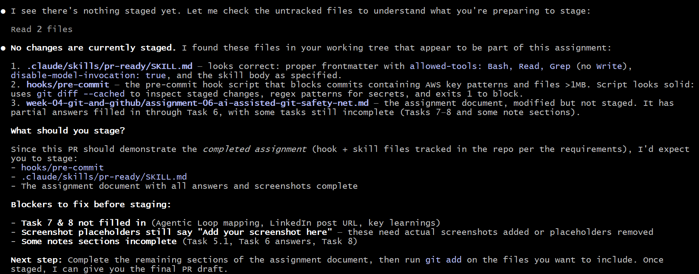

---

### Notes

**1. What exactly did you change to satisfy the pre-commit hook?**

I removed the credential-shaped AWS access key assignment from the file. This satisfied the pre-commit hook because the staged diff no longer contained a string matching the AWS access-key detection rule defined in the hook.

---

# Task 6 — Push and Open a Pull Request Using the AI Draft

## Goal

Push your branch and open a real Pull Request, using `/pr-ready`'s drafted title and description as your starting point — read it critically and edit before you use it.

**Important:** Open this Pull Request with base repository set to **your own fork** — not the shared upstream `pravinmishraaws/devops-micro-internship-pravinmishra` repository. This assignment's hook and skill files are your own practice work, not a change meant for the shared class repo.

### Evidence

#### Screenshot 9 — Your Pull Request showing the base repository is your own fork, plus the title and description, with the `/pr-ready` draft visible for comparison (paste it in the PR conversation or your notes below)

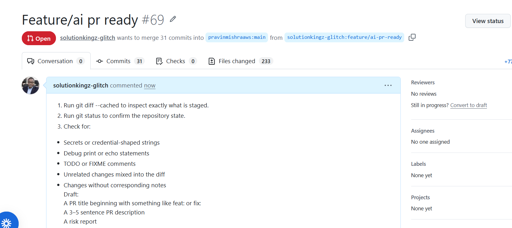

---

#### PR Link

https://github.com/pravinmishraaws/devops-micro-internship-pravinmishra/pull/69

---

### Notes

**1. What, if anything, did you edit in the AI's drafted PR description before using it? Why?**

I did not edit the AI's drafted PR description before using it because the description accurately reflected the staged changes and the purpose of the assignment. I reviewed the AI-generated draft to ensure that it did not contain incorrect information, secrets, or unrelated changes. Since it was accurate and suitable for the Pull Request, I used it as drafted.

---

**2. If you had blindly copy-pasted the AI's draft without reading it, what could go wrong?**

If I had blindly copy-pasted the AI's draft without reading it, it could have contained inaccurate information, overlooked a secret or credential-shaped string, or failed to mention an important risk in the staged changes. It could also have described changes that were not actually made or included unrelated information, resulting in a misleading Pull Request. Reviewing the AI's draft first ensures that I remain responsible for the final content and can correct any errors before using it.

---

**3. Why does this PR need to target your own fork instead of the shared upstream repository?**

This Pull Request must target my own fork because this assignment is an exercise in my personal working repository, not a contribution to the shared upstream repository. Using my fork as the base keeps the assignment changes isolated from the upstream project and prevents unrelated or personal assignment files from being submitted to the shared repository. It also allows me to practice the Pull Request workflow safely within my own repository.

---

# Task 7 — Map the Workflow to the Agentic Loop

## Goal

Explain this assignment's workflow using the same Gather → Analyze → Human Act → Verify structure from Week 3.

### Notes

**1. Which step(s) represent Gather?**

The **Gather** step is represented by reviewing the staged changes before opening the Pull Request. This includes running `git diff --cached` and `git status` to see exactly what has been staged. The `/pr-ready` skill then gathers information about possible secrets, credential-shaped strings, debug statements, TODO/FIXME comments, unrelated changes, and missing notes.

---

**2. Which step(s) represent Analyze?**

The **Analyze** step is represented by reviewing the information gathered from the staged changes and identifying potential risks or issues. The `/pr-ready` skill analyzes the diff for secrets or credential-shaped strings, debug statements, TODO/FIXME comments, unrelated changes, and missing notes. It also analyzes the changes to draft an appropriate PR title, description, and risk report.

---

**3. Which step is Human Act, and why must a human — not Claude — run `git commit`, `git push`, and open the PR?**

The **Human Act** step is represented by the human reviewing the AI's draft and then personally performing the required Git actions: `git commit`, `git push`, and creating the Pull Request.

A human must perform these actions because they are consequential changes to the repository and remote GitHub state. Keeping these actions under human control provides a safety checkpoint where the person can verify the AI's analysis, confirm the correct branch and repository, and ensure that no secrets or unintended changes are committed or published. This prevents Claude from autonomously making irreversible or externally visible changes.

---

**4. Which step is Verify?**

The **Verify** step is represented by checking that the human-performed actions completed successfully and that the final repository state is correct. This includes confirming that the commit was created successfully, the branch was pushed to my own fork, and the Pull Request was opened against the correct base repository. It also involves reviewing the final Pull Request to ensure that the intended changes and description are present and that no secrets or unintended changes were included.

---

**5. In one or two sentences: why do you need *both* the fixed-rule pre-commit hook and the AI skill? Isn't one enough?**

Both are needed because they provide different layers of protection. The fixed-rule `pre-commit` hook reliably blocks specific, known patterns such as credential-shaped AWS keys, private keys, and oversized files, while the AI `/pr-ready` skill performs a broader contextual review for issues such as debug statements, TODO/FIXME comments, unrelated changes, and missing notes.

---

# Task 8 — LinkedIn Post

## Goal

Publish a LinkedIn post summarizing what you built and what you learned about combining fixed-rule safety checks with AI-assisted review.

### Evidence

#### LinkedIn Post URL

https://www.linkedin.com/posts/kingsley-erhatiemwonmon_devops-devsecops-git-ugcPost-7486055930992775168-bh4D/?utm_source=share&utm_medium=member_desktop&rcm=ACoAAClDkSEBa4Zo6dTWVIEEl8FJLczvH_zPHtY

---

## Key Learnings

Add 3-5 bullet points on what you learned this week.

- Learned how to create a tracked Git pre-commit hook that uses fixed rules to detect secret-like patterns and oversized files before a commit is created.
- Learned how to configure Git with core.hooksPath so repository hooks can be shared and version-controlled instead of living only in .git/hooks/.
- Learned how to build a restricted Claude Code skill using allowed-tools without Write and disable-model-invocation: true to control how AI interacts with a repository.
- Learned the difference between deterministic rule-based safety checks and AI-assisted contextual review, and why both are valuable in a secure development workflow.
- Learned how to apply the Gather → Analyze → Human Act → Verify Agentic Loop to a Git/GitHub workflow while keeping commits, pushes, and Pull Request creation under human control.

---

# Submission Instructions

- Ensure `hooks/pre-commit` and `.claude/skills/pr-ready/SKILL.md` are committed to your GitHub repository
- Add all required screenshots to your submission
- All written answers must be in your own words
- Do not use a real secret or credential anywhere in your submission — the fake key in Task 1 is intentional and must stay clearly fake
- Open your Pull Request against your own fork, not the shared upstream repository
- Push your final changes to your forked repository
- Include your PR link and LinkedIn post URL

---

## GitHub Repository URL

Paste your forked repository URL here:

https://github.com/solutionkingz-glitch/devops-micro-internship-pravinmishra

---

# Completion Checklist

- [ ] Branch `feature/ai-pr-ready` created with a staged file containing a fake secret and a debug statement
- [ ] `hooks/pre-commit` created and tracked in the repo (not only in `.git/hooks/`)
- [ ] `core.hooksPath` configured to point at `hooks/`
- [ ] Pre-commit hook shown blocking the risky commit
- [ ] `.claude/skills/pr-ready/SKILL.md` created with correct `allowed-tools` (no `Write`) and `disable-model-invocation: true`
- [ ] `/pr-ready` run against the risky diff and shown flagging issues
- [ ] Risky file fixed; `git commit` succeeds cleanly
- [ ] `/pr-ready` re-run showing a clean report and drafted PR title/description
- [ ] Pull Request opened using the AI draft as a starting point, with your own fork as the base repository (not upstream), PR link included
- [ ] Agentic Loop mapping (Task 7) completed in your own words
- [ ] LinkedIn post published and URL submitted
- [ ] All required screenshots added
- [ ] GitHub repository URL provided

---

## 📌 About DMI & CloudAdvisory

DevOps Micro Internship (DMI) is a project-based DevOps program run by Pravin Mishra (The CloudAdvisory) focused on real-world execution, systems thinking, and career readiness.

It helps learners build strong DevOps foundations with hands-on experience.

---

## 📌 Resources

- 🌐 DMI Official Website: https://pravinmishra.com/dmi  
- 🎓 DevOps for Beginners (Udemy): https://www.udemy.com/course/devops-for-beginners-docker-k8s-cloud-cicd-4-projects/  
- 🎓 Agentic AI DevOps with Claude Code: https://www.udemy.com/course/ultimate-agentic-ai-devops-with-claude-code/  
- 🎓 DevOps with Claude Code: Terraform, EKS, ArgoCD & Helm: https://www.udemy.com/course/devops-with-claude-code-terraform-eks-argocd-helm/  
- ▶️ YouTube Playlist: https://www.youtube.com/playlist?list=PLFeSNDtI4Cho  
- 🔗 Pravin Mishra (LinkedIn): https://www.linkedin.com/in/pravin-mishra-aws-trainer/  
- 🏢 CloudAdvisory (LinkedIn): https://www.linkedin.com/company/thecloudadvisory/

---

*This submission is part of DevOps Micro Internship (DMI) Cohort 3 — Agentic AI Track.*
