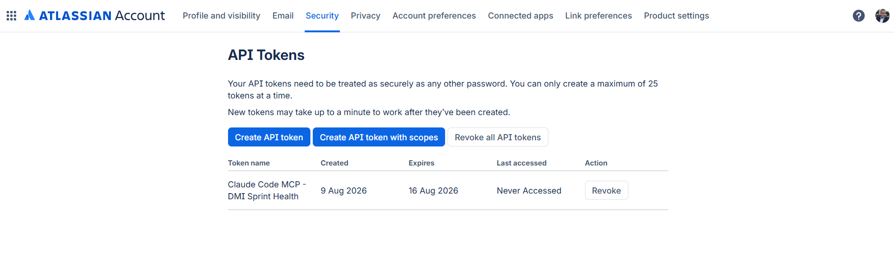
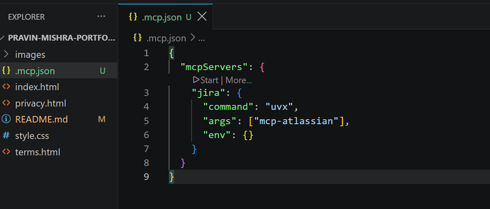
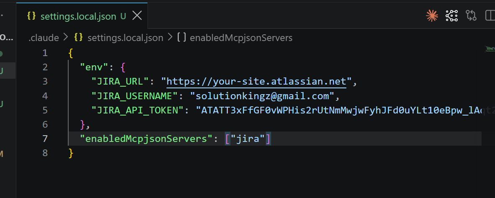
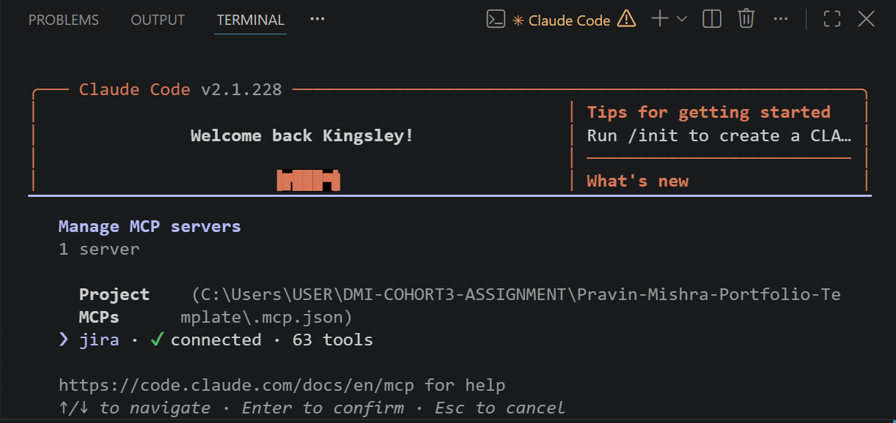
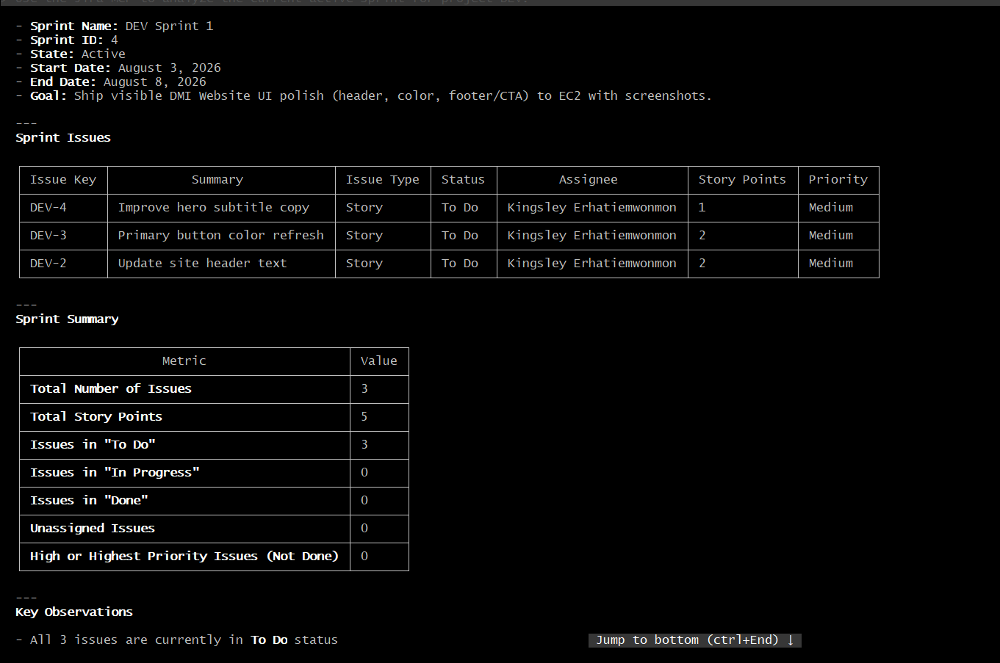
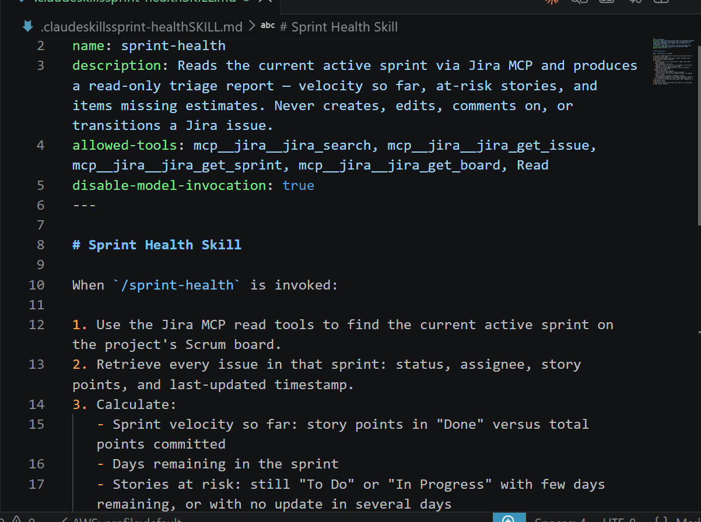
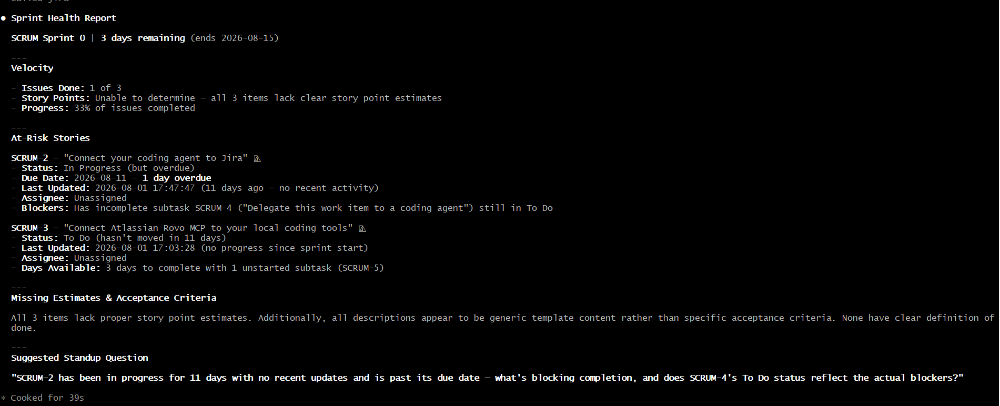
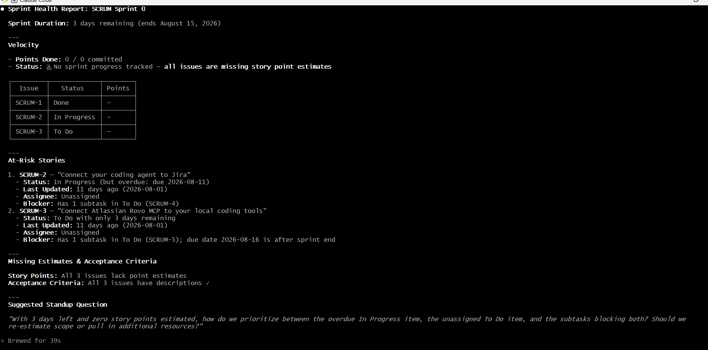

# Assignment 5 — AI-Assisted Sprint Health Report via Jira MCP

Part of the DevOps Micro Internship (DMI) Cohort 3 with Agentic AI

---

## Purpose

In this assignment, you will connect Claude Code to your Jira board through an MCP server, the same way you connected it to GitHub in Week 2, and build a read-only `/sprint-health` skill. The skill reads your current sprint through Jira's API and reports sprint velocity, stories at risk of missing the sprint, and items missing an estimate — but it must never create, edit, comment on, or transition a single ticket itself. You will prove that boundary holds by making a real change on the board yourself and confirming the skill only ever reports, never acts.

---

# Task 1 — Create a Jira API Token

## Goal

Generate an API token from your Atlassian account that the MCP server will use to authenticate with your Jira site. Do not screenshot the token value itself.

### Evidence

#### Screenshot 1 — Jira API token creation confirmation page showing the token name, with the token value not visible

### Notes You Must Write (Very Important):

Why does the MCP server need your site URL and account email in addition to the token?

The MCP server needs the Jira site URL and account email in addition to the API token because these details identify the Jira account and workspace that the server should connect to. The site URL tells the MCP server which Jira instance to access, while the account email identifies the Jira user associated with the API token. The API token acts as the authentication credential that allows the MCP server to securely make authorized requests to Jira on the user's behalf

---

# Task 2 — Create .mcp.json at the Project Root

## Goal

Create or update `.mcp.json` at your project root with a Jira MCP server block, following the same shape as the GitHub MCP server you configured in Week 2.

### Evidence

#### Screenshot 2 — `.mcp.json` open in VS Code showing the Jira server configuration

### Notes You Must Write (Very Important):

Compare this jira block to the github block from Week 2 Assignment 5. The GitHub server ran via npx (a Node.js package); this one runs via uvx (a Python package) — what stays exactly the same shape despite that difference, and why doesn't Claude Code care which language a given MCP server is written in?

The GitHub and Jira MCP blocks have the same basic structure even though they use different runtimes. Both define an mcpServers object, give the server a name, specify a command, provide args, and optionally define env variables.

The GitHub server uses npx to run a Node.js package, while the Jira server uses uvx to run a Python package. Claude Code does not need to know or care which programming language the MCP server uses because it communicates with the server through the standard MCP (Model Context Protocol) interface. The runtime command simply starts the server; once running, Claude Code interacts with it through the same MCP protocol regardless of whether the implementation is written in JavaScript, Python, or another supported language

---

# Task 3 — Add Your Credentials to settings.local.json

## Goal

Add your Jira site URL, account email, and API token to `.claude/settings.local.json`, and confirm that file is listed in `.gitignore` so it is never committed.

### Evidence

#### Screenshot 3 — `settings.local.json` open in VS Code showing the `env` section, with the actual token value blurred or covered

### Notes You Must Write (Very Important):

Why must JIRA_API_TOKEN live in settings.local.json and never in .mcp.json?

JIRA_API_TOKEN must live in .claude/settings.local.json because it is a secret credential that authenticates access to Jira. The file is local to the developer's environment and should be listed in .gitignore so the token is not accidentally committed to GitHub.

The .mcp.json file is intended for the MCP server configuration, such as the server name, command, arguments, and non-sensitive environment configuration. Putting the Jira token there increases the risk of exposing the credential through version control or sharing the project configuration.

In short: .mcp.json defines how to start the MCP server; settings.local.json stores local secrets and permissions that should remain private.

---

# Task 4 — Verify the Connection with /mcp

## Goal

Restart Claude Code and confirm the Jira MCP server shows as connected.

### Evidence

#### Screenshot 4 — `/mcp` output showing `jira: connected`

---

# Task 5 — Run a Live Query to Prove Real Board Data

## Goal

Ask Claude to list the issues in your current active sprint through the Jira MCP connection, and confirm the result matches what you see on your live board in the browser.

### Evidence

#### Screenshot 5 — Claude's response showing the live sprint issue list retrieved via Jira MCP

### Notes You Must Write (Very Important):

How did you confirm this was real board data and not something Claude guessed?

I confirmed it was real board data because Claude retrieved the information directly through the Jira MCP using live Jira data. I cross-checked the returned project and sprint details against the Jira board in the browser, including the project key (DEV), issue keys, and sprint status. The values matched the actual Jira board, so they were not guessed or fabricated.

---

# Task 6 — Build the /sprint-health Skill

## Goal

Create a `/sprint-health` skill restricted to read-only Jira tools plus `Read`, with no issue-mutating tools and no `Write`. Run it and confirm it produces a report covering sprint velocity, at-risk stories, and items missing an estimate.

### Evidence

#### Screenshot 6 — `SKILL.md` frontmatter showing `allowed-tools` limited to read-only Jira tools plus `Read`, with `disable-model-invocation: true`

#### Screenshot 7 — `/sprint-health` output showing the full triage report against your real sprint

### Notes You Must Write (Very Important):

1. Which Jira MCP tools does this skill's allowed-tools list include, and which mutating tools (create issue, update issue, transition issue, add comment) does it deliberately exclude?

The skill deliberately allows only read-oriented Jira MCP tools:

mcp__jira__jira_search — search Jira issues
mcp__jira__jira_get_issue — retrieve issue details
mcp__jira__jira_get_sprint — retrieve sprint information
mcp__jira__jira_get_board — retrieve board information
Read — read local files when needed

It deliberately excludes mutating tools, such as:

Create issue
Update/edit issue
Transition issue
Add comment

This keeps the /sprint-health skill read-only. It can inspect and report Jira data but cannot change anything.

2. Why does a Scrum Master need this restriction more than almost any other role in this course?

A Scrum Master needs this restriction because their role is primarily to facilitate, monitor, and help the team improve, not to secretly modify the team's work.

A read-only skill prevents the AI from accidentally:

Changing an issue's status
Changing story points
Reassigning work
Creating or deleting issues
Adding comments that could influence the team's record

This preserves the integrity of the Scrum board and sprint data. The Scrum Master can use AI to identify risks and provide insights, while humans remain responsible for deciding and making changes.

---

# Task 7 — Prove the Skill Never Mutates the Board

## Goal

Manually update one ticket on your board in the browser (for example, move a story to "Done" or add a missing estimate), then run `/sprint-health` again and confirm the new report reflects your change — proving the skill only ever reads live state and never wrote to the board itself.

### Evidence

#### Screenshot 8 — Second `/sprint-health` run showing the report now reflects your manual board change

### Notes You Must Write (Very Important):

Map this assignment to Gather → Analyze → Human Act → Verify from Week 3 Assignment 6. Which step did you perform manually in the browser, and why must that step stay human?

Gather: The Jira MCP gathered live data from the DEV project, active sprint, board, and sprint issues.

Analyze: The /sprint-health skill analyzed the retrieved data to calculate sprint velocity, identify at-risk stories, missing estimates, unassigned issues, and high-priority work that was not Done.

Human Act: I manually used the Jira browser to verify the project, board, sprint, and issue information and to make any actual Jira changes when required.

Verify: I compared the MCP results with the live Jira board to confirm that the reported information matched the real Jira data.

The Human Act step must stay human because AI should not autonomously modify sprint data or make Scrum decisions. A human Scrum Master or team member must remain responsible for changes such as updating status, estimates, assignments, or sprint decisions. This prevents unintended changes and keeps accountability with the team.

---

# Submission Instructions

Complete all tasks in sequence.

Your submission must include:
- All 8 required screenshots
- All the required notes

---

# Completion Checklist

- [ ] Task 1: Jira API token created, value never screenshotted (Screenshot 1)
- [ ] Task 2: `.mcp.json` has the Jira server block (Screenshot 2)
- [ ] Task 3: Credentials stored in `settings.local.json`, token blurred, file gitignored (Screenshot 3)
- [ ] Task 4: `/mcp` shows the Jira server connected (Screenshot 4)
- [ ] Task 5: Live query returned real sprint data, verified against the browser (Screenshot 5)
- [ ] Task 6: `/sprint-health` skill created with correct read-only `allowed-tools`, and produced a full report (Screenshots 6–7)
- [ ] Task 7: A manual board change was reflected in a second `/sprint-health` run (Screenshot 8)
- [ ] Skill never created, edited, transitioned, or commented on any issue
- [ ] Reflection answered (Notes)
- [ ] No API token value exposed

---

## 📌 About DMI & CloudAdvisory

DevOps Micro Internship (DMI) is a project-based DevOps program run by Pravin Mishra (The CloudAdvisory) focused on real-world execution, systems thinking, and career readiness.

It helps learners build strong DevOps foundations with hands-on experience.

---

## 📌 Resources

- 🌐 DMI Official Website: https://dmi.pravinmishra.com?utm_source=github&utm_medium=readme  
- 🎓 University: https://university.pravinmishra.com?utm_source=github&utm_medium=readme  
- 💬 Discord Community: https://discord.pravinmishra.com?utm_source=github&utm_medium=readme  
- 📝 Blog: https://dmi.pravinmishra.com/blog?utm_source=github&utm_medium=readme  
- ▶️ YouTube Playlist: https://www.youtube.com/playlist?list=PLFeSNDtI4Cho  
- 🔗 Pravin Mishra (LinkedIn): https://www.linkedin.com/in/pravin-mishra-aws-trainer/  
- 🏢 CloudAdvisory (LinkedIn): https://www.linkedin.com/company/thecloudadvisory/

---

*This submission is part of DevOps Micro Internship (DMI) Cohort 3 — Agentic AI Track.*
