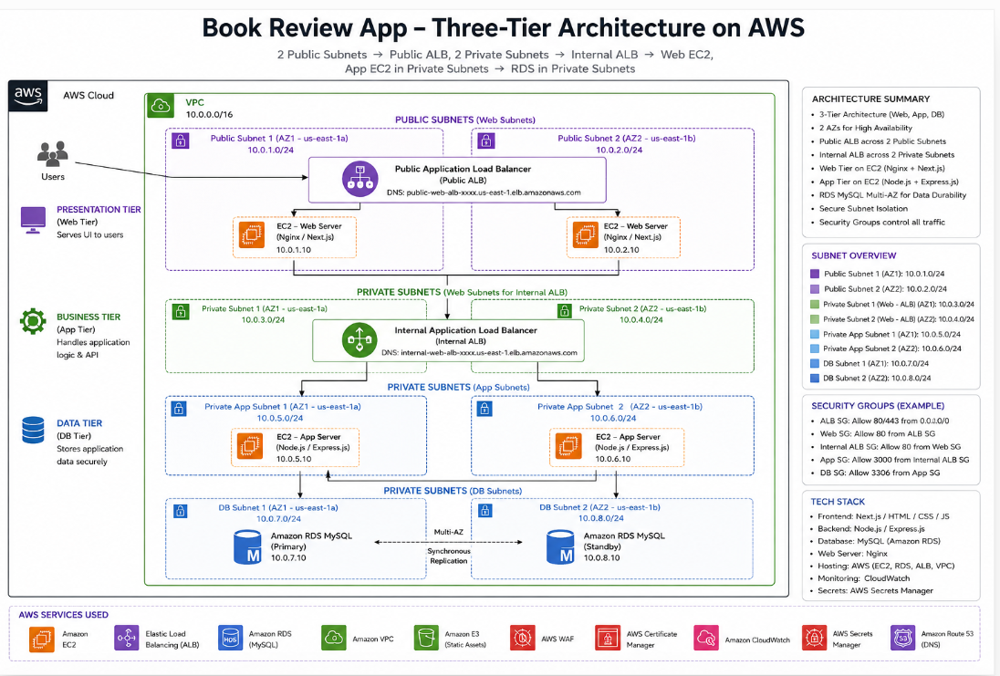
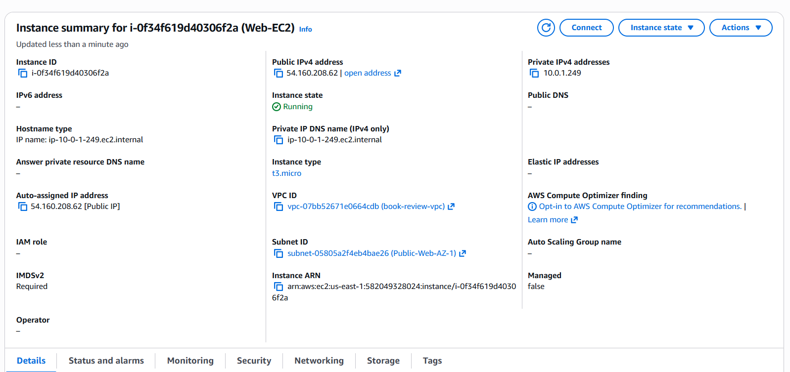
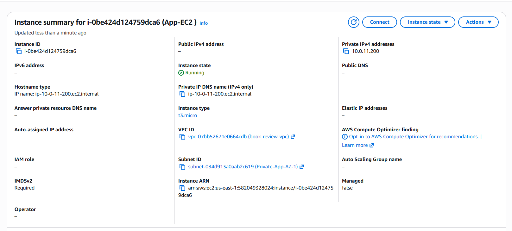
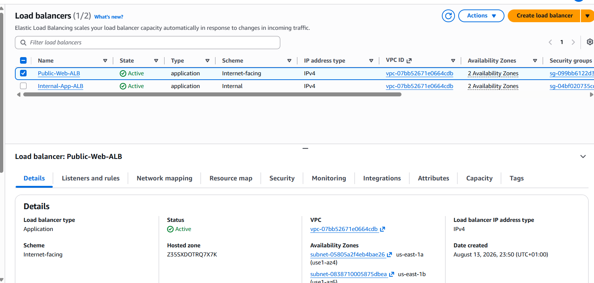
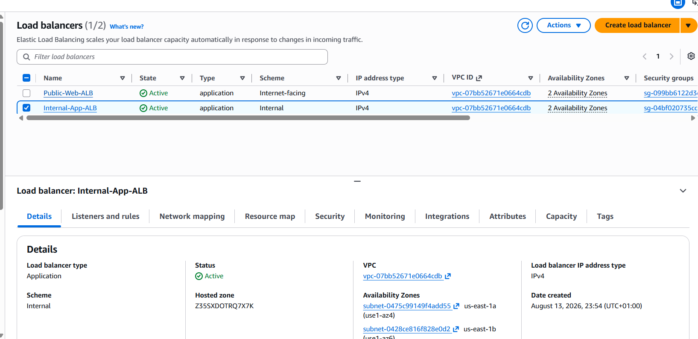
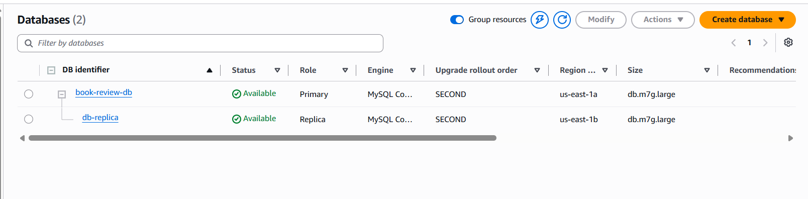
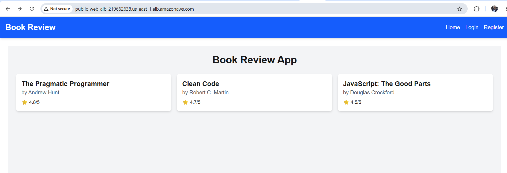
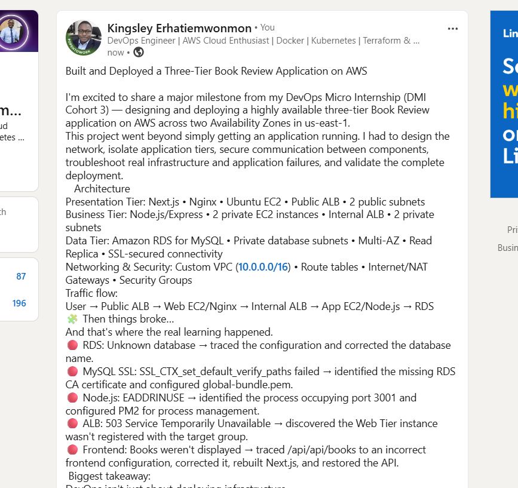

# Assignment 6 — Capstone Assignment — Deploy Book Review App (Three-Tier Architecture) on AWS

Part of the DevOps Micro Internship (DMI) Cohort 3 with Agentic AI

---

## Purpose

This is the most important assignment of the course. You will deploy the Book Review App in a fully production-style three-tier architecture on AWS: a Next.js Web Tier behind Nginx and a public ALB, a private Node.js/Express App Tier behind an internal ALB, and a private Multi-AZ MySQL RDS database with a read replica. You are expected to design, deploy, isolate, debug, and document the result independently.

---

# Task 1 — Architecture Diagram

## Goal

Create an architecture diagram showing the custom VPC (10.0.0.0/16), the six subnets across two Availability Zones (two public Web Tier, two private App Tier, two private Database Tier), the public ALB, Web Tier EC2/Nginx, internal ALB, private App Tier EC2, private Multi-AZ RDS with its read replica, and the permitted traffic flow.

### Evidence

#### Diagram image or link

---

# Task 2 — AWS Region & Services Used

## Goal

Record the AWS Region used and list every AWS service used across networking, compute, load balancing, security, and the database.

### Notes

**Region:**

US East (N. Virginia) — us-east-1

---

**Services:**

Networking
- Amazon VPC
- Public and private subnets across two Availability Zones
- Route tables
- Internet Gateway
- NAT Gateways

Compute
- Amazon EC2 — Web Tier and App Tier instances

Load Balancing
- Elastic Load Balancing — Application Load Balancer (ALB)
- Public ALB for the Web Tier
- Internal ALB for the App Tier

Security
- AWS Security Groups

Database
- Amazon RDS for MySQL
- Read Replica

---

# Task 3 — Public Entry Point

## Goal

Confirm the Book Review App loads through the public ALB DNS name.

### Evidence

#### Public ALB DNS

Paste your public ALB DNS name here:

http://public-web-alb-219662638.us-east-1.elb.amazonaws.com/

---

# Task 4 — Evidence Screenshots

## Goal

Capture visual proof of every tier and load balancer.

### Evidence

#### Web EC2

---

#### App EC2

---

#### Public ALB

---

#### Internal ALB

---

#### RDS + Replica

---

#### App UI proof

---

# Task 5 — Summary

## Goal

Summarize what worked in the final deployment, the issues encountered and how each was fixed, and the tools or sources used to research and debug.

### Notes

**What worked:**

The final deployment successfully implemented the three-tier Book Review application on AWS. The public ALB successfully served the Next.js frontend through the Web Tier EC2 instances and Nginx. The Web Tier successfully routed /api requests through the internal ALB to the private App Tier running Node.js/Express on port 3001. The App Tier successfully connected to the private Amazon RDS for MySQL database using SSL, and the application successfully retrieved and displayed the books from the database. PM2 was also configured to keep the application processes running.

---

**Issues + fixes:**

- RDS connection initially failed with Unknown database 'book-review-db'.
The application was configured with the wrong database name. It was corrected to book_review_db.
- MySQL SSL connection failed with SSL_CTX_set_default_verify_paths failed.
The RDS CA certificate file global-bundle.pem was missing. It was downloaded from the AWS RDS trust store and supplied with --ssl-ca. The database connection then succeeded using SSL.
- Backend returned EADDRINUSE on port 3001.
An existing Node.js process was already using port 3001. The process was identified with ss/lsof, stopped, and the backend was subsequently started correctly with PM2.
- Public ALB initially returned 503 Service Temporarily Unavailable.
The Web Tier instance had not been registered with the ALB target group. The target was registered, after which the ALB became available.
- Books were not initially displayed even though the frontend loaded.
The frontend API URL was incorrectly constructing /api/api/books. The API request was corrected to use /api/books, the Next.js application was rebuilt, and the frontend was restarted.
- PM2 initially showed the backend as errored.
This was caused by the existing Node.js process occupying port 3001. The conflicting process was stopped and the backend was started again successfully with PM2.

---

**Tools/sources used:**

- AWS Management Console — VPC, subnets, route tables, Security Groups, EC2, ALBs, target groups, and RDS configuration and validation.
- AWS Documentation/RDS Trust Store — used to obtain the RDS CA certificate.
- Linux/Ubuntu commands — curl, nc, ss, lsof, grep, sed, nano, wget, and system/process commands for troubleshooting.
- MySQL client — used to test connectivity and verify the RDS databases.
- Node.js/npm — used to run and rebuild the application.
- PM2 — used to manage the frontend and backend application processes.
- Nginx configuration/logs — used to verify API proxying between the Web Tier and Internal ALB.
- ChatGPT — used to research concepts, interpret errors, troubleshoot configuration issues, and validate the three-tier architecture.

---

# LinkedIn Post (Required)

## Goal

Publish a LinkedIn post sharing the capstone deployment, including the public ALB DNS (or a redacted screenshot), three to five lines on what you built and why it is production-style, and one proof screenshot.

## Evidence

#### LinkedIn Post URL

Paste your LinkedIn post URL here:

https://www.linkedin.com/posts/kingsley-erhatiemwonmon_devops-aws-cloudengineering-ugcPost-7494461921476362240-bufX/?utm_source=share&utm_medium=member_desktop&rcm=ACoAAClDkSEBa4Zo6dTWVIEEl8FJLczvH_zPHtY

---

#### Screenshot of LinkedIn post

---

# Submission Instructions

- Add all required screenshots and links in your submission
- Do not expose passwords, RDS credentials, connection strings, private keys, or account IDs

---

# Completion Checklist

- [ ] Task 1: Architecture diagram completed
- [ ] Task 2: AWS Region and services documented
- [ ] Task 3: Public ALB DNS confirmed working
- [ ] Task 4: All six evidence screenshots captured (Web Tier, App Tier, both ALBs, RDS + replica, app UI)
- [ ] Task 5: Deployment summary completed (what worked, issues/fixes, tools/sources)
- [ ] LinkedIn post published and URL submitted
- [ ] App Tier and Database Tier confirmed not publicly accessible
- [ ] No sensitive data exposed

---

## 📌 About DMI & CloudAdvisory

DevOps Micro Internship (DMI) is a project-based DevOps program run by Pravin Mishra (The CloudAdvisory) focused on real-world execution, systems thinking, and career readiness.

It helps learners build strong DevOps foundations with hands-on experience.

---

## 📌 Resources

- 🌐 DMI Official Website: https://dmi.pravinmishra.com?utm_source=github&utm_medium=readme  
- 🎓 University: https://university.pravinmishra.com?utm_source=github&utm_medium=readme  
- 💬 Discord Community: https://discord.pravinmishra.com?utm_source=github&utm_medium=readme  
- 📝 Blog: https://dmi.pravinmishra.com/blog?utm_source=github&utm_medium=readme  
- ▶️ YouTube Playlist: https://www.youtube.com/playlist?list=PLFeSNDtI4Cho  
- 🔗 Pravin Mishra (LinkedIn): https://www.linkedin.com/in/pravin-mishra-aws-trainer/  
- 🏢 CloudAdvisory (LinkedIn): https://www.linkedin.com/company/thecloudadvisory/

---

*This submission is part of DevOps Micro Internship (DMI) Cohort 3 — Agentic AI Track.*