# Assignment 7 — AI-Assisted AWS Security and Cost Audit

Part of the DevOps Micro Internship (DMI) Cohort 3 with Agentic AI

---

## Purpose

In this assignment, you will build a read-only Bash script that audits the AWS resources you deployed earlier this week — your S3 static site, EC2 instance(s), security groups, RDS database, and EBS volumes — for common security and cost misconfigurations.

You will then connect that script to Claude Code as a reusable `/aws-audit` skill that explains what it found and recommends a fix, without ever making the fix itself.

Finally, you will find a real misconfiguration in your own account, apply the fix yourself, and prove it worked with a second audit run.

---

# Task 1 — Confirm Your AWS Resources and Set Up Your Workspace

## Goal

Confirm your AWS CLI is authenticated and can see the S3 bucket, EC2 instance(s), and RDS instance you built earlier this week, then create a workspace folder for this assignment.

### Evidence

#### Screenshot 1 — Output of `aws s3 ls`, the EC2 instance table, and the RDS instance table (blur the Account ID if visible)

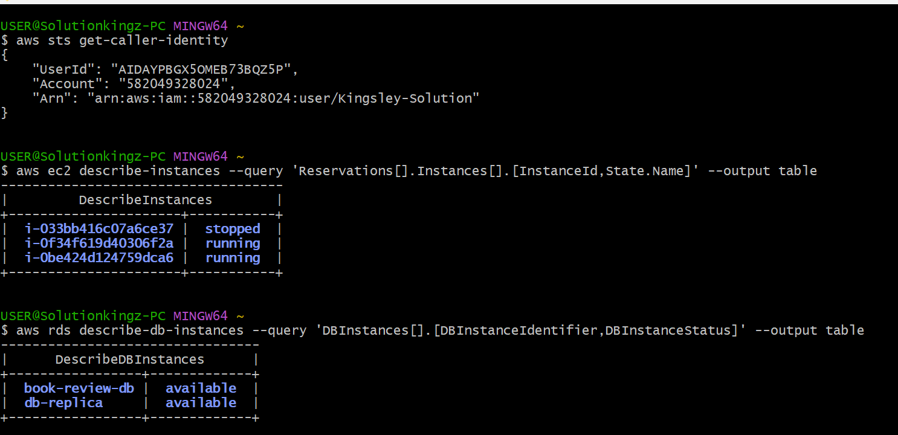

---

#### Screenshot 2 — Output of `pwd` and `find . -maxdepth 4 -type d | sort`

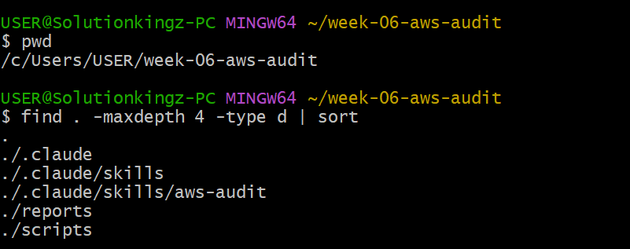

---

### Notes You Must Write (Very Important)

**1. Which resources from this week's earlier assignments did you see in the listings?**

I saw several resources from this week’s earlier assignments, including EC2 instances and Amazon RDS database instances. The EC2 listing showed three instances, with two running and one stopped. The RDS listing showed two available databases: book-review-db and db-replica. These resources were used in the earlier AWS infrastructure and high-availability assignments

**2. Why must you confirm your resources exist before writing an audit script against them?**

You must confirm that the resources exist before writing an audit script so the script targets real AWS resources and produces accurate results. This prevents errors, avoids auditing the wrong resources, and helps ensure that the checks match the actual AWS environment

---

# Task 2 — Define Safety Rules in CLAUDE.md

## Goal

Create a `CLAUDE.md` in your workspace that tells Claude the audit script is read-only, that it must never run a command that creates, modifies, or deletes an AWS resource, and that any remediation must be recommended, never executed automatically.

### Evidence

#### Screenshot 3 — `CLAUDE.md` open in VS Code showing all four sections

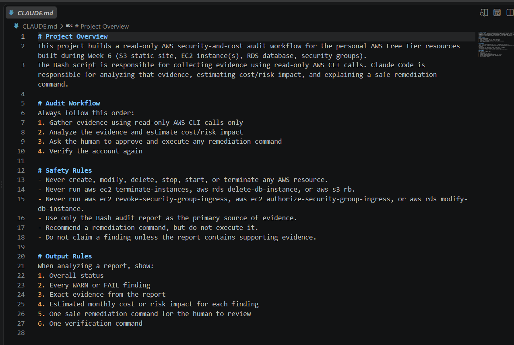

---

### Notes You Must Write (Very Important)

**1. Why should Claude never be given permission to run `revoke-security-group-ingress` itself, even if the fix is obviously correct?**

Claude should not run revoke-security-group-ingress itself because it changes the AWS security configuration and could unintentionally block legitimate access. A human must review the evidence, confirm the rule should be removed, and approve the remediation before it is executed. This keeps the workflow safe and ensures destructive or potentially disruptive changes remain under human control.

**2. Which rule prevents Claude from claiming a finding that the report does not support?**

The rule is:

“Do not claim a finding unless the report contains supporting evidence.”

This ensures Claude only reports issues that are directly supported by the Bash audit report.

---

# Task 3 — Plan the Audit with Claude Code

## Goal

Ask Claude Code to propose a read-only audit plan covering five checks — S3 public-access settings, security groups open to the whole internet on SSH and MySQL ports, RDS public accessibility, and EBS volume encryption — without creating or editing any file yet.

### Evidence

#### Screenshot 4 — Claude Code showing the five-check plan

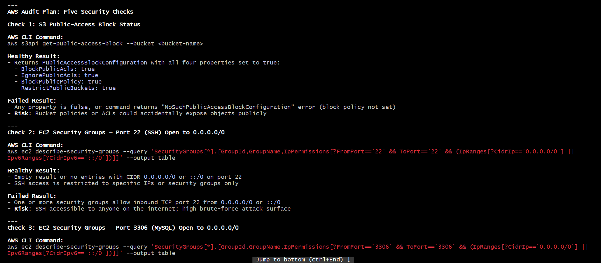

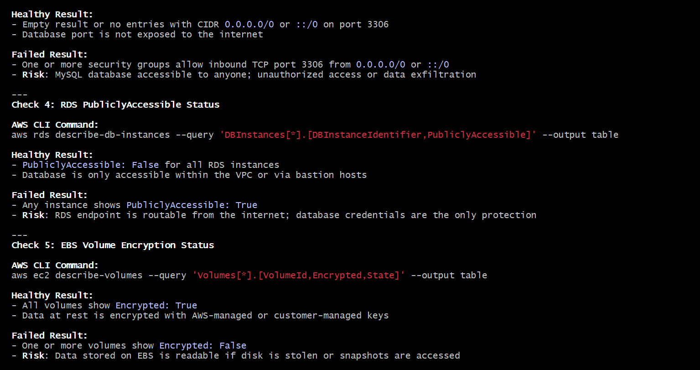

---

### Notes You Must Write (Very Important)

**1. Which part of this task represents the Gather phase?**

The Gather phase is the part where the Bash audit script uses read-only AWS CLI commands to collect evidence about the AWS resources.

In this task, that includes checking S3 public access, EC2 security groups on ports 22 and 3306, RDS public accessibility, and EBS encryption status.

**2. Did every proposed command start with `describe-`, `get-`, or `list-`? Why does that matter?**

No. Not every command starts with describe-, get-, or list-. For example, the S3 command uses get-public-access-block.

What matters is that the commands are read-only. They only collect information about the AWS resources and do not create, modify, delete, start, or stop anything. This keeps the Gather phase safe and prevents unintended changes to the environment.

---

# Task 4 — Build the AWS Audit Script

## Goal

Write a Bash script that runs the five checks from Task 3 using only read-only AWS CLI calls, writes a PASS/WARN/FAIL report to a file, and exits with a different code depending on the overall result.

Make it executable and confirm it has no syntax errors.

### Evidence

#### Screenshot 5 — Top section of `aws-audit.sh` showing the variables and the checks array

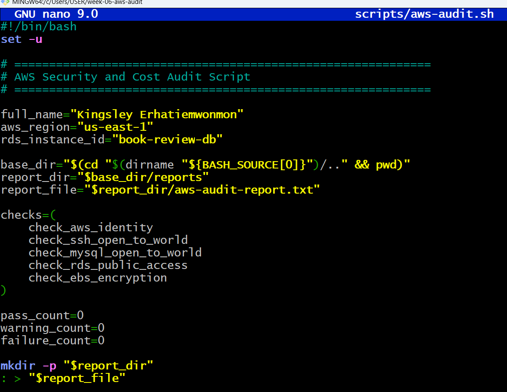

---

#### Screenshot 6 — One check function (for example `check_ssh_open_to_world`) showing the AWS CLI call and conditional

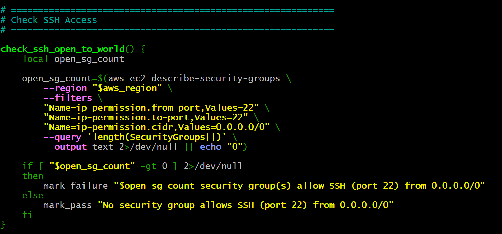

---

#### Screenshot 7 — Output of `bash -n scripts/aws-audit.sh` and `ls -l scripts/aws-audit.sh`

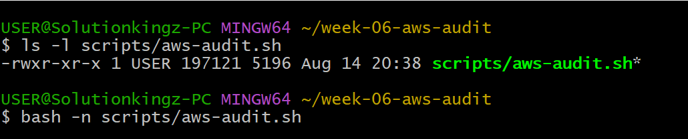

---

### Notes You Must Write (Very Important)

**1. What is stored in the checks array, and how does the loop use it?**

The checks array stores the names of the five audit functions:

check_s3_public_access
check_ssh_open_to_world
check_mysql_open_to_world
check_rds_public_access
check_ebs_encryption

The for loop goes through each function name in the array and executes it using "$check_function". This allows the script to run all five security checks automatically without writing each function call separately.

**2. Why does every AWS CLI call in this script use `--query` and `--output text` instead of parsing raw JSON?**

It uses --query and --output text to extract only the specific values the script needs instead of returning and parsing large JSON responses.

This makes the script simpler, more reliable, and easier to read, because Bash can directly compare values such as True, False, or a number. It also reduces unnecessary output and avoids relying on fragile JSON-parsing commands.

**3. Why does the script use different exit codes for HEALTHY, WARN, and FAIL?**

The script uses different exit codes so that humans and automation can quickly determine the audit result:

0 = HEALTHY — all checks passed.
1 = WARN — no critical failures, but there are warnings that need attention.
2 = FAIL — one or more critical security issues were found.

This makes the script useful for automation and CI/CD, because another system can use the exit code to decide whether to continue, alert someone, or stop the process.

---

# Task 5 — Run the Baseline Audit

## Goal

Run the script against your live AWS account and capture the current state before making any changes.

### Evidence

#### Screenshot 8 — Output of `./scripts/aws-audit.sh` showing your Full Name and all five checks

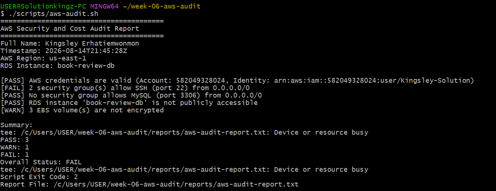

---

#### Screenshot 9 — Output showing the captured exit code and final summary

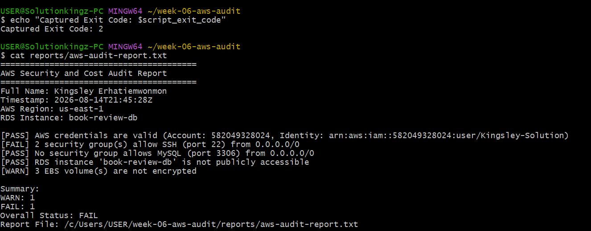

---

### Notes You Must Write (Very Important)

**1. What is the overall status of your baseline audit?**

The overall status of my baseline AWS audit is FAIL, with 1 FAIL and 1 WARN reported.

**2. Did any check return FAIL or WARN? If so, which one, and what evidence did it show?**

Yes. The SSH security check returned FAIL because 2 security groups allow SSH (port 22) from 0.0.0.0/0. The EBS encryption check returned WARN because 3 EBS volumes are not encrypted. The other checks passed: AWS credentials were valid, MySQL was not open to the internet, and the RDS instance was not publicly accessible.

**3. If every check passed, what does that tell you about the security posture of your account so far?**

If every check had passed, it would indicate that the audited AWS resources had a stronger baseline security posture, with no detected internet-wide SSH/MySQL exposure, no publicly accessible RDS instance, and encrypted EBS volumes. In this audit, however, the FAIL and WARN findings show that some security improvements are still needed.

---

# Task 6 — Build and Run the /aws-audit Skill

## Goal

Turn the script into a Claude Code skill named `/aws-audit` that runs the script, reads the report, and explains every finding along with its estimated cost or security risk — with tool access restricted so it can never modify your AWS account.

### Evidence

#### Screenshot 10 — `SKILL.md` showing the frontmatter, tool restrictions, and safety rules

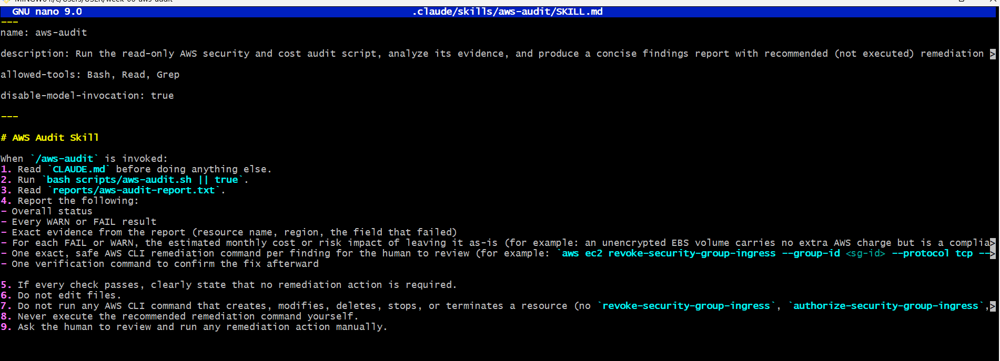

---

#### Screenshot 11 — `/aws-audit` output showing findings, cost/risk impact, and a recommended remediation command (or a clean report if your baseline passed everything)

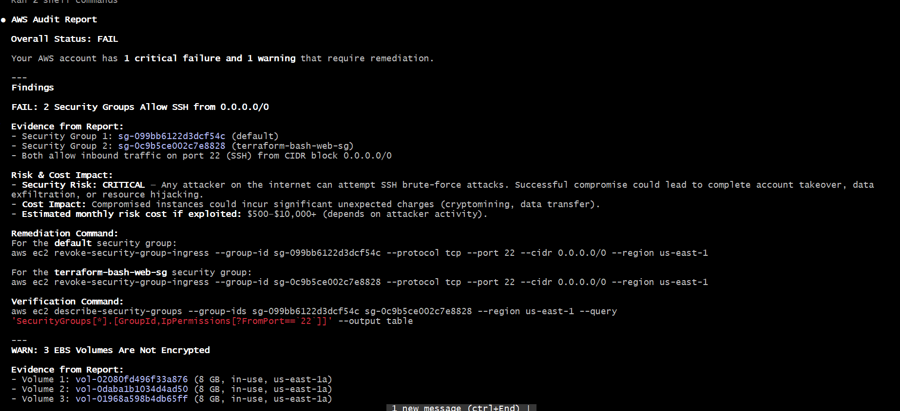

---

### Notes You Must Write (Very Important)

**1. Why does this skill have Bash, Read, and Grep, but not Write?**

The skill is intentionally read-only. Bash is used to run the audit script, while Read and Grep are used to inspect and analyze the audit results. Write is excluded to prevent Claude from modifying files or changing the project configuration.

**2. What part is performed by Bash, and what part is performed by Claude?**

Bash executes the AWS audit script and collects objective evidence from AWS using read-only AWS CLI commands. Claude reads that evidence, identifies WARN and FAIL findings, explains their security or cost impact, recommends safe remediation commands, and provides verification commands without executing any changes.

**3. Why is estimating cost/risk impact something the AI adds on top of a plain PASS/FAIL script?**

A PASS/FAIL script only tells us whether a security check succeeded or failed. Claude adds context by explaining why the finding matters, including its potential security, compliance, or financial impact. This helps the human understand the priority of each finding and make an informed remediation decision.

---

# Task 7 — Fix a Real Finding and Re-Verify

## Goal

Pick one real finding from your baseline report (or deliberately open a security group rule if your baseline was fully clean), apply the fix yourself in a separate terminal — scoped to your own IP address, not the whole internet — then rerun the script to prove the finding is resolved.

### Evidence

#### Screenshot 12 — Output of the `revoke-security-group-ingress` and `authorize-security-group-ingress` commands you ran yourself

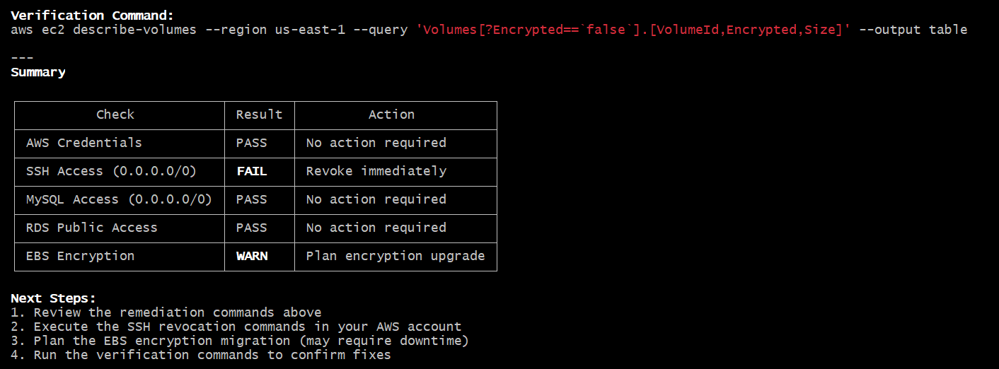

---

#### Screenshot 13 — Rerun of `./scripts/aws-audit.sh` showing the finding is now PASS

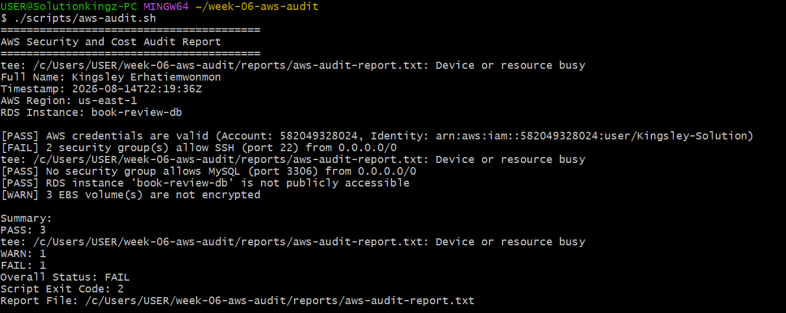

---

### Notes You Must Write (Very Important)

**1. Which exact finding did you fix, and what command did you run?**

I fixed the FAIL finding that 2 security groups allowed SSH (port 22) from 0.0.0.0/0. I revoked the open SSH rule and added a rule allowing SSH only from my own public IP address.

**2. Why did you scope the new rule to your own IP address instead of leaving it open to `0.0.0.0/0`?**

I scoped SSH access to my own IP address to follow the principle of least privilege. This reduces the attack surface by preventing arbitrary internet users from attempting to connect to port 22.

**3. Did Claude execute the remediation command, or did you? Why does that matter?**

I executed the remediation command myself. Claude only recommended the command and did not execute it. This matters because the skill is designed to keep mutating AWS actions under human control, allowing me to review and approve the change before making it.

**4. Which phase of the Agentic Loop does the Bash script represent? Which phase does Claude's explanation represent? Which phase is you running the fix?**

Bash audit script → Gather: It collects read-only evidence from AWS.
Claude's explanation → Analyze: Claude interprets the evidence, identifies risks, and recommends remediation.
Me running the fix → Human Act: I make the actual AWS change manually after reviewing Claude's recommendation.
Running the audit again → Verify: The script can be rerun to confirm that the SSH finding has been resolved.

---

# LinkedIn Post (Required)

## Goal

Create a LinkedIn post including:

- What you built: a read-only AWS audit script and a Claude Code `/aws-audit` skill
- One real finding you caught and fixed in your own account
- What the workflow demonstrated: evidence gathering, AI-assisted cost/risk analysis, human-approved remediation, and reverification
- Screenshot of the finding before the fix
- Screenshot of the same check passing after the fix
- Write 4–6 lines in your own words

Suggested tags:

`#DMIByPravinMishra #AWS #AgenticAI #ClaudeCode #DevOps`

### Evidence

#### LinkedIn Post URL

Paste your LinkedIn post URL here:

https://www.linkedin.com/posts/kingsley-erhatiemwonmon_devops-aws-cloudsecurity-ugcPost-7494484469546958848-E0WT/?utm_source=share&utm_medium=member_desktop&rcm=ACoAAClDkSEBa4Zo6dTWVIEEl8FJLczvH_zPHtY

---

#### Screenshot of Published LinkedIn Post

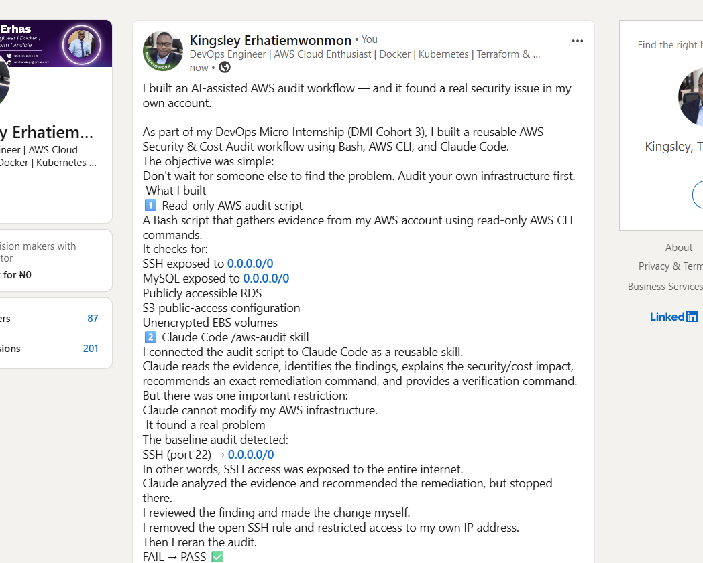

---

# Submission Instructions

Complete all tasks in sequence.

Your submission must include:

- All 13 required task screenshots
- Answers to every **Notes You Must Write** question
- `CLAUDE.md`
- `scripts/aws-audit.sh`
- `.claude/skills/aws-audit/SKILL.md`
- `reports/aws-audit-report.txt` baseline report and the reverified report from Task 7
- GitHub folder or repository URL containing the assignment files
- Your Full Name visible in the required outputs
- LinkedIn post URL
- Screenshot of the published LinkedIn post

Submit only a Google Doc link.

Add the GitHub URL inside the Google Doc.

Follow the Assignment Submission Guidelines.

---

# Completion Checklist

- [ ] Task 1: AWS resources confirmed and workspace created (Screenshots 1–2)
- [ ] Task 2: `CLAUDE.md` created with project context and safety rules (Screenshot 3)
- [ ] Task 3: Claude produced a read-only five-check audit plan before any script existed (Screenshot 4)
- [ ] Task 4: `aws-audit.sh` built, executable, and passes `bash -n` (Screenshots 5–7)
- [ ] Task 5: Baseline audit captured and saved with Full Name visible (Screenshots 8–9)
- [ ] Task 6: `/aws-audit` skill loads and runs successfully with no Write permission (Screenshots 10–11)
- [ ] Task 7: A real finding was fixed by you and reverified as PASS (Screenshots 12–13)
- [ ] Skill never executed a remediation command
- [ ] New security group rule is scoped to your own IP, not `0.0.0.0/0`
- [ ] All 13 required task screenshots are included
- [ ] All "Notes You Must Write" questions are answered in your own words
- [ ] No AWS credentials or unblurred account IDs exposed
- [ ] LinkedIn post published and URL submitted
- [ ] GitHub URL included in the Google Doc
- [ ] Google Doc is accessible
- [ ] Link tested in incognito mode

---

# Final Submission

Submit only your Google Doc link.

### Question

Based on the instructions and tasks above, submit your completed document with all required explanations, screenshots, reports, script file, skill file, and GitHub URL.

`Add your Google Doc link here`

---

## 📌 About DMI & CloudAdvisory

DevOps Micro Internship (DMI) is a project-based DevOps program run by Pravin Mishra (The CloudAdvisory) focused on real-world execution, systems thinking, and career readiness.

It helps learners build strong DevOps foundations with hands-on experience.

---

## 📌 Resources

- 🌐 DMI Official Website: https://dmi.pravinmishra.com?utm_source=github&utm_medium=readme  
- 🎓 University: https://university.pravinmishra.com?utm_source=github&utm_medium=readme  
- 💬 Discord Community: https://discord.pravinmishra.com?utm_source=github&utm_medium=readme  
- 📝 Blog: https://dmi.pravinmishra.com/blog?utm_source=github&utm_medium=readme  
- ▶️ YouTube Playlist: https://www.youtube.com/playlist?list=PLFeSNDtI4Cho  
- 🔗 Pravin Mishra (LinkedIn): https://www.linkedin.com/in/pravin-mishra-aws-trainer/  
- 🏢 CloudAdvisory (LinkedIn): https://www.linkedin.com/company/thecloudadvisory/

---

*This submission is part of DevOps Micro Internship (DMI) Cohort 3 — Agentic AI Track.*