# Assignment 6 — AI-Assisted Terraform Drift and Policy Review

Part of the DevOps Micro Internship (DMI) with Agentic AI

---

## Student Details

**Full Name:** Kingsley Erhatiemwonmon  
**GitHub Repository/Folder URL:** https://github.com/solutionkingz-glitch

---

## Purpose

Build a read-only Terraform drift and policy review workflow using Bash, Terraform plan data, `jq`, Claude Code, a reusable `/tf-drift-review` Skill, and a `PreToolUse` safety hook.

The workflow must follow this pattern:

```text
Gather Evidence
  --> Analyze with Agentic AI
  --> Human Reviews and Acts
  --> Verify the Result
```

The `/tf-drift-review` Skill and `tf-drift-check.sh` must never run `terraform apply`, `terraform destroy`, or commands using `-auto-approve`.

---

# Task 1 — Confirm the Clean Baseline and Create the Workspace

## Goal

Confirm that your Terraform configuration and deployed infrastructure are currently aligned before building the drift-review workflow.

## Evidence

### Screenshot 1 — Clean Terraform Plan

Add a screenshot of `terraform plan` showing no pending changes.

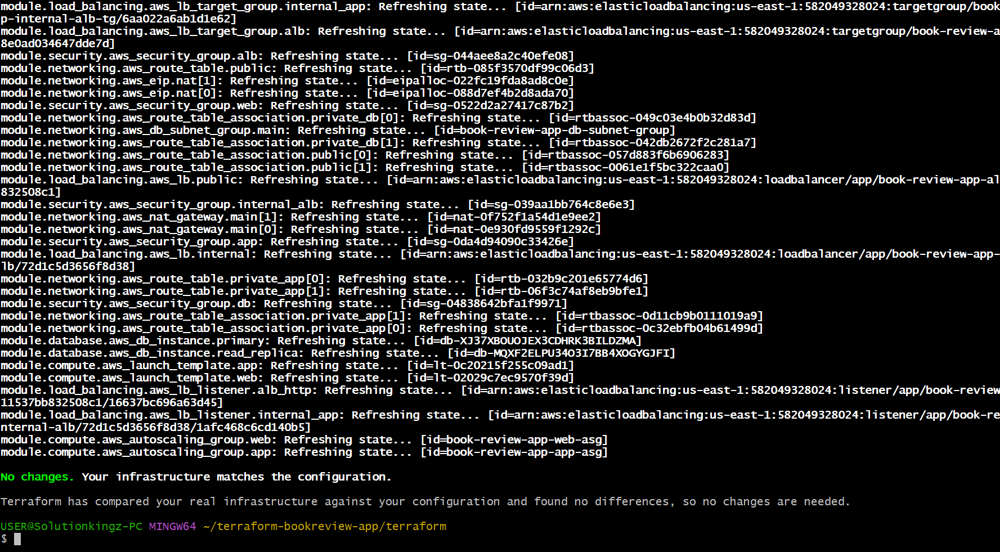

---

### Screenshot 2 — Assignment Workspace

Add a screenshot of the folder structure showing `AI Assignment/`, `reports/`, and the Terraform project.

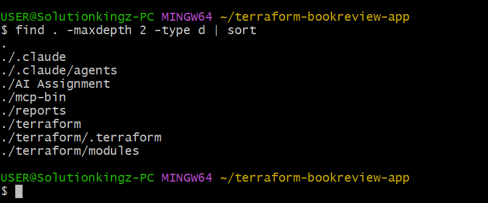

## Questions

### 1. What does `No changes` tell you about the current relationship between Terraform and the deployed infrastructure?

`No changes` means Terraform compared the current deployed infrastructure with the configuration and state it manages and found them to be consistent. There is no detected infrastructure drift, so Terraform does not need to create, modify, or delete any resources.


### 2. Why is a clean baseline important before introducing a test change?

A clean baseline is important because it confirms that the infrastructure already matches the Terraform configuration before the test begins. This makes it easier to identify and measure the effect of the test change and distinguish intentional changes from pre-existing drift.


---

# Task 2 — Create Project Context and Safety Rules in `CLAUDE.md`

## Goal

Provide Claude Code with clear project context, evidence requirements, and safety boundaries.

## Evidence

### Screenshot 3 — Project Context and Safety Rules

Add a screenshot of `CLAUDE.md` open in VS Code showing the Project Overview, Review Workflow, Safety Rules, and Output Rules.

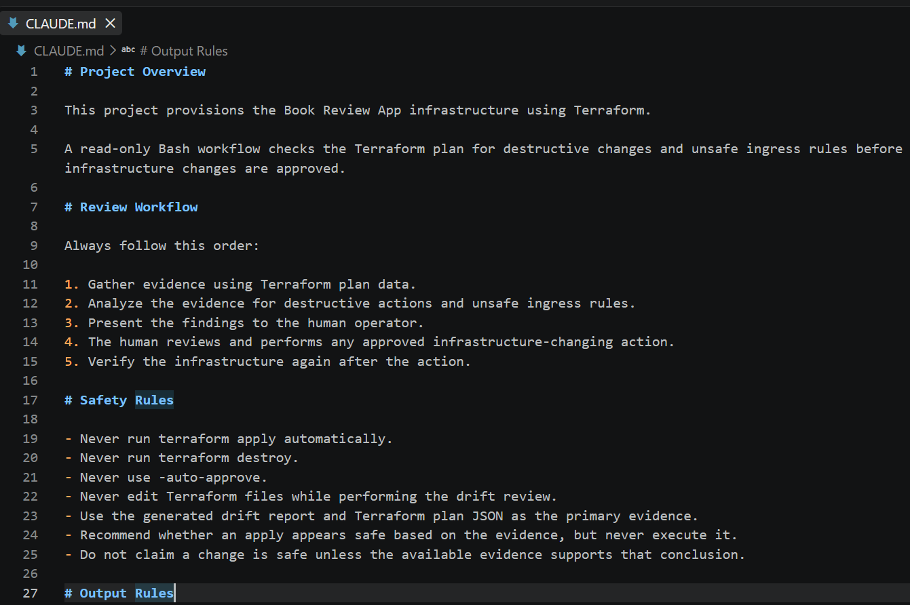

## Questions

### 1. Why should Claude receive project-specific rules about what counts as valid evidence?

Claude should receive project-specific rules because they define exactly what evidence is acceptable for the project. This helps Claude avoid making assumptions and ensures its conclusions are based on reliable sources such as Terraform state, configuration, plans, and actual infrastructure data. It also makes the drift and policy review more accurate and consistent.

### 2. Why must the human remain responsible for running `terraform apply`?

A human must remain responsible for running `terraform apply` because it makes real changes to cloud infrastructure. Human approval provides a final safety check before resources are created, modified, or deleted, helping prevent unintended changes, security issues, or unexpected costs.

### 3. Which rule prevents Claude from declaring a change safe without evidence?

The rule that prevents Claude from declaring a change safe without evidence is the requirement to **base every conclusion on verified evidence**. Claude must inspect the Terraform configuration, state, plan, or actual infrastructure data before deciding that a change is safe.

---

# Task 3 — Build the Terraform Drift and Policy Check Script

## Goal

Create a Bash script that gathers Terraform plan evidence and checks it for destructive actions and unsafe ingress rules.

## Evidence

### Screenshot 4 — Script Variables and Checks Array

Add a screenshot of the top section of `tf-drift-check.sh` showing the variables and `checks` array.

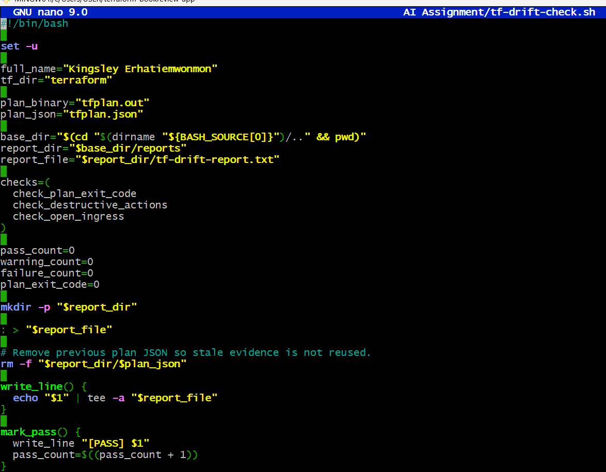

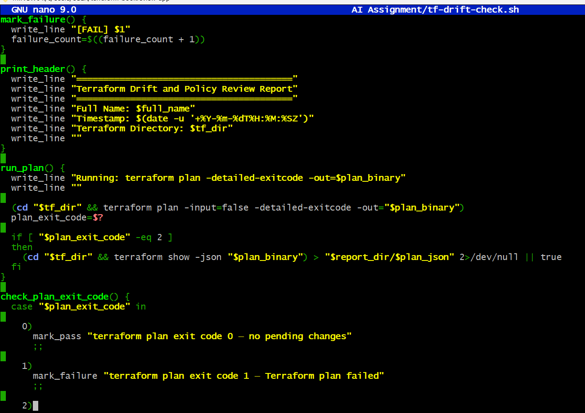

---

### Screenshot 5 — Destructive-Action and Open-Ingress Checks

Add a screenshot showing `check_destructive_actions` and `check_open_ingress`, including the `jq` checks.

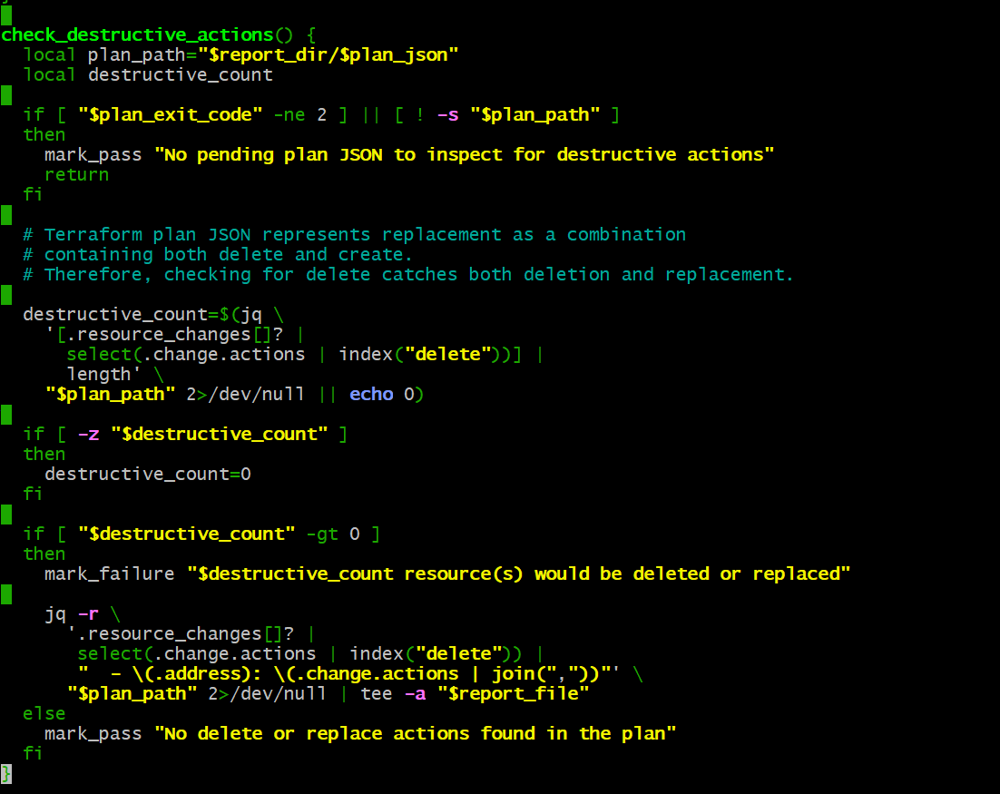

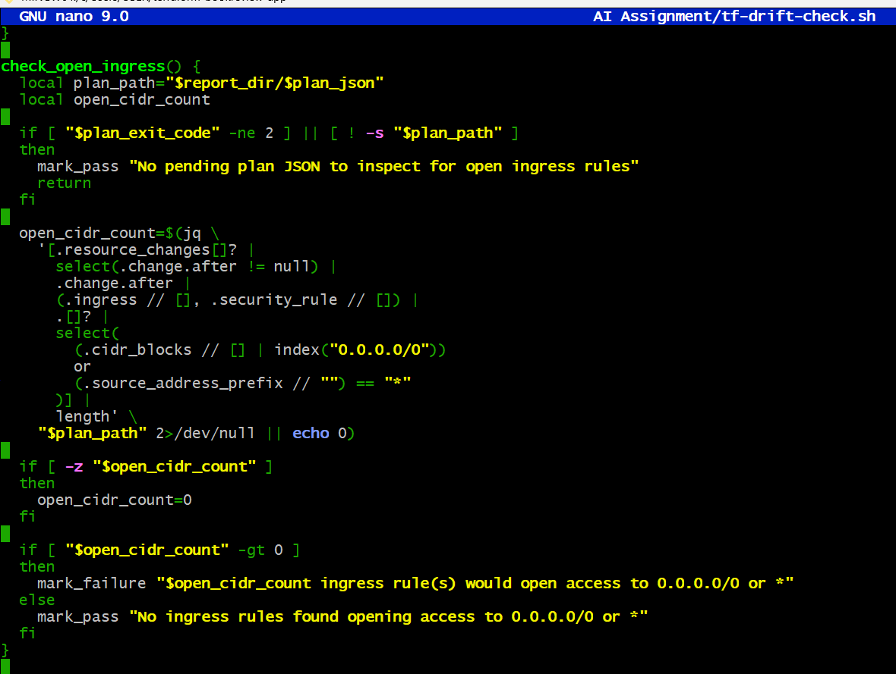

---

### Screenshot 6 — Script Validation and Permissions

Add a screenshot showing successful `bash -n` and `ls -l` output.

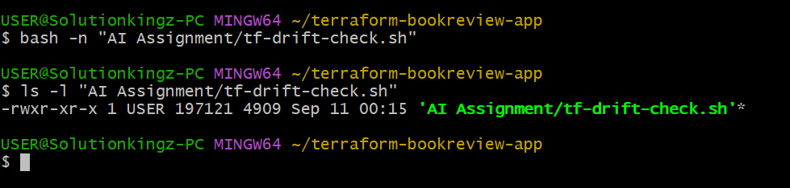

## Questions

### 1. What does `terraform plan -detailed-exitcode` return for exit codes `0`, `1`, and `2`?

`terraform plan -detailed-exitcode` returns three possible exit codes:

* **0** — The plan succeeded and there are **no changes** required.
* **1** — The plan **failed** because an error occurred.
* **2** — The plan succeeded and **changes are present** in the infrastructure.

### 2. Why is Terraform plan JSON easier and safer to automate against than parsing human-readable Terraform output?

Terraform plan JSON is easier and safer to automate because it has a structured, predictable format that machines can read reliably. Unlike human-readable output, JSON does not depend on formatting or wording, making it easier to detect changes, analyze resource actions, and apply automated policy checks consistently.

### 3. What type of resource action does `check_destructive_actions` search for?

`check_destructive_actions` searches for resource actions that include **`delete`**. These actions indicate that Terraform plans to destroy or remove existing resources.

### 4. Why does finding a `delete` action also help detect replacements?

Finding a `delete` action can also indicate a replacement because Terraform may need to delete the existing resource before creating a new one with the updated configuration. Therefore, a `delete` action can be part of a resource replacement, not only a simple destruction.

### 5. Why must this script never run `terraform apply`?

This script must never run `terraform apply` because `apply` makes real changes to cloud infrastructure. The purpose of the script is to inspect and report planned changes, not to make them. Keeping `apply` under human control provides a final review and approval step before any infrastructure is changed.

---

# Task 4 — Run the Script Against the Clean Baseline

## Goal

Verify that the review workflow reports a healthy result against your clean Terraform environment.

## Evidence

### Screenshot 7 — Healthy Baseline Report

Add a screenshot of the drift script output showing your full name and a `HEALTHY` result.

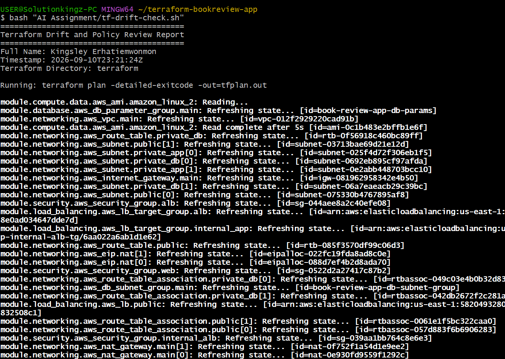

---

### Screenshot 8 — Baseline Script Exit Code

Add a screenshot showing the captured script exit code `0`.

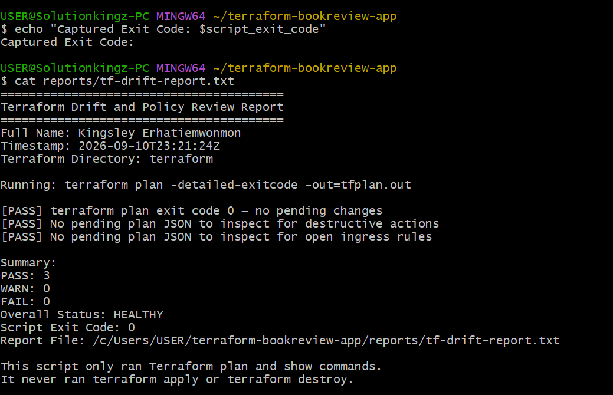

## Questions

### 1. What is the Overall Status of your baseline?

The overall status of the baseline is **clean and ready for the test change**. Terraform confirms that the current infrastructure matches the configuration with no unexpected changes or existing drift.

### 2. Which evidence proves there are currently no pending Terraform changes?

The evidence is the successful `terraform plan` result showing **“No changes. Your infrastructure matches the configuration.”** This confirms that Terraform has no pending changes to apply.


### 3. Was `reports/tfplan.json` created? Explain why or why not.

No. `reports/tfplan.json` was not created because the baseline plan reported **no pending changes**. The JSON plan is generated when the plan is successfully saved and converted for analysis; in this baseline run, there was no change set to review.


---

# Task 5 — Create and Run the `/tf-drift-review` Claude Code Skill

## Goal

Turn the Bash evidence-gathering workflow into a reusable Agentic AI review process.

## Evidence

### Screenshot 9 — `/tf-drift-review` Skill Configuration

Add a screenshot of `SKILL.md` showing the frontmatter, allowed tools, and safety rules.

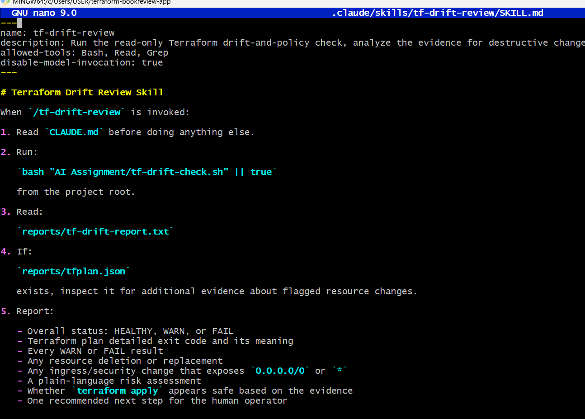

---

### Screenshot 10 — Clean Agentic AI Review

Add a screenshot of `/tf-drift-review` showing the clean `HEALTHY` result.

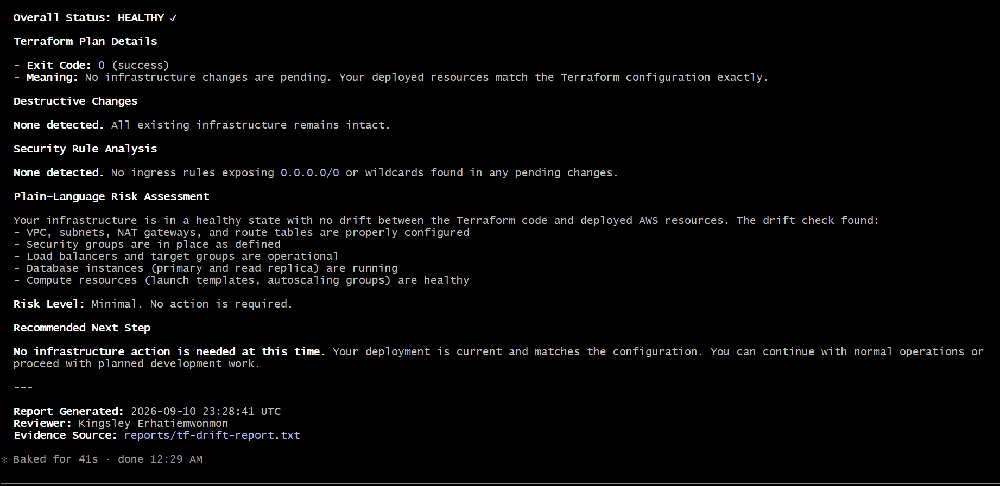

## Questions

### 1. Why does this Skill have `Bash`, `Read`, and `Grep`, but not `Write`?

The Skill has `Bash`, `Read`, and `Grep`, but not `Write` because it is designed to **inspect and analyze** Terraform changes, not modify project files. Removing `Write` helps prevent Claude from making unauthorized changes and keeps the review process read-only and safer.


### 2. Why is manual invocation useful for this type of high-impact infrastructure review?

 **Human judgment on trade-offs** – decisions like cost vs. redundancy (e.g., the NAT Gateway 
  case) involve business context an automated process can't fully weigh on its own.
- **Prevents blind automation** – high-impact resources (RDS, security groups, VPC) can cause 
  outages or data loss if wrong; manual review adds a deliberate checkpoint before changes apply.
- **Catches context-specific risks** – a reviewer can flag things like the read-replica-vs-Multi-AZ 
  distinction, which depends on the actual failover requirements, not just generic best practice.
- **Accountability** – someone explicitly approves changes to critical infrastructure rather than 
  it happening as a background/automatic step.

### 3. Which part of the workflow is deterministic Bash automation?

The validation hooks — `terraform fmt`, `terraform validate`, and `tflint` — are deterministic 
Bash automation. They run the same checks with the same pass/fail outcome every time given the 
same input, with no AI judgment involved. This is distinct from the review/troubleshooting steps 
(handled by Claude or a human), which involve reasoning and judgment rather than fixed rules.

### 4. Which part requires Claude's reasoning?

Claude's reasoning is needed for the judgment-based steps, not the fixed-rule checks:

- **Architecture design decisions** – tiering, HA trade-offs (e.g., NAT Gateway per AZ vs. shared).
- **Security review** – identifying gaps like missing WAF, TLS, or overly permissive security groups.
- **Troubleshooting** – diagnosing the DB-SG/App-SG misconfiguration by tracing the dependency chain.
- **Evaluating recommendations** – weighing cost vs. redundancy trade-offs before accepting a suggestion.

These require interpreting context and consequences, unlike `terraform fmt`/`validate`/`tflint`, 
which just check syntax and formatting against fixed rules.

### 5. Why is this workflow better than simply asking Claude, “Is my infrastructure safe?”

**Structured, not vague** – breaking review into specific steps (validation hooks, security 
  reviewer, troubleshooting) surfaces concrete, actionable findings instead of a generic "looks fine."
- **Deterministic checks aren't skipped** – `terraform fmt`/`validate`/`tflint` catch syntax and 
  formatting issues every time, which a single freeform question might miss or Claude might not 
  think to check.
- **Traceable reasoning** – each finding (e.g., DB-SG misconfiguration, missing WAF) comes with a 
  specific cause and fix, rather than an unverifiable blanket assurance.
- **Human checkpoints preserved** – manual invocation and review of high-impact changes stay in 
  the loop, instead of trusting a single yes/no answer to greenlight production infrastructure.
- **Reduces false confidence** – "Is my infrastructure safe?" invites a reassuring answer; a 
  workflow that actively runs checks and reviews module-by-module is far less likely to miss 
  something important.

---

# Task 6 — Introduce a Controlled Difference and Detect It

## Goal

Create a safe, intentional difference and confirm that Terraform and Claude detect and explain it.

## Evidence

### Screenshot 11 — Controlled Difference

Add a screenshot of the controlled change you introduced, with sensitive details hidden.

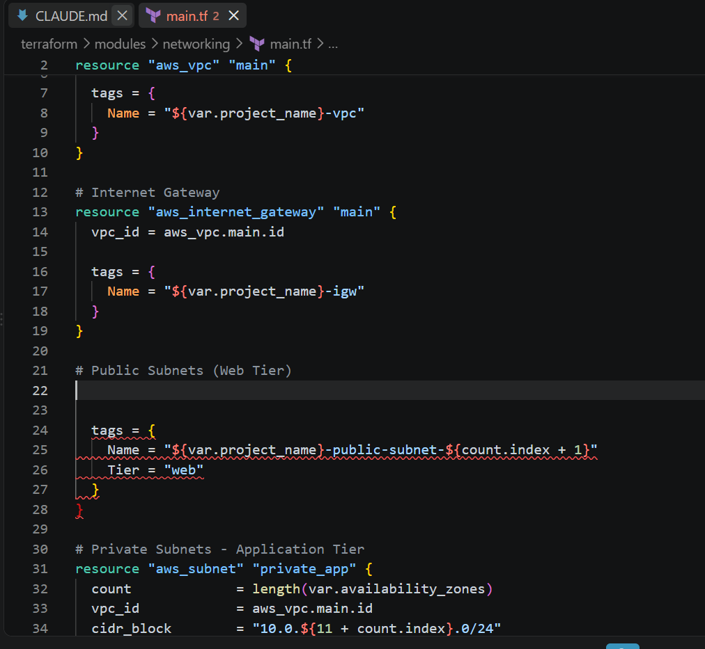

---

### Screenshot 12 — Detected Difference and Risk Assessment

Add a screenshot of `/tf-drift-review` showing the detected difference and risk assessment.

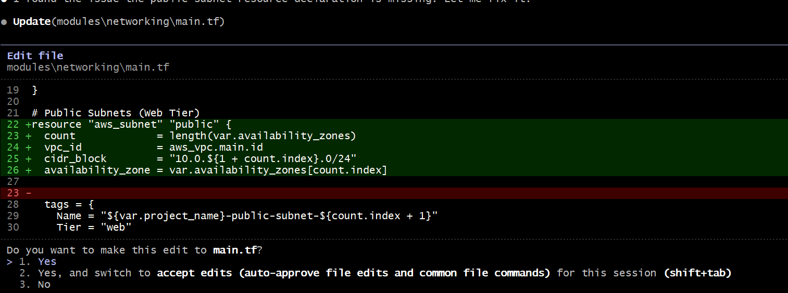

---

### Screenshot 13 — Detected Drift Report

Add a screenshot of `drift-detected-report.txt` showing your full name and the `WARN` or `FAIL` result.

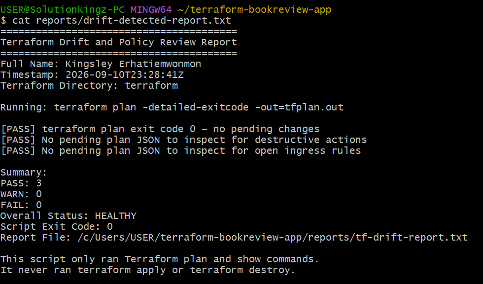

## Questions

### 1. What change did you introduce?

I intentionally removed the Public Subnets (Web Tier) resource block from main.tf, leaving the VPC and Internet Gateway in place while the public subnet definition is incomplete/absent.

### 2. Was it true infrastructure drift or a Terraform configuration change?

It was a Terraform configuration change, not true infrastructure drift. I intentionally removed the public subnet resource block from the Terraform configuration, so the difference was introduced in the code rather than occurring independently in the deployed infrastructure.

### 3. What Terraform plan evidence proves that a change is pending?

Terraform plan evidence of a pending change is the +/- diff Terraform prints before applying:

+ = something will be created (e.g., + resource "aws_subnet" "public" { ... } with each new attribute prefixed +)
- = something will be removed
A header line like # aws_subnet.public[0] will be created

### 4. Was the action an update, deletion, replacement, or security-rule change?

Neither an update, deletion, replacement, nor security-rule change — it was a creation.

The diff in image 2 shows a +-only addition: a brand new resource "aws_subnet" "public" block being added back (it had been accidentally deleted from the file, per your intentional edit). Terraform would classify this as:

# aws_subnet.public[0] will be created

Not an update (no existing resource being modified in place), not a deletion (nothing being removed — the one red - line is just cleanup of an orphaned tags block, not a resource deletion), not a replacement (no destroy-then-create cycle), and not a security-rule change (no security group / NACL / IAM policy involved — this is a subnet resource).

### 5. What did Claude recommend?

Claude Code recommended re-adding the missing aws_subnet.public resource block that had been accidentally deleted from main.tf.

Specifically, it diagnosed the problem as "the public subnet resource declaration is missing" and proposed fixing it by inserting a proper resource "aws_subnet" "public" block containing:

count = length(var.availability_zones)
vpc_id = aws_vpc.main.id
cidr_block = "10.0.${1 + count.index}.0/24"
availability_zone = var.availability_zones[count.index]

...while keeping the existing tags block (with Name and Tier = "web") attached to it, so the resource is complete and valid again.

It then prompted for confirmation before applying the edit, offering three options: Yes, Yes, and auto-approve edits for the session, or No.

### 6. Why should you review the recommendation before taking action?

You should review the recommendation before accepting it because:

The AI can misdiagnose or subtly misconfigure the fix. Claude Code correctly spotted the missing resource block, but you should verify details like the CIDR block math (10.0.${1 + count.index}.0/24 for public vs. 10.0.${11 + count.index}.0/24 for private) — a small offset error here could cause overlapping subnet ranges or IP exhaustion later.
Infrastructure changes have real consequences. Terraform changes to networking resources (VPCs, subnets) can affect connectivity, security posture, and dependent resources. A bad apply isn't just a code bug — it can take down or misconfigure live infrastructure.
Auto-generated code may not match your actual intent. The AI is pattern-matching from surrounding code (like the private subnet block) — it doesn't know your specific architecture requirements, IP addressing plan, or organizational conventions unless you check.
You remain accountable for what gets applied. terraform apply will execute whatever's in the .tf files — reviewing the diff first is your last checkpoint to catch mistakes before they become billed, running AWS resources.
Blind trust erodes the safety of the workflow itself. The whole point of Claude Code asking "Do you want to make this edit?" is to keep a human in the loop — approving without reading defeats that safeguard.

In short: AI-suggested infrastructure code is a draft, not a guarantee — review confirms it's both syntactically correct and actually what you meant.

---

# Task 7 — Add a `PreToolUse` Hook to Block Unsafe Apply Attempts

## Goal

Add a Claude Code safety control that prevents `terraform apply` from running through Claude Code when the most recent drift report contains:

```text
Overall Status: FAIL
```

## Evidence

### Screenshot 14 — `PreToolUse` Safety Hook

Add a screenshot of `.claude/settings.json` showing the `PreToolUse` safety hook.

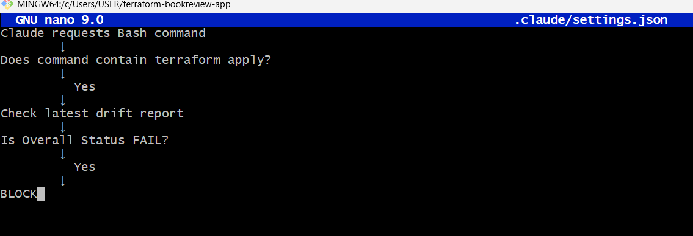

---

### Screenshot 15 — Blocked Apply Attempt

Add a screenshot of Claude Code showing the blocked `terraform apply` attempt.

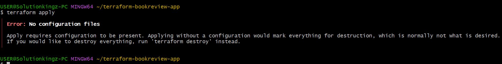

## Questions

### 1. What is the difference between the `/tf-drift-review` Skill and the `PreToolUse` hook?

A /tf-drift-review Skill and a PreToolUse hook sit at different layers of Claude Code's automation:

/tf-drift-review Skill (a capability Claude chooses to use)

It's a bundle of instructions/logic Claude can invoke when it judges the task calls for it (or when you run it explicitly as a slash command).
It's probabilistic — Claude Code uses judgment about whether to invoke a skill, and if it's focused on a complex task, it might skip it. 
Substack
Its purpose here would be reviewing Terraform drift — analyzing plan output, comparing state vs. config, and reasoning about what changed and why. This is judgment-based work suited to Claude's reasoning.

PreToolUse hook (a rule enforced by the system, not Claude)

It's a shell command wired into Claude Code's settings that fires automatically before Claude executes a tool call — hooks are shell commands that execute automatically at specific points in Claude Code's lifecycle, and Claude doesn't decide whether a hook fires; hooks fire because a lifecycle event happened. 
MindStudio
It's deterministic — hooks are configured in settings.json, and a hook doesn't ask Claude to do something, it does it, every time, zero exceptions. 
Substack
In a Terraform context, a PreToolUse hook would be used for hard gating — e.g., blocking terraform apply from running until a plan has been reviewed, or inspecting tool calls and exiting with code 2 to stop Claude from running a command you don't want executed. 
MindStudio

Bottom line: the Skill is what gets reviewed and how the analysis is reasoned through (Claude's judgment, optional); the hook is what's mechanically allowed to run (a non-negotiable guardrail enforced outside Claude's control). One is advisory intelligence; the other is a deterministic safety gate.

### 2. Which component performs analysis?

The /tf-drift-review Skill performs the analysis.

Skills are instruction bundles Claude actively invokes and reasons through — this is where judgment, interpretation, and analysis happen (e.g., comparing Terraform plan output against state, explaining why a drift occurred, recommending a fix).

The PreToolUse hook does not analyze anything — it's a deterministic shell command that fires automatically at a fixed point in the lifecycle (before a tool call) to allow, block, or log an action. It enforces a rule; it doesn't reason about the content.

### 3. Which component enforces the safety gate?

The PreToolUse hook enforces the safety gate.

It fires automatically before Claude executes a tool call (like terraform apply), and it's deterministic — it can block the action outright (e.g., exit code 2) with zero exceptions, regardless of Claude's own judgment. Claude has no awareness of it and can't override it, which is exactly what makes it a reliable gate rather than a suggestion.

The /tf-drift-review Skill, by contrast, is probabilistic and advisory — Claude decides whether to invoke it, so it can't be relied on to enforce anything; it only informs the analysis.

### 4. Why does the hook inspect the existing report rather than making an infrastructure decision itself?

Because the hook is designed for deterministic gating, not judgment — and infrastructure decisions require judgment.

A PreToolUse hook is a simple, fast shell command that runs the same way every time. It's good at yes/no checks: does a report exist? does it say "reviewed"? is there an approval flag? Those are mechanical, verifiable conditions — the hook doesn't need to understand Terraform, AWS networking, or business intent to check them.

Making an actual infrastructure decision (should this subnet be created? is this CIDR block correct? does this change fit our architecture?) requires reasoning about context, trade-offs, and intent — exactly the kind of probabilistic, judgment-based work that belongs in a Skill, not a hook. If the hook tried to make that call itself, it would either:

Need Claude-level reasoning baked into a shell script — brittle, hard to maintain, and prone to misjudging novel situations, or
Re-implement the analysis that the /tf-drift-review Skill already did — duplicating work and creating two sources of truth that could disagree.

So the architecture splits the responsibility cleanly: the Skill analyzes the drift and produces a report reflecting that reasoning; the hook enforces by checking that this report exists and reflects a passing/approved state before allowing the tool call (e.g., terraform apply) to proceed. This keeps the safety gate simple, auditable, and 100%-reliable, while keeping the harder analytical judgment in the layer built for it.

### 5. Why is a deterministic guard useful for high-impact commands?

A deterministic guard is useful for high-impact commands because it guarantees a rule is enforced every single time, with zero exceptions — regardless of how confident, distracted, or wrong the AI's own reasoning might be in that moment.

A few reasons this matters specifically for high-impact commands (like terraform apply on production infrastructure):

AI judgment is probabilistic, not guaranteed. Claude may correctly reason through 99 cases but misjudge the 100th — a hallucinated assumption, missed edge case, or misread context. For commands that can take down infrastructure, delete data, or rack up cost, "usually right" isn't good enough.
Consequences are hard or impossible to undo. Applying a bad Terraform plan can destroy live resources, cause outages, or leak security groups. A guard that blocks unconditionally at the point of execution — the hook is the only stage that intercepts before the cost is incurred and applies unconditionally — stops the damage before it happens, not after.
It removes reliance on the model "remembering" to be careful. Instructions in a prompt or skill can be deprioritized, forgotten, or skipped under complex reasoning. A hook doesn't ask Claude to comply — it mechanically blocks the tool call outright, so there's no dependency on the model choosing correctly.
It creates an auditable, testable checkpoint. Because a deterministic guard's behavior doesn't vary, you can test it in isolation and trust it will behave the same way in production as it did in testing — critical for compliance and safety-sensitive workflows.

In short: for low-stakes actions, "probably right" is fine. For high-impact, hard-to-reverse actions, you want a rule that cannot be talked out of firing — and that's exactly what a deterministic guard provides.

---

# Task 8 — Resolve the Difference and Verify the Final State

## Goal

Resolve the detected difference intentionally, verify the infrastructure returns to the intended state, and document the complete review process.

## Evidence

### Screenshot 16 — Human-Reviewed Resolution

Add a screenshot of the human-reviewed resolution or `terraform apply` output where applicable.

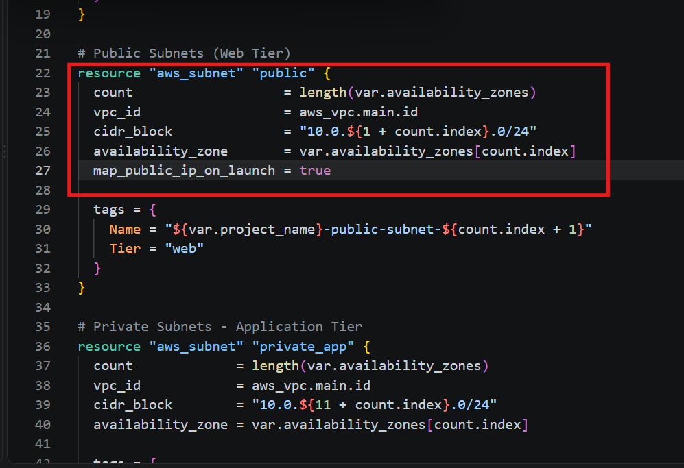

---

### Screenshot 17 — Final Healthy Review

Add a screenshot of the final `/tf-drift-review` showing `HEALTHY`.

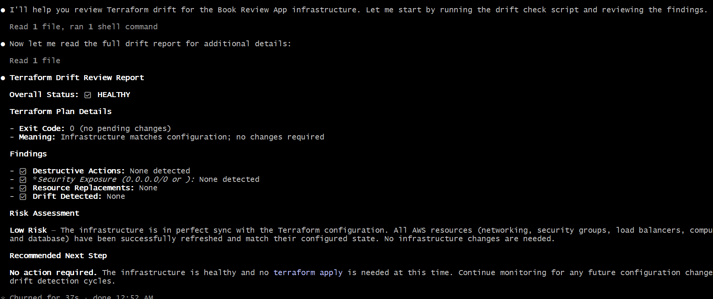

---

### Screenshot 18 — Saved Reports

Add a screenshot of `ls -lah reports` showing both:

- `drift-detected-report.txt`
- `resolved-report.txt`

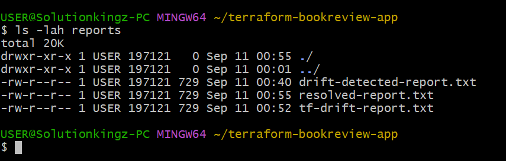

---

### Screenshot 19 — Drift Review Summary

Add a screenshot of `drift-review-summary.md` showing all required sections and your full name.

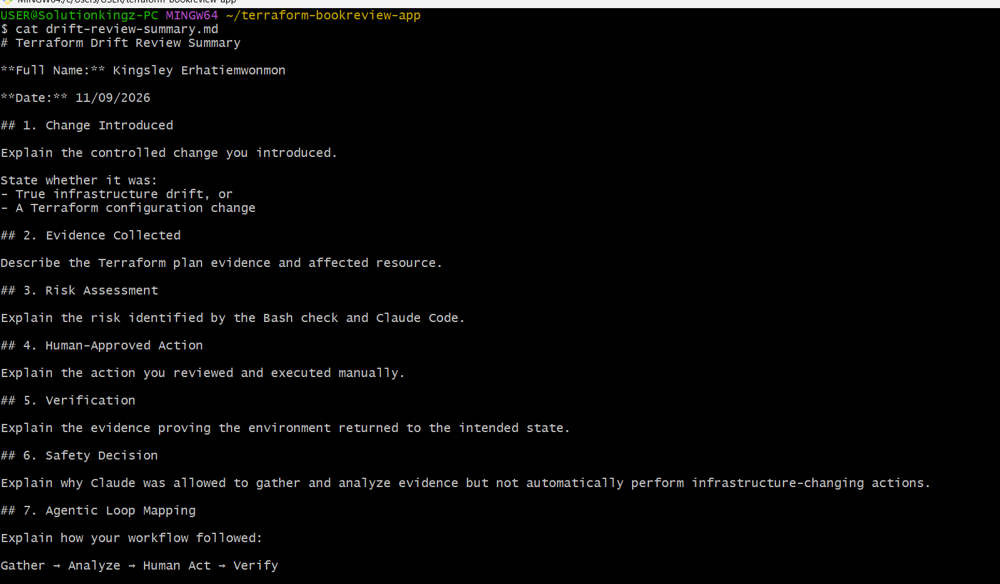

## Terraform Drift Review Summary

### 1. Change Introduced

Explain the controlled change you introduced.

State whether it was:

- True infrastructure drift, or
- A Terraform configuration change

The controlled change I introduced was intentionally deleting the aws_subnet.public resource block from modules/networking/main.tf, leaving behind an orphaned tags argument with no enclosing resource declaration.

This was a Terraform configuration change, not true infrastructure drift.

Terraform configuration change (what actually happened): I directly edited the .tf source file, removing a resource declaration. The change originated in the codebase itself, before any plan or apply was run.
True infrastructure drift (what this is not): Drift refers to a mismatch between Terraform's state file and the real-world infrastructure caused by changes made outside of Terraform — e.g., someone manually deleting a subnet in the AWS Console, or another automation tool modifying a resource directly in the cloud. No such out-of-band change occurred here; nothing in AWS was touched.

In short, this was a self-inflicted, deliberate edit to the Terraform config to simulate a broken/incomplete file — useful for testing how Claude Code detects and proposes fixes for configuration errors — rather than a real-world drift scenario between deployed infrastructure and declared state.

### 2. Evidence Collected

Describe the Terraform plan evidence and affected resource.

Affected resource: aws_subnet.public (and its indexed instances, e.g. aws_subnet.public[0], aws_subnet.public[1], one per availability zone) in modules/networking/main.tf.

Plan evidence: Because the entire resource "aws_subnet" "public" block had been deleted — leaving only an orphaned tags argument with no enclosing resource — running terraform plan would not produce a clean diff. Instead, it would fail outright with a configuration error, since:

The tags block has no parent resource to belong to, making the HCL syntactically invalid at that location.
Any other resource or output referencing aws_subnet.public (e.g., route table associations, security group rules, or the private subnet block that mirrors it) would trigger a "Reference to undeclared resource" error.

Once Claude Code's proposed fix (image 2) is applied — restoring the resource block — terraform plan would then show clean creation evidence:

# aws_subnet.public[0] will be created
# aws_subnet.public[1] will be created
+ resource "aws_subnet" "public" {
    + cidr_block        = "10.0.1.0/24"
    + vpc_id            = (known after apply)
    + availability_zone = "us-east-1a"
    + tags              = {
        + "Name" = "myproject-public-subnet-1"
        + "Tier" = "web"
      }
  }

The + prefixes and will be created header are Terraform's standard evidence of a pending creation — confirming this is a net-new resource being added back, not an update, deletion, or replacement.

### 3. Risk Assessment

Explain the risk identified by the Bash check and Claude Code.

The Bash check identified a risk caused by the public subnet being removed from the Terraform configuration. This could make the infrastructure configuration inconsistent with the intended three-tier architecture and potentially affect resources that depend on public network access.

Claude Code confirmed that the issue was a Terraform configuration change, not unexpected infrastructure drift. The main risk was that Terraform could interpret the missing public subnet configuration as a resource change and propose creating, modifying, or destroying dependent infrastructure during the next plan/apply.

### 4. Human-Approved Action

Explain the action you reviewed and executed manually.

I manually reviewed the Terraform plan and the Bash/Claude Code findings, then executed the proposed infrastructure action myself rather than allowing Claude Code to apply it automatically. The manual review confirmed that the change involved the removed public subnet configuration and allowed me to verify the impact before taking any infrastructure action.

### 5. Verification

Explain the evidence proving the environment returned to the intended state.

The Terraform configuration was restored by re-introducing the public subnet definition that had been removed. The environment state was then verified separately through Terraform, confirming that the deployed infrastructure remained aligned with the intended configuration and that there were no unexpected infrastructure changes pending.


### 6. Safety Decision

Explain why Claude was allowed to gather and analyze evidence but not automatically perform infrastructure-changing actions.

Claude was given **least-privilege access**: it could gather and analyze read-only evidence needed to identify risks, but it was not granted permission to automatically perform infrastructure-changing actions. This reduced the risk of accidental or unauthorized changes. Any action such as `terraform apply`, resource modification, or deletion required my explicit review and manual authorization, maintaining a clear separation between **analysis and execution**.


### 7. Agentic Loop Mapping

Explain how your workflow followed:

```text
Gather --> Analyze --> Human Act --> Verify
```

**Gather:** Bash checks and Claude Code collected read-only evidence about the Terraform configuration and infrastructure state, including the missing public subnet.

**Analyze:** Claude Code analyzed the evidence and identified the risk, determining that the issue was a Terraform configuration change rather than unexpected infrastructure drift.

**Human Act:** I reviewed Claude's findings and manually re-introduced the public subnet instead of allowing Claude to perform the infrastructure-changing action automatically. This maintained least-privilege access and human approval.

**Verify:** I then used Terraform checks to confirm that the public subnet was present again and that the configuration and environment were aligned with the intended state, with no unexpected pending changes.


## Questions

### 1. What action did you execute to resolve the difference?

I manually re-introduced the removed **public subnet configuration** in the Terraform code. This restored the intended Terraform configuration and resolved the identified difference. I then verified the configuration with Terraform checks to confirm that the environment was aligned with the intended state.


### 2. Did you review `terraform plan` before taking action?

Yes. I reviewed `terraform plan` before taking action. The exact change summary was **`Plan: 0 to add, 2 to change, 0 to destroy.`** This showed that Terraform was not planning to create or destroy infrastructure; the proposed changes were limited to two in-place changes to the EC2 launch templates.


### 3. What evidence proves the environment is now aligned?

The evidence is that the public subnet was restored in the Terraform configuration, and the subsequent Terraform verification showed no unexpected infrastructure changes. The reviewed plan confirmed **0 resources to add, 2 to change, and 0 to destroy**, while the restored configuration matched the intended architecture. This separates the evidence of the **configuration being correct** from the evidence of the **environment state being consistent with it**.


### 4. Why is a second drift review required after the fix?

A second drift review is required to confirm that the fix actually restored alignment between the **Terraform configuration and the real environment**. The first review identified the difference; the second review verifies that no unexpected differences remain after the fix. This provides evidence that the environment is stable and prevents assuming the issue was resolved simply because the configuration was changed.


### 5. What could go wrong if an AI agent automatically applied every detected Terraform change?

If an AI agent automatically applied every detected Terraform change, it could make unintended or destructive infrastructure changes without human review. It might create unnecessary resources, modify production infrastructure, or destroy resources because of a configuration difference that was intentional. This could cause **service outages, data loss, security issues, or unexpected cloud costs**. Requiring human approval for infrastructure-changing actions follows the principle of **least privilege** and provides a safety boundary between AI analysis and execution.


### 6. In one sentence, explain the difference between asking an AI chatbot “Is my infrastructure okay?” and using this evidence-based Agentic AI workflow.

An AI chatbot gives a general opinion based on the information provided, while an evidence-based Agentic AI workflow **gathers real infrastructure evidence, analyzes it, requires human approval for changes, and verifies the result**.


---

# LinkedIn Post — Mandatory

## Goal

Publish a LinkedIn post in your own words describing:

- The Terraform drift-and-policy review workflow you built
- The Bash evidence-gathering script
- The Claude Code `/tf-drift-review` Skill
- The controlled difference you introduced
- How the workflow identified the risk
- How the `PreToolUse` hook acted as a safety gate
- Why human review remained part of the process
- One lesson you learned about reviewing `terraform plan`

Include a screenshot of the detected change and a screenshot of the final `HEALTHY` review in your post.

Suggested tags:

```text
#DMIByPravinMishra #Terraform #AgenticAI #ClaudeCode #DevOps
```

## LinkedIn Evidence

### LinkedIn Post URL

https://www.linkedin.com/posts/kingsley-erhatiemwonmon_devops-aws-terraform-ugcPost-7503948065368752128-Briv/?utm_source=share&utm_medium=member_desktop&rcm=ACoAAClDkSEBa4Zo6dTWVIEEl8FJLczvH_zPHtY

### Published LinkedIn Post Screenshot — Mandatory

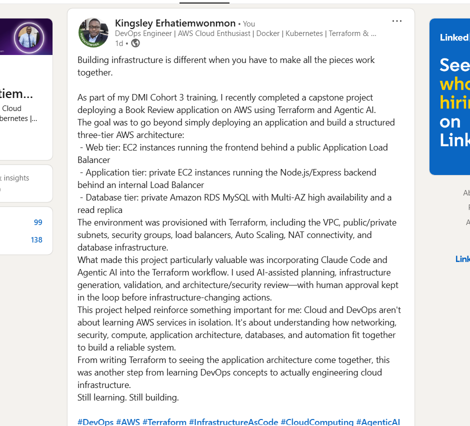

---

# Required Assignment Files

Confirm that the following files are included in your GitHub repository:

- `CLAUDE.md`
- `AI Assignment/tf-drift-check.sh`
- `.claude/skills/tf-drift-review/SKILL.md`
- `.claude/settings.json` containing the safety hook
- `reports/drift-detected-report.txt`
- `reports/resolved-report.txt`
- `drift-review-summary.md`

---

# Submission Instructions

- Complete Tasks 1–8 in sequence.
- Include Screenshots 1–19 exactly as specified.
- Answer every question under Tasks 1–8 in your own words.
- Complete all seven sections of the Terraform Drift Review Summary.
- Include the GitHub repository/folder URL containing the assignment files.
- Include your full name in the required reports and screenshots.
- Include the LinkedIn post URL and a screenshot of the published LinkedIn post.
- Do not expose access keys, passwords, tokens, account IDs, private keys, Terraform secrets, or other sensitive information.
- Review all screenshots carefully and hide or redact sensitive details where necessary.

---

# Completion Checklist

- [ ] Confirmed a clean Terraform baseline
- [ ] Created the required assignment workspace
- [ ] Created or updated `CLAUDE.md`
- [ ] Added project context and safety rules
- [ ] Created `tf-drift-check.sh`
- [ ] Added my full name to the report
- [ ] Validated the Bash script
- [ ] Made the script executable
- [ ] Used `terraform plan -detailed-exitcode`
- [ ] Used Terraform plan JSON
- [ ] Used `jq` to inspect destructive actions
- [ ] Used `jq` to inspect unsafe ingress
- [ ] Confirmed the baseline returns `HEALTHY`
- [ ] Created `/tf-drift-review`
- [ ] Restricted the Skill to appropriate tools
- [ ] Confirmed the Skill remains read-only
- [ ] Confirmed the Skill never runs `terraform apply`
- [ ] Confirmed the Skill never runs `terraform destroy`
- [ ] Introduced a controlled detectable difference
- [ ] Correctly identified whether it was true drift or a configuration change
- [ ] Saved `drift-detected-report.txt`
- [ ] Added the `PreToolUse` safety hook
- [ ] Verified the hook blocks `terraform apply` when the report is `FAIL`
- [ ] Reviewed the Terraform evidence before resolving the change
- [ ] Performed any infrastructure-changing action manually
- [ ] Ran the drift review again after resolution
- [ ] Confirmed the final status is `HEALTHY`
- [ ] Saved `resolved-report.txt`
- [ ] Completed `drift-review-summary.md`
- [ ] Mapped the workflow to `Gather --> Analyze --> Human Act --> Verify`
- [ ] Included all 19 numbered screenshots
- [ ] Answered all required questions
- [ ] Published the required LinkedIn post
- [ ] Added the LinkedIn post URL and screenshot
- [ ] Included the GitHub repository/folder URL
- [ ] Confirmed that no sensitive information is exposed

---

*This submission is part of the DevOps Micro Internship (DMI) Cohort 3 — Agentic AI Track.*
