# Assignment 02 — Provision Linux VMs with Terraform and Run Ansible Ad-Hoc Commands

Part of the DevOps Micro Internship (DMI) with Agentic AI

---

## Purpose

In this assignment, you will use Terraform to provision three or four Ubuntu Linux Virtual Machines on either Microsoft Azure or Amazon Web Services.

You will configure SSH key-based authentication, organize the servers using a custom Ansible inventory, and run Ansible ad-hoc commands across individual hosts and inventory groups.

---

# Task 1 — Create the Multi-Host Lab Structure

## Goal

Create a separate project directory for the multi-host lab and prepare the Terraform, Ansible, and documentation files.

This project will use the Git repository and Ansible controller prepared in Assignment 01.

### Evidence

#### Screenshot 1 — Terminal showing the complete `ansible-adhoc-lab` project structure

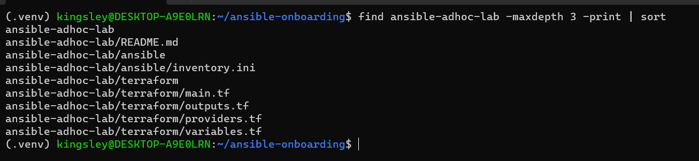

---

#### Screenshot 2 — Terminal showing `git status --short` with the new project files and updated `.gitignore`

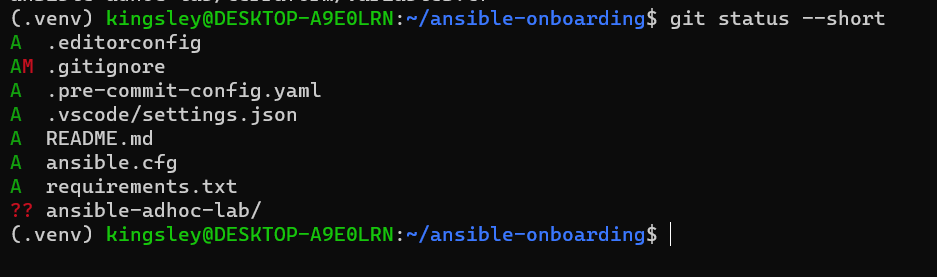

---

### Notes

This screenshot shows the result of git status --short in ~/ansible-onboarding after I created the ansible-adhoc-lab project and updated .gitignore. The ?? next to ansible-adhoc-lab/ means the new project directory exists and Git sees it as untracked. Because I created it inside the existing ansible-onboarding repository, that one repository tracks it, and I did not run git init in the new folder.

The other entries come from Assignment 01. The A marks .editorconfig, .pre-commit-config.yaml, .vscode/settings.json, README.md, ansible.cfg, and requirements.txt as files added to the index. The AM next to .gitignore means the file was already staged and I then modified it. That modification is the set of Terraform rules I appended, which are .terraform/, *.tfstate and .tfstate., *.tfplan, and the crash logs. Those rules protect Terraform state files, the provider working directory, saved plans, and crash logs. Terraform state can contain sensitive infrastructure details, so it must never be committed. I did not add .terraform.lock.hcl to .gitignore, because the dependency lock file is meant to be tracked.

No Terraform-generated files appear in the output. I had not run terraform init yet, so .terraform/ and terraform.tfstate did not exist. After the apply, I checked git status again to confirm that .gitignore kept them out.

---

# Task 2 — Create the Terraform Configuration

## Goal

Create the Terraform configuration required to provision three or four Ubuntu Linux VMs on your selected cloud platform.

Complete only one option:

- Option A — Microsoft Azure
- Option B — Amazon Web Services

Do not configure both providers for this assignment.

### Evidence

#### Screenshot 3 — Terraform configuration showing the three or four server roles and the `for_each` or `count` implementation

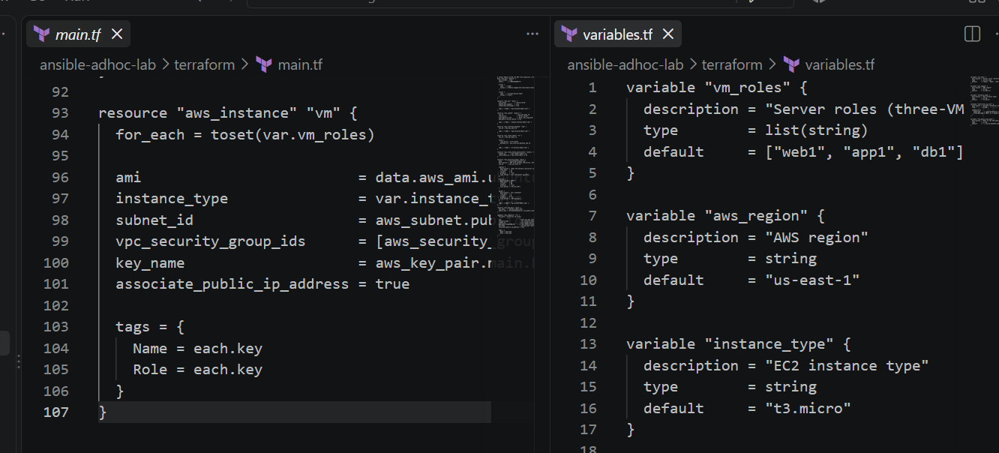

---

#### Screenshot 4 — Terraform configuration showing SSH restricted to the controller IP and HTTP allowed only for web hosts

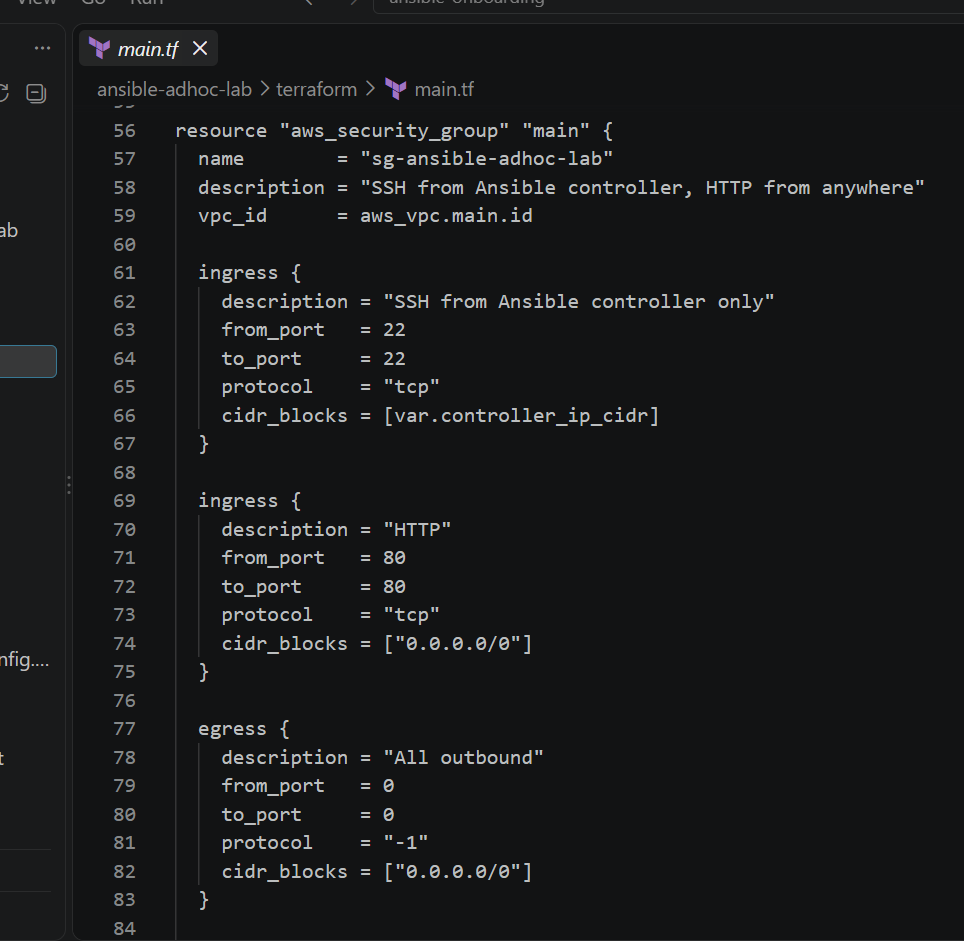

---

#### Screenshot 5 — Terraform output configuration showing how public IP addresses are associated with the server roles

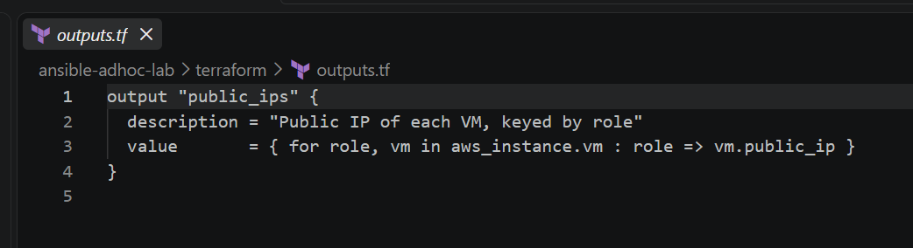

---

### Notes

* Configured the Terraform security rules to allow SSH access only from the Ansible controller's public IP address.
* Restricted HTTP access to the web server role rather than allowing it on all provisioned servers.
* Configured Terraform outputs to clearly associate each server role (`web1`, `app1`, and `db1`) with its assigned public IP address.
* Used Terraform outputs to make the provisioned server information easier to reference when connecting to the VMs and running Ansible ad-hoc commands.
* Verified the Terraform configuration and outputs before using the provisioned infrastructure for the Ansible exercises.

---

# Task 3 — Provision the Infrastructure with Terraform

## Goal

Initialize and validate the Terraform configuration, review the execution plan, provision the selected three or four VMs, and retrieve their public IP addresses.

### Evidence

#### Screenshot 6 — Final `terraform apply` output showing `Apply complete`

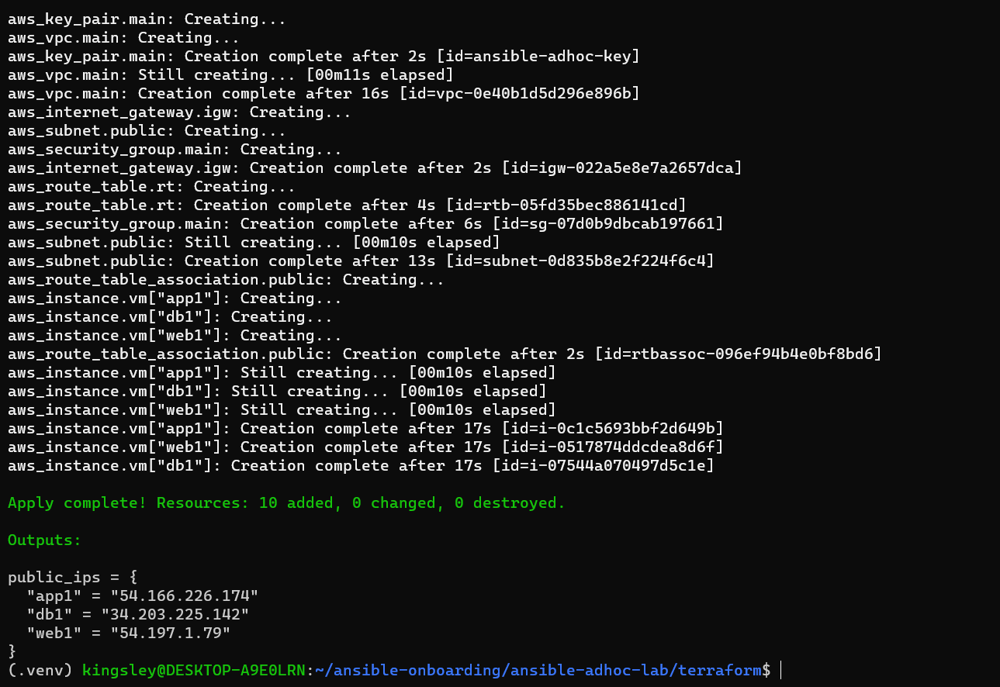

---

#### Screenshot 7 — `terraform output public_ips` showing the role-to-IP mapping for all three or four VMs

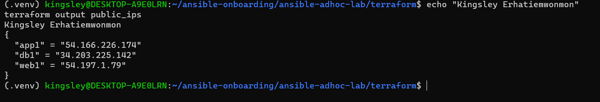

---

#### Screenshot 8 — Azure Portal or AWS Management Console showing all three or four VMs in the `Running` state, with their role-based names visible

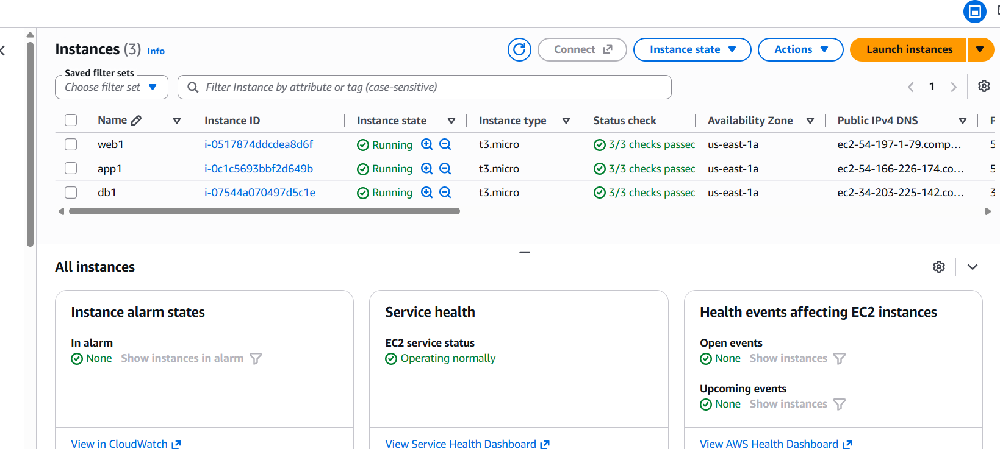

---

### Notes

* Ran `terraform apply` successfully and confirmed that Terraform completed the infrastructure deployment with `Apply complete`.
* Used `terraform output public_ips` to display the public IP addresses assigned to the provisioned server roles.
* Confirmed that the output provides a clear role-to-IP mapping for the provisioned VMs, making it easier to identify and connect to each server.
* Verified the provisioned virtual machines in the AWS Management Console and confirmed that the expected role-based instances were running.
* The role-based naming convention makes it easier to distinguish the web, application, and database servers when managing the infrastructure with Ansible.

---

# Task 4 — Verify SSH Key-Based Access

## Goal

Verify that each managed VM can be accessed from the Ansible controller using SSH key-based authentication.

### Evidence

#### Screenshot 9 — Terminal showing successful SSH hostname output from all VMs

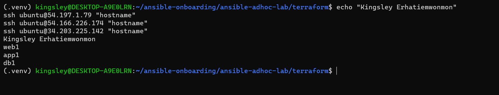

---

### Notes

This screenshot shows the result of Task 4, where I tested SSH key-based access from my Ansible controller to all three Terraform-provisioned AWS VMs. My full name is printed at the top, followed by the three commands ssh ubuntu@<public IP> "hostname", one for each server. The output returned web1, app1, and db1, which are the three roles defined in my Terraform vm_roles variable.

Each command connected as the default Ubuntu user, ubuntu, using the public IP address of the VM. No password prompt appeared. Authentication used my SSH key pair, ~/.ssh/id_ed25519. Terraform registered the public key in AWS as the key pair ansible-adhoc-key and attached it to every instance, and the private key stayed on my controller. I used public IPs from terraform output public_ips because the controller is outside the VPC, and the private 10.0.1.x addresses are not reachable from it. The connections worked because the security group allows SSH on port 22 only from my controller's public IP as a /32.

Ubuntu on AWS names a server after its private IP by default, for example ip-10-0-1-25, and Terraform sets only the Name tag. To make the hostnames match the roles, I used hostnamectl set-hostname on each VM and added a matching line to /etc/hosts. That is a manual change made after provisioning. A cleaner long-term method is setting the hostname through user_data in the Terraform aws_instance block. Once the hostnames were set, each VM returned its role name. The first connection to each server asked me to confirm the host fingerprint, and I answered yes.

This result confirmed that all three VMs were running, reachable, and trusted my key, which I needed before creating the Ansible inventory and running ad-hoc commands in the next tasks.

---

# Task 5 — Create the Custom Ansible Inventory

## Goal

Create an Ansible inventory file that groups the managed VMs by role.

The inventory allows Ansible to run commands against all servers, or only specific groups such as `web`, `app`, or `db`.

### Evidence

#### Screenshot 10 — `inventory.ini` showing the `web`, `app`, and `db` groups

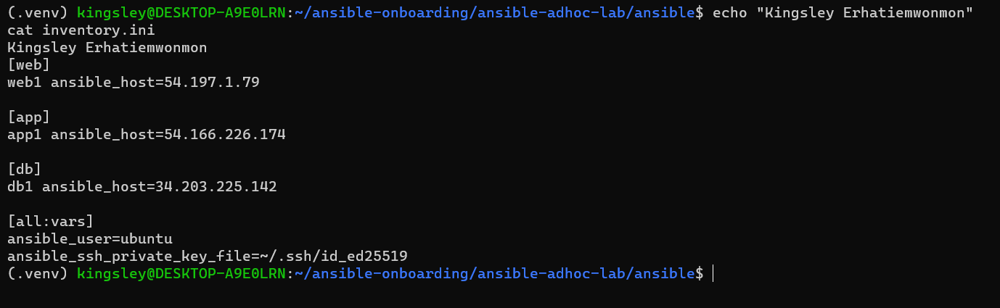

---

#### Screenshot 11 — Output of `ansible-inventory -i inventory.ini --graph`

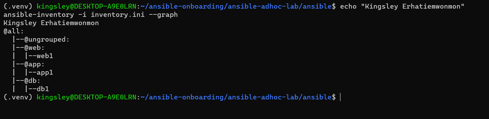

---

### Notes

* Created the Ansible `inventory.ini` file and organized the provisioned servers into three role-based groups: `web`, `app`, and `db`.
* Each group represents a different server role, making it easier to target specific types of servers when running Ansible commands.
* Used `ansible-inventory -i inventory.ini --graph` to verify that Ansible correctly recognized the inventory structure and the hosts assigned to each group.
* The inventory graph confirmed that the web, application, and database servers were properly grouped and available for Ansible management.
* Using role-based inventory groups provides a clear and reusable structure for running commands against specific server roles.

---

# Task 6 — Run Ansible Ad-Hoc Commands

## Goal

Run Ansible ad-hoc commands from the controller to verify connectivity, check server information, and manage packages and services across inventory groups.

This task proves that the inventory is working and that Ansible can control multiple managed VMs without writing a playbook.

### Evidence

#### Screenshot 12 — Output of `ansible all -i inventory.ini -m ping`

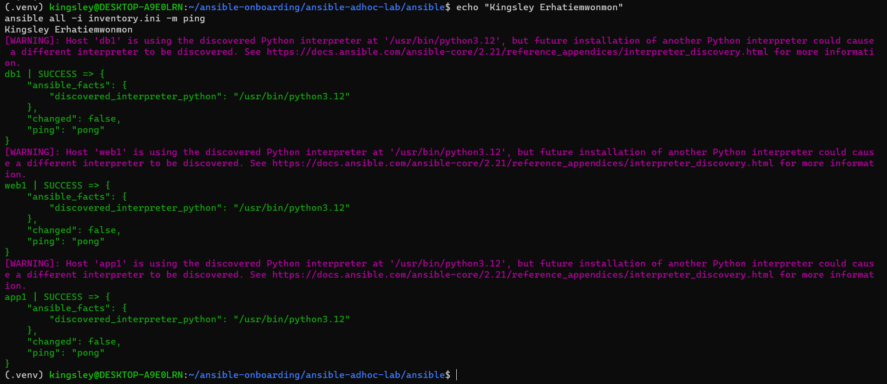

---

#### Screenshot 13 — Output of `ansible all -i inventory.ini -m command -a "uptime"`

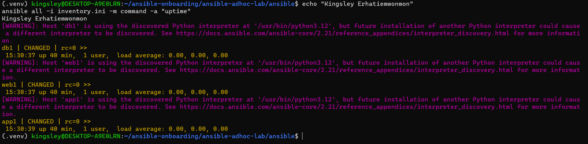

---

#### Screenshot 14 — Output of `ansible web -i inventory.ini -m apt -a "name=nginx state=present update_cache=yes" --become`

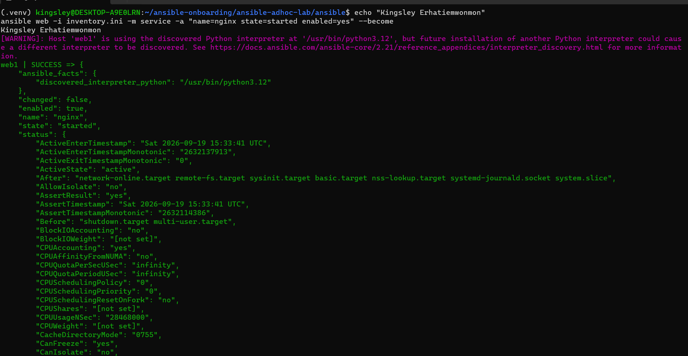

---

#### Screenshot 15 — Output of `ansible web -i inventory.ini -m service -a "name=nginx state=started enabled=yes" --become`

---

#### Screenshot 16 — Output of `ansible all -i inventory.ini -m apt -a "name=htop state=present update_cache=yes" --become`

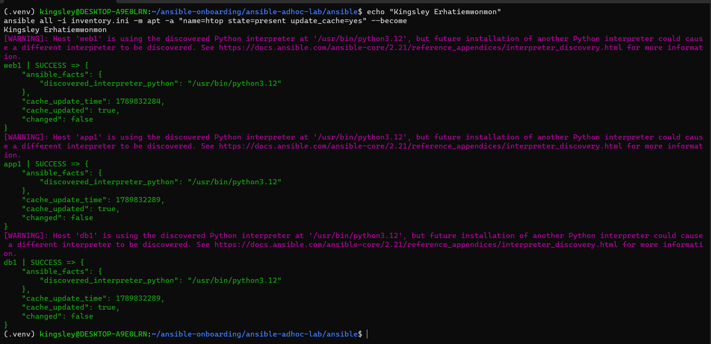

---

#### Screenshot 17 — Output of `ansible web -i inventory.ini -m command -a "systemctl is-active nginx"`

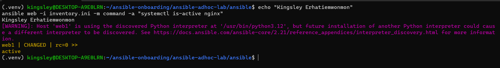

---

### Notes

* Used the Ansible `apt` module with privilege escalation to install Nginx on the servers in the `web` group.
* Used the Ansible `service` module to start Nginx and configure it to start automatically when the server boots.
* Used the `apt` module against the `all` group to install `htop` across all provisioned servers.
* Verified the Nginx service status on the web server using `systemctl is-active nginx`.
* The successful command outputs confirmed that Ansible could connect to the managed hosts and perform the required package and service management tasks.
* These ad-hoc commands demonstrated how Ansible can manage specific server roles as well as all hosts in the inventory from the controller.

---

# LinkedIn Post Required

## Evidence

#### LinkedIn Post URL

Paste your LinkedIn post URL here:

https://www.linkedin.com/posts/kingsley-erhatiemwonmon_devops-ansible-terraform-activity-7507127558061289473-Hstu?utm_source=share&utm_medium=member_desktop&rcm=ACoAAClDkSEBa4Zo6dTWVIEEl8FJLczvH_zPHtY

---

#### Screenshot — Published LinkedIn post

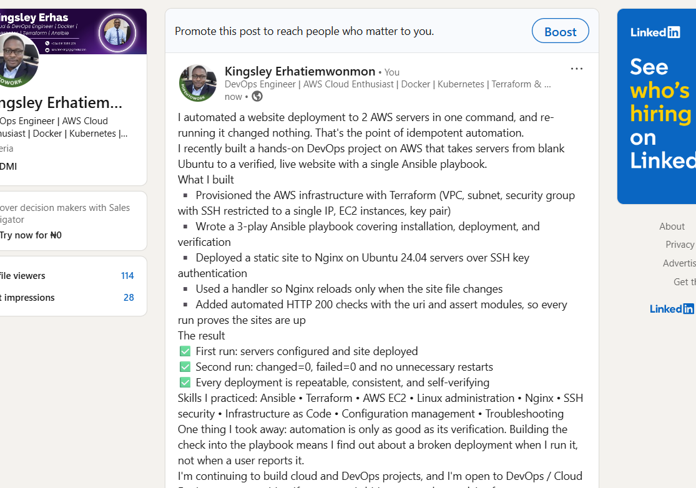

---

# Assignment Questions

Answer the following in your own words:

**1. What is the purpose of an Ansible inventory file?**

An Ansible inventory file defines the managed hosts that Ansible connects to and organizes them into logical groups. In this project, the inventory groups the servers into `web`, `app`, and `db` roles, making it easy to target specific servers when running commands or applying configurations. It also provides the connection details Ansible needs to communicate with the remote machines. This makes server management more organized, consistent, and easier to automate.

---

**2. What is the difference between the `web`, `app`, and `db` groups in your inventory?**

The `web`, `app`, and `db` groups represent different roles assigned to the servers in the Ansible inventory. The `web` group contains servers responsible for serving web content, such as the Nginx server configured in this assignment. The `app` group contains servers intended to run application services and application-related workloads. The `db` group contains servers intended to host databases and handle data storage and database services. Grouping the servers by role allows Ansible commands and configurations to be applied specifically to the servers that need them.

---

**3. What does the Ansible `ping` module verify?**

The Ansible `ping` module verifies that Ansible can successfully connect to a managed host and communicate with it. It checks the basic Ansible connection and authentication setup without performing any changes on the remote server. A successful `pong` response confirms that the host is reachable and that Ansible can communicate with it using the configured connection method.

---

**4. Why do package installation commands require `--become`?**

Package installation commands require `--become` because installing or updating system packages usually requires administrator or root privileges. The `--become` option allows Ansible to execute the task with elevated privileges, typically using `sudo`, without requiring the user to log in directly as root. This allows Ansible to install packages such as Nginx and `htop` while maintaining controlled and secure privilege escalation.

---

**5. When would you use an ad-hoc command instead of a playbook?**

I would use an Ansible ad-hoc command when I need to perform a quick, one-time task or check on one or more managed servers without creating a complete playbook. For example, an ad-hoc command can be used to check connectivity, install a package, check a service status, or gather basic system information. For repeated tasks, complex configurations, or processes that need to be documented and reused, I would use an Ansible playbook instead.

---

**6. What is one challenge you faced while setting up SSH or inventory, and how did you fix it?**

One challenge I faced was ensuring that the Ansible inventory correctly matched the role-based servers and that SSH authentication was properly configured for the managed hosts. I resolved this by organizing the servers into the `web`, `app`, and `db` groups in `inventory.ini`, verifying the inventory with `ansible-inventory -i inventory.ini --graph`, and checking SSH connectivity before running the Ansible ad-hoc commands. This helped confirm that Ansible could identify the correct hosts and connect to them successfully.

---

# Required Files

Confirm that the following files are included in your assignment workspace:

- [ ] `ansible-adhoc-lab/README.md`
- [ ] `ansible-adhoc-lab/terraform/providers.tf`
- [ ] `ansible-adhoc-lab/terraform/main.tf`
- [ ] `ansible-adhoc-lab/terraform/variables.tf`
- [ ] `ansible-adhoc-lab/terraform/outputs.tf`
- [ ] `ansible-adhoc-lab/ansible/inventory.ini`
- [ ] Updated `.gitignore`

---

# Submission Instructions

- Add all required screenshots from the tasks.
- Full Name must be visible in required screenshots.
- Mention whether you used Azure or AWS.
- Mention whether you used the three-VM option or four-VM option.
- Add the public IP addresses of the VMs, redacted if preferred.
- Add your `inventory.ini` proof.
- Add a short explanation of what you learned.
- Answer all assignment questions clearly in your own words.
- Add your LinkedIn post URL.
- Do not expose SSH private keys, Terraform state files, cloud credentials, passwords, access keys, secret keys, account IDs, or subscription IDs.

---

# Completion Checklist

- [ ] Task 1: `ansible-adhoc-lab` project structure created
- [ ] Task 1: `.gitignore` updated for Terraform files
- [ ] Task 2: Terraform configuration created
- [ ] Task 2: Server roles defined for either three or four VMs
- [ ] Task 2: `count` or `for_each` used
- [ ] Task 2: SSH restricted to the controller public IP
- [ ] Task 2: HTTP allowed only for web hosts
- [ ] Task 2: Terraform output maps roles to public IPs
- [ ] Task 3: Terraform initialized successfully
- [ ] Task 3: Terraform configuration validated
- [ ] Task 3: Terraform apply completed successfully
- [ ] Task 3: All selected VMs are running
- [ ] Task 4: SSH key-based access works for every VM
- [ ] Task 5: `inventory.ini` contains `web`, `app`, and `db` groups
- [ ] Task 5: `ansible-inventory -i inventory.ini --graph` shows the correct groups
- [ ] Task 6: `ansible all -i inventory.ini -m ping` returns `SUCCESS`
- [ ] Task 6: Ad-hoc commands run successfully
- [ ] Task 6: `--become` was used for package and service tasks
- [ ] Task 6: Nginx is active on the `web` group
- [ ] Screenshots 1–17 are included
- [ ] Assignment questions are answered
- [ ] LinkedIn post published
- [ ] LinkedIn post URL added
- [ ] No sensitive information is exposed

---

## About DMI & CloudAdvisory

DevOps Micro Internship (DMI) is a project-based DevOps program run by Pravin Mishra and The CloudAdvisory, focused on real-world execution, systems thinking, and career readiness.

It helps learners build strong DevOps foundations with hands-on experience.

---

## Resources

- DMI Official Website: [https://dmi.pravinmishra.com?utm_source=github&utm_medium=readme](https://dmi.pravinmishra.com?utm_source=github&utm_medium=readme)
- University: [https://university.pravinmishra.com?utm_source=github&utm_medium=readme](https://university.pravinmishra.com?utm_source=github&utm_medium=readme)
- Discord Community: [https://discord.pravinmishra.com?utm_source=github&utm_medium=readme](https://discord.pravinmishra.com?utm_source=github&utm_medium=readme)
- Blog: [https://dmi.pravinmishra.com/blog?utm_source=github&utm_medium=readme](https://dmi.pravinmishra.com/blog?utm_source=github&utm_medium=readme)
- YouTube Playlist: [https://www.youtube.com/playlist?list=PLFeSNDtI4Cho](https://www.youtube.com/playlist?list=PLFeSNDtI4Cho)
- Pravin Mishra LinkedIn: [https://www.linkedin.com/in/pravin-mishra-aws-trainer/](https://www.linkedin.com/in/pravin-mishra-aws-trainer/)
- CloudAdvisory LinkedIn: [https://www.linkedin.com/company/thecloudadvisory/](https://www.linkedin.com/company/thecloudadvisory/)

---

*This submission is part of DevOps Micro Internship (DMI) — Agentic AI Track.*