# Assignment 03 — Deploy a Static Website to Multiple Servers Using a Multi-Play Ansible Playbook

Part of the DevOps Micro Internship (DMI) with Agentic AI

---

## Student Details

**Full Name:** Kingsley Erhatiemwonmon 
**Cloud Platform Used:** AWS  
**Server 1 URL:** http://54.197.1.79  
**Server 2 URL:** http://54.166.226.174

---

## Purpose

In this assignment, you will create a multi-play Ansible playbook to install Nginx, deploy a static website to two Ubuntu servers, and verify that the website is accessible from both servers.

You may use either AWS EC2 instances or Azure Virtual Machines as your managed servers.

---

# Task 1 — Create the Project Structure

## Goal

Create the required folders and files for the Ansible project.

## Evidence

### Screenshot 1 — Terminal or VS Code showing the complete `static-web` project structure

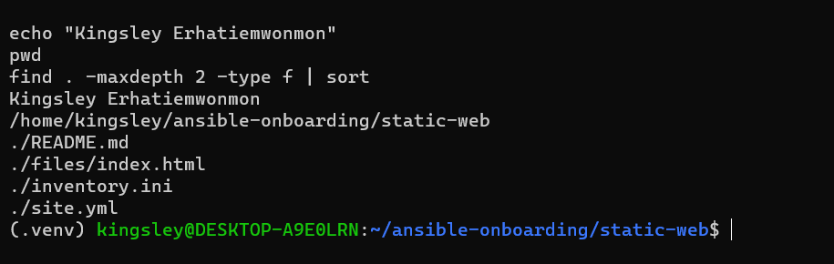

---

# Task 2 — Configure the Ansible Inventory

## Goal

Add both Ubuntu servers to the Ansible inventory.

## Evidence

### Screenshot 2 — Output of `ansible-inventory -i inventory.ini --graph` showing `web1` and `web2`

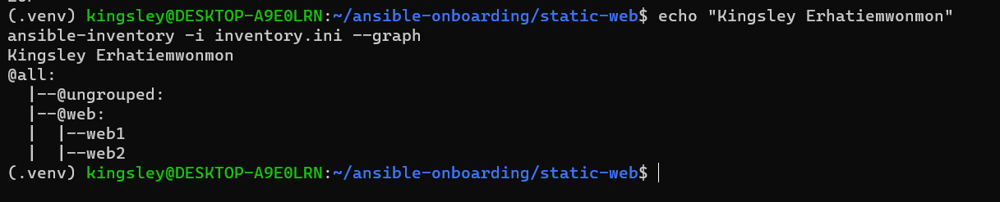

---

## Configuration File

Copy and paste the complete contents of your `inventory.ini` file below:

```ini
[web]
web1 ansible_host=54.197.1.79
web2 ansible_host=54.166.226.174

[web:vars]
ansible_user=ubuntu
ansible_ssh_private_key_file=/home/kingsley/.ssh/id_ed25519
```

---

# Task 3 — Verify Ansible Connectivity

## Goal

Confirm that the Ansible controller can connect to both servers.

## Evidence

### Screenshot 3 — Ansible ping output showing `SUCCESS` and `pong` for both servers

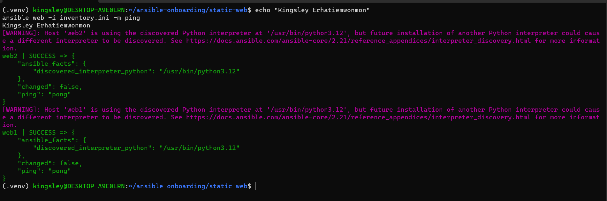

---

# Task 4 — Download and Personalize the Static Website

## Goal

Download `index.html` to the Ansible controller and personalize the website with your full name.

## Evidence

### Screenshot 4 — Edited `files/index.html` showing the footer line with your full name

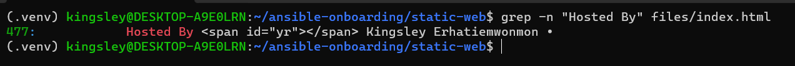

---

# Task 5 — Create the Multi-Play Ansible Playbook

## Goal

Create a single Ansible playbook containing separate plays for installation, deployment, and verification.

## Configuration File

Copy and paste the complete contents of your `site.yml` file below:

```yaml
---
# Play 1: install and configure Nginx
- name: Install and configure Nginx on web servers
  hosts: web
  become: true
  tasks:
    - name: Update the APT package cache
      ansible.builtin.apt:
        update_cache: true
        cache_valid_time: 86400

    - name: Install Nginx
      ansible.builtin.apt:
        name: nginx
        state: present

    - name: Start and enable Nginx
      ansible.builtin.service:
        name: nginx
        state: started
        enabled: true

# Play 2: deploy the static website
- name: Deploy the static website to web servers
  hosts: web
  become: true
  tasks:
    - name: Copy index.html from the controller
      ansible.builtin.copy:
        src: files/index.html
        dest: /var/www/html/index.html
        owner: www-data
        group: www-data
        mode: "0644"
      notify: Reload Nginx

  handlers:
    - name: Reload Nginx
      ansible.builtin.service:
        name: nginx
        state: reloaded

# Play 3: verify from the controller
- name: Verify both websites from the controller
  hosts: localhost
  connection: local
  gather_facts: false
  become: false
  tasks:
    - name: Send HTTP GET request to each web server
      ansible.builtin.uri:
        url: "http://{{ hostvars[item].ansible_host }}"
        method: GET
        status_code: 200
      loop: "{{ groups['web'] }}"
      register: website_checks

    - name: Assert each server returned HTTP 200
      ansible.builtin.assert:
        that:
          - item.status == 200
        success_msg: "{{ item.item }} returned HTTP {{ item.status }}"
        fail_msg: "{{ item.item }} returned HTTP {{ item.status }}"
      loop: "{{ website_checks.results }}"
      loop_control:
        label: "{{ item.item }}"
```

---

# Task 6 — Validate the Playbook Syntax

## Goal

Check the playbook for YAML or Ansible syntax errors before running it.

## Evidence

### Screenshot 5 — Successful syntax-check output showing `playbook: site.yml`

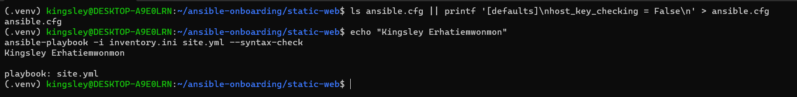

---

# Task 7 — Run the Multi-Play Playbook

## Goal

Install Nginx, deploy the website, and verify both servers in one playbook run.

## Evidence

### Screenshot 6 — Play 3 verification showing HTTP `200` for both servers

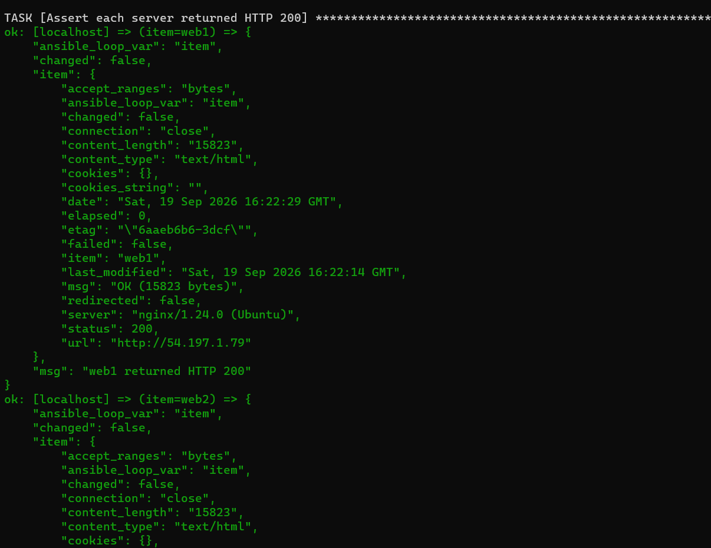

---

### Screenshot 7 — Final play recap showing `unreachable=0` and `failed=0` for `web1`, `web2`, and `localhost`

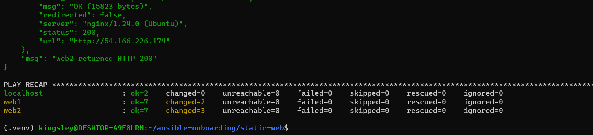

---

# Task 8 — Verify Idempotency

## Goal

Run the playbook again and confirm that it does not make unnecessary changes.

## Evidence

### Screenshot 8 — Second playbook run showing the play recap with `changed=0`, `unreachable=0`, and `failed=0` for both web servers

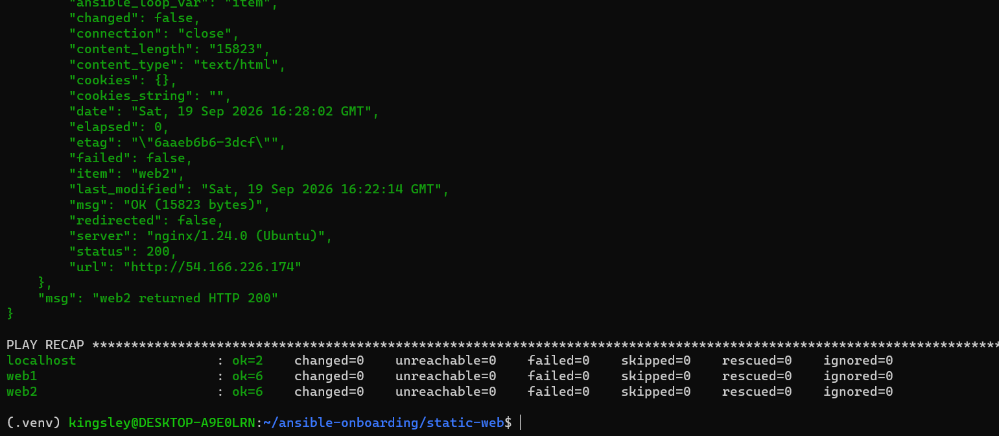

---

# Task 9 — Test Both Websites Manually

## Goal

Confirm that the static website is accessible from both public IP addresses.

## Evidence

### Screenshot 9 — `curl -I` output showing HTTP `200 OK` from both servers

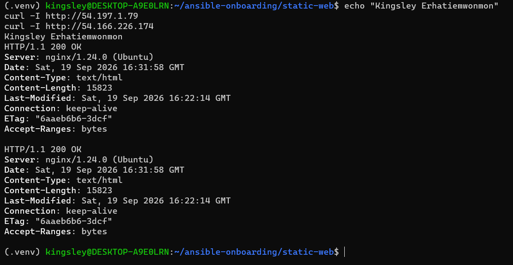

---

### Screenshot 10 — Browser showing the website from Server 1 with the public IP and your full name visible

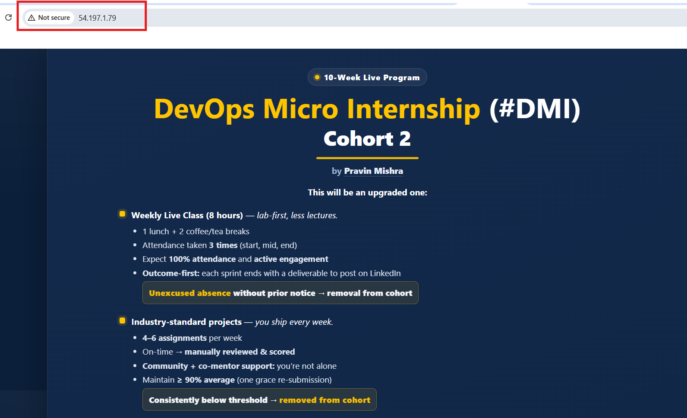

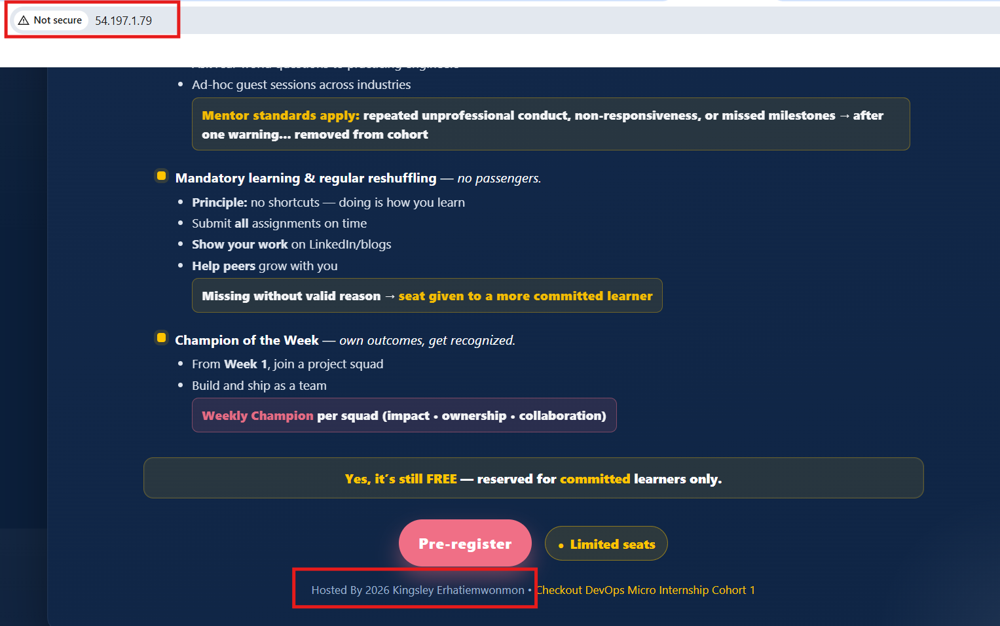

---

### Screenshot 11 — Browser showing the website from Server 2 with the public IP and your full name visible

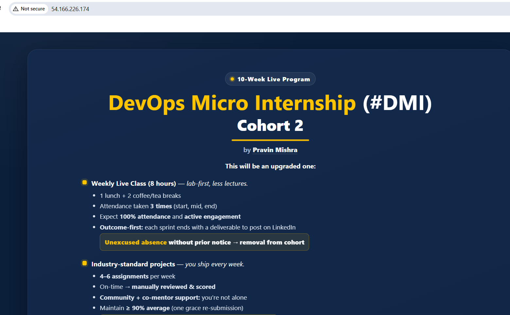

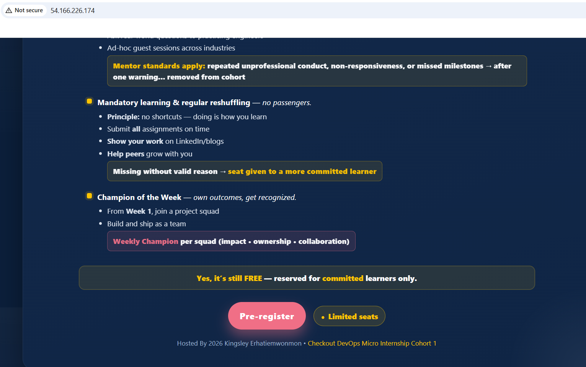

---

## Website URLs

Add both deployed website URLs below:


Server 1: http://54.197.1.79

Server 2: http://54.166.226.174

---

# Task 10 — Complete the Project README

## Goal

Document how the project works and record what you learned.

## README Content

Copy and paste the complete contents of your `README.md` file below:


# Multi-Play Ansible Static Website Deployment

Author: Kingsley Erhatiemwonmon

## Project Overview

This project uses a single Ansible playbook (`site.yml`) with three plays to deploy a static website to two Ubuntu servers on AWS:

1. **Install and configure Nginx** on both web servers.
2. **Deploy the static website** by copying a personalized `index.html` from the Ansible controller to `/var/www/html/index.html`. A handler reloads Nginx only when the file changes.
3. **Verify both websites** from the controller using the `uri` module, then confirm with the `assert` module that each server returned HTTP 200.

The website file was downloaded from a public GitHub repository and personalized with my full name in the footer. The playbook is idempotent: a second run made no changes.

## Environment

- Cloud platform: AWS (EC2, region us-east-1)
- Operating system: Ubuntu 24.04 LTS
- Number of managed servers: 2 (inventory names `web1` and `web2`)
- Web server: Nginx 1.24
- Ansible controller: Ubuntu on WSL, with Ansible installed in a Python virtual environment
- Connection: SSH key authentication as the `ubuntu` user

The two servers were reused from the previous assignment. `web1` is the VM named web1 there, and `web2` is the VM that was named app1. The inventory names are only labels.

## How to Run the Playbook

From the `static-web` directory, with the virtual environment active:

```bash
ansible-playbook -i inventory.ini site.yml
```

To check the syntax first:

```bash
ansible-playbook -i inventory.ini site.yml --syntax-check
```

## Issue Faced and Solution

**Issue:** When I opened `files/index.html` with Nano, the file was empty.

**Cause:** Task 1 created `files/index.html` with `touch`, which makes an empty placeholder. I had not yet done the download step in Task 4, so there was nothing to edit.

**Solution:** I downloaded the website into the file with `curl -L <raw GitHub URL> -o files/index.html`, which replaced the empty placeholder. I then checked the size with `ls -l` and replaced the `Your Full Name` placeholder with my name using `sed`. Finally, I confirmed the change with `grep -n "Hosted By" files/index.html`.

## What I Learned

- How to structure one playbook with several plays, each targeting different hosts (`web` for Plays 1 and 2, `localhost` for Play 3).
- How handlers work: the Nginx reload ran on the first deployment because `index.html` changed, and it did not run on the second run because nothing changed.
- How to check a result from the controller with `uri`, `register`, and `assert`. `status_code` is the expected code passed to `uri`, while `status` is the returned value that `assert` checks.
- How to verify idempotency. The first run showed changes (`changed=2` on web1 and `changed=3` on web2). The second run showed `changed=0` and `failed=0` on all hosts.
- Ansible reads only the `ansible.cfg` in the current directory, so each project folder needs its own configuration file.

## Why Installation and Deployment Are Separate

Installing Nginx and deploying website content are different jobs that change at different rates. Installing and enabling the web server is a one-time setup that rarely changes, while the website content may change often. With separate plays, I can update the site and reload Nginx without repeating the server setup. Each play also has one clear purpose, so if something fails, I can see quickly whether the problem is in the setup or the deployment, and each play is easier to reuse for other servers.

## Benefit of the Ansible Copy Module

The `copy` module sends a file straight from the controller to every server. The servers do not need Git installed, access to the repository, or any credentials, and no repository has to be reachable from each of them. Every server also receives exactly the same file that I reviewed on the controller, so the deployment is consistent, and Ansible can compare the file and skip the copy when nothing has changed.


---

# LinkedIn Post Required

## Evidence

### LinkedIn Post URL

Paste your LinkedIn post URL here:

https://www.linkedin.com/posts/kingsley-erhatiemwonmon_devops-ansible-terraform-activity-7507127558061289473-Hstu?utm_source=share&utm_medium=member_desktop&rcm=ACoAAClDkSEBa4Zo6dTWVIEEl8FJLczvH_zPHtY

---

### Screenshot — Published LinkedIn post


---

# Assignment Questions

Answer the following in your own words:

**1. What issue did you face while completing this assignment, and how did you fix it?**

While personalizing the website in Task 4, I opened files/index.html in Nano and found the file was empty, so there was no "Your Full Name" placeholder to replace. The cause was that Task 1 had created the file with the touch command, which only makes an empty placeholder, and I had not yet downloaded the real website file.

I fixed it by downloading the website into that file with curl -L https://raw.githubusercontent.com/pravinmishraaws/Azure-Static-Website/main/index.html -o files/index.html, which replaced the empty file. I checked the download with ls -l files/index.html, which showed about 15 KB instead of 0 bytes. Then I replaced the "Your Full Name" placeholder with my full name using the sed command. Finally, I confirmed the change with grep -n "Hosted By" files/index.html, which showed my name in the footer. The playbook then deployed the correct page to both servers, and both returned HTTP 200.

---

**2. What did you learn from this assignment?**

From this assignment I learned how to organize one Ansible playbook into several plays, each with its own purpose and target hosts. Plays 1 and 2 ran against the web group to install Nginx and deploy the website, while Play 3 ran against localhost to verify the result from the controller. Separating installation, deployment, and verification made the playbook easier to read and to troubleshoot.

I also learned how handlers work. The Nginx reload handler ran on the first run because index.html changed, and it did not run on the second run because the file was already correct. This showed me that handlers run only when a task reports a change.

I learned how to verify a website from the controller by combining the uri module, register, and assert. The status_code parameter in uri is the expected status, while the status value in the registered result is what assert checks. Looping over groups['web'] with hostvars[item].ansible_host let me test both servers with a single task.

I also saw idempotency in practice. The first run made changes (changed=2 on web1 and changed=3 on web2), and the second run showed changed=0 and failed=0 on all hosts, which proves the playbook can be run repeatedly without making unnecessary changes.

Finally, I learned that Ansible reads only the ansible.cfg in the current directory, so each project folder needs its own configuration file, and that the copy module lets the controller push the same file to every server without needing Git or credentials on the servers.

---

**3. Why is it useful to split installation, deployment, and verification into separate plays?**

Splitting the playbook into separate plays gives each stage one clear job. In my playbook, Play 1 installs and starts Nginx, Play 2 deploys index.html, and Play 3 checks from the controller that both servers return HTTP 200. Installing the web server is a one-time setup that rarely changes, while the website content may change often. Because the plays are separate, I can update the site and reload Nginx without repeating the server setup.

It also makes troubleshooting easier. If something fails, the play name shows which stage the problem is in. A failure in Play 1 points to the package or service setup, a failure in Play 2 points to the file copy or permissions, and a failure in Play 3 means the website is not responding correctly.

Separate plays can also target different hosts. Plays 1 and 2 ran against the web group on the managed servers, while Play 3 ran against localhost, because the check is made from the Ansible controller and needs no privilege escalation or fact gathering. Splitting the plays let me set become, connection, and gather_facts for each stage separately.

Finally, each play is easier to reuse and maintain. The installation play could be used for any new web server, and the verification play could be run alone to check the sites at any time.

---

**4. What is one benefit of using the Ansible `copy` module instead of cloning the website directly from Git on every managed server?**

One benefit of the copy module is that the managed servers need no Git access. With copy, the Ansible controller pushes the file to each server over the same SSH connection it already uses. The servers do not need Git installed, a route to GitHub, or any repository credentials. If I cloned the website on every server, each one would need Git, network access to the repository, and possibly a deploy key or token for a private repo. That adds setup work and more places for credentials to leak.

It also keeps the deployment consistent. Every server receives the exact index.html I edited and checked on the controller, with my name in the footer. Cloning on each server could pull a different version if the repository changed between runs. In my playbook, copy also let me set the owner (www-data), the group, and the mode (0644) in the same task. It compares the file with the copy already on the server, so the second run showed ok instead of changed and did not trigger the Nginx reload handler.

---

**5. What does idempotency mean in this assignment?**

Idempotency means that running the same playbook several times leaves the servers in the same state as running it once. Ansible checks the current state of each server and only makes a change when the server differs from what the playbook describes. If a server already matches, the task reports ok instead of changed.

In this assignment, the first run made changes because the servers were not yet in the desired state. web1 showed changed=2 (the copied index.html and the Nginx reload handler), and web2 showed changed=3 (the Nginx installation, the copy, and the handler). The second run, with no edits to site.yml or files/index.html, showed changed=0 and failed=0 on both web servers. Nginx was already installed, running, and enabled, so those tasks reported ok. The copy module compared index.html with the file already on each server, found it identical, and reported ok. Because the file did not change, the handler was not notified, and the Nginx reload did not run again.

This matters because the playbook can be re-run safely at any time, for example after a failed run or to confirm that servers still match the intended configuration, without duplicate installs, unnecessary restarts, or unexpected side effects. It also makes the playbook a reliable, repeatable deployment, which is what the assignment asks for.

---

**6. What does the Ansible uri module verify in Play 3?

In Play 3, the uri module verifies that each web server answers an HTTP request with status code 200. It runs on the Ansible controller (localhost), loops through every host in the web group, and sends an HTTP GET request to http://<public IP>, building the address from hostvars[item].ansible_host. The status_code: 200 parameter tells uri that 200 is the expected result, so the task fails if a server returns a different code or does not respond at all.

This works as an end-to-end check from the outside, the way a real visitor would reach the site. A 200 response shows that Nginx is installed and running, that port 80 is open in the security group, and that the server is serving the deployed page. In my run, both servers returned 200 with a content length of 15823 bytes, which matches the size of my index.html.

The uri results are stored in the website_checks variable. The next task uses assert to check that each returned status value equals 200 and prints a message such as "web1 returned HTTP 200". The uri module checks only the response status, not the page content, so I confirmed my name in the footer separately with curl and in the browser in Task 9.

---

# Required Files

Confirm that the following files are included in your assignment folder:

- [ ] `inventory.ini`
- [ ] `site.yml`
- [ ] `files/index.html`
- [ ] `README.md`

---

# Submission Instructions

- Add all required screenshots in the correct order.
- Full Name must be visible in required screenshots.
- Include both deployed website URLs.
- Paste `inventory.ini`, `site.yml`, and `README.md` as editable text.
- Answer all assignment questions clearly in your own words.
- Add your LinkedIn post URL.
- Do not expose SSH private keys, passwords, cloud account IDs, or other sensitive information.

---

# Completion Checklist

- [ ] Task 1: `static-web` folder structure is complete
- [ ] Task 2: Both servers are listed under the `[web]` group in `inventory.ini`
- [ ] Task 2: Inventory graph shows `web1` and `web2`
- [ ] Task 3: Ansible ping returns `SUCCESS` and `pong` for both servers
- [ ] Task 4: `files/index.html` contains your full name
- [ ] Task 5: `site.yml` contains three separate plays
- [ ] Task 5: Play 1 installs, starts, and enables Nginx
- [ ] Task 5: Play 2 deploys `index.html` using the `copy` module
- [ ] Task 5: Nginx reload handler is included
- [ ] Task 5: Play 3 verifies both web servers from the controller
- [ ] Task 6: Playbook syntax check passes
- [ ] Task 7: First playbook run completes with `unreachable=0` and `failed=0`
- [ ] Task 7: URI verification returns HTTP `200` for both servers
- [ ] Task 8: Second playbook run demonstrates idempotency
- [ ] Task 8: Second run shows `changed=0` for both web servers
- [ ] Task 9: Both `curl -I` commands return HTTP `200 OK`
- [ ] Task 9: Website loads from Server 1
- [ ] Task 9: Website loads from Server 2
- [ ] Task 9: Full name is visible on both deployed websites
- [ ] Task 10: `README.md` contains all required explanations
- [ ] Screenshots 1–11 are included
- [ ] `inventory.ini`, `site.yml`, and `README.md` are pasted as editable text
- [ ] Both website URLs are included
- [ ] Assignment questions are answered
- [ ] LinkedIn post published
- [ ] LinkedIn post URL added
- [ ] No sensitive information is exposed

---

## About DMI & CloudAdvisory

DevOps Micro Internship (DMI) is a project-based DevOps program run by Pravin Mishra and The CloudAdvisory, focused on real-world execution, systems thinking, and career readiness.

It helps learners build strong DevOps foundations with hands-on experience.

---

## Resources

- DMI Official Website: [https://dmi.pravinmishra.com?utm_source=github&utm_medium=readme](https://dmi.pravinmishra.com?utm_source=github&utm_medium=readme)
- University: [https://university.pravinmishra.com?utm_source=github&utm_medium=readme](https://university.pravinmishra.com?utm_source=github&utm_medium=readme)
- Discord Community: [https://discord.pravinmishra.com?utm_source=github&utm_medium=readme](https://discord.pravinmishra.com?utm_source=github&utm_medium=readme)
- Blog: [https://dmi.pravinmishra.com/blog?utm_source=github&utm_medium=readme](https://dmi.pravinmishra.com/blog?utm_source=github&utm_medium=readme)
- YouTube Playlist: [https://www.youtube.com/playlist?list=PLFeSNDtI4Cho](https://www.youtube.com/playlist?list=PLFeSNDtI4Cho)
- Pravin Mishra LinkedIn: [https://www.linkedin.com/in/pravin-mishra-aws-trainer/](https://www.linkedin.com/in/pravin-mishra-aws-trainer/)
- CloudAdvisory LinkedIn: [https://www.linkedin.com/company/thecloudadvisory/](https://www.linkedin.com/company/thecloudadvisory/)

---

*This submission is part of DevOps Micro Internship (DMI) — Agentic AI Track.*