# Assignment 04 — Deploy Mini Finance on Azure Using Terraform and Ansible

Part of the DevOps Micro Internship (DMI) with Agentic AI

---

## Purpose

In this assignment, you will provision Azure infrastructure using Terraform and deploy the Mini Finance website using an Ansible multi-play playbook.

Terraform will create the Azure Virtual Machine and networking resources. Ansible will install Nginx, clone the Mini Finance repository, deploy the website, and verify the deployment.

---

# Task 1 — Create the Project Structure

## Goal

Create separate directories and files for the Terraform infrastructure and Ansible configuration.

### Evidence

#### Screenshot 1 — Terminal or VS Code showing the complete `mini-finance` project structure

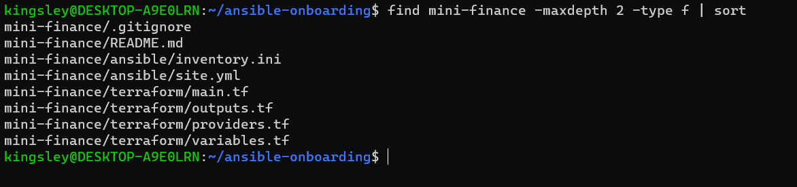

---

### Notes

This screenshot shows the project structure I created for the Mini Finance assignment. The project folder, mini-finance, sits inside my existing ansible-onboarding workspace and keeps the two tools in separate directories. The terraform directory holds the infrastructure code: providers.tf for the AzureRM provider, main.tf for the Azure resources, variables.tf for input values, and outputs.tf for the public_ip output. The ansible directory holds the configuration files: inventory.ini for the target server and site.yml for the multi-play playbook. README.md documents the project, and .gitignore keeps Terraform state files, the .terraform working directory, saved plans, crash logs, and private keys (*.pem and *.key) out of version control.

I created the structure first so that the work was organized before any Azure resources existed. Separating the two tools follows the assignment's split of responsibilities: Terraform provisions the cloud infrastructure, and Ansible configures the server, deploys the website, and verifies it. Keeping their files apart makes the project easier to maintain and troubleshoot, because a problem in the infrastructure and a problem in the deployment are in different folders. The .gitignore was set up at the start, so sensitive files like the Terraform state, which can contain details of the infrastructure, were never at risk of being committed.

The listing matches the expected output: eight files, with the four Terraform files under terraform/, the two Ansible files under ansible/, and README.md and .gitignore at the top level.

---

# Task 2 — Create the Azure Infrastructure Using Terraform

## Goal

Use Terraform to provision an Ubuntu Virtual Machine with the required Azure networking and security resources.

### Evidence

#### Screenshot 2 — Terraform code showing the `Allow-SSH` rule for port `22` and the `Allow-HTTP` rule for port `80`

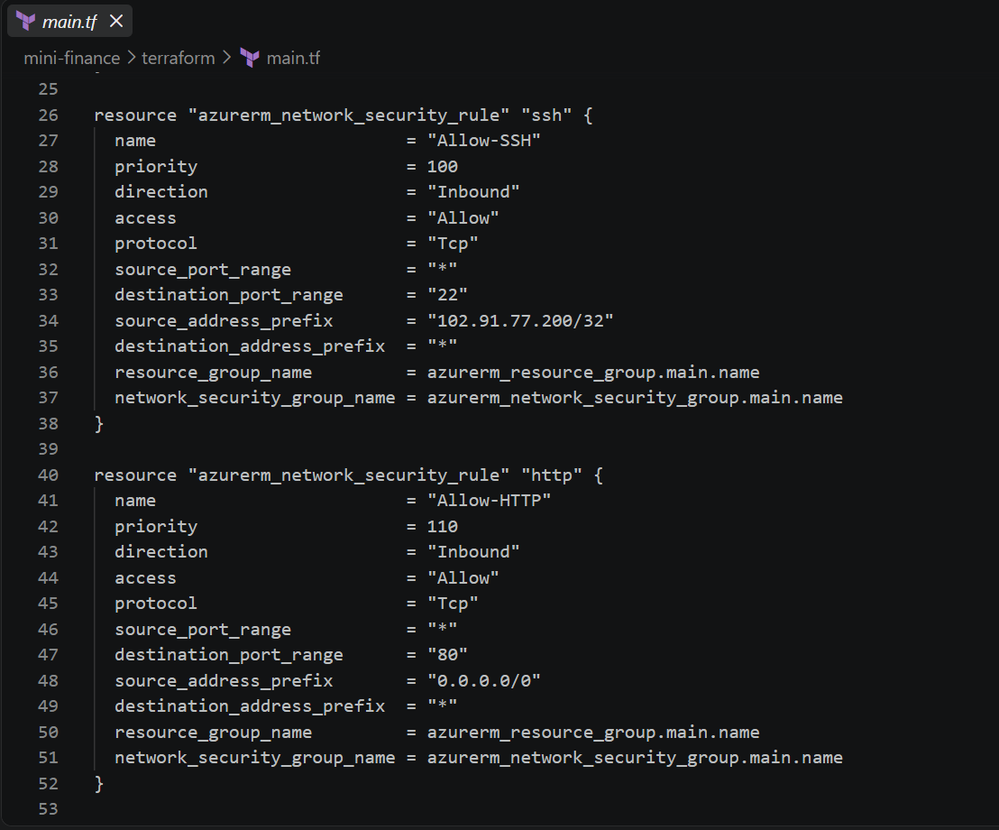

---

#### Screenshot 3 — Terraform code showing the association between `nsg-mini-finance` and `nic-mini-finance`

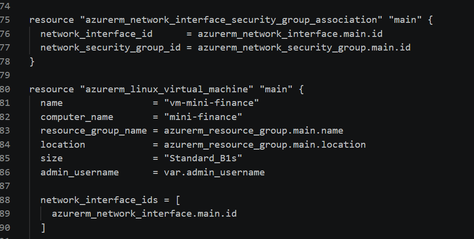

---

### Notes

This screenshot shows the block in main.tf that associates the network security group nsg-mini-finance with the network interface nic-mini-finance. The block uses the Terraform resource azurerm_network_interface_security_group_association, which has two arguments. The first, network_interface_id, points to the nic-mini-finance network interface. The second, network_security_group_id, points to the nsg-mini-finance network security group.

This association is what makes the security rules take effect. Creating an NSG doesn't protect anything until it is attached to a subnet or a network interface. Attaching nsg-mini-finance to nic-mini-finance means its two inbound rules apply to traffic reaching the VM: Allow-SSH on port 22, limited to my public IP as a /32, and Allow-HTTP on port 80 from anywhere. Without this block, the VM would not have those rules applied to its network interface, and I would not be able to reach it over SSH or in a browser.

I referenced both resources by their Terraform addresses instead of typing IDs, so Terraform knows to create the NSG and the network interface first and the association after them. The block appears in the terraform plan output as a resource to be created, and it was applied successfully with the other resources in terraform apply.

---

# Task 3 — Initialize and Apply the Terraform Configuration

## Goal

Format and validate the Terraform configuration, review the execution plan, and provision the Azure infrastructure.

### Evidence

#### Screenshot 4 — End of the `terraform apply` output showing `Apply complete!` with no errors

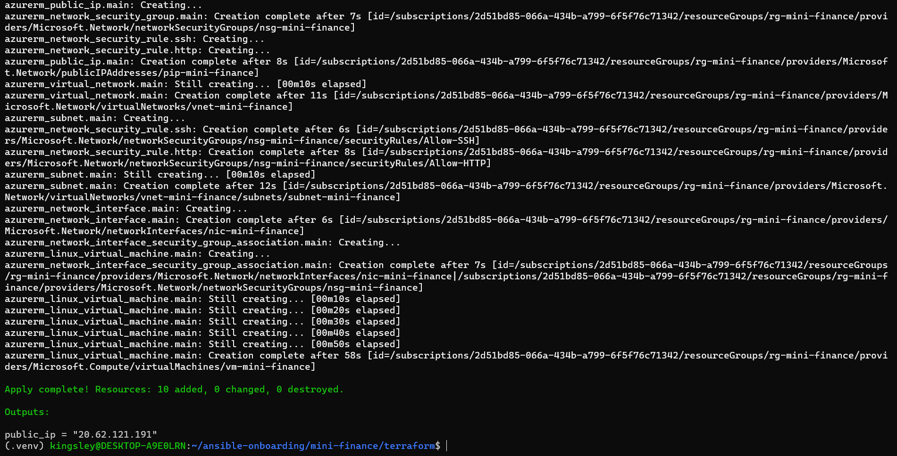

---

#### Screenshot 5 — Output of `terraform output public_ip` showing the VM’s public IP address

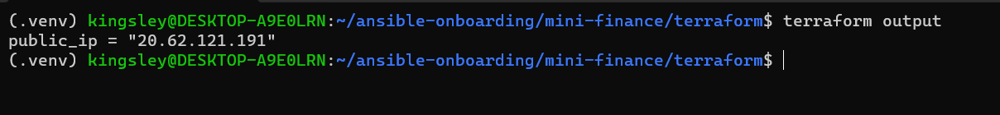

---

### Notes

This screenshot shows the output of terraform output public_ip, which prints the public IP address of the VM vm-mini-finance. The address is 20.62.121.191, the value of the public_ip output defined in outputs.tf. That output reads the public_ip_address attribute of the azurerm_linux_virtual_machine resource, so Terraform reports the address assigned to pip-mini-finance after the apply finishes.

I use this address in every later step of the project. It is the target of the passwordless SSH test (ssh -i ~/.ssh/id_ed25519 azureuser@20.62.121.191 "hostname"), which returned mini-finance. It goes into inventory.ini under the [web] group, so Ansible knows which server to configure. Play 3 uses it as well, because the uri module builds the verification request from the first host in the web group. I also used it in the browser (http://20.62.121.191) to check the Mini Finance website.

The IP address never changes while the VM exists, because pip-mini-finance uses the Standard SKU with static allocation. That is why the address in the inventory stayed valid through every playbook run. The IP is not a password, but it is only reachable for SSH from my own address, because the Allow-SSH rule is limited to my public IP as a /32.

---

# Task 4 — Verify Passwordless SSH Access

## Goal

Confirm that the Ansible controller can connect to the Terraform-provisioned Azure VM using SSH key authentication.

### Evidence

#### Screenshot 6 — Passwordless SSH command and the returned `mini-finance` hostname

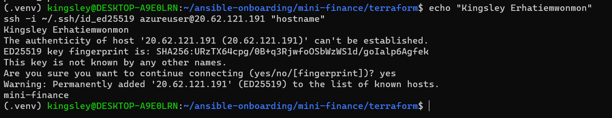

---

### Notes

This screenshot shows the passwordless SSH test from my Ansible controller to the Azure VM. I ran ssh -i ~/.ssh/id_ed25519 azureuser@20.62.121.191 "hostname", and it returned mini-finance. That is the computer name I set in Terraform on the azurerm_linux_virtual_machine resource, so the result confirms that I reached the right server.

The connection did not ask for a password. On the first connection, SSH asked me to confirm the VM's host fingerprint, and I answered yes. That prompt is not a password request. It only records the server's identity in my known_hosts file. After that, the login succeeded with my private key, ~/.ssh/id_ed25519. Terraform added the matching public key, id_ed25519.pub, to the VM through the admin_ssh_key block, and I disabled password authentication with disable_password_authentication = true. My private key stays on the controller and was never copied to the VM.

The test also confirmed that the network settings work. The Allow-SSH rule in nsg-mini-finance permits port 22 only from my public IP as a /32, and the NSG is associated with nic-mini-finance, so my controller could connect. Any other address would be blocked. The same key, user (azureuser), and IP are used later in inventory.ini, so this test showed that Ansible would be able to connect.

---

# Task 5 — Create the Ansible Inventory and Verify Connectivity

## Goal

Add the Terraform-provisioned Azure VM to the Ansible inventory and confirm that Ansible can connect to it.

### Evidence

#### Screenshot 7 — Ansible ping output showing `SUCCESS` and `pong` from the Azure VM

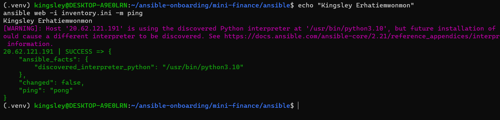

---

### Configuration File

Copy and paste the complete contents of your `ansible/inventory.ini` file below:

```ini
[web]
20.62.121.191

[web:vars]
ansible_user=azureuser
ansible_ssh_private_key_file=~/.ssh/id_ed25519
```

---

# Task 6 — Create the Multi-Play Ansible Playbook

## Goal

Create one Ansible playbook containing separate plays to install Nginx, deploy the Mini Finance website, and verify the deployment.

### Evidence

#### Screenshot 8 — `site.yml` showing Play 1 and the beginning of Play 2

Screenshot must show:

- Play 1 targeting the `web` group
- Installation of `nginx`, `git`, and `rsync`
- Nginx service configured as started and enabled
- Beginning of Play 2 with the Git repository URL and synchronization task

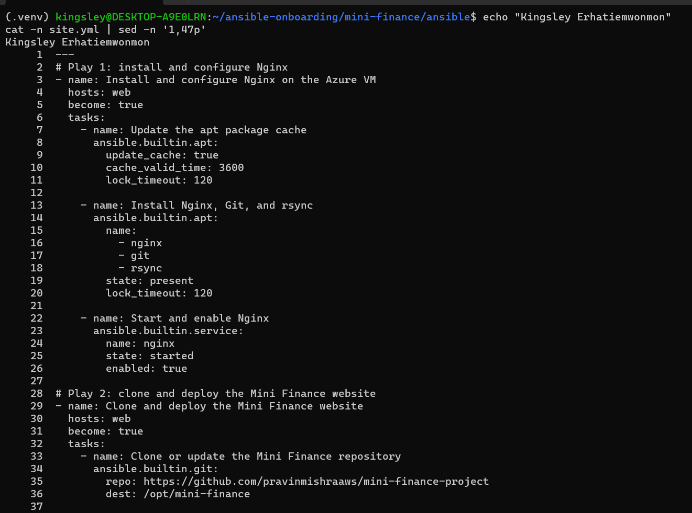

---

#### Screenshot 9 — `site.yml` showing the deployment destination, handler, and Play 3 verification

Screenshot must show:

- Website destination `/var/www/html/`
- Ownership set to `www-data:www-data`
- Nginx reload handler
- Play 3 targeting `localhost`
- The `uri` verification and `assert` condition

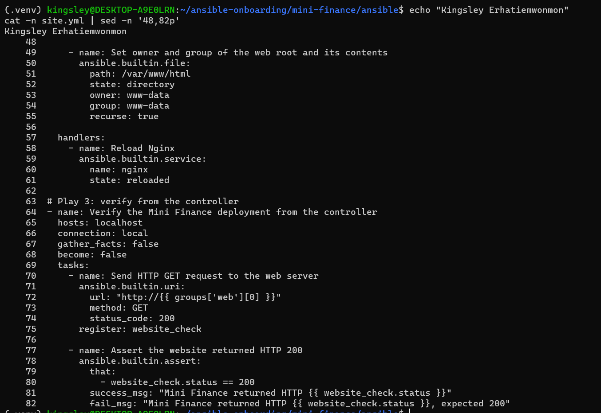

---

### Configuration File

Copy and paste the complete contents of your `ansible/site.yml` file below:

```yaml
---
# Play 1: install and configure Nginx
- name: Install and configure Nginx on the Azure VM
  hosts: web
  become: true
  tasks:
    - name: Update the apt package cache
      ansible.builtin.apt:
        update_cache: true
        cache_valid_time: 3600
        lock_timeout: 120

    - name: Install Nginx, Git, and rsync
      ansible.builtin.apt:
        name:
          - nginx
          - git
          - rsync
        state: present
        lock_timeout: 120

    - name: Start and enable Nginx
      ansible.builtin.service:
        name: nginx
        state: started
        enabled: true

# Play 2: clone and deploy the Mini Finance website
- name: Clone and deploy the Mini Finance website
  hosts: web
  become: true
  tasks:
    - name: Clone or update the Mini Finance repository
      ansible.builtin.git:
        repo: https://github.com/pravinmishraaws/mini_finance.git
        dest: /opt/mini-finance

    - name: Synchronize website files to the Nginx web root
      ansible.posix.synchronize:
        src: /opt/mini-finance/
        dest: /var/www/html/
        owner: false
        group: false
        rsync_opts:
          - "--exclude=.git"
      delegate_to: "{{ inventory_hostname }}"
      notify: Reload Nginx

    - name: Set owner and group of the web root and its contents
      ansible.builtin.file:
        path: /var/www/html
        state: directory
        owner: www-data
        group: www-data
        recurse: true

  handlers:
    - name: Reload Nginx
      ansible.builtin.service:
        name: nginx
        state: reloaded

# Play 3: verify from the controller
- name: Verify the Mini Finance deployment from the controller
  hosts: localhost
  connection: local
  gather_facts: false
  become: false
  tasks:
    - name: Send HTTP GET request to the web server
      ansible.builtin.uri:
        url: "http://{{ groups['web'][0] }}"
        method: GET
        status_code: 200
      register: website_check

    - name: Assert the website returned HTTP 200
      ansible.builtin.assert:
        that:
          - website_check.status == 200
        success_msg: "Mini Finance returned HTTP {{ website_check.status }}"
        fail_msg: "Mini Finance returned HTTP {{ website_check.status }}, expected 200"

```

---

# Task 7 — Validate and Run the Ansible Playbook

## Goal

Validate the syntax of the multi-play Ansible playbook and run it to install Nginx, deploy the Mini Finance website, and verify the deployment.

### Evidence

#### Screenshot 10 — Successful playbook syntax check showing `playbook: site.yml`

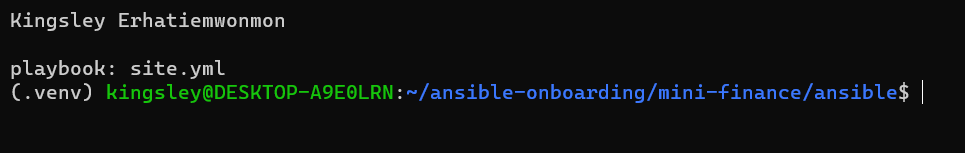

---

#### Screenshot 11 — Play 3 output showing the successful HTTP verification and assertion

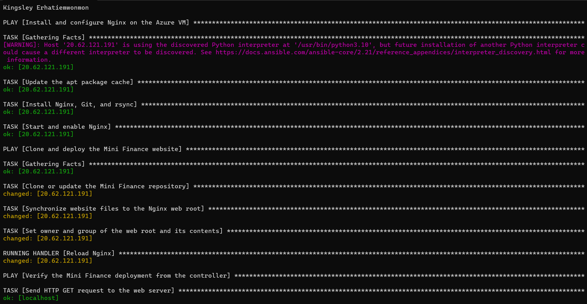

---

#### Screenshot 12 — Final `PLAY RECAP` showing `failed=0` and `unreachable=0`

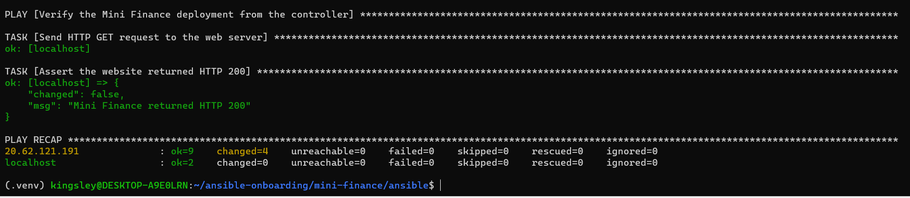

---

### Notes

This screenshot shows the final PLAY RECAP from running ansible-playbook -i inventory.ini site.yml after I corrected the repository URL. The recap has one line per host, and both lines show failed=0 and unreachable=0, so every task completed and Ansible could reach every host.

The VM at 20.62.121.191 shows ok=9 changed=4 unreachable=0 failed=0. Nine tasks completed successfully, and four made a change. The four changes were the Git clone of the Mini Finance repository, the synchronization of the website files to /var/www/html/, the ownership change to www-data:www-data, and the Nginx reload handler that ran because the content changed. The installation tasks in Play 1 showed ok, because nginx, git, and rsync were already installed by my earlier run, which stopped at the clone step. The localhost line shows ok=2 changed=0 unreachable=0 failed=0, which covers the two Play 3 tasks: the uri request and the assert check. They only read the website's status and change nothing, so changed stays at 0.

The recap matters because it summarizes the whole run in one place. A single failed or unreachable count above 0 would show a problem somewhere in the playbook. With both at 0, the installation, deployment, and verification all worked, and the assert confirmed that Mini Finance returned HTTP 200.

---

# Task 8 — Test the Mini Finance Website in a Browser

## Goal

Confirm that the Mini Finance website is publicly accessible through the Azure VM’s public IP address.

### Evidence

#### Screenshot 13 — Mini Finance website successfully loading in the browser, with the Azure VM’s public IP address visible in the address bar

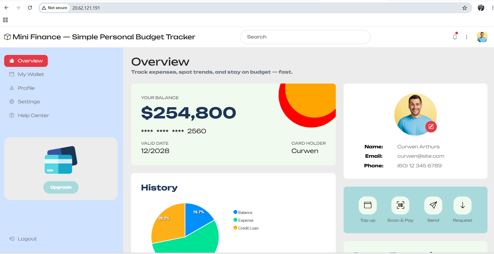

---

### Website URL

Add your deployed website URL below:

```text
http://20.62.121.191
```

---

# Task 9 — Create the Project README

## Goal

Create a `README.md` file to document the Mini Finance infrastructure and deployment project.

### Evidence

#### Screenshot 14 — Completed `README.md` displayed in the VS Code Markdown preview or terminal

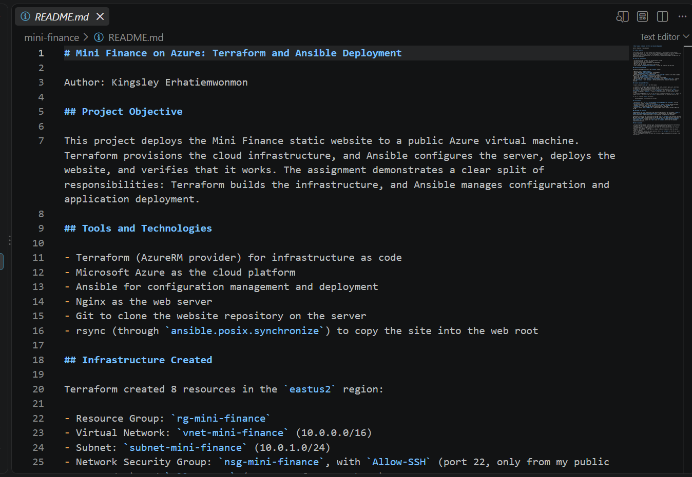

---

### README Content

Copy and paste the complete contents of your `README.md` file below:
```README
Author: Kingsley Erhatiemwonmon

## Project Objective

This project deploys the Mini Finance static website to a public Azure virtual machine. Terraform provisions the cloud infrastructure, and Ansible configures the server, deploys the website, and verifies that it works. The assignment demonstrates a clear split of responsibilities: Terraform builds the infrastructure, and Ansible manages configuration and application deployment.

## Tools and Technologies

- Terraform (AzureRM provider) for infrastructure as code
- Microsoft Azure as the cloud platform
- Ansible for configuration management and deployment
- Nginx as the web server
- Git to clone the website repository on the server
- rsync (through `ansible.posix.synchronize`) to copy the site into the web root

## Infrastructure Created

Terraform created 8 resources in the `eastus2` region:

- Resource Group: `rg-mini-finance`
- Virtual Network: `vnet-mini-finance` (10.0.0.0/16)
- Subnet: `subnet-mini-finance` (10.0.1.0/24)
- Network Security Group: `nsg-mini-finance`, with `Allow-SSH` (port 22, only from my public IP as a /32) and `Allow-HTTP` (port 80, from anywhere)
- Public IP: `pip-mini-finance` (Standard SKU, static)
- Network Interface: `nic-mini-finance`, associated with the NSG
- Ubuntu 22.04 LTS virtual machine: `vm-mini-finance` (size `Standard_D2als_v7`), computer name `mini-finance`, user `azureuser`, SSH key authentication only with password login disabled

## Ansible Deployment Workflow

A single playbook (`site.yml`) has three plays:

1. **Install and configure Nginx:** updates the apt cache, installs nginx, git, and rsync, and makes sure Nginx is started and enabled at boot.
2. **Clone and deploy the website:** clones the Mini Finance repository into `/opt/mini-finance`, synchronizes the files to `/var/www/html/` while excluding `.git`, and sets the owner and group to `www-data`. A handler reloads Nginx when the synchronized content changes.
3. **Verify the deployment:** runs on the controller (localhost) and uses the `uri` module to request the VM's public IP, then the `assert` module confirms the returned status is 200.

To run it, from the `ansible` directory:

    ansible-playbook -i inventory.ini site.yml

## Verification

- Passwordless SSH: `ssh -i ~/.ssh/id_ed25519 azureuser@<PUBLIC_IP> "hostname"` returned `mini-finance` without asking for a password.
- Ansible connectivity: `ansible web -i inventory.ini -m ping` returned SUCCESS and pong.
- Playbook: the syntax check passed, and the run finished with `failed=0` and `unreachable=0`. Play 3 reported that Mini Finance returned HTTP 200.
- Browser: opening `http://<PUBLIC_IP>` loaded the Mini Finance website served by Nginx on the VM.

## Challenge and Solution

**Challenge:** The clone step failed. The repository URL given in the assignment (`https://github.com/pravinmishraaws/mini-finance-project`) does not exist, and GitHub answers a missing repository with a login prompt, so git reported "could not read Username".

**Solution:** I tested the connection from the VM with `git ls-remote` and confirmed that the VM could reach GitHub, so the problem was the URL. I then found that the public repository is named `mini_finance`, verified it with `git ls-remote https://github.com/pravinmishraaws/mini_finance.git`, and updated the `repo` value in `site.yml`. After that the playbook completed successfully.

## What I Learned

- Terraform and Ansible do different jobs. Terraform creates the infrastructure and outputs the public IP, and Ansible uses that IP to configure and verify the server.
- Restricting SSH to a single /32 address and using key authentication keeps the VM secure while HTTP stays open to the public.
- Handlers run only when a task reports a change, so Nginx reloads only when the website content is updated.
- When a task fails, testing the cause directly (here, `git ls-remote` on the VM) is faster than re-running the whole playbook.
- Before creating a VM, I need to check that the size, region, and quota are available in my subscription.
```


---

# LinkedIn Post Required

## Evidence

#### Screenshot 15 — Published LinkedIn post showing the text and at least one deployment screenshot

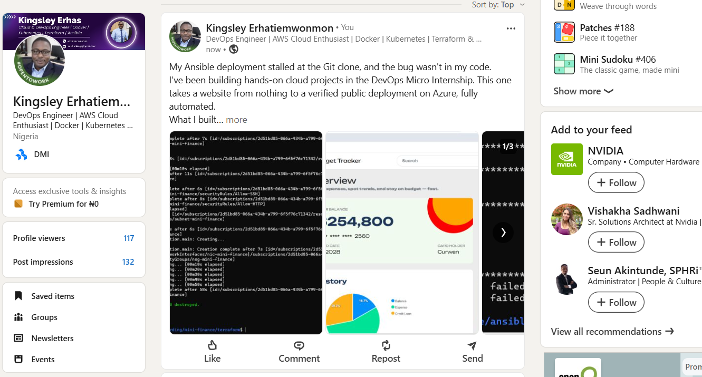

---

#### LinkedIn Post URL

Paste your LinkedIn post URL here:

https://www.linkedin.com/posts/kingsley-erhatiemwonmon_devops-terraform-ansible-ugcPost-7507730633746472960-Wmtg/?utm_source=share&utm_medium=member_desktop&rcm=ACoAAClDkSEBa4Zo6dTWVIEEl8FJLczvH_zPHtY

---

### LinkedIn Submission Notes

**One challenge you faced and how you fixed it:**

The Git clone step failed in my Ansible playbook. The repository URL in the assignment (mini-finance-project) doesn't exist, and GitHub answers a missing repository with a login prompt, so the run stalled and git reported "could not read Username". I first suspected the VM's network, but a git ls-remote test from the VM showed it could reach GitHub, so the URL was the problem. I confirmed it returned a 404, then found that the public repository is actually named mini_finance. After I verified it with git ls-remote and updated the repo value in site.yml, the playbook cloned the site, deployed it, and returned HTTP 200. The lesson was to test the failing step directly and check the source URL before blaming the network.

---

**One real-world example where you can use this learning:**

I can use this to launch temporary demo or staging environments for a company website. A team could use Terraform to create the same secure network and VM each time, restrict SSH to the office IP, and open only port 80 for visitors. Ansible would install the web server, deploy the latest site, and confirm it returns HTTP 200. When the demo ends, terraform destroy removes everything to stop cloud costs. The same approach works for client demos, training labs, and test environments that need to be rebuilt consistently.

---

# Assignment Questions

Answer the following in your own words:

**1. What did you provision using Terraform in this assignment?**

Using Terraform, I provisioned the Azure infrastructure for the Mini Finance website. It created 8 resources in the East US 2 region. First, a resource group named rg-mini-finance holds everything. Inside it are a virtual network named vnet-mini-finance (10.0.0.0/16) and a subnet named subnet-mini-finance (10.0.1.0/24).

I also created a network security group named nsg-mini-finance with two inbound rules. Allow-SSH permits port 22 only from my own public IP address as a /32, and Allow-HTTP permits port 80 from anywhere. A Standard, static public IP named pip-mini-finance gives the server a fixed address. A network interface named nic-mini-finance connects to the subnet and the public IP, and it is associated with the network security group so the SSH and HTTP rules apply to the VM.

Finally, I provisioned an Ubuntu 22.04 LTS virtual machine named vm-mini-finance (size Standard_D2als_v7) with the computer name mini-finance and the administrator user azureuser. It uses SSH public key authentication from my controller, and password authentication is disabled. A Terraform output named public_ip displays the VM's public address, which I used for the SSH test, the Ansible inventory, and the browser check.

Terraform handled only the infrastructure. Ansible then installed Nginx and deployed and verified the website on the VM.

---

**2. What did Ansible configure and deploy in this assignment?**

Ansible configured the Azure VM and deployed the Mini Finance website onto it, using one playbook (site.yml) with three plays. It connected from my controller over SSH as azureuser, using my private key, and the VM's public IP in the inventory.

Play 1 configured the server. It updated the apt package cache, installed nginx, git, and rsync, and made sure the Nginx service was started and enabled to start after a reboot.

Play 2 deployed the website. The git module cloned the Mini Finance repository (https://github.com/pravinmishraaws/mini_finance.git) into /opt/mini-finance on the VM. The synchronize module then copied the site files into the Nginx web root, /var/www/html/, excluding the .git directory. The file module set the owner and group of the web root and its contents to www-data:www-data. A handler reloaded Nginx when the synchronized content changed, and it ran on my first deployment.

Play 3 verified the result from the controller. It used the uri module to send an HTTP GET request to the VM's public IP and registered the result. The assert module then confirmed that the returned status was 200, and the playbook printed "Mini Finance returned HTTP 200". The recap showed failed=0 and unreachable=0, and I also confirmed the site in a browser.

---

**3. Why is SSH access on port `22` restricted to your public IP address?**

SSH on port 22 is restricted to my public IP address (as a /32) because SSH gives full command-line access to the server, so it should only be reachable from the machine that needs it. In this assignment, only my Ansible controller connects to the VM over SSH, so there is no reason for anyone else to be able to reach that port.

Public IP addresses on the internet are scanned constantly by automated bots that try to log in with common usernames, passwords, and stolen keys. If port 22 were open to 0.0.0.0/0, my VM would be exposed to those brute-force attempts as soon as it was created. Limiting the source to my own address means the network security group drops all SSH traffic from every other address before it reaches the VM. This reduces the attack surface and follows the principle of least privilege: allow only the access that is actually needed.

It works together with the other protections in this project. The VM uses SSH public key authentication and password login is disabled, so an attacker would need both network access and my private key. HTTP on port 80 is open to everyone because the website has to be public, but SSH is a management port and should not be.

The restriction has one trade-off. If my ISP changes my public IP, SSH stops working until I update the Allow-SSH rule and run terraform apply again. For a real environment, a fixed office IP, a VPN, or a bastion host would be more reliable.

---

**4. Why is HTTP port `80` open to the internet?**

HTTP port 80 is open to the internet (0.0.0.0/0) because the Mini Finance website is a public demonstration. The people who need to see it, including me in a browser and any visitor, come from unknown IP addresses, so the network security group has to accept web traffic from anywhere. If port 80 were limited to one address, the site would work only for that address, and it would not be a public website.

Opening this port is low risk because it exposes only one service. Nginx serves static HTML, CSS, JavaScript, and images, and there is no login, database, or user data to attack. The website is read-only and public by design. The Allow-HTTP rule opens only port 80 and nothing else, so every other port stays blocked by default.

This differs from SSH on port 22, which is a management port that gives full control of the server. That is why Allow-SSH is limited to my own IP as a /32 while Allow-HTTP is open to everyone. Ansible's verification in Play 3 also depends on the open port, because the uri module makes a request to the VM's public IP from the controller and needs HTTP to answer with status 200.

One limitation is that plain HTTP is not encrypted. That is acceptable for a static demo with no sensitive data, and the assignment says HTTPS is not configured. For a production site, I would add a certificate and open port 443, and redirect HTTP to HTTPS.

---

**5. What is the purpose of the Ansible inventory file?**

The Ansible inventory file tells Ansible which servers to manage and how to connect to them. Without it, Ansible would not know where to run its tasks. In this assignment, inventory.ini lists the Azure VM's public IP address under a group named web. The playbook then uses hosts: web in Play 1 and Play 2 to run against that group, instead of writing the IP address into every play.

The inventory also holds the connection details. In the [web:vars] section, I set ansible_user=azureuser and ansible_ssh_private_key_file=~/.ssh/id_ed25519, so Ansible connects over SSH with the correct user and key, without a password. The file stores only the path to the private key, never its contents.

Groups also let one playbook target different sets of servers. Here there is one VM, but the same web group could hold several servers, and the playbook would configure all of them without changes. Play 3 uses the same inventory to build the verification request, with groups['web'][0] returning the VM's public IP for the uri check.

The inventory is also the link between Terraform and Ansible. Terraform creates the VM and outputs the public IP, and that address goes into inventory.ini so Ansible can find the server. Because the IP is static, it stays the same while the VM exists. In larger setups, the inventory can be generated automatically from Terraform's output.

---

**6. Why does the playbook use separate plays for install, deploy, and verify?**

Add your answer here.Separate plays give each stage of the deployment one clear job. In my playbook, Play 1 installs and configures the server (nginx, git, rsync, and the Nginx service). Play 2 deploys the application by cloning the Mini Finance repository, synchronizing the files to /var/www/html/, and setting the www-data ownership. Play 3 verifies the result by checking that the website returns HTTP 200. The plays also run in order, so the website is deployed only after the server is ready, and it is verified only after it has been deployed.

The plays also need different settings. Plays 1 and 2 run against the web group on the Azure VM with become: true, because installing packages and writing to /var/www/html need administrative privileges. Play 3 runs on localhost with connection: local, gather_facts: false, and no privilege escalation, because the check is an HTTP request from the controller and doesn't need any of those. Separate plays let me set target hosts, connection, and become for each stage.

Troubleshooting is easier too. When the clone failed because the repository URL in the assignment returned a 404, the failure appeared in Play 2, while Play 1 showed ok on the re-run. That told me the server setup was fine and only the deployment step needed fixing.

The separation also makes the playbook easier to maintain and reuse. Installing the web server is a one-time setup, while the website content changes more often. The handler in Play 2 reloads Nginx only when the deployed content changes, and the verification play can be reused as an independent check after any future deployment.

---

**7. Why is `rsync` useful when deploying website files?**

rsync is useful because it copies a whole directory of website files efficiently and only transfers what has changed. The Mini Finance site is more than one file: it has HTML pages plus css, js, fonts, and images folders. In my playbook, the ansible.posix.synchronize module uses rsync to copy /opt/mini-finance/ into the Nginx web root, /var/www/html/, and that keeps the whole folder structure intact in one task. This is why Play 1 installs rsync on the VM, since the module needs it on the server.

rsync compares the source and the destination and copies only the files that are new or different. On the first deployment it copies everything, and on later runs it skips unchanged files, which is faster and uses less bandwidth. Because it reports a change only when something was actually copied, it works well with Ansible's idempotency. The Reload Nginx handler is triggered only when the synchronize task reports a change, so Nginx is not reloaded when the content is the same.

rsync also gives control over what is copied. I used --exclude=.git so the repository's version-control data never reaches the web root, where it could be served to visitors. I also set owner and group to false so rsync doesn't copy the root ownership from the source, and then a separate file task sets www-data:www-data on /var/www/html. In my setup rsync runs on the VM with delegate_to, copying from the cloned repo to the web root, which avoids sending the files back over the network from the controller.

---

**8. What does the Ansible `uri` module verify in this assignment?**

In Play 3, the uri module verifies that the Mini Finance website is reachable and answers with HTTP status code 200. It runs on the Ansible controller (localhost, with connection: local) and sends an HTTP GET request to the VM's public IP address. The URL is built from groups['web'][0], which is the VM's IP from the inventory. The status_code: 200 option tells uri that 200 is the expected response, so the task fails if the server returns a different code or does not respond.

This works as an end-to-end check from outside the server, the way a real visitor would reach the site. A 200 response shows that Nginx is running, that port 80 is open in the network security group, and that the server is serving the deployed content. The result is stored in the website_check variable using register. The next task uses the assert module to confirm that website_check.status == 200 and prints "Mini Finance returned HTTP 200". The two options are easy to confuse: status_code is the expected code passed to uri, and status is the returned value that assert checks.

uri checks only the response status, not what the page contains, so a 200 alone doesn't prove the Mini Finance content is displayed. I confirmed that separately by opening http://20.62.121.191 in a browser and seeing the dashboard load with its styling. The playbook run finished with failed=0 and unreachable=0, so the verification passed.

---

**9. What issue did you face during this assignment, and how did you fix it?**

The main issue was in Play 2 of the playbook, where the Git clone failed. The repository URL given in the assignment (https://github.com/pravinmishraaws/mini-finance-project) does not exist, and GitHub answers a missing repository with a login prompt. The playbook run stalled at "Clone or update the Mini Finance repository", and when I tested from the VM with git ls-remote, git reported "could not read Username for 'https://github.com'". I first suspected the VM's network access, but the same test showed the VM could reach GitHub, so the problem had to be the URL.

I opened the URL in a browser and confirmed it returned a 404. Then I searched the instructor's GitHub account and found that the public repository is named mini_finance, with an underscore. I checked it from the VM with git ls-remote https://github.com/pravinmishraaws/mini_finance.git, which returned a commit hash. I then updated the repo value in site.yml, re-ran the playbook, and this time Play 2 cloned the repository, synchronized the files, and reloaded Nginx. Play 3 returned HTTP 200, and the recap showed failed=0 and unreachable=0. Because Screenshot 8 showed the old URL, I retook it with the corrected one.

---

**10. What did you learn from using Terraform and Ansible together?**

Using Terraform and Ansible together taught me that they do different jobs and work best when each one stays in its own role. Terraform provisioned the Azure infrastructure: the resource group, network, security rules, public IP, network interface, and the Ubuntu VM. Ansible then took over the running server, installing Nginx, Git, and rsync, deploying the website, and verifying it. When something went wrong, this split told me where to look. The Git clone failure was an Ansible problem, so I never had to touch the Terraform infrastructure.

I also learned how the two tools connect. Terraform's public_ip output gave me the address for the Ansible inventory, and the SSH public key that Terraform added to the VM matched the private key Ansible used to connect. The computer name set in Terraform was the mini-finance hostname that came back in my SSH test. Because the public IP is static, the inventory stayed valid for the whole project.

On security, I learned to restrict SSH to my own IP as a /32 and keep HTTP open only for the public website. I also learned to use key authentication with password login disabled, and to keep the subscription ID and private key out of files and screenshots.

Running the tools showed me how idempotency works. When I re-ran the playbook, the installation tasks in Play 1 reported ok instead of changed, and the reload handler ran only when the site content changed.

Troubleshooting was another lesson. I learned to check the region, VM size, and quota before creating resources, to test the cause of a failure directly instead of re-running everything, and to verify a source URL before blaming the network. The repository URL in the assignment returned a 404, and I found the correct one by testing it from the VM.

---

# Required Files

Confirm that the following files are included in your assignment folder:

- [ ] `.gitignore`
- [ ] `README.md`
- [ ] `terraform/providers.tf`
- [ ] `terraform/main.tf`
- [ ] `terraform/variables.tf`
- [ ] `terraform/outputs.tf`
- [ ] `ansible/inventory.ini`
- [ ] `ansible/site.yml`

---

# Submission Instructions

- Add all required screenshots in the correct order.
- Full Name must be visible in required screenshots.
- Add the Azure VM public IP address.
- Add the final Mini Finance website URL.
- Paste `inventory.ini`, `site.yml`, and `README.md` as editable text.
- Answer all assignment questions clearly in your own words.
- Add your LinkedIn post URL.
- Do not expose SSH private keys, passwords, Azure credentials, subscription IDs, Terraform state contents, or other sensitive information.

---

# Completion Checklist

- [ ] Task 1: `mini-finance` project structure created
- [ ] Task 1: `.gitignore` created
- [ ] Task 2: Terraform Azure infrastructure code created
- [ ] Task 2: `Allow-SSH` rule configured for port `22`
- [ ] Task 2: `Allow-HTTP` rule configured for port `80`
- [ ] Task 2: NSG associated with the Network Interface
- [ ] Task 3: `terraform fmt` completed
- [ ] Task 3: `terraform init` completed
- [ ] Task 3: `terraform validate` completed successfully
- [ ] Task 3: `terraform apply` completed successfully
- [ ] Task 3: `terraform output public_ip` displayed the VM public IP
- [ ] Task 4: Passwordless SSH works from the Ansible controller
- [ ] Task 5: `inventory.ini` created
- [ ] Task 5: Ansible ping returns `SUCCESS` and `pong`
- [ ] Task 6: `site.yml` contains three separate plays
- [ ] Task 6: Play 1 installs Nginx, Git, and rsync
- [ ] Task 6: Play 2 clones and deploys the Mini Finance website
- [ ] Task 6: Play 3 verifies HTTP status code `200`
- [ ] Task 7: Playbook syntax check passes
- [ ] Task 7: Ansible playbook completes successfully
- [ ] Task 7: Final recap shows `failed=0` and `unreachable=0`
- [ ] Task 8: Mini Finance website loads in the browser
- [ ] Task 8: Azure VM public IP is visible in the browser screenshot
- [ ] Task 9: `README.md` completed
- [ ] Screenshots 1–15 are included
- [ ] `inventory.ini`, `site.yml`, and `README.md` are pasted as editable text
- [ ] Assignment questions are answered
- [ ] LinkedIn post published with Anyone visibility
- [ ] LinkedIn post URL added
- [ ] No sensitive information is exposed

---

## About DMI & CloudAdvisory

DevOps Micro Internship (DMI) is a project-based DevOps program run by Pravin Mishra and The CloudAdvisory, focused on real-world execution, systems thinking, and career readiness.

It helps learners build strong DevOps foundations with hands-on experience.

---

## Resources

- DMI Official Website: [https://dmi.pravinmishra.com?utm_source=github&utm_medium=readme](https://dmi.pravinmishra.com?utm_source=github&utm_medium=readme)
- University: [https://university.pravinmishra.com?utm_source=github&utm_medium=readme](https://university.pravinmishra.com?utm_source=github&utm_medium=readme)
- Discord Community: [https://discord.pravinmishra.com?utm_source=github&utm_medium=readme](https://discord.pravinmishra.com?utm_source=github&utm_medium=readme)
- Blog: [https://dmi.pravinmishra.com/blog?utm_source=github&utm_medium=readme](https://dmi.pravinmishra.com/blog?utm_source=github&utm_medium=readme)
- YouTube Playlist: [https://www.youtube.com/playlist?list=PLFeSNDtI4Cho](https://www.youtube.com/playlist?list=PLFeSNDtI4Cho)
- Pravin Mishra LinkedIn: [https://www.linkedin.com/in/pravin-mishra-aws-trainer/](https://www.linkedin.com/in/pravin-mishra-aws-trainer/)
- CloudAdvisory LinkedIn: [https://www.linkedin.com/company/thecloudadvisory/](https://www.linkedin.com/company/thecloudadvisory/)

---

*This submission is part of DevOps Micro Internship (DMI) — Agentic AI Track.*