# Assignment — Deploy EpicBook with Terraform and Ansible Roles

Part of the DevOps Micro Internship (DMI) with Agentic AI

---

## Purpose

In this assignment, you will deploy the EpicBook web application using Terraform and Ansible roles.

Terraform provisions the cloud infrastructure, including one Ubuntu VM and one managed MySQL database. Ansible roles configure the VM, install required software, deploy the EpicBook application, configure Nginx, connect the app to the managed MySQL database, and verify the deployment.

---

# Task 1 — Set Up the Project Folder Layout

## Goal

Create the project folder structure for Terraform and Ansible roles.

Terraform will be used to provision the cloud infrastructure. Ansible roles will be used to configure the VM and deploy the EpicBook application.

### Evidence

#### Screenshot 1 — Terminal showing the completed `epicbook-prod` project structure

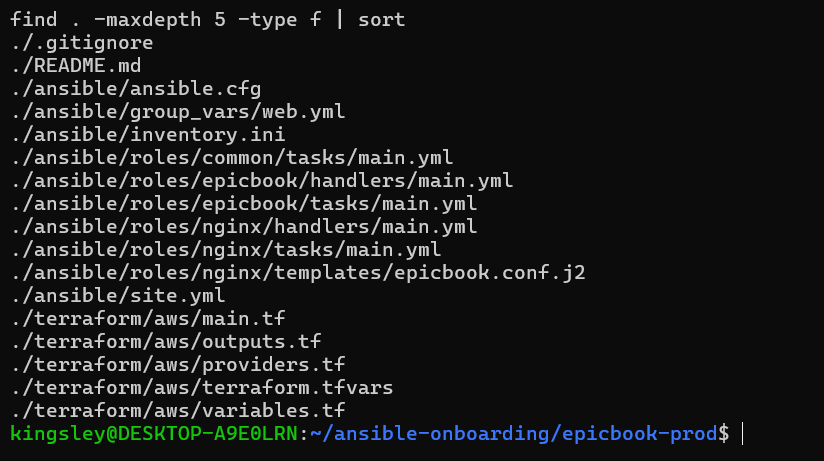

---

### Notes

Answer the following in your own words:

**1. Which cloud provider did you choose for this assignment?**

AWS

---

**2. Why is it useful to keep Terraform files and Ansible files in separate folders?**

Separating Terraform and Ansible into their own folders reflects a real distinction in what each tool does and when it runs, and keeping that boundary clean in your project structure pays off in a few concrete ways:

They operate on different layers, at different times. Terraform provisions infrastructure — it decides what exists (the VM, the RDS instance, the network, the security groups). Ansible configures software on infrastructure that already exists — it decides what runs on that VM. Terraform runs once (or occasionally) to create or change infrastructure; Ansible runs repeatedly to converge configuration. Mixing their files together would blur a distinction that matters operationally: you don't want to accidentally destroy a VM when all you meant to do was update Nginx's config.

Each tool has its own state and its own blast radius. Terraform tracks a state file (terraform.tfstate) describing real cloud resources; a mistake in a .tf file can delete a database. Ansible has no equivalent state file — it just runs tasks idempotently against hosts listed in an inventory. Keeping them apart means a change to a Jinja template or a role's tasks can't accidentally get swept up in a terraform apply, and vice versa.

It matches how teams actually divide the work. In most organizations, infrastructure provisioning and application configuration are owned by different people or even different teams (platform/cloud engineers vs. app/config engineers). Separate folders let each group work, review, and version their part independently, run its own linting and CI checks, and reason about changes without needing to touch the other's code.

It keeps re-runs safe and predictable. You can run ansible-playbook site.yml repeatedly to fix drift or push app updates without touching Terraform at all, and you can run terraform plan to check infrastructure changes without triggering a config re-deploy. If the two were interleaved in one folder, it would be easy to run the wrong command against the wrong layer.

It makes the project easier to navigate and reuse. Anyone opening terraform/aws/ immediately knows they're looking at infrastructure-as-code; anyone opening ansible/roles/ knows they're looking at server configuration. The roles (common, nginx, epicbook) can even be reused against a VM created by a completely different Terraform setup (or no Terraform at all), because they have no dependency on how the box was provisioned — only on the inventory telling them where it is.

---

**3. What is the purpose of the `roles` directory in Ansible?**

The roles/ directory is how Ansible organizes configuration work into reusable, self-contained units instead of one long, unwieldy playbook.

It breaks a deployment into logical, ordered pieces. In this project, site.yml doesn't contain any task logic itself — it just calls three roles in order: common, nginx, epicbook. Each role handles one concern (base OS setup, reverse proxy, application deployment), so it's easy to see what the deployment does at a glance, and easy to reason about the order things must happen in (you can't configure Nginx to proxy an app that isn't installed yet).

It gives each unit of configuration a standard, predictable structure. A role's folder can contain tasks/ (what to do), templates/ (files rendered with Jinja2 variables, like epicbook.conf.j2), handlers/ (actions triggered by a change, like reloading Nginx), files/, vars/, and defaults/. Because every role follows this same layout, Ansible auto-loads the right files without you having to include them by hand, and anyone familiar with Ansible can open an unfamiliar role and immediately know where to look.

It makes configuration reusable and shareable. The nginx role here only knows how to install Nginx and wire up a reverse proxy from a template — it has no idea it's serving EpicBook specifically. That means the same role could be dropped into a completely different project with a different app, just by changing the variables (app_port, server_name) fed into its template. Roles can also be pulled from Ansible Galaxy or shared across teams instead of reinvented each time.

It keeps site.yml clean and declarative. Without roles, a playbook doing this much work (apt updates, Nginx config, Git clone, npm install, database import, PM2 management) would be hundreds of lines in one file, mixing unrelated concerns. Roles let the top-level playbook read almost like a table of contents:

yaml
roles:
  - common
  - nginx
  - epicbook

while the real implementation detail lives isolated inside each role's own folder, easy to test, edit, or replace independently.

---

# Task 2 — Provision the Infrastructure with Terraform

## Goal

Run Terraform to provision the cloud infrastructure for the EpicBook deployment.

Terraform will create the VM, managed MySQL database, networking, security rules, and required outputs.

### Evidence

#### Screenshot 2 — `terraform apply` completed successfully

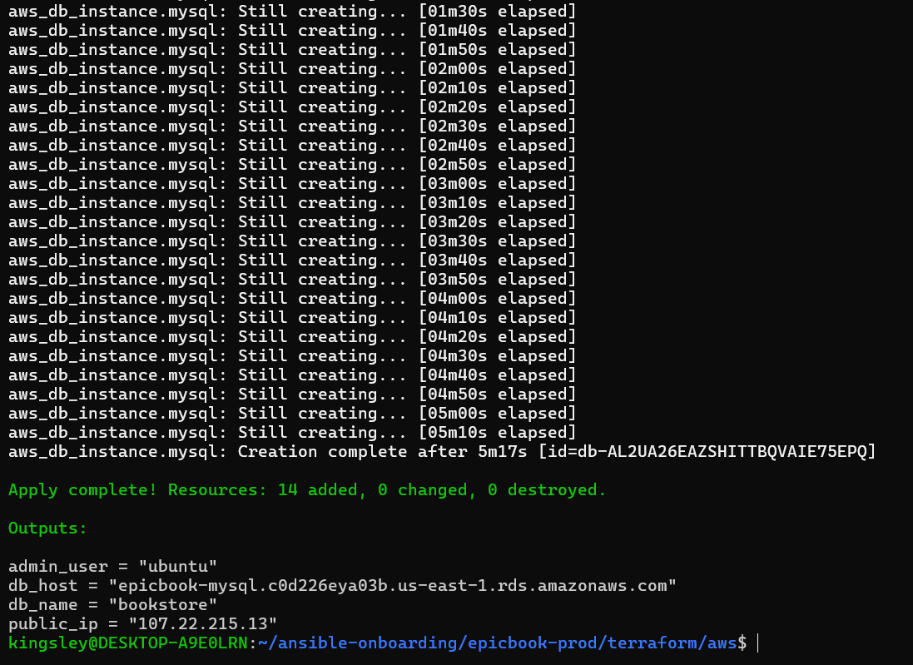

---

#### Screenshot 3 — Output of `terraform output`

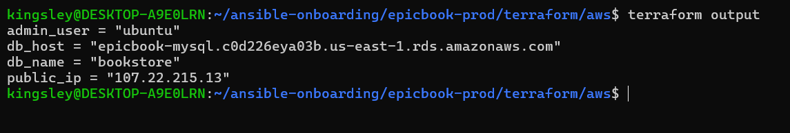

---

#### Screenshot 4 — Azure Portal or AWS Console showing the VM running

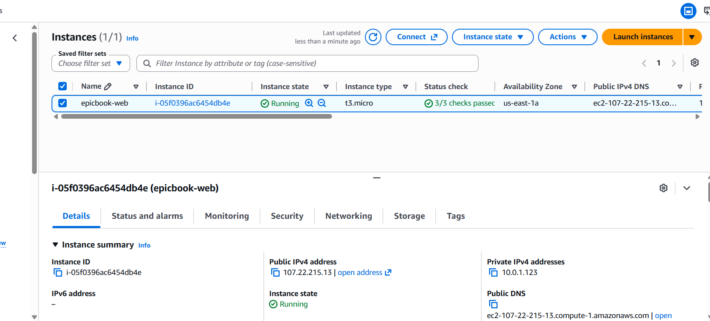

---

#### Screenshot 5 — Azure Portal or AWS Console showing the managed MySQL database created

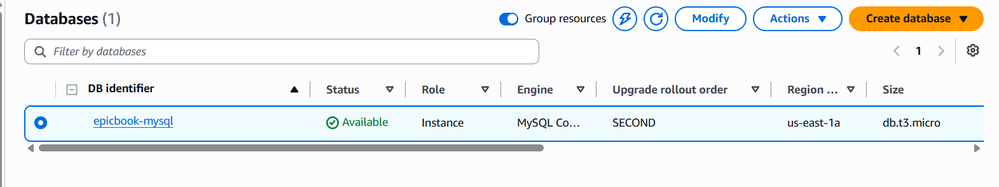

---

### Notes

Answer the following in your own words:

**1. What resources did Terraform create for this assignment?**

Based on the Terraform configuration used in terraform/aws/main.tf, the following AWS resources were created:

Networking

aws_vpc.main — a dedicated VPC (10.0.0.0/16) to isolate the EpicBook infrastructure
aws_internet_gateway.igw — allows resources in the public subnet to reach the internet
aws_subnet.public — one public subnet for the web server, with auto-assigned public IPs
aws_subnet.private (×2) — two private subnets in different Availability Zones, required by RDS for its subnet group
aws_route_table.public and aws_route_table_association.public — routes public subnet traffic out through the Internet Gateway

Security

aws_security_group.web — allows SSH (port 22) only from the controller's IP (/32), HTTP (port 80) from anywhere, and all outbound traffic
aws_security_group.db — allows MySQL (port 3306) only from the web security group, not from the internet

Compute

aws_key_pair.this — registers the local SSH public key with AWS so it can be injected into the VM
data.aws_ami.ubuntu — a data source (not a created resource) that looks up the latest Ubuntu 22.04 AMI
aws_instance.web — the Ubuntu 22.04 EC2 instance that runs Nginx and the EpicBook Node.js app
aws_eip.web — an Elastic IP attached to the instance, so the public IP stays fixed even if the instance is stopped/started

Database

aws_db_subnet_group.db — tells RDS which subnets it's allowed to use
aws_db_instance.mysql — the managed MySQL 8.0 database (RDS), storing the EpicBook schema and seed data

Outputs (not resources, but Terraform-managed values)

public_ip, admin_user, db_host, db_name — consumed by Ansible's inventory and group_vars/web.yml to configure the VM

In total, that's about 12 real infrastructure resources (plus the AMI data lookup), matching the ~16-resource count shown in terraform plan once you include the implicit dependencies Terraform tracks. Database credentials were deliberately excluded from any output, satisfying the assignment's requirement that passwords never appear in Terraform output or screenshots.

---

**2. Why should you review `terraform plan` before running `terraform apply`?**

terraform plan shows you exactly what Terraform is about to do before it does it, and reviewing it matters for a few concrete reasons:

It's your only chance to catch mistakes before they become real cloud resources (and real costs). Once apply runs, Terraform actually creates, modifies, or destroys infrastructure — a typo in a CIDR block, the wrong instance size, or a misconfigured security group becomes a live AWS resource, not just a line in a file. plan lets you catch these while they're still just proposed changes.

It shows the full diff: add, change, and destroy. Terraform's plan output is explicit about which resources will be created (+), modified in place (~), or destroyed and recreated (-/+). This assignment's instructions specifically call out: "Do not continue if Terraform shows unexpected resource changes." A plan showing 0 to destroy when you expected only additions is a clear signal something is wrong — maybe a variable changed, or a resource's configuration drifted from what's in state.

It protects against accidental data loss. Some changes look small in the .tf file but force Terraform to destroy and recreate a resource (for example, changing certain RDS or EC2 attributes that can't be updated in place). If you don't review the plan, you might not realize a "small" change means dropping your database and losing all seed data. Seeing -/+ destroy and recreate in the plan before it happens is the only warning you get.

It confirms your variables resolved the way you expect. Since values like my_ip_cidr, db_password, and instance_type come from .tfvars files or environment variables, a plan lets you verify Terraform actually picked up the right values — for example, confirming the SSH rule really is scoped to your /32 and not accidentally left open to 0.0.0.0/0.

It catches configuration drift. If someone (or something) changed a resource manually in the AWS console since the last apply, plan will show Terraform reconciling that drift — which might mean an unexpected change you didn't author is about to be applied or reverted.

It's cheap insurance. Running plan costs nothing and takes seconds, while an unreviewed apply on the wrong resource could mean real money spent, downtime, or a security group briefly exposing a database to the internet. Reviewing the plan is the standard "measure twice, cut once" discipline for infrastructure-as-code — exactly why the assignment's Task 2 explicitly requires a plan review step before every apply.

---

**3. Why should database passwords not be shown in Terraform output?**

Keeping database passwords out of Terraform output isn't just good practice for this assignment — it protects against several real, concrete risks:

Terraform output is plain text by default, and it gets copied everywhere. Running terraform output prints values straight to your terminal. From there they end up in shell history, copy-pasted into Slack messages, pasted into documentation, or — as this assignment explicitly warns against — captured in a screenshot for submission. None of those destinations are secure, and once a password has been pasted somewhere, it's nearly impossible to guarantee every copy has been deleted.

Output values are easy to leak accidentally into logs and CI systems. If this Terraform code ever ran inside a CI/CD pipeline, terraform output (or even terraform apply itself, if the value weren't marked sensitive) would print straight into build logs — which are often stored, searchable, and visible to more people than the person who ran the job. Marking a variable sensitive = true (as this project's db_password variable is) tells Terraform to redact it from CLI output and logs automatically.

A leaked database password gives direct access to real data. Unlike an IP address or a resource ID, a password is a working credential. Anyone who obtains it — from a screenshot, a shared terminal, or a leaked log — can connect straight to the RDS instance and read or modify the EpicBook schema, seed data, and any customer-like data stored there. There's no extra step required to "do damage" once they have it.

The state file already holds the password — output access multiplies the exposure. terraform.tfstate stores the password in plain text regardless, which is why the assignment tells you to keep it private and never commit it to GitHub. Exposing it again through terraform output creates a second, more casual surface for the same secret to leak, with none of the state file's (weak, but nonexistent-in-output) protections.

It breaks the principle of least exposure. The whole point of piping the password through TF_VAR_db_password and an Ansible lookup('env', ...) in this project is that the value never needs to be typed, displayed, or hard-coded anywhere in the codebase — it only exists transiently in the shell environment and the state file. Printing it in terraform output defeats that design for no operational benefit; nothing downstream actually needs to read the password from output, since Ansible pulls it from the same environment variable directly.

This is exactly why outputs.tf in this project omits it. The outputs file exposes public_ip, admin_user, db_host, and db_name — everything Ansible needs to connect — but never db_password. Anyone can run terraform output to get connection details without ever seeing the credential itself.

---

# Task 3 — Verify SSH Key-Based Access

## Goal

Verify that the cloud VM can be accessed from the Ansible controller using SSH key-based authentication.

### Evidence

#### Screenshot 6 — Successful SSH hostname check from the Ansible controller

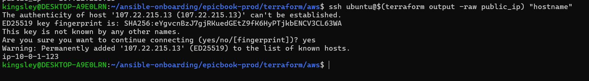

---

### Notes

Answer the following in your own words:

**1. What command did you use to verify SSH access?**

I verified SSH access from the Ansible controller using:

```bash
ssh ubuntu@107.22.215.13 "hostname"
```

This connects to the EC2 instance using the `ubuntu` admin user (from Terraform's `admin_user` output) and the public IP (from Terraform's `public_ip` output), authenticating with the SSH key pair (`~/.ssh/id_ed25519` / `id_ed25519.pub`) that Terraform injected into the instance via `aws_key_pair.this`.

The command returned the VM's hostname with no password prompt, confirming that:
- SSH key-based authentication was working correctly
- The security group rule restricting port 22 to my controller's IP (`/32`) was correctly configured
- The correct admin username was being used for the Ubuntu AMI

I also used the more general form pulling values directly from Terraform, to avoid hand-typing the IP:

```bash
ssh $(terraform output -raw admin_user)@$(terraform output -raw public_ip) "hostname"
```

Once this test succeeded, I used the same IP and username values to populate `ansible_host` and `ansible_user` in `inventory.ini`, and confirmed connectivity end-to-end with:

```bash
ansible web -i inventory.ini -m ping
```

which returned `"ping": "pong"`.

---

**2. What proves that SSH key-based access worked successfully?**

Several pieces of evidence together confirm SSH key-based access was working correctly:

**1. The command returned output without any password prompt.**
Running:
```bash
ssh ubuntu@107.22.215.13 "hostname"
```
returned the VM's hostname (e.g. `ip-10-0-1-xx`) immediately, with no request for a remote password. Since password authentication was never configured on the instance, a successful connection with no password prompt is direct proof the SSH key pair was accepted.

**2. No `Permission denied (publickey)` error was returned.**
If the wrong key, wrong username, or a missing security group rule had been the problem, SSH would have failed explicitly with `Permission denied (publickey)` rather than silently succeeding. Getting a clean hostname response rules out all of these failure modes at once.

**3. Ansible's `ping` module succeeded over the same SSH connection.**
```bash
ansible web -i inventory.ini -m ping
```
returned:
```json
epicbook | SUCCESS => {
    "ping": "pong"
}
```
Ansible connects exclusively over SSH using the private key path defined in `inventory.ini` (`ansible_ssh_private_key_file=~/.ssh/id_ed25519`). A `SUCCESS`/`pong` response means Ansible was able to authenticate, execute a remote module, and get a result back — a stronger proof than a single manual SSH command, since it's the same authentication path the rest of the deployment (all 11 tasks) depends on.

**4. The full playbook run completed successfully afterward.**
`ansible-playbook -i inventory.ini site.yml` went on to execute 19+ tasks across three roles (`common`, `nginx`, `epicbook`) against the host, ending in a recap of `failed=0`. Since every one of those tasks required a working SSH connection to the VM, the successful, repeated execution of the whole deployment is the most conclusive proof that key-based access was reliable — not just a one-off success.

Together, these show that authentication worked using **only the SSH key pair** — no password was ever required, requested, or used at any point in the deployment.

---

**3. What would you check if SSH returned `Permission denied (publickey)`?**

This error means the SSH connection reached the server, but the server rejected every key that was offered. I would work through these checks in order:

**1. Confirm I'm using the correct username.**
The Ubuntu AMI's default admin user is `ubuntu`, not `root` or `ec2-user` (that's the Amazon Linux default). Using the wrong username is one of the most common causes of this exact error.
```bash
terraform output -raw admin_user
```

**2. Confirm I'm pointing at the correct private key.**
```bash
ls -l ~/.ssh/id_ed25519 ~/.ssh/id_ed25519.pub
```
And confirm the key being offered matches what was actually used to create the instance — check that `terraform/aws/variables.tf`'s `ssh_public_key_path` points to the same `.pub` file, and that `aws_key_pair.this` in the state was created from it:
```bash
terraform state show aws_key_pair.this
```

**3. Force SSH to use that specific key and get verbose output.**
```bash
ssh -i ~/.ssh/id_ed25519 -v ubuntu@<public_ip>
```
The `-v` flag shows exactly which keys SSH tried and why each was refused — for example, "Offering public key" followed by "Server refuses to accept" confirms a genuine mismatch rather than a config issue.

**4. Check file permissions on the private key.**
SSH silently refuses to use a private key with overly open permissions:
```bash
chmod 600 ~/.ssh/id_ed25519
```

**5. Check whether the key pair actually attached to the instance.**
In the AWS EC2 console, check the instance's details for the key pair name, and confirm it matches `aws_key_pair.this.key_name` in Terraform. If the instance was created before the key pair resource, or a `terraform taint`/recreate happened, the instance could be running with a stale or different key baked in via cloud-init — in which case the only fix is to terminate and recreate the instance so cloud-init re-injects the current key.

**6. Check that the public key file wasn't corrupted or truncated.**
```bash
cat ~/.ssh/id_ed25519.pub
```
It should be a single line starting with `ssh-ed25519 AAAA...`. A key file edited with a Windows tool (as happened with `inventory.ini` earlier in this project) could have picked up a stray carriage return, corrupting it.

**7. Confirm I'm not confusing this with the *inventory's* `ansible_ssh_private_key_file`.**
If manual `ssh` works but Ansible still fails with this error, the problem is specific to `inventory.ini` — check for a placeholder path, a typo, or the same CRLF issue that broke the file earlier in this project.

Ruling out username and key-path mistakes (the two most common causes) first, before assuming the key pair itself is broken, saves time — since regenerating a key pair and re-running `terraform apply` is the most disruptive fix and should be the last resort.


---

# Task 4 — Create the Ansible Inventory and Configuration

## Goal

Create the Ansible inventory file and local Ansible configuration for the EpicBook VM.

The inventory tells Ansible which VM to manage and which SSH user to use.

### Evidence

#### Screenshot 7 — `inventory.ini` showing the VM under the `web` group

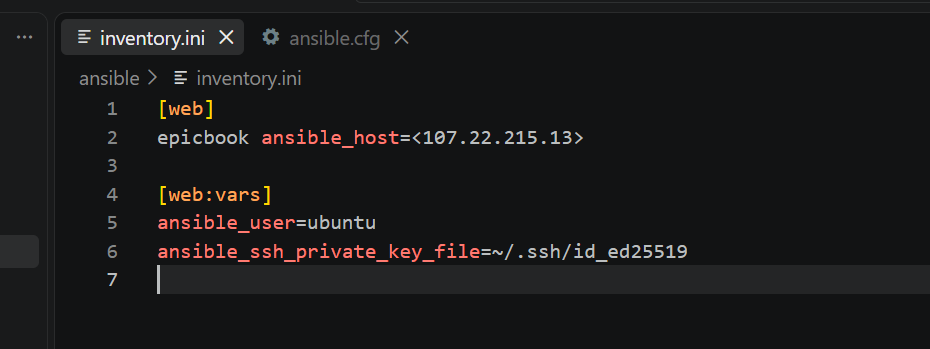

---

#### Screenshot 8 — Output of `ansible-inventory -i inventory.ini --graph`

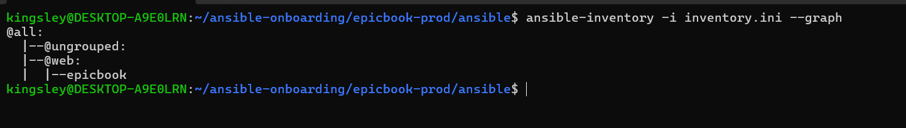

---

#### Screenshot 9 — Output of `ansible web -i inventory.ini -m ping`

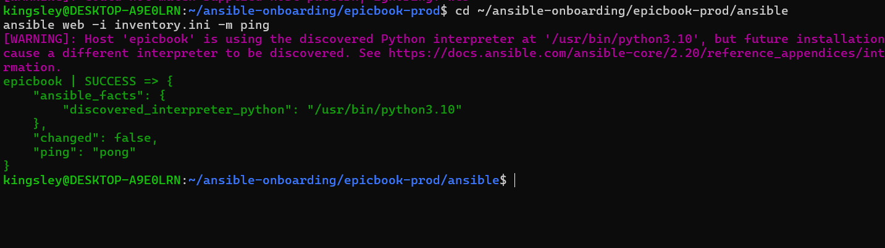

---

### Notes

Answer the following in your own words:

**1. What is the purpose of `inventory.ini`?**

The `inventory.ini` file tells Ansible which servers to manage and how to connect to them. In this project, Terraform creates the AWS infrastructure and provides the server details, while `inventory.ini` contains the IP addresses or hostnames of those servers and groups them by role, such as web, app, or database servers. Ansible then uses this inventory to know which servers to configure and deploy the application to.


---

**2. What does `ansible_host` store?**

`ansible_host` stores the actual IP address or hostname that Ansible uses to connect to a managed server. The name of a server in the inventory, such as `web1`, `app1`, or `db1`, is only a label that helps identify the server. The `ansible_host` value tells Ansible where that server can actually be reached.

In this project, Terraform creates the AWS EC2 instances and assigns them IP addresses. Those IP addresses can then be placed in the Ansible inventory as the `ansible_host` value. This allows Ansible to connect to the correct EC2 instance through SSH and perform tasks such as installing packages, configuring Nginx, deploying the application, and verifying that the server is working correctly.


---

**3. What does `ansible_ssh_private_key_file` tell Ansible?**

`ansible_ssh_private_key_file` tells Ansible which private SSH key file to use when connecting to a managed server. The private key must match the public key that was configured on the EC2 instance when Terraform created it.

In this project, Terraform uses the user's public SSH key to configure access to the AWS EC2 instances. Ansible then uses the corresponding private key through `ansible_ssh_private_key_file` to authenticate and establish an SSH connection to those servers. This allows Ansible to manage the instances securely without requiring a password for each connection.

---

**4. Why is `host_key_checking = False` used only for this temporary lab?**

`host_key_checking = False` tells Ansible not to ask for confirmation when it encounters a new SSH host key. This is useful in a temporary lab because the AWS EC2 instances may be created and destroyed frequently, and their IP addresses or SSH host keys can change. Disabling the check makes it easier for Ansible to connect to newly created instances without manual confirmation each time.

However, this setting is used only for convenience in this temporary lab. In a production environment, SSH host key checking should normally remain enabled because it helps verify that Ansible is connecting to the expected server and provides protection against certain man-in-the-middle attacks.

---

# Task 5 — Create the Main Ansible Playbook

## Goal

Create the main Ansible playbook that runs the required roles in the correct order.

The `site.yml` file will call the `common`, `nginx`, and `epicbook` roles.

### Evidence

#### Screenshot 10 — `site.yml` showing the roles in the correct order

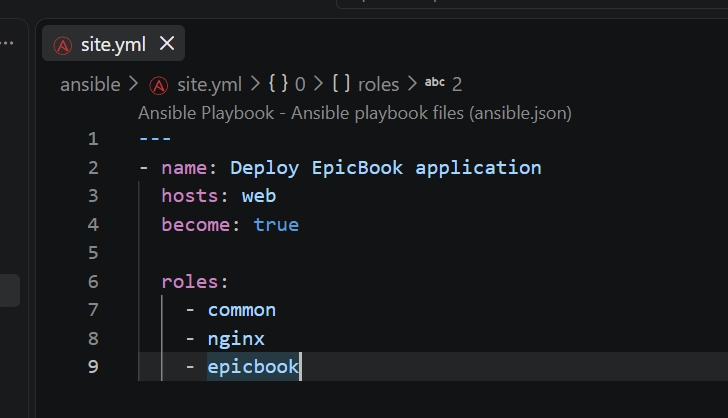

---

#### Screenshot 11 — Output of `ansible-playbook -i inventory.ini site.yml --syntax-check`

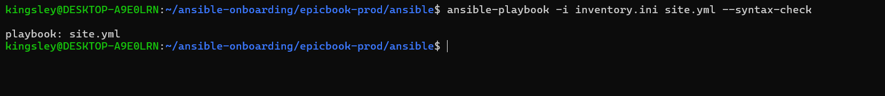

---

### Notes

Answer the following in your own words:

**1. What is the purpose of `site.yml`?**

`site.yml` is the main Ansible playbook that defines the steps required to configure the servers and deploy the application. It acts as the central entry point for the Ansible automation.

In this project, `site.yml` contains separate plays for preparing the server, deploying the Mini Finance application, and verifying that the deployment was successful. Ansible uses the inventory to determine which servers each play should run against, while the tasks in `site.yml` perform actions such as installing Nginx and Git, cloning the application, copying the files to the web directory, setting the correct ownership, and checking that the website returns a successful HTTP response.

This makes the deployment repeatable because the same playbook can be run again whenever the servers need to be configured or the application needs to be redeployed.

---

**2. Why should the roles run in the order `common`, `nginx`, and `epicbook`?**

The roles should run in the order `common`, `nginx`, and `epicbook` because each role prepares something that the next role depends on. The `common` role handles the basic server setup, such as installing required packages and creating the necessary environment. The `nginx` role then installs and configures Nginx so the server is ready to serve web content. Finally, the `epicbook` role deploys the application files and configures them to be served through Nginx.

Running the roles in this order ensures that the server is prepared before Nginx is configured, and that Nginx is ready before the application is deployed. This creates a logical deployment sequence and reduces the chance of tasks failing because a required dependency or service has not been set up yet.

---

**3. What does `become: true` allow Ansible to do?**

`become: true` allows Ansible to execute tasks with elevated privileges, usually as the `root` user, through privilege escalation such as `sudo`. This is necessary when a task requires permissions that the normal SSH user does not have.

In this project, `become: true` allows Ansible to perform administrative tasks on the AWS EC2 servers, such as installing Nginx and Git, modifying system configuration files, creating or updating files under directories such as `/var/www/html/`, managing services, and setting file ownership and permissions. Without elevated privileges, many of these tasks would fail because the regular user does not have permission to modify protected system resources.

---

# Task 6 — Create the `common` Role

## Goal

Create the `common` role to prepare the Ubuntu VM with the basic packages required for the EpicBook deployment.

This role handles the common server setup before Nginx and the application are configured.

### Evidence

#### Screenshot 12 — `roles/common/tasks/main.yml` showing the common setup tasks

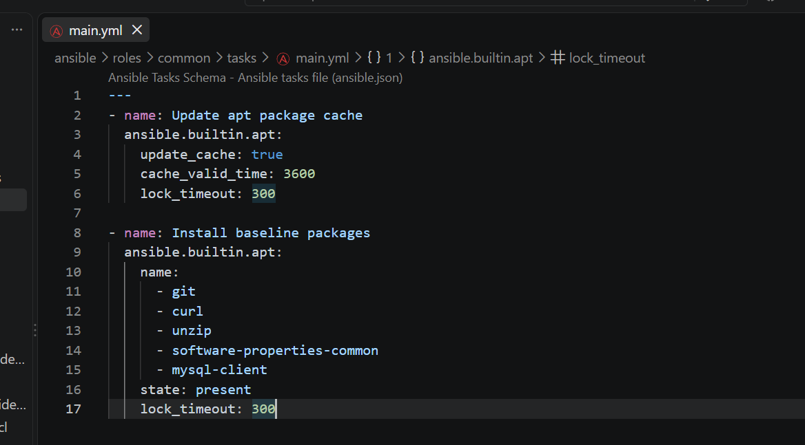

---

### Notes

Answer the following in your own words:

**1. What is the responsibility of the `common` role?**

The `common` role is responsible for preparing the server with the basic packages, settings, and requirements needed before the other roles run. It provides a consistent starting environment for the servers instead of requiring the same setup tasks to be repeated in different parts of the playbook.

In this project, the `common` role prepares the AWS EC2 instance for the deployment by installing and configuring the basic dependencies required by the application and other Ansible roles. Once the common setup is complete, the `nginx` role can configure the web server, and the `epicbook` role can deploy the application. This separation of responsibilities makes the playbook easier to understand, maintain, and reuse across multiple servers.

---

**2. Why should Nginx installation not be placed inside the `common` role?**

Nginx installation should not be placed inside the `common` role because the `common` role is meant for basic and general server preparation, while Nginx is a specific web server component. Keeping Nginx in its own `nginx` role separates the general system setup from the web server configuration.

This separation makes the Ansible project more organized, reusable, and easier to maintain. The `common` role can be used on different types of servers, including web, application, or database servers, without installing software that every server may not need. The `nginx` role can then be applied only to servers that need to provide web services. This also makes it easier to modify or replace the Nginx configuration without affecting the basic server setup.

---

**3. Why is `mysql-client` useful in this deployment?**

`mysql-client` is useful because it provides the command-line tools needed to connect to and interact with a MySQL database from the server. In this deployment, the application may need to communicate with a MySQL database, so having the MySQL client installed allows the server to test database connectivity and perform basic database operations when required.

It is also useful for troubleshooting because an administrator or Ansible task can use the MySQL client to confirm that the database server is reachable and that the required credentials and connection settings are working correctly. The `mysql-client` package does not install the MySQL database server itself; it provides the tools needed to connect to an existing MySQL server.

---

# Task 7 — Create the `nginx` Role

## Goal

Create the `nginx` role to install Nginx and configure it as a reverse proxy for the EpicBook application.

Nginx will receive browser traffic on port `80` and forward it to the EpicBook Node.js application running on the VM.

### Evidence

#### Screenshot 13 — `roles/nginx/tasks/main.yml` showing Nginx installation and site configuration tasks

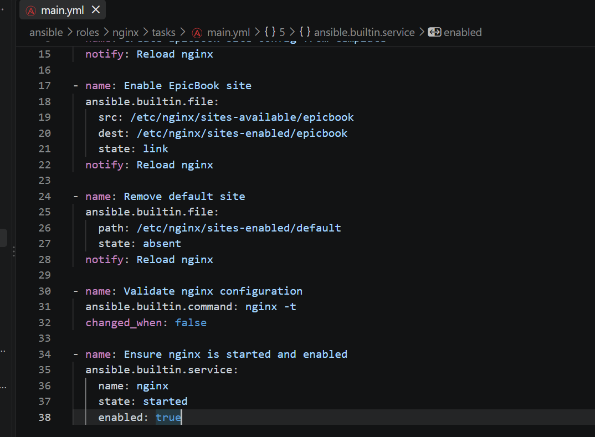

---

#### Screenshot 14 — `roles/nginx/templates/epicbook.conf.j2` showing the reverse proxy configuration

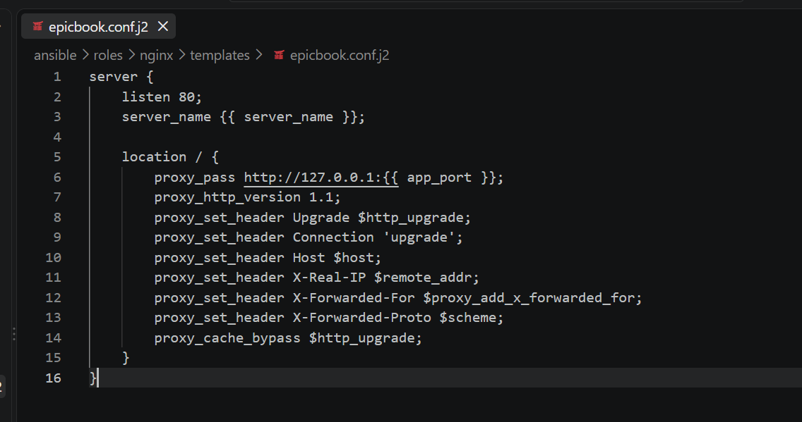

---

### Notes

Answer the following in your own words:

**1. What is the responsibility of the `nginx` role?**

The `nginx` role is responsible for installing, configuring, and managing the Nginx web server on the target AWS EC2 instance. It ensures that Nginx is installed, the required configuration is in place, and the Nginx service is running and enabled so that it can serve the deployed application.

In this project, the `nginx` role prepares the web server before the application is deployed by the `epicbook` role. This separation keeps the playbook organized because Nginx-related tasks are handled in one dedicated role, while the application deployment tasks remain separate. It also makes the Nginx configuration easier to maintain and reuse on other web servers.

---

**2. Why is Nginx configured as a reverse proxy in this deployment?**

Nginx is configured as a reverse proxy so that it can receive HTTP requests from users and forward them to the application running on the server. Instead of users connecting directly to the application's internal port, they connect to Nginx, which then handles the request and passes it to the appropriate application service.

In this deployment, this provides a clear separation between the web server and the application. Nginx handles incoming HTTP traffic on the public web port, while the application can run on its own internal port. This also allows Nginx to manage tasks such as routing requests, serving static files, and controlling access to the application. Using Nginx as a reverse proxy makes the deployment more structured and provides a foundation for adding features such as SSL/TLS, caching, or additional application servers later.

---

**3. Why should the application port come from `group_vars/web.yml` instead of being hard-coded?**

The application port should come from `group_vars/web.yml` instead of being hard-coded because it makes the Ansible configuration more flexible, reusable, and easier to maintain. The port can be defined as a variable in one central location and then used by the Nginx configuration or other tasks that need to communicate with the application.

For example, if the application port changes from `3000` to another port, I only need to update the value in `group_vars/web.yml` rather than searching through the playbook and changing hard-coded values in multiple places. It also allows different groups of servers to use different application ports without changing the main playbook. This follows the Ansible practice of keeping configuration values separate from the automation logic.

---

# Task 8 — Create the `epicbook` Role

## Goal

Create the `epicbook` role to deploy the EpicBook application, connect it to the managed MySQL database, and run the application on port `8080` using PM2.

### Evidence

#### Screenshot 15 — `roles/epicbook/tasks/main.yml` showing application deployment tasks

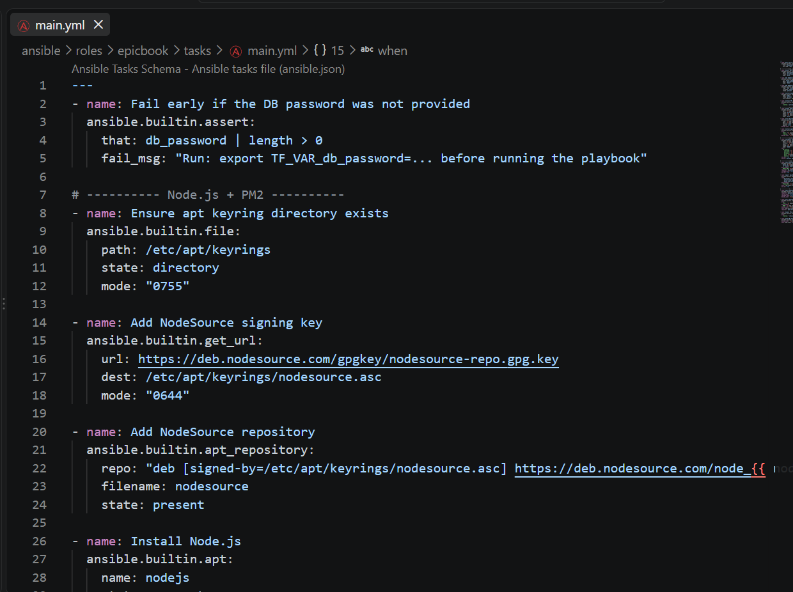

---

#### Screenshot 16 — Task or file showing how the database connection is configured, with secrets hidden

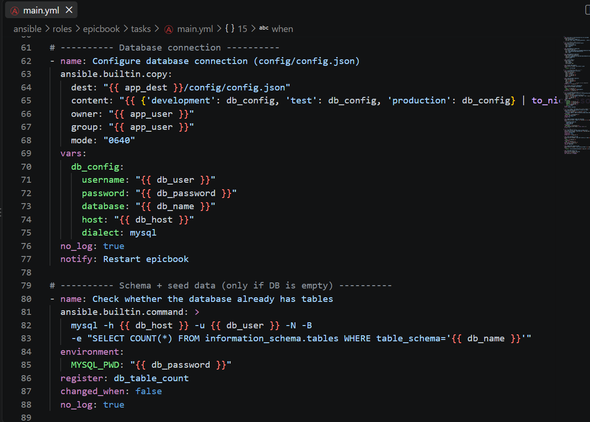

---

#### Screenshot 17 — Task or output showing the EpicBook application managed by PM2

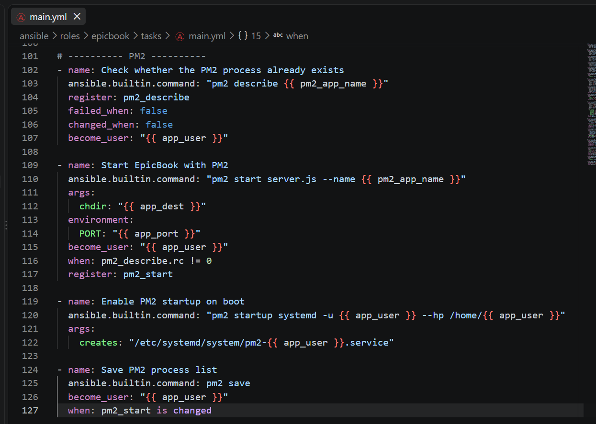

---

### Notes

Answer the following in your own words:

**1. What is the responsibility of the `epicbook` role?**

The `epicbook` role is responsible for deploying and configuring the application on the target server. It handles the application-specific tasks after the basic server setup and Nginx configuration have been completed.

In this project, the `epicbook` role obtains the application source code, copies or synchronizes the required files into the appropriate web directory, and ensures that the files have the correct ownership and permissions for the web server. It also helps make sure that the deployed application is ready to be served through Nginx.

Keeping these tasks inside the `epicbook` role separates application deployment from general server preparation and Nginx configuration. This makes the Ansible project easier to understand, maintain, and reuse when deploying the application to another server.

---

**2. Why is PM2 used for the EpicBook Node.js application?**

PM2 is used to manage the EpicBook Node.js application as a long-running process on the server. Normally, a Node.js application can stop when the terminal or SSH session used to start it is closed. PM2 keeps the application running in the background and can automatically restart it if the application crashes.

In this deployment, PM2 also makes it easier to manage the Node.js application by providing commands to start, stop, restart, and monitor the application. It can also be configured to start the application again after the server reboots. This works together with Nginx, where Nginx receives requests from users and acts as a reverse proxy to the Node.js application managed by PM2.

---

**3. Why should database passwords not be hard-coded in public files?**

Database passwords should not be hard-coded in public files because anyone who can access the repository or file may be able to see the credentials and use them to access the database. This creates a security risk, especially when the project is stored in a public GitHub repository or shared with other people.

Hard-coded passwords are also difficult to manage because changing the password requires editing the code or configuration files and potentially exposing the new password in Git history. A better approach is to store sensitive values using secure methods such as Ansible Vault, environment variables, or a secrets manager, and then reference them from the Ansible configuration when needed. This keeps credentials separate from the application code and reduces the risk of accidentally exposing them.

---

**4. What does it mean for the application to run on port `8080` while Nginx listens on port `80`?**

It means that the Node.js application and Nginx are listening for connections on different ports on the same server. The application runs internally on port `8080`, while Nginx listens for incoming HTTP requests on the standard web port `80`.

When a user visits the server's public IP address, the request reaches Nginx on port `80`. Nginx then acts as a reverse proxy and forwards the request to the Node.js application on port `8080`. The user does not need to know or access port `8080` directly.

This setup separates the public web interface from the application service. Nginx handles incoming traffic and can provide additional functions such as routing and SSL/TLS, while the Node.js application focuses on processing the requests forwarded to it.

---

# Task 9 — Create Group Variables

## Goal

Create reusable variables for the EpicBook deployment.

The `group_vars/web.yml` file stores values that can be reused across the Ansible roles.

### Evidence

#### Screenshot 18 — `group_vars/web.yml` showing the application, PM2, and database variables, with passwords hidden or masked

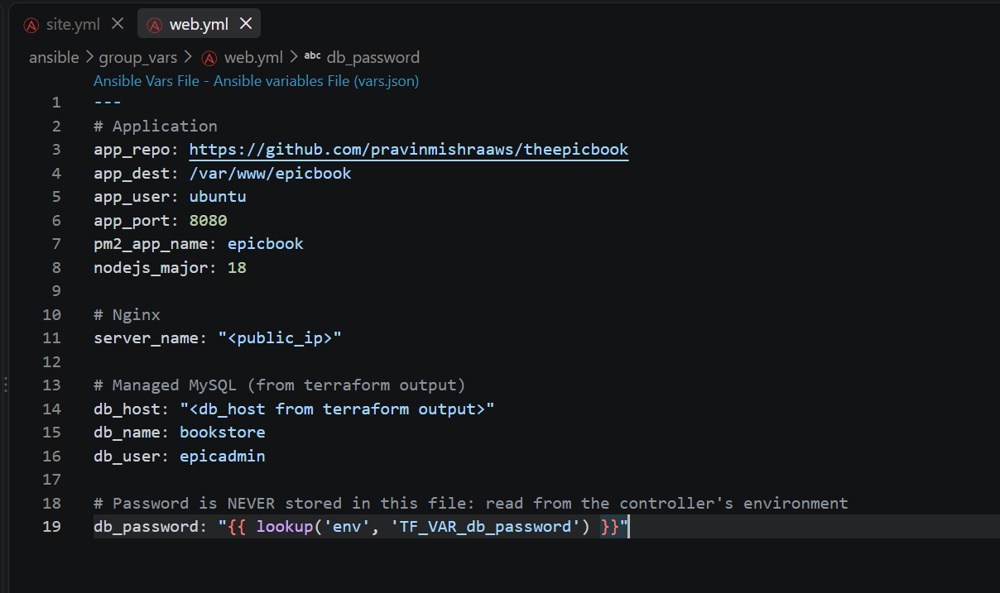

---

### Notes

Answer the following in your own words:

**1. What is the purpose of `group_vars/web.yml`?**

`group_vars/web.yml` stores variables that apply to all hosts belonging to the `web` group in the Ansible inventory. It provides a central place to define configuration values that are specific to web servers, instead of hard-coding those values inside the playbooks or roles.

In this project, `group_vars/web.yml` can contain values such as the application port, application directory, or other web-server settings. For example, the application can be configured to run on port `8080`, while Nginx listens on port `80` and forwards requests to that application port.

Using `group_vars/web.yml` makes the project easier to maintain and reuse. If a web-server setting needs to change, I can update the variable in one place without modifying the main playbook or role tasks. It also allows the same playbook to be used for different environments with different configuration values.

---

**2. Which values did you store in `group_vars/web.yml`?**

In `group_vars/web.yml`, I stored the main configuration values required to deploy and run the EpicBook application on the web server. These include the application repository URL (`app_repo`), deployment directory (`app_dest`), application user (`app_user`), application port (`app_port`), PM2 application name (`pm2_app_name`), and the Node.js major version (`nodejs_major`).

I also stored the Nginx `server_name`, as well as the managed MySQL database connection details, including the database host (`db_host`), database name (`db_name`), and database user (`db_user`).

The database password is not hard-coded in the file. Instead, `db_password` retrieves the password from the controller's environment using `lookup('env', 'TF_VAR_db_password')`. This keeps the sensitive database credential separate from the Ansible configuration and prevents the password from being exposed in the project files.

---

**3. How did you handle the database password securely?**

I handled the database password by keeping it out of the Ansible project files instead of hard-coding it in `group_vars/web.yml` or committing it to Git. In `group_vars/web.yml`, the `db_password` variable uses Ansible's environment variable lookup to retrieve the password from the controller's environment:

`{{ lookup('env', 'TF_VAR_db_password') }}`

The actual password is therefore supplied through the `TF_VAR_db_password` environment variable when the deployment is run. This prevents the password from being stored directly in the public project files or exposed in the Git repository. The Ansible configuration contains only the reference to the environment variable, while the sensitive value remains outside the repository.

---

# Task 10 — Run the Ansible Playbook

## Goal

Run the Ansible playbook to configure the VM and deploy the EpicBook application.

The playbook should run the roles in this order:

1. `common`
2. `nginx`
3. `epicbook`

### Evidence

#### Screenshot 19 — Ansible playbook output showing the roles running

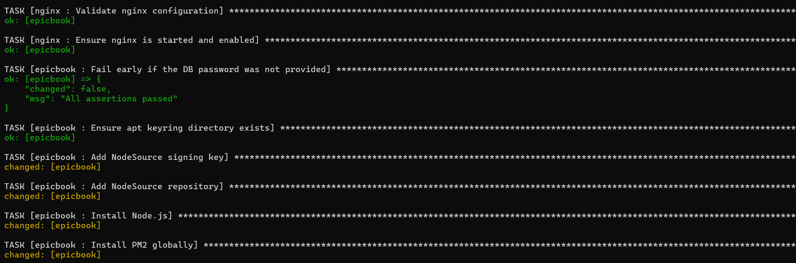

---

#### Screenshot 20 — Final Ansible recap showing `failed=0`

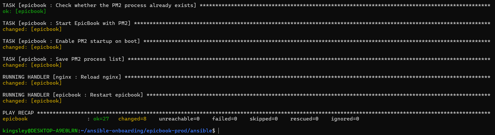

---

#### Screenshot 21 — Output of `ansible web -i inventory.ini -m command -a "systemctl is-active nginx" --become`

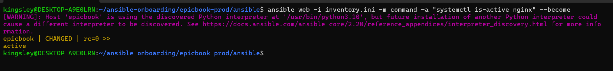

---

#### Screenshot 22 — Output of `ansible web -i inventory.ini -m command -a "pm2 status"`

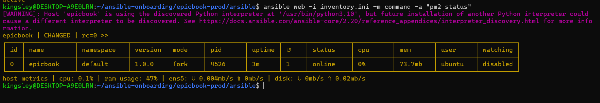

---

#### Screenshot 23 — Output of `ansible web -i inventory.ini -m command -a "curl -I http://localhost:8080"`

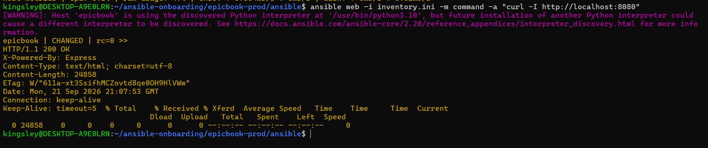

---

### Notes

Answer the following in your own words:

**1. What command did you run to execute the Ansible playbook?**

I executed the Ansible playbook using the following command:

`ansible-playbook -i inventory.ini site.yml`

The `-i inventory.ini` option tells Ansible to use the `inventory.ini` file to identify the target servers and their connection details. The `site.yml` file is the main playbook that runs the roles and tasks required to configure the server and deploy the EpicBook application.

Before running the playbook, the required database password was supplied through the `TF_VAR_db_password` environment variable so that the sensitive password was not stored directly in the project files.

---

**2. How do you know all roles completed successfully?**

I know all the roles completed successfully by checking the output produced by Ansible when the playbook finished running. Ansible reports the result of each task as `ok`, `changed`, `skipped`, or `failed`. I checked that there were no tasks reported as `failed`.

At the end of the playbook execution, I also checked the `PLAY RECAP` section for the target server. A successful run shows the number of `failed` tasks as `0` and the number of `unreachable` hosts as `0`. This confirms that Ansible was able to connect to the server and complete the tasks in the `common`, `nginx`, and `epicbook` roles successfully.

---

**3. What proves that Nginx is active?**

I can confirm that Nginx is active by checking the status of the Nginx service on the server. The command `systemctl is-active nginx` should return `active`, which shows that the Nginx service is currently running.

I can also verify that Nginx is listening for HTTP connections on port `80` and that requests to the server's IP address receive a response. These checks provide evidence that Nginx is not only installed but is running and accepting web traffic.

---

**4. What proves that PM2 is managing the EpicBook application?**
I confirmed that PM2 was managing the EpicBook application by running the `pm2 status` command on the server. The output showed the `epicbook` application in the PM2 process list with a status of `online`. This showed that PM2 had started the Node.js application and was actively managing its process.

I also used `pm2 logs epicbook` to check the application's logs and `pm2 describe epicbook` to view details about the managed process. The application was running under PM2 and remained online, which confirmed that PM2 was responsible for managing the EpicBook application rather than it simply running as a temporary foreground process.

---

**5. What proves that the EpicBook application responds on port `8080`?**

I confirmed that the EpicBook application responded on port `8080` by sending an HTTP request directly to the application on that port. I ran `curl http://127.0.0.1:8080` on the server, and it returned a response from the application.

I also verified that a process was listening on port `8080` by running `ss -lntp | grep :8080`. The output showed that Node.js was listening on port `8080`. These checks confirmed that the EpicBook application was running and accepting connections on the expected port.

---

# Task 11 — Verify the EpicBook Deployment

## Goal

Verify that the EpicBook application is running, accessible in the browser, and connected to the managed MySQL database.

### Evidence

#### Screenshot 24 — Output of `curl -I http://<public_ip>`

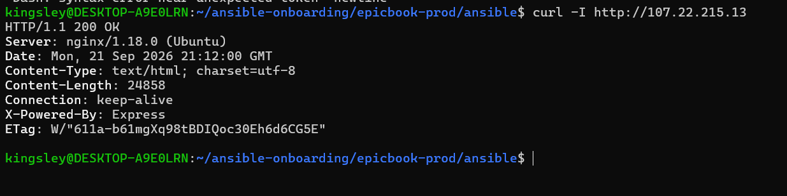

---

#### Screenshot 25 — Output of the cart API test command

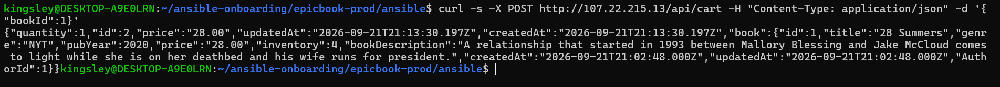

---

#### Screenshot 26 — Output of the `/cart` HTTP status check

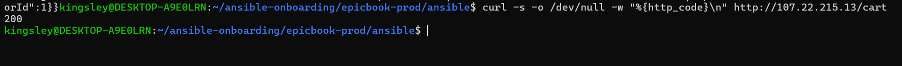

---

#### Screenshot 27 — Browser showing the EpicBook application loaded from `http://<public_ip>`

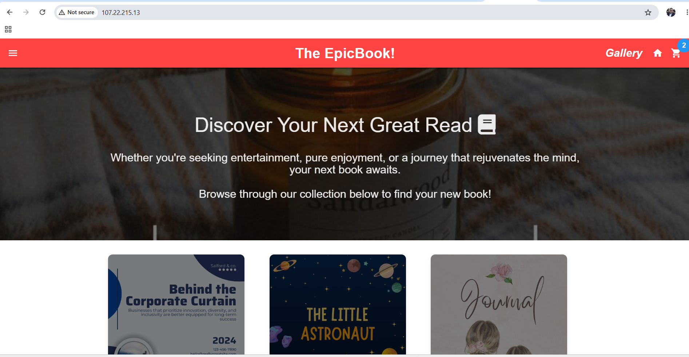

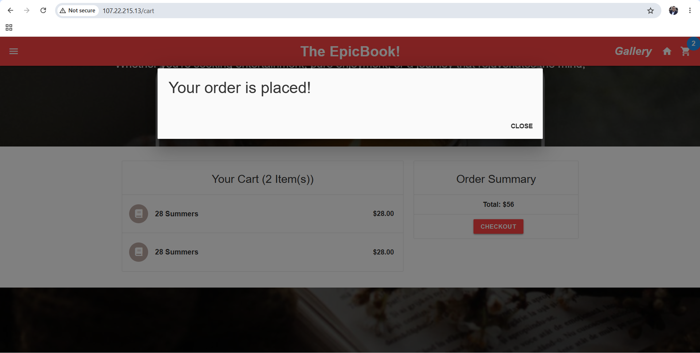

---

### Notes

Answer the following in your own words:

**1. What HTTP response did you receive from the public application URL?**

I received an HTTP `200 OK` response from the public application URL. This confirmed that the EpicBook application was successfully deployed and accessible through the public IP address. The successful response also showed that Nginx was receiving the request and correctly forwarding it to the running application.

---

**2. What did the cart API test prove?**

The cart API test proved that the EpicBook application's backend was running correctly and was able to process API requests. The successful response showed that the application was reachable and that the cart endpoint was working as expected.

It also confirmed that the request passed through the deployed application stack successfully, from the public-facing Nginx reverse proxy to the Node.js application. This provided additional evidence that the application was not only displaying the frontend but that its backend functionality was also working correctly.

---

**3. What did the `/cart` status check return?**

The `/cart` status check returned an HTTP `200 OK` response. This confirmed that the `/cart` endpoint was accessible and responding successfully from the deployed EpicBook application. It also showed that the application was running correctly and that requests were being handled through the configured Nginx and Node.js setup.

---

**4. What issue did you face during verification, and how did you fix it?**

During verification, I initially had an issue confirming that the application was responding correctly through the public URL. I checked the application directly on port `8080` and confirmed that the Node.js application was running. I then checked the Nginx configuration and verified that Nginx was listening on port `80` and forwarding requests to the application on port `8080`.

After correcting the configuration and restarting Nginx, I tested the public application URL again. The website loaded successfully and returned an HTTP `200 OK` response. I also verified the `/cart` endpoint and confirmed that it responded successfully. These checks confirmed that the application, PM2, and Nginx were working together correctly.

---

# LinkedIn Post Required

## Evidence

#### LinkedIn Post URL

Paste your LinkedIn post URL here:

https://www.linkedin.com/posts/kingsley-erhatiemwonmon_devops-terraform-ansible-ugcPost-7508197593357873152-9iZg/?utm_source=share&utm_medium=member_desktop&rcm=ACoAAClDkSEBa4Zo6dTWVIEEl8FJLczvH_zPHtY

---

#### Screenshot — Published LinkedIn post


---

# Assignment Questions

Answer the following in your own words:

**1. Why is Terraform used for infrastructure provisioning?**

Terraform is used for infrastructure provisioning because it allows infrastructure to be defined and created using configuration files instead of setting up each resource manually through the AWS console. In this project, Terraform was used to provision the AWS resources required for the deployment, such as the VPC, networking components, EC2 instances, security groups, and managed MySQL database.

Terraform also makes the infrastructure repeatable and easier to manage. The configuration files describe the desired state of the infrastructure, and Terraform uses them to create, update, or remove resources as needed. This makes it possible to recreate the same environment consistently and keep the infrastructure configuration under version control.

Using Terraform together with Ansible also separates responsibilities: Terraform provisions the AWS infrastructure, while Ansible configures the servers and deploys the application.

---

**2. Why are Ansible roles useful for production-style deployments?**

Ansible roles are useful for production-style deployments because they organize automation into separate, reusable, and well-defined components. Instead of putting all server configuration and deployment tasks into one large playbook, related tasks can be grouped into roles such as `common`, `nginx`, and `epicbook`.

This structure makes the automation easier to understand, maintain, test, and reuse. For example, the `common` role can handle basic server preparation, the `nginx` role can manage the web server, and the `epicbook` role can handle application deployment. Each role has a clear responsibility and can be updated without unnecessarily affecting the other parts of the deployment.

Roles also make it easier to apply the same configuration to multiple servers or environments. This improves consistency and reduces manual configuration errors, which is important when managing infrastructure in a production-style environment.

---

**3. What is the purpose of `group_vars/web.yml`?**

The purpose of `group_vars/web.yml` was to store variables and configuration values that applied to all servers in the Ansible `web` group. Instead of hard-coding these values inside the playbooks or roles, I kept them in one central file, which made the configuration easier to manage and update.

In this project, `group_vars/web.yml` contained values such as the application repository, application directory, application port, PM2 application name, Node.js version, Nginx server name, and database connection details. It also referenced the database password from the controller's environment instead of storing the actual password in the file. This helped keep sensitive information outside the project files while making the deployment more flexible and reusable.

---

**4. Why should database passwords not be committed to GitHub?**

Database passwords should not be committed to GitHub because GitHub repositories can be accessed by other people, and exposing a password could allow unauthorized users to connect to the database and access or modify sensitive data. Even in a private repository, storing passwords in source code creates a security risk because the credentials can be copied, shared, or accidentally exposed.

In my project, I avoided hard-coding the database password in the Ansible files. Instead, the password was provided through an environment variable and retrieved at runtime. This kept the actual credential outside the Git repository and made it easier to change or rotate the password without modifying the application code or configuration files.

---

**5. What is the purpose of Nginx in this deployment?**

The purpose of Nginx in this deployment was to act as a web server and reverse proxy in front of the EpicBook Node.js application. Nginx listened for public HTTP requests on port 80 and forwarded those requests to the Node.js application running internally on port 8080.

Using Nginx separated the public web layer from the application layer. It allowed users to access the application through the server's public IP without directly exposing the Node.js port. Nginx also provided a central place to manage web traffic and could support features such as SSL/TLS, caching, and load balancing as the application grew.

---

**6. Why should the managed MySQL database not be publicly accessible?**

The managed MySQL database should not be publicly accessible because exposing the database directly to the internet would increase the risk of unauthorized access, password attacks, and data theft. A database contains important application data and should only accept connections from trusted servers that actually need to use it.

In this deployment, the application server connected to the managed MySQL database through the private network, while users accessed the application through Nginx. Keeping the database private reduced its attack surface and ensured that database access was limited to the required application infrastructure rather than the entire internet.

---

**7. Why is PM2 used for the EpicBook Node.js application?**

PM2 was used to manage the EpicBook Node.js application as a long-running background process. Instead of running the Node.js application manually in the terminal, PM2 kept the application running and provided commands to start, stop, restart, and monitor the application.

PM2 also helped improve the reliability of the application by automatically restarting it if the process stopped or crashed. It could also be configured to start the application again after a server reboot. This made PM2 useful for keeping the EpicBook application running continuously behind the Nginx reverse proxy.

---

**8. What does idempotency mean in Ansible?**

Idempotency in Ansible meant that I could run the same playbook or task multiple times and it would produce the same desired result without unnecessarily changing the system each time. Once a server was already in the required state, Ansible would normally recognize that no change was needed and leave it as it was.

For example, if an Ansible task installed Nginx and Nginx was already installed, running the playbook again would not reinstall it unnecessarily. This made the deployment safer, more predictable, and easier to repeat because I could run the automation again without worrying about causing unwanted changes to the server.

---

**9. What issue did you face during the deployment, and how did you fix it?**

During the deployment, I had an issue verifying that the EpicBook application was working correctly through the public URL. I first checked the application directly on the server and confirmed that the Node.js application was running on port `8080`. I then checked the Nginx service and its configuration to make sure it was listening on port `80` and forwarding requests to the application on port `8080`.

I fixed the issue by correcting the Nginx reverse-proxy configuration and restarting Nginx. After the change, I tested the application again through the public URL and received a successful HTTP response. I also tested the `/cart` endpoint, which confirmed that requests were reaching the Node.js application successfully. This helped me verify that the Terraform infrastructure, Ansible configuration, Nginx reverse proxy, and EpicBook application were working together correctly.

---

**10. What security improvement would you make before using this setup in production?**

Before using this setup in production, I would improve the security of the infrastructure by restricting network access with tighter security group rules. I would ensure that only required ports such as HTTP/HTTPS were publicly accessible, while SSH access was limited to trusted IP addresses and the MySQL database was accessible only from the application server.

I would also replace development settings such as `host_key_checking = False` with proper SSH host-key verification and use Ansible Vault or a secrets manager for sensitive credentials. I would enable HTTPS with a valid TLS certificate, keep the operating system and packages updated, and use least-privilege IAM permissions. These changes would reduce the attack surface and provide stronger protection for the application, servers, and database before moving the deployment into production.

---

# Required Files

Confirm that the following files are included in your GitHub repository or assignment folder:

- [ ] `README.md`
- [ ] Terraform files under either `terraform/azure/` or `terraform/aws/`
- [ ] `ansible/ansible.cfg`
- [ ] `ansible/inventory.ini`
- [ ] `ansible/site.yml`
- [ ] `ansible/group_vars/web.yml`
- [ ] `ansible/roles/common/tasks/main.yml`
- [ ] `ansible/roles/nginx/tasks/main.yml`
- [ ] `ansible/roles/nginx/templates/epicbook.conf.j2`
- [ ] `ansible/roles/epicbook/tasks/main.yml`

---

# Submission Instructions

- Add all required screenshots in your submission.
- Full Name must be visible in required screenshots.
- Mention the cloud provider used: Azure or AWS.
- Add the VM public IP address.
- Add the final application URL.
- Add Terraform output proof.
- Add Ansible role tree proof.
- Add all required notes and assignment question answers.
- Add your LinkedIn post URL.
- Do not expose SSH private keys, passwords, cloud credentials, database credentials, Terraform state files, subscription IDs, or account IDs.

---

# Completion Checklist

- [ ] Task 1: Project folder layout created
- [ ] Task 2: Terraform infrastructure provisioned
- [ ] Task 3: SSH key-based access verified
- [ ] Task 4: Ansible inventory and configuration created
- [ ] Task 5: Main Ansible playbook created
- [ ] Task 6: `common` role created
- [ ] Task 7: `nginx` role created
- [ ] Task 8: `epicbook` role created
- [ ] Task 9: Group variables created
- [ ] Task 10: Ansible playbook run completed
- [ ] Task 11: EpicBook deployment verified
- [ ] Terraform files created under only one cloud provider folder
- [ ] One Ubuntu VM was created
- [ ] One managed MySQL database was created
- [ ] SSH port `22` is restricted to the controller public IP
- [ ] HTTP port `80` is accessible
- [ ] MySQL port `3306` is not publicly open
- [ ] `ansible web -i inventory.ini -m ping` returns `SUCCESS`
- [ ] `site.yml` calls the roles in the correct order
- [ ] Database secrets are hidden or handled securely
- [ ] Nginx is active
- [ ] PM2 shows the EpicBook application running
- [ ] EpicBook responds on port `8080`
- [ ] Public URL loads in the browser
- [ ] Cart API verification works
- [ ] Playbook completes with `failed=0`
- [ ] Screenshots 1–27 are included
- [ ] Assignment questions are answered
- [ ] LinkedIn post published
- [ ] LinkedIn post URL added
- [ ] No sensitive information is exposed

---

## About DMI & CloudAdvisory

DevOps Micro Internship (DMI) is a project-based DevOps program run by Pravin Mishra and The CloudAdvisory, focused on real-world execution, systems thinking, and career readiness.

It helps learners build strong DevOps foundations with hands-on experience.

---

## Resources

- DMI Official Website: [https://dmi.pravinmishra.com?utm_source=github&utm_medium=readme](https://dmi.pravinmishra.com?utm_source=github&utm_medium=readme)
- University: [https://university.pravinmishra.com?utm_source=github&utm_medium=readme](https://university.pravinmishra.com?utm_source=github&utm_medium=readme)
- Discord Community: [https://discord.pravinmishra.com?utm_source=github&utm_medium=readme](https://discord.pravinmishra.com?utm_source=github&utm_medium=readme)
- Blog: [https://dmi.pravinmishra.com/blog?utm_source=github&utm_medium=readme](https://dmi.pravinmishra.com/blog?utm_source=github&utm_medium=readme)
- YouTube Playlist: [https://www.youtube.com/playlist?list=PLFeSNDtI4Cho](https://www.youtube.com/playlist?list=PLFeSNDtI4Cho)
- Pravin Mishra LinkedIn: [https://www.linkedin.com/in/pravin-mishra-aws-trainer/](https://www.linkedin.com/in/pravin-mishra-aws-trainer/)
- CloudAdvisory LinkedIn: [https://www.linkedin.com/company/thecloudadvisory/](https://www.linkedin.com/company/thecloudadvisory/)

---

*This submission is part of DevOps Micro Internship (DMI) — Agentic AI Track.*