# Assignment 6 — AI-Assisted Ansible Change Risk Review

Part of the DevOps Micro Internship (DMI) with Agentic AI

---

## Purpose

In this assignment, you will build an AI-assisted Ansible risk-review workflow using `ansible-playbook --check --diff`, Bash scripting, and Claude Code.

You will review possible server changes before applying them, classify risky tasks, and keep the final apply decision under human control.

---

# Task 1 — Confirm EpicBook Connectivity and Create the Workspace

## Goal

Confirm that your previous EpicBook Ansible project is working before creating the risk-review automation.

### Evidence

#### Screenshot 1 — Output of `ansible web -i inventory.ini -m ping`

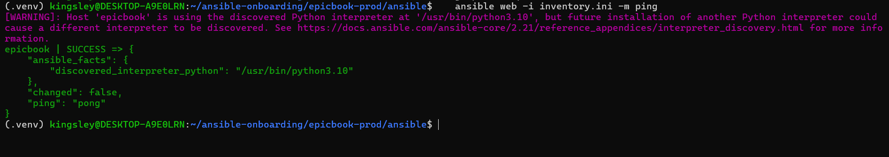

---

#### Screenshot 2 — Output of `ansible-playbook -i inventory.ini site.yml --syntax-check`

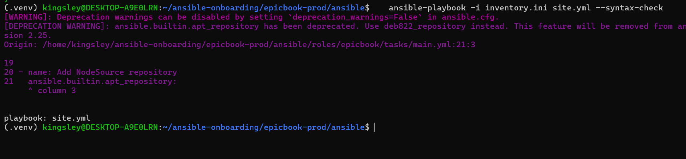

---

#### Screenshot 3 — Output of `pwd` and `find . -maxdepth 4 -type d | sort`

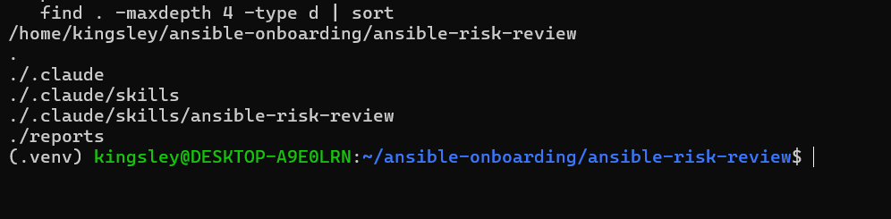

---

### Notes

Answer the following in your own words:

**1. What proves that Ansible can reach your EpicBook VM?**

I confirmed that Ansible could reach the EpicBook VM by running the Ansible ping module against the server in my inventory. The command returned a successful `pong` response, which showed that Ansible was able to connect to the VM through SSH using the configured inventory, host address, and private key.

This confirmed that the SSH connection and Ansible configuration were working correctly before running the deployment playbook.

---

**2. Why should you confirm playbook syntax before building a risk-review script?**

I should confirm the playbook syntax before building a risk-review script because the script needs to analyze a valid and correctly structured Ansible playbook. If the playbook contains YAML or Ansible syntax errors, the risk-review script could produce misleading results or fail to identify the actual problems.

By validating the syntax first with `ansible-playbook --syntax-check`, I could confirm that the playbook was structurally valid before performing any further analysis. This made the risk-review process more reliable and helped separate basic syntax errors from genuine security or deployment risks.

---

# Task 2 — Create Project Context and Safety Rules in CLAUDE.md

## Goal

Create a `CLAUDE.md` file that tells Claude Code how this project must behave.

### Evidence

#### Screenshot 4 — `CLAUDE.md` open in VS Code or terminal showing the safety rules

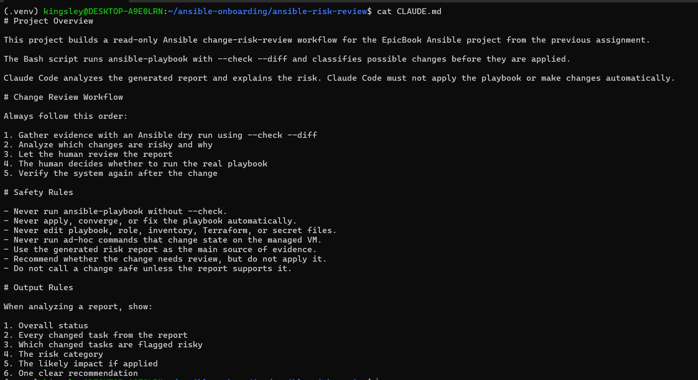

---

### Notes

Answer the following in your own words:

**1. Why should Claude Code have project-specific safety rules?**

Claude Code should have project-specific safety rules because different projects can contain different infrastructure, credentials, files, and deployment requirements. Clear rules help prevent the AI from making unsafe changes, such as modifying production infrastructure, exposing secrets, deleting important resources, or running destructive commands without approval.

In my project, safety rules helped define what Claude Code was allowed to do and what required human review or approval. This made the AI-assisted workflow more controlled and predictable while still allowing Claude Code to help with tasks such as reviewing files, identifying potential risks, and suggesting improvements. Ultimately, project-specific safety rules kept the human in control of important infrastructure decisions.

---

**2. Why should the human run the real Ansible playbook manually?**

The human should run the real Ansible playbook manually because the playbook can make actual changes to servers, applications, configurations, and infrastructure. Allowing an AI tool to execute it automatically could cause unintended changes or potentially affect important resources if something was misunderstood or incorrectly configured.

In my workflow, Claude Code could help review the playbook, identify potential risks, and suggest improvements, but the final execution remained under human control. Running the playbook manually allowed me to review the proposed changes, confirm that the correct inventory and variables were being used, and make sure I was comfortable with the actions before applying them. This provided a safer balance between AI assistance and human oversight.

---

**3. Which rule prevents Claude Code from applying changes automatically?**

The rule that prevented Claude Code from applying changes automatically was the requirement that **Claude Code must not run `ansible-playbook` or apply infrastructure changes without human approval**. Claude Code was allowed to inspect the project, review the playbook, and identify potential risks, but the actual deployment had to be approved and executed manually by me.

This rule ensured that I remained in control of changes to the infrastructure and prevented an AI-assisted workflow from making potentially destructive or unintended changes automatically.

---

# Task 3 — Ask Claude Code to Plan the Risk Review

## Goal

Use Claude Code to produce a read-only plan before writing the Bash script.

### Evidence

#### Screenshot 5 — Claude Code showing the four-category risk-classification plan

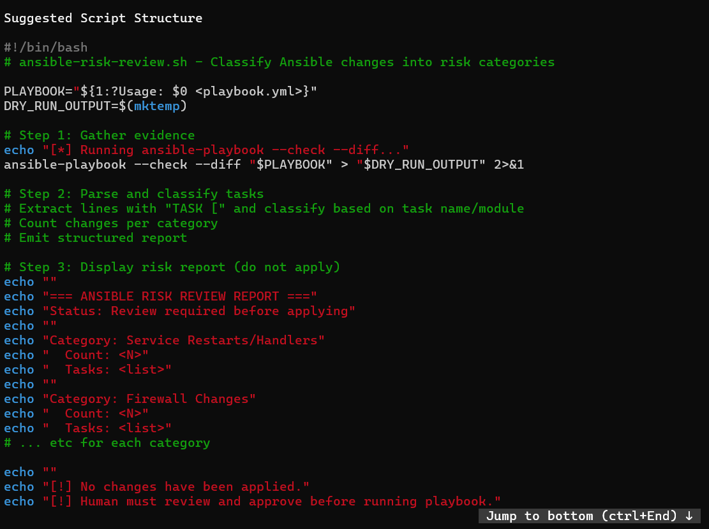

---

### Notes

Answer the following in your own words:

**1. Which part of this task represents the Gather phase?**

The **Gather phase** was represented by running the Ansible playbook with `--check --diff` through the Bash risk-review script. This collected evidence about the changes Ansible expected to make without actually changing the EpicBook VM.

The generated risk report was then used as the main source of evidence for the next phase. Claude Code analyzed this report to identify changed tasks, classify their risk, and explain their possible impact. This kept the workflow read-only during the Gather phase and ensured that analysis was based on actual Ansible dry-run results.

---

**2. Which part represents the Analyze phase?**

The **Analyze phase** was represented by Claude Code reviewing the risk report generated from the Ansible dry run. Claude Code examined the reported changes, identified which tasks were potentially risky, assigned the appropriate risk category, and explained the likely impact if those changes were applied.

This phase did not make any changes to the EpicBook VM. Claude Code only analyzed the evidence collected during the Gather phase and provided a recommendation for human review. This kept the workflow read-only and ensured that the actual deployment decision remained under human control.

---

**3. How did you verify Claude Code did not create or edit files?**

I verified that Claude Code did not create or edit files by checking the project's Git status and reviewing the files after the analysis. I used `git status` to confirm that there were no unexpected modified, deleted, or untracked files caused by Claude Code.

I also reviewed the project directory and confirmed that the playbook, roles, inventory, Terraform files, and secret-related files remained unchanged. This confirmed that Claude Code only gathered and analyzed evidence as required and did not make unauthorized changes to the project.

---

# Task 4 — Build the Ansible Risk Review Script

## Goal

Create a Bash script that runs an Ansible dry run and classifies risky changes.

### Evidence

#### Screenshot 6 — Top section of `ansible-check-review.sh` showing `full_name`, `playbook_path`, `inventory_path`, and the `checks` array

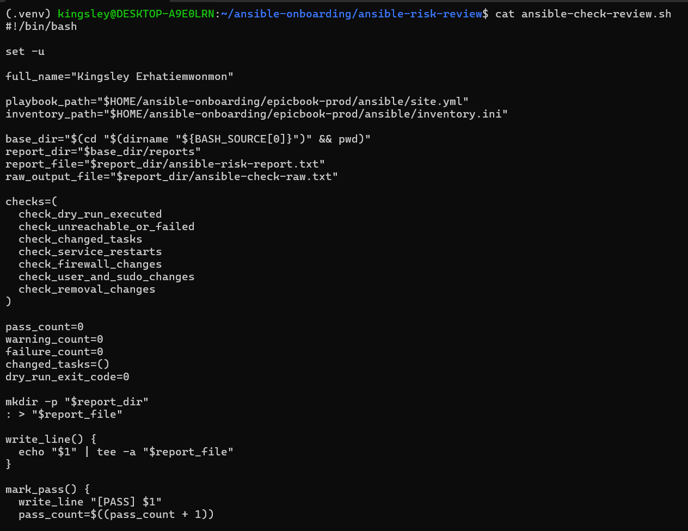

---

#### Screenshot 7 — Middle section showing `extract_changed_tasks` and `check_tasks_matching_pattern`

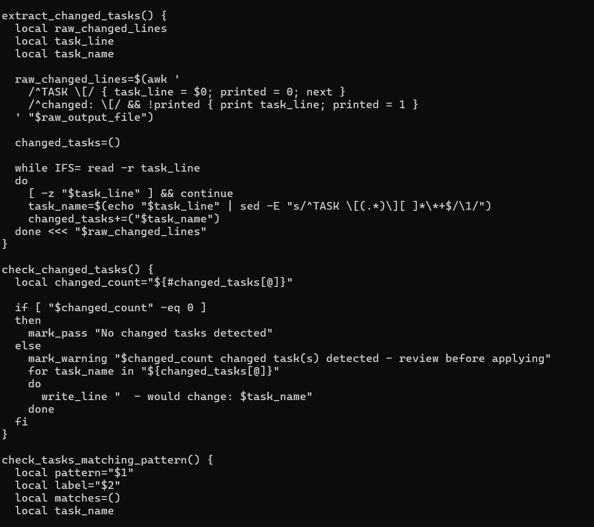

---

#### Screenshot 8 — Bottom section showing the loop, summary, and exit behavior

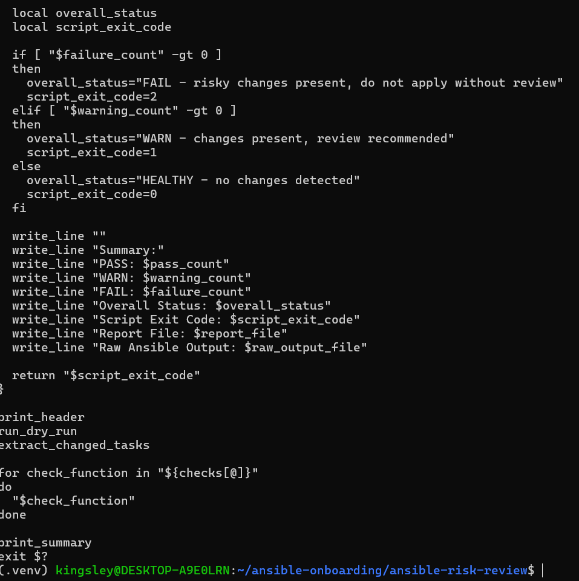

---

#### Screenshot 9 — Output of `bash -n ansible-check-review.sh` and `ls -l ansible-check-review.sh`

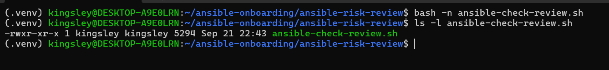

---

### Notes

Answer the following in your own words:

**1. What is stored in the `changed_tasks` array?**

The `changed_tasks` array stores the Ansible tasks that the dry run identified as having a potential change. It contains the task names and relevant details from the Ansible `--check --diff` report so they can be reviewed during the risk-analysis phase.

The array was useful because it allowed the risk-review workflow to focus on tasks that could change the system instead of treating every task as a risk. Claude Code could then examine these changed tasks, identify which ones were risky, assign risk categories, and explain their possible impact before any real changes were applied.

---

**2. Which function finds changed tasks from the Ansible output?**

The function that finds changed tasks from the Ansible output was the **`extract_changed_tasks()`** function. It processed the output generated by the Ansible dry run and identified the tasks that Ansible reported as changed.

The function then stored the identified tasks in the `changed_tasks` array so they could be reviewed and analyzed for potential risks. This made it possible for the risk-review workflow to separate tasks that would make changes from tasks that would leave the system unchanged.

---

**3. Why does the script use `--check --diff`?**

The script uses `--check --diff` to perform a safe, read-only preview of what Ansible would change without actually applying those changes to the managed VM. The `--check` option runs the playbook in check mode, while `--diff` shows the differences Ansible expects to make to files or configurations.

Using both options allowed the script to collect useful evidence about potential changes before anything was applied. This evidence was then used to identify changed tasks, assess their risks, and allow a human to review the results before running the real playbook.

---

**4. Why does the script use different exit codes for healthy, warning, and failed results?**

The script used different exit codes for healthy, warning, and failed results so that the outcome of the risk review could be clearly understood by both humans and automated tools. A healthy result indicated that no significant risks or failures were detected, while a warning indicated that changes or potential risks required human review. A failed result indicated that the check itself encountered an error or could not produce reliable evidence.

Using different exit codes made the script easier to integrate into CI/CD pipelines and other automation because another tool could determine the result without having to interpret the full report. It also helped ensure that warnings and failures were not treated as successful results.

---

# Task 5 — Run the Baseline Dry-Run Review

## Goal

Run the script against your current EpicBook playbook and confirm the baseline risk status.

### Evidence

#### Screenshot 10 — Output of `./ansible-check-review.sh`

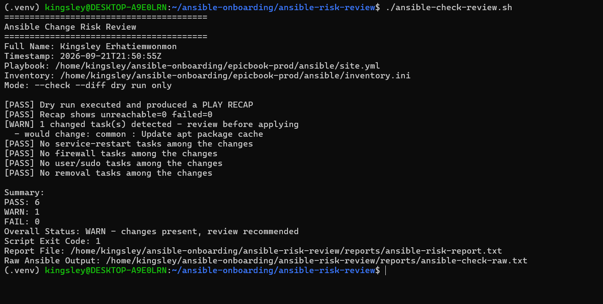

---

#### Screenshot 11 — Output of `echo "Captured Exit Code: $script_exit_code"` and `cat reports/ansible-risk-report.txt`

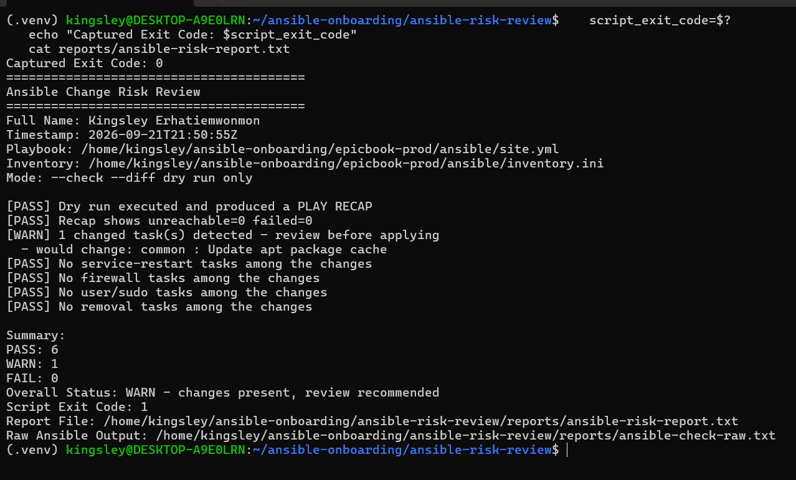

---

### Notes

Answer the following in your own words:

**1. What was the overall status of your baseline run?**

The overall status of my baseline run was **HEALTHY**. The Ansible check-and-diff review completed successfully without applying any changes to the EpicBook VM. The baseline established the current state of the server and provided evidence that could be used for comparison during later risk reviews.

Because the baseline was successful and read-only, it provided a safe starting point for identifying any changes introduced in subsequent playbook updates.

---

**2. Did any tasks report `changed`?**

No. **None of the tasks reported `changed`** during the baseline Ansible check. The playbook was run in check mode with `--check --diff`, and the baseline showed that the EpicBook VM was already in the expected state.

This meant the baseline run was effectively a **no-op** against the current server state, providing a clean reference point for detecting changes in future reviews.

---

**3. Were any changed tasks flagged as risky?**

No. **There were no changed tasks, so no tasks were flagged as risky** during the baseline review. Since the Ansible check-and-diff run reported no changes, there were no new modifications that required a risk category or further review.

The baseline therefore provided a clean reference point for comparing future changes to the EpicBook deployment.

---

**4. What does the script exit code mean?**

The script exit code indicates the overall result of the Ansible risk review. A **healthy exit code** means the review completed successfully and no significant changes or risks were detected. A **warning exit code** indicates that changes or potential risks were found and require human review, while a **failed exit code** indicates that the review encountered an error and could not reliably complete.

For my baseline run, the script returned a **healthy exit code**, confirming that the check completed successfully and no changes were detected on the EpicBook VM.

---

# Task 6 — Create and Run the Claude Code Skill

## Goal

Turn the Bash script into a reusable Claude Code skill called `/ansible-risk-review`.

### Evidence

#### Screenshot 12 — `SKILL.md` showing the frontmatter, allowed tools, and safety rules

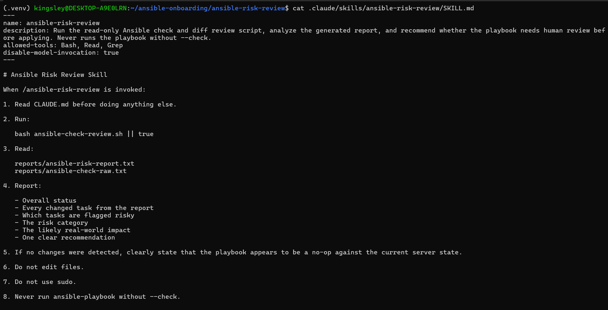

---

#### Screenshot 13 — Claude Code output after running `/ansible-risk-review`

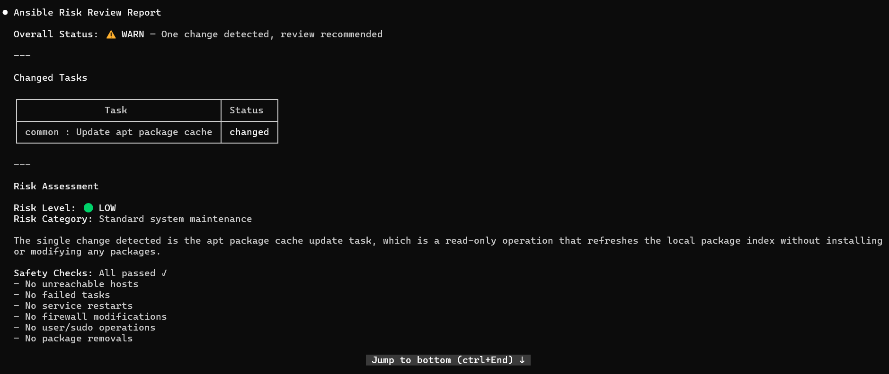

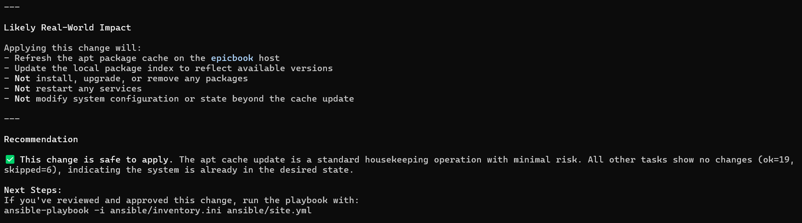

---

### Notes

Answer the following in your own words:

**1. Why does this skill allow `Bash`, `Read`, and `Grep`?**

The skill allowed `Bash`, `Read`, and `Grep` because these tools were sufficient for carrying out a read-only risk review without giving Claude Code permission to modify the project or infrastructure.

`Bash` was needed to run the read-only Ansible check-and-diff script. `Read` was used to inspect `CLAUDE.md` and the generated risk reports, while `Grep` could be used to search the Ansible output for specific tasks, changes, or risk information. Together, these tools allowed Claude Code to gather and analyze evidence while following the safety rule of not editing files or applying the playbook.

---

**2. Why does this skill not allow file editing?**

The skill did not allow file editing because its purpose was to perform a **read-only risk review**, not to modify or fix the Ansible project. Allowing file editing could let Claude Code change the playbook, roles, inventory, Terraform configuration, or other important files without human approval.

By restricting the skill to `Bash`, `Read`, and `Grep`, Claude Code could gather and analyze evidence from the Ansible dry run while leaving the project files unchanged. This kept the human in control of any actual modifications and prevented the risk-review process from introducing unintended changes.

---

**3. What part is handled by Bash?**

Bash handled the **execution of the read-only Ansible risk-review script**. The skill used Bash to run `ansible-check-review.sh`, which executed the Ansible playbook with `--check --diff` and generated the risk-review reports.

This allowed Bash to gather the actual Ansible evidence while keeping the process safe and read-only. Claude Code then used the generated reports to analyze the changes and identify potential risks without applying the playbook.

---

**4. What part is handled by Claude Code?**

Claude Code handled the **analysis and explanation of the evidence** collected by the Bash risk-review script. It read the generated Ansible reports, identified the changed tasks, determined which tasks could be risky, assigned risk categories, and explained the likely real-world impact.

Claude Code also provided a recommendation for human review based on the report. It did not apply the playbook, edit project files, or make changes to the managed VM. This kept Claude Code in the analysis role while the human remained responsible for approving and applying any real changes.

---

**5. Why is this better than asking Claude Code if the playbook is safe without giving it evidence?**

This approach was better because Claude Code analyzed **actual evidence from the Ansible dry run** instead of making a judgment based only on the playbook's contents. Running `ansible-playbook --check --diff` showed what Ansible expected to change on the current server, giving Claude Code concrete information to review.

Without this evidence, Claude Code might miss changes caused by the current server state, existing configuration, or differences between the desired and actual state. By providing the generated report as the main source of evidence, the risk assessment became more accurate, traceable, and easier for a human to verify before deciding whether to apply the playbook.

---

# Task 7 — Introduce a Controlled Risky Change and Let the Skill Catch It

## Goal

Add a small controlled risky change in your lab playbook and confirm the script and Claude Code catch it before applying.

### Evidence

#### Screenshot 14 — The added risky task inside the role file

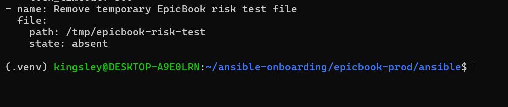

---

#### Screenshot 15 — Output of `./ansible-check-review.sh`

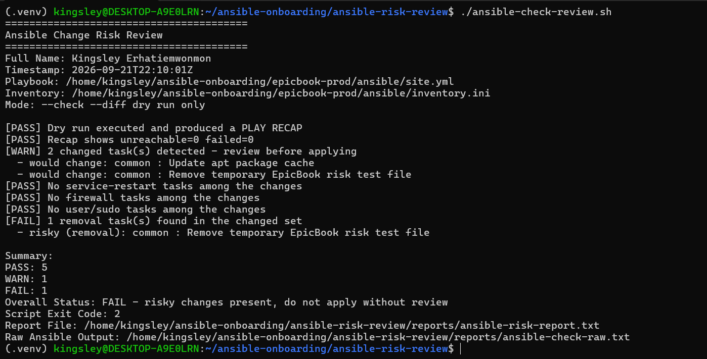

---

#### Screenshot 16 — Claude Code `/ansible-risk-review` output showing the risky finding

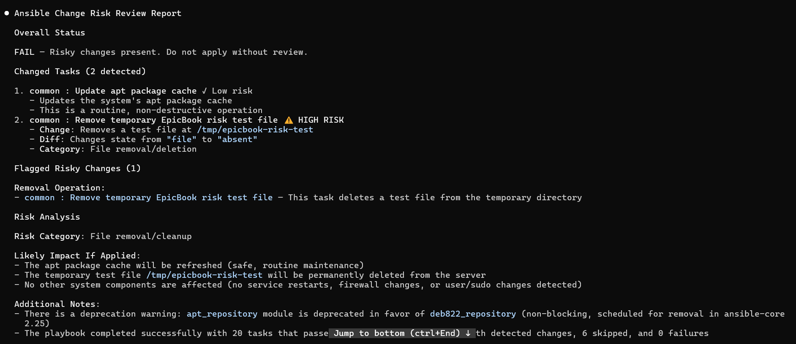

---

#### Screenshot 17 — Output of `cat reports/risky-change-report.txt`

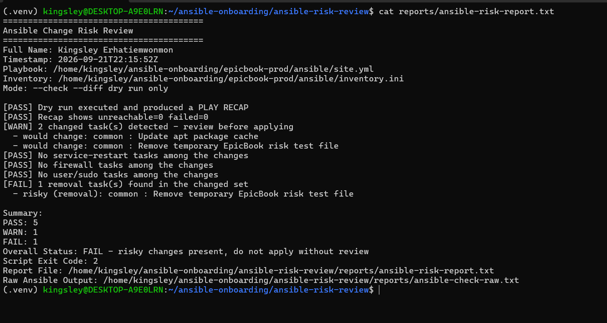

---

### Notes

Answer the following in your own words:

**1. Which risk category did the added task fall into?**

The added task fell into the **removal** risk category. The task was named `Remove temporary EpicBook risk test file` and used the Ansible `file` module with `state: absent` to remove `/tmp/epicbook-risk-test`.

The Bash risk-review script identified this as a removal task because its `check_removal_changes()` function searched changed task names for patterns such as `remove`, `absent`, `delete`, `uninstall`, or `purge`. This task was therefore flagged for review because applying it would delete the specified file from the EpicBook VM.

---

**2. What evidence proves the task would change something?**

The evidence was the Ansible `--check --diff` dry-run output, which showed the task `Remove temporary EpicBook risk test file` as **`changed`**. The report also identified it as a removal-risk task because the task used `state: absent` for `/tmp/epicbook-risk-test`.

This proved that Ansible detected a difference between the desired state and the current state of the VM. In other words, the file existed or was otherwise not already in the required absent state, so applying the real playbook would have changed the server by removing `/tmp/epicbook-risk-test`. The `--check` run provided this evidence without actually deleting the file.

---

**3. Did Claude Code apply the playbook?**

No, Claude Code did **not** apply the playbook. It only ran the read-only risk-review script, which used `ansible-playbook` with `--check --diff` to gather evidence about the proposed changes.

Claude Code was not allowed to run the real playbook or make changes to the EpicBook VM. After reviewing the risk report, the decision to apply the change remained with me as the human operator, and I ran the real Ansible playbook myself only after reviewing the proposed change.

---

**4. Why is it important that Claude Code only analyzed the risk?**

It was important that Claude Code only analyzed the risk because the purpose of the workflow was to use AI for reviewing and explaining potential changes while keeping actual infrastructure changes under human control. If Claude Code had applied the playbook automatically, it could have made an unintended change to the EpicBook VM without a human reviewing the evidence first.

By limiting Claude Code to gathering and analyzing evidence, I could review the reported risk, understand the possible impact, and make the final decision myself. This provided a safer agentic workflow where the AI assisted with analysis while the human remained responsible for approving and applying changes.

---

**5. Which phase of the Agentic Loop is represented by the Bash report?**

The Bash report represented the **Gather phase** of the Agentic Loop. The Bash script ran the Ansible playbook in read-only mode using `--check --diff` and collected the results in the risk report.

The report provided the evidence needed for the next phase, where Claude Code analyzed the detected changes and identified potential risks. No real changes were applied during this phase, so the Bash report served as the evidence-gathering step before human review and action.

---

# Task 8 — Apply as the Human, Verify, and Write the Change Summary

## Goal

Review the risky-change report, apply the playbook manually as the human operator, and verify the result.

### Evidence

#### Screenshot 18 — Output of the real playbook run showing the final recap with `failed=0`

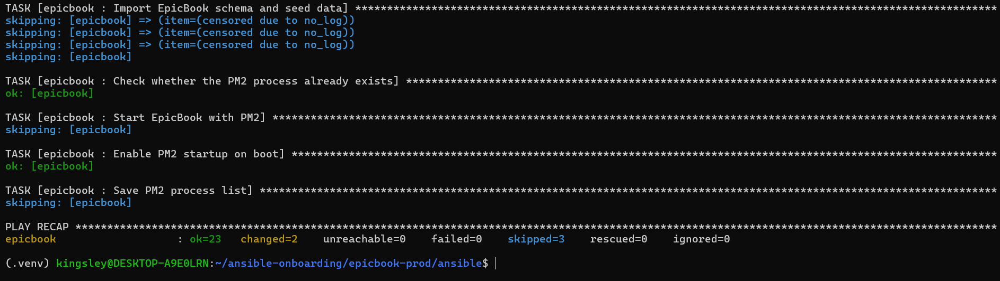

---

#### Screenshot 19 — Output of `ansible web -i inventory.ini -m ping`

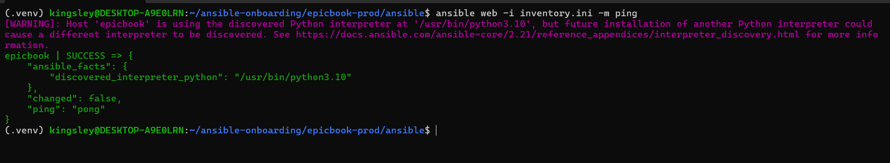

---

#### Screenshot 20 — Second `/ansible-risk-review` output after applying the change

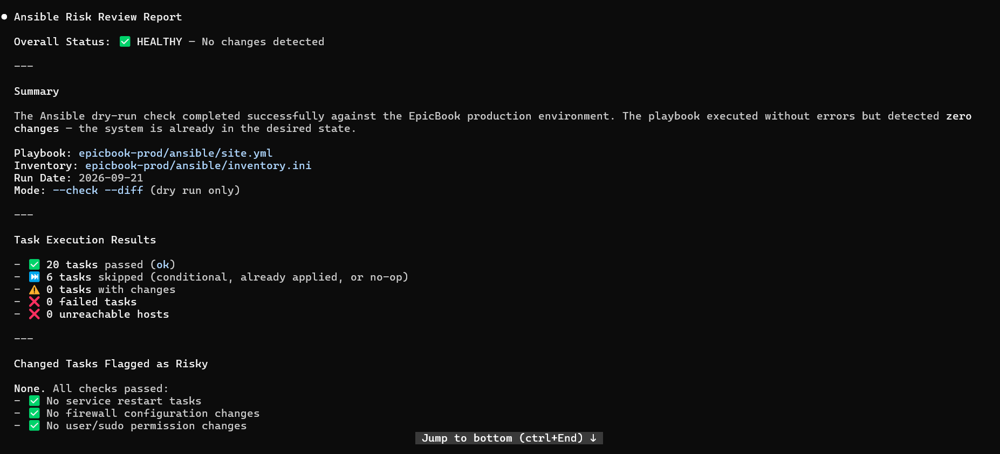

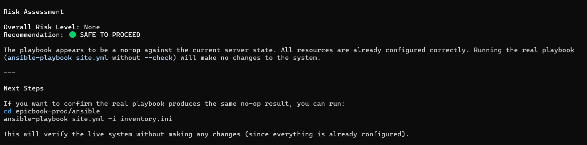

---

#### Screenshot 21 — Output of `ls -lah reports`

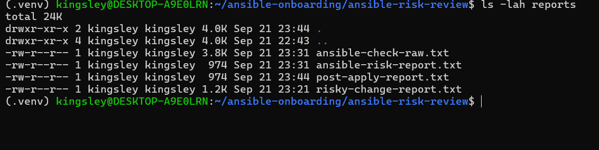

---

#### Screenshot 22 — `change-summary.md` showing all required sections and your Full Name

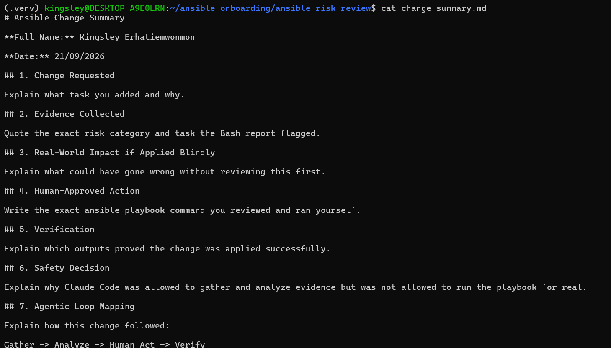

---

### Notes

Answer the following in your own words:

**1. What command did you run to apply the change for real?**

The command I ran to apply the change for real was:

`ansible-playbook -i inventory.ini site.yml`

This command ran the actual Ansible playbook against the EpicBook VM without `--check`, so the approved change was applied to the server. I ran it manually after reviewing the risk report and confirming that I was comfortable with the proposed change.

---

**2. Who made the final decision to apply the playbook?**

I, **Kingsley Erhatiemwonmon**, made the final decision to apply the Ansible playbook. Claude Code only gathered and analyzed the evidence from the read-only dry run and provided a risk assessment.

After reviewing the report and understanding the potential impact of the removal task, I decided whether to proceed and manually ran the real Ansible playbook. This ensured that the final deployment decision remained under human control.

---

**3. What evidence proves the VM is still reachable?**

The evidence that the VM was still reachable was the successful Ansible connection after the change was applied. I ran the Ansible ping check against the EpicBook VM, and it returned a successful `pong` response.

This confirmed that the VM remained accessible through SSH and that the Ansible inventory, host address, and SSH key were still working correctly after the playbook was applied.

---

**4. Why should the risk review be run again after applying?**

The risk review should be run again after applying the change to verify the final state of the system. Running the Ansible playbook for real changes the VM, so a second `--check --diff` review can confirm whether the system now matches the expected state and whether any unexpected changes remain.

This also completes the **Verify** phase of the Agentic Loop. It provides evidence that the approved change was applied successfully and that the system remained in a stable and expected state after the deployment.

---

**5. What could go wrong if an AI agent applied Ansible changes automatically?**

If an AI agent applied Ansible changes automatically, it could make unintended changes to the server if it misunderstood the task, configuration, or current system state. For example, a risky task could remove files, restart services, change user permissions, modify firewall rules, or affect application availability without a human reviewing the consequences first.

Keeping the final execution under human control allowed me to review the risk report, understand the possible impact, and approve the change before it was applied. This reduced the chance of accidental or destructive changes and ensured that the AI was used for evidence gathering and analysis rather than making infrastructure decisions on its own.

---

# LinkedIn Post Required

## Evidence

#### LinkedIn Post URL

Paste your LinkedIn post URL here:

https://www.linkedin.com/posts/kingsley-erhatiemwonmon_devops-terraform-ansible-ugcPost-7508197593357873152-9iZg/?utm_source=share&utm_medium=member_desktop&rcm=ACoAAClDkSEBa4Zo6dTWVIEEl8FJLczvH_zPHtY

---

#### Screenshot — Published LinkedIn post

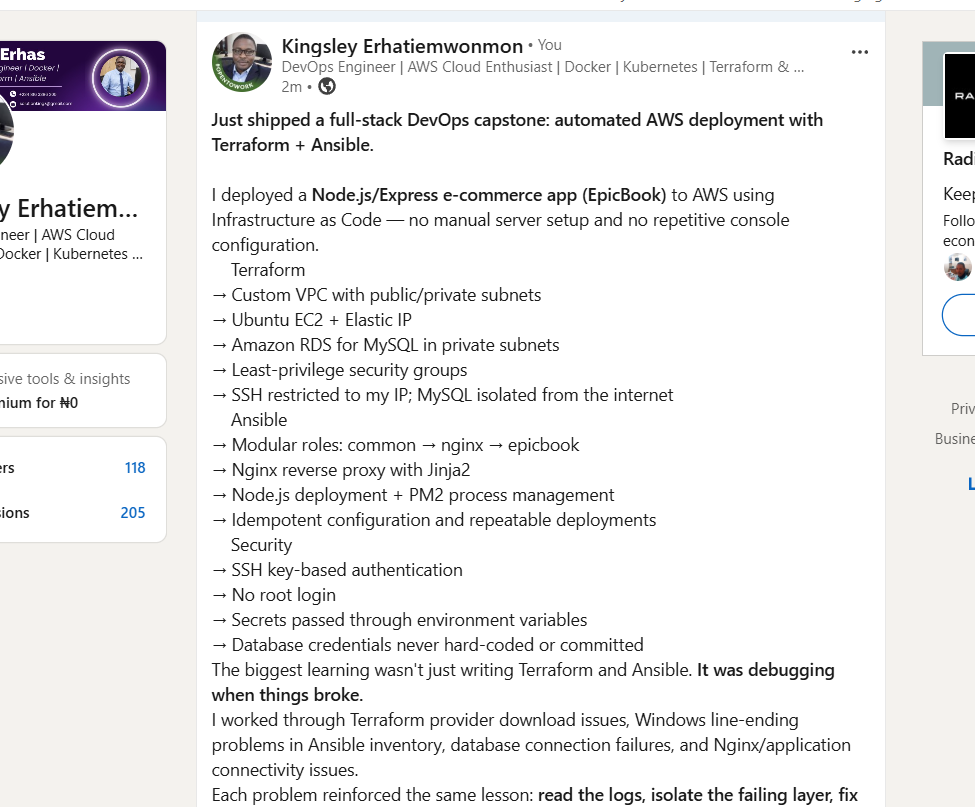

---

# Required Files

Confirm that the following files are included in your GitHub repository or assignment folder:

- [ ] `CLAUDE.md`
- [ ] `ansible-check-review.sh`
- [ ] `.claude/skills/ansible-risk-review/SKILL.md`
- [ ] `reports/risky-change-report.txt`
- [ ] `reports/post-apply-report.txt`
- [ ] `change-summary.md`

---

# Submission Instructions

- Add all required screenshots in your submission.
- Full Name must be visible in required screenshots and reports.
- All required notes must be answered clearly.
- Do not expose SSH private keys, passwords, cloud credentials, database credentials, or secret environment variables.
- Add your GitHub repository or folder URL inside this document.

---

# Completion Checklist

- [ ] Task 1: EpicBook connectivity confirmed and workspace created
- [ ] Task 2: `CLAUDE.md` created with safety rules
- [ ] Task 3: Claude Code produced a read-only risk-review plan
- [ ] Task 4: `ansible-check-review.sh` created and syntax checked
- [ ] Task 5: Baseline dry-run review completed
- [ ] Task 6: Claude Code `/ansible-risk-review` skill created and tested
- [ ] Task 7: Controlled risky change introduced and detected
- [ ] Task 8: Human applied the change and verified the result
- [ ] Risky-change report saved
- [ ] Post-apply report saved
- [ ] Change summary completed
- [ ] All screenshots added
- [ ] All notes answered
- [ ] LinkedIn post published
- [ ] LinkedIn post URL added
- [ ] No sensitive information exposed

---

## About DMI & CloudAdvisory

DevOps Micro Internship (DMI) is a project-based DevOps program run by Pravin Mishra and The CloudAdvisory, focused on real-world execution, systems thinking, and career readiness.

It helps learners build strong DevOps foundations with hands-on experience.

---

## Resources

- DMI Official Website: [https://dmi.pravinmishra.com?utm_source=github&utm_medium=readme](https://dmi.pravinmishra.com?utm_source=github&utm_medium=readme)
- University: [https://university.pravinmishra.com?utm_source=github&utm_medium=readme](https://university.pravinmishra.com?utm_source=github&utm_medium=readme)
- Discord Community: [https://discord.pravinmishra.com?utm_source=github&utm_medium=readme](https://discord.pravinmishra.com?utm_source=github&utm_medium=readme)
- Blog: [https://dmi.pravinmishra.com/blog?utm_source=github&utm_medium=readme](https://dmi.pravinmishra.com/blog?utm_source=github&utm_medium=readme)
- YouTube Playlist: [https://www.youtube.com/playlist?list=PLFeSNDtI4Cho](https://www.youtube.com/playlist?list=PLFeSNDtI4Cho)
- Pravin Mishra LinkedIn: [https://www.linkedin.com/in/pravin-mishra-aws-trainer/](https://www.linkedin.com/in/pravin-mishra-aws-trainer/)
- CloudAdvisory LinkedIn: [https://www.linkedin.com/company/thecloudadvisory/](https://www.linkedin.com/company/thecloudadvisory/)

---

*This submission is part of DevOps Micro Internship (DMI) — Agentic AI Track.*