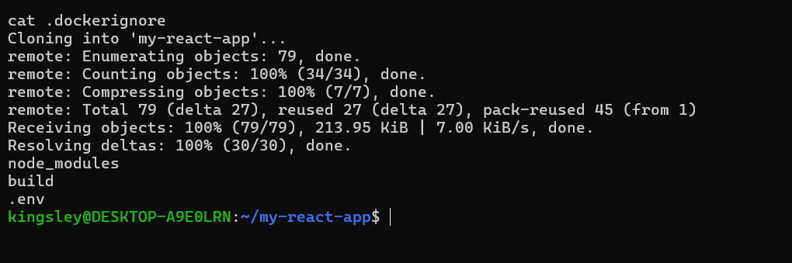
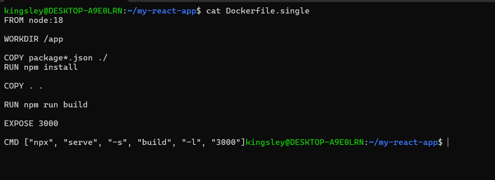
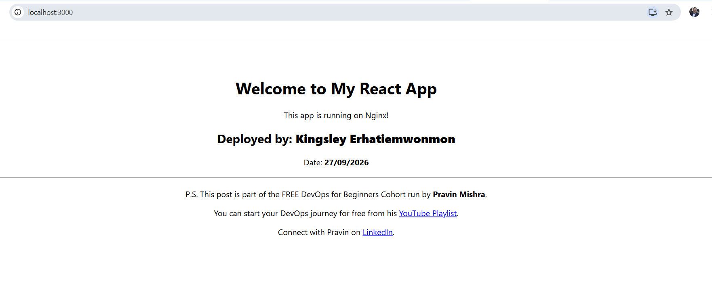
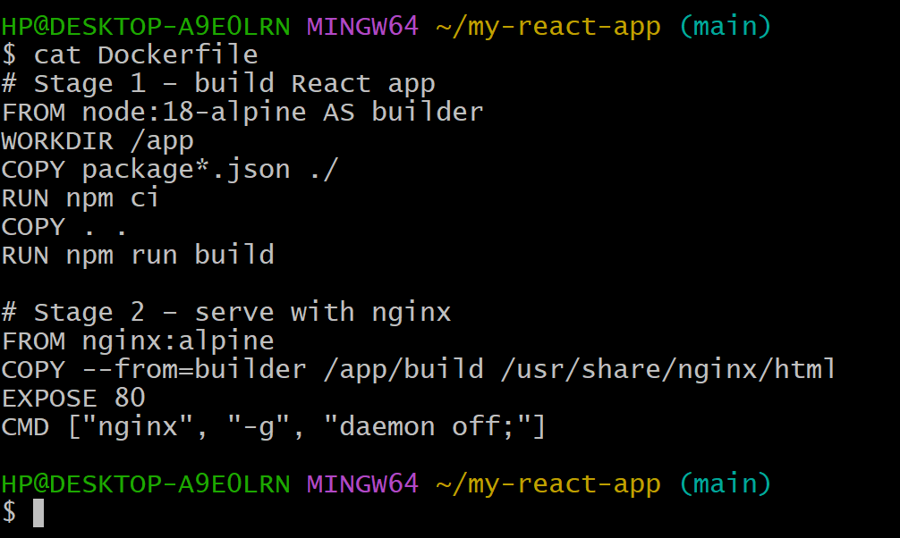
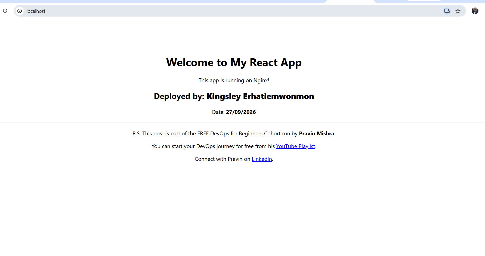
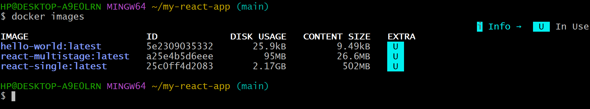
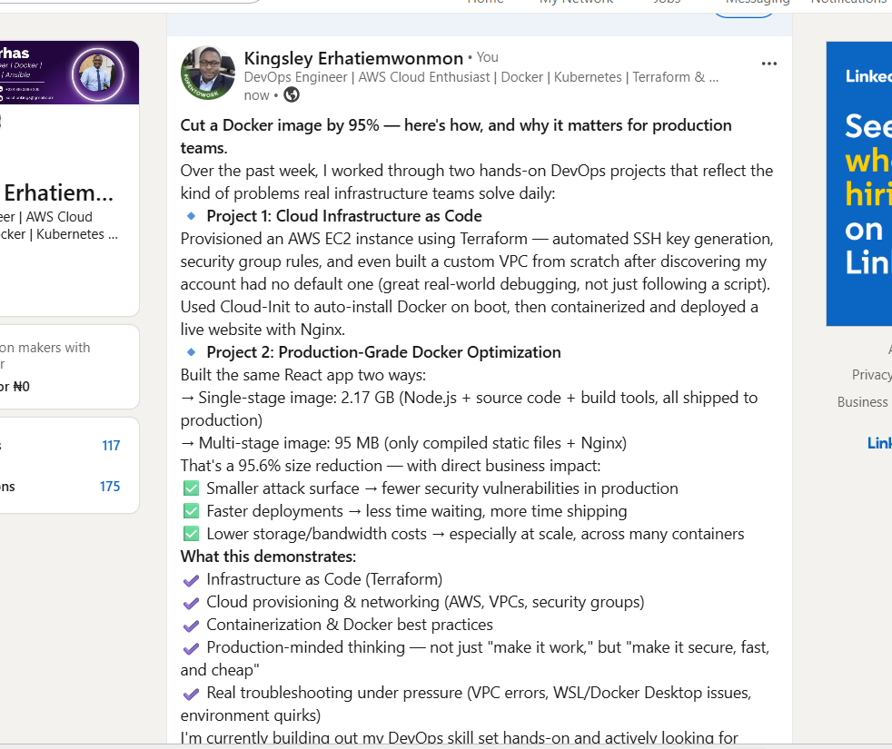

# Assignment 2 — Multi-Stage Docker Build for a React Application

Part of the DevOps Micro Internship (DMI) with Agentic AI

---

## Purpose

In this assignment, you will build both a single-stage and an optimized multi-stage Docker image for a React application, compare the resulting image sizes, and deploy the optimized version using a production-ready Nginx runtime container.

Complete this assignment locally on your own computer where Docker is installed and running.

---

# Task 1 — Prepare the Project

## Goal

Prepare the React application for Docker image creation.

### Evidence

#### Screenshot 1 — Contents of the `.dockerignore` File

Add a screenshot of the terminal showing:

```bash
cat .dockerignore
```

The file must exclude `node_modules`, `build`, and `.env`.



---

# Task 2 — Create a Single-Stage Docker Image

## Goal

Create a baseline single-stage Docker image and run the application on port 3000.

### Evidence

#### Screenshot 2 — Contents of `Dockerfile.single`

Add a screenshot showing the completed `Dockerfile.single`.



---

#### Screenshot 3 — Single-Stage Application in Browser

Add a screenshot of the browser showing the application at:

```text
http://localhost:3000
```

Ensure that your full name is visible in the application.



---

# Task 3 — Create a Multi-Stage Docker Build

## Goal

Create an optimized multi-stage Docker image with separate builder and Nginx runtime stages, then run the application on port 80.

### Evidence

#### Screenshot 4 — Contents of the Multi-Stage Dockerfile

Add a screenshot showing the completed multi-stage `Dockerfile`.



---

#### Screenshot 5 — Multi-Stage Application in Browser

Add a screenshot of the browser showing the application at:

```text
http://localhost
```

Ensure that your full name is visible in the application.



---

# Task 4 — Compare Docker Image Sizes

## Goal

Compare the single-stage and multi-stage image sizes and calculate the percentage reduction.

### Evidence

#### Screenshot 6 — Docker Image Size Comparison

Add a screenshot of the terminal showing:

```bash
docker images
```

The output must include both:

```text
react-single:latest
react-multistage:latest
```



---

### Percentage Reduction Calculation

Record the image sizes and calculate the reduction using the same unit for both images.

```text
Single-stage image size: Add size here

Multi-stage image size: Add size here

Percentage reduction =
((Single-stage image size − Multi-stage image size)
÷ Single-stage image size) × 100

Percentage reduction: The single-stage image came out to 2.17 GB, while the multi-stage image was only 95 MB — a reduction of approximately 95.6%. This is because the single-stage build keeps Node.js, all node_modules, and the full application source code in the final image, while the multi-stage build discards the entire build environment and keeps only the compiled static files served by nginx:alpine. A smaller runtime image also improves security by shrinking the attack surface — there's no Node.js runtime, package manager, or source code present for an attacker to exploit, only a minimal Nginx server and static assets. Smaller images also pull and deploy significantly faster, which matters at scale when spinning up multiple containers or deploying frequently. For build-caching, I ordered COPY package*.json ./ and RUN npm ci before COPY . ., so Docker only re-runs the dependency install step when package.json actually changes, rather than on every source code edit.
```

---

# Task 5 — Analyze the Optimization Results

## Goal

Evaluate the advantages of using multi-stage Docker builds.

### Notes

Write a short analysis of 5–8 lines covering:

- The single-stage and multi-stage image sizes
- The percentage reduction in image size
- Security benefits of the smaller runtime image
- How a smaller runtime image reduces the attack surface
- How smaller images improve image pull and deployment speed
- One Docker build-caching optimization you used

Multi-stage Docker builds delivered a substantial reduction in image size: the single-stage image came out to 2.17 GB, while the multi-stage image was only 95 MB, a reduction of approximately 95.6%. This is because the single-stage build keeps Node.js, all node_modules, and the full application source code in the final image, whereas the multi-stage build discards the build environment and keeps only the compiled static files served by nginx:alpine. The smaller runtime image also improves security by shrinking the attack surface: with no Node.js runtime, package manager, or source code present, an attacker has only a minimal Nginx server and static assets to target, and there are fewer packages that could contain unpatched vulnerabilities. Smaller images also pull and deploy significantly faster, which matters at scale when spinning up multiple containers or deploying frequently, since less data is transferred over the network and less storage is used on each host. For build caching, I ordered COPY package*.json ./ and RUN npm ci before COPY . ., so Docker only re-runs the dependency install step when package.json actually changes, rather than on every source code edit.

---

# Task 6 — Explore Additional Production Optimizations (Optional)

## Goal

Explore one or more additional production optimization techniques.

### Optional Work

You may choose to:

- Configure an Nginx health check
- Configure cache headers for static assets
- Experiment with a lighter runtime image
- Compare the resulting image size with your original multi-stage image

Screenshots are optional.

---

# LinkedIn Requirement

## Goal

Create a LinkedIn post describing what you built, what a multi-stage Docker build is, the image-size reduction achieved, and key learnings from the assignment.

### Evidence

#### LinkedIn Post URL

Paste your LinkedIn post URL here:

https://www.linkedin.com/posts/kingsley-erhatiemwonmon_devops-cloudengineer-cloudcomputing-ugcPost-7510113724729454592-pp_N/?utm_source=share&utm_medium=member_desktop&rcm=ACoAAClDkSEBa4Zo6dTWVIEEl8FJLczvH_zPHtY

---

#### LinkedIn Post Screenshot



---

# Submission Instructions

- Complete all required tasks in sequence.
- Include Screenshots 1–6 exactly as specified.
- Include the percentage-reduction calculation and Task 5 analysis.
- Include the LinkedIn post URL and screenshot.
- Ensure that your full name is visible in all required screenshots.
- Do not expose passwords, keys, tokens, account IDs, or other sensitive information.

---

# Completion Checklist

- [ ] Assignment completed locally
- [ ] `.dockerignore` created and verified (Screenshot 1)
- [ ] `Dockerfile.single` created (Screenshot 2)
- [ ] Single-stage container verified in the browser (Screenshot 3)
- [ ] Multi-stage `Dockerfile` created (Screenshot 4)
- [ ] Multi-stage container verified in the browser (Screenshot 5)
- [ ] Both Docker image sizes captured (Screenshot 6)
- [ ] Percentage reduction calculated
- [ ] Optimization analysis completed
- [ ] LinkedIn post URL and screenshot included
- [ ] Full name visible in all required screenshots
- [ ] No sensitive information exposed

---

## About DMI & CloudAdvisory

DevOps Micro Internship (DMI) is a project-based DevOps program run by Pravin Mishra (The CloudAdvisory), focused on real-world execution, systems thinking, and career readiness.

It helps learners build strong DevOps foundations through hands-on experience.

---

## 📌 About DMI & CloudAdvisory

DevOps Micro Internship (DMI) is a project-based DevOps program run by Pravin Mishra (The CloudAdvisory) focused on real-world execution, systems thinking, and career readiness.

It helps learners build strong DevOps foundations with hands-on experience.

---

## 📌 Resources

- 🌐 DMI Official Website: https://dmi.pravinmishra.com?utm_source=github&utm_medium=readme  
- 🎓 University: https://university.pravinmishra.com?utm_source=github&utm_medium=readme  
- 💬 Discord Community: https://discord.pravinmishra.com?utm_source=github&utm_medium=readme  
- 📝 Blog: https://dmi.pravinmishra.com/blog?utm_source=github&utm_medium=readme  
- ▶️ YouTube Playlist: https://www.youtube.com/playlist?list=PLFeSNDtI4Cho  
- 🔗 Pravin Mishra (LinkedIn): https://www.linkedin.com/in/pravin-mishra-aws-trainer/  
- 🏢 CloudAdvisory (LinkedIn): https://www.linkedin.com/company/thecloudadvisory/

---

*This submission is part of DevOps Micro Internship (DMI) — Agentic AI Track.*
