# Assignment 4 — Docker Volumes and Bind Mounts

Part of the DevOps Micro Internship (DMI) with Agentic AI

---

## Purpose

In this assignment, you will use Docker Bind Mounts and Docker Volumes to persist logs and application data outside a container’s lifecycle. You will verify that data remains available after containers are removed and recreated.

---

# Task 1 — Persist Nginx Logs Using a Bind Mount

## Goal

Deploy an Nginx container with a Bind Mount and verify that its log files remain on the VM host after the container is removed.

### Evidence

#### Screenshot 1 — Nginx Image Pull

Add a screenshot of the terminal showing successful completion of:

```bash
docker pull nginx:alpine
```

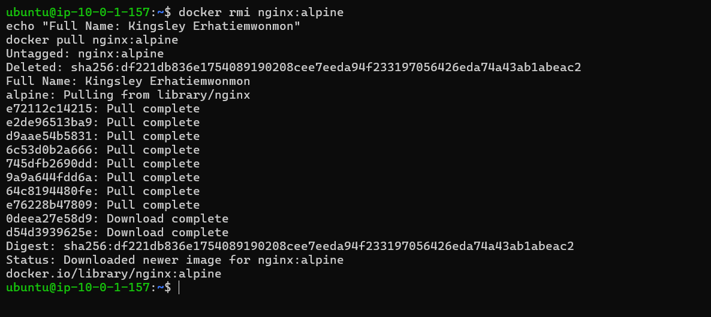

---

#### Screenshot 2 — Host Log Directory

Add a screenshot of the terminal showing the created host directory:

```text
$HOME/nginx-logs
```

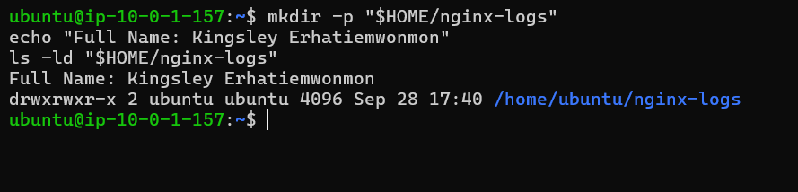

---

#### Screenshot 3 — Running Nginx Container with Port Mapping

Add a screenshot of the terminal showing:

```bash
docker ps
```

The output must show the `myweb` container with:

```text
0.0.0.0:80->80/tcp
```

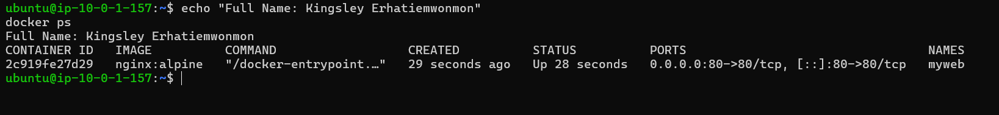

---

#### Screenshot 4 — Nginx Welcome Page

Add a browser screenshot showing the Nginx Welcome Page at:

```text
http://<YOUR-VM-PUBLIC-IP>
```

Ensure that the VM public IP is visible in the address bar. Add your full name as a clear caption directly below the screenshot.

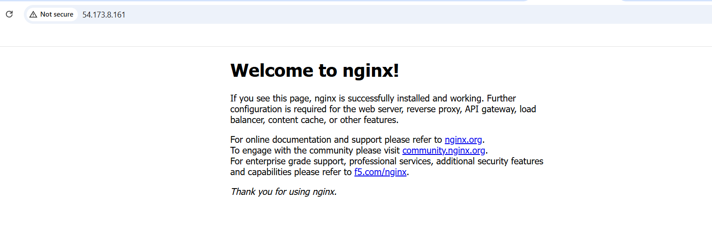

---

#### Screenshot 5 — Bind-Mounted Log Files

Add a screenshot of the terminal showing the host log files and access-log content from:

```text
$HOME/nginx-logs
```

The output must show `access.log`, `error.log`, and an access-log entry created when you opened the Nginx page.

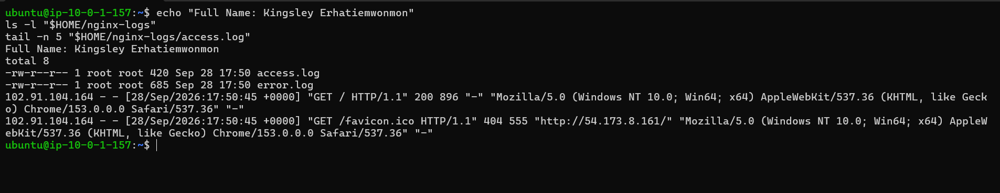

---

#### Screenshot 6 — Nginx Container Removed

Add a screenshot of the terminal showing successful completion of:

```bash
docker stop myweb
docker rm myweb
```

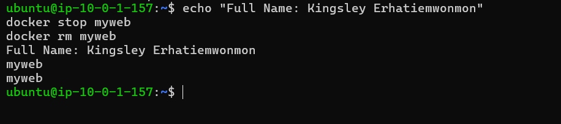

---

#### Screenshot 7 — Logs Persist After Container Removal

Add a screenshot of the terminal showing that `access.log` and `error.log` still exist in:

```text
$HOME/nginx-logs
```

The access log must retain its content after the container has been removed.

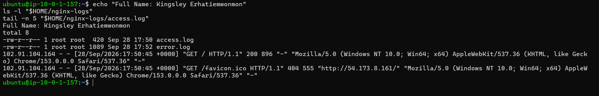

---

# Task 2 — Share Persistent Data Using a Docker Volume

## Goal

Deploy backend and frontend containers that share data through a named Docker Volume. Verify that the data remains after both containers are removed and recreated.

### Evidence

#### Screenshot 8 — Project File Structure

Add a screenshot of the terminal showing the `two-tier-app` project structure, including separate `backend` and `frontend` directories with a `Dockerfile` and `index.js` file in each.

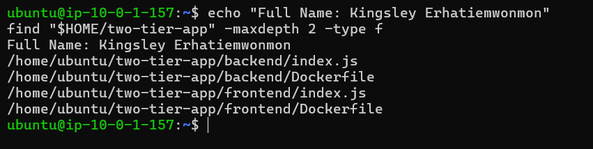

---

#### Screenshot 9 — Custom Docker Network

Add a screenshot of the terminal showing `mynetwork` in:

```bash
docker network ls
```

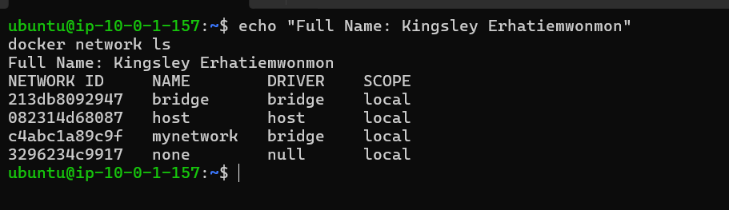

---

#### Screenshot 10 — Docker Volume

Add a screenshot of the terminal showing `shared-data` in:

```bash
docker volume ls
```

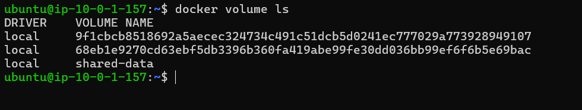

---

#### Screenshot 11 — Backend Dockerfile

Add a screenshot of the terminal showing the completed backend `Dockerfile`.

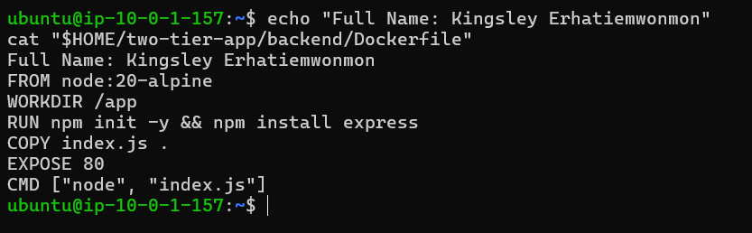

---

#### Screenshot 12 — Backend Image Build

Add a screenshot of the terminal showing successful completion of the `backend-app:latest` image build.

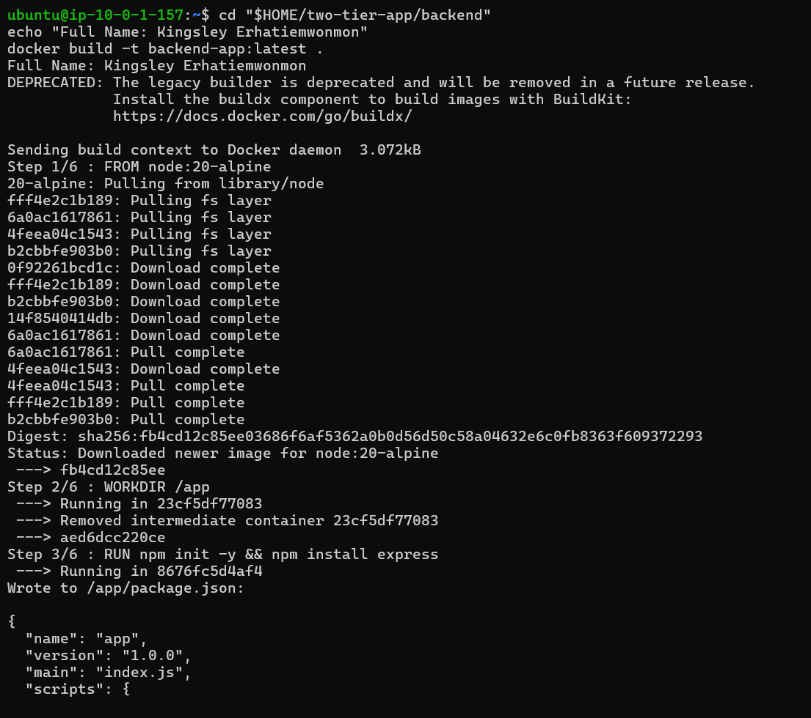

---

#### Screenshot 13 — Running Backend Container

Add a screenshot of the terminal showing:

```bash
docker ps
```

The output must show the running `backend` container.

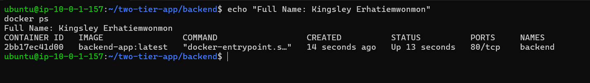

---

#### Screenshot 14 — Frontend Dockerfile

Add a screenshot of the terminal showing the completed frontend `Dockerfile`.

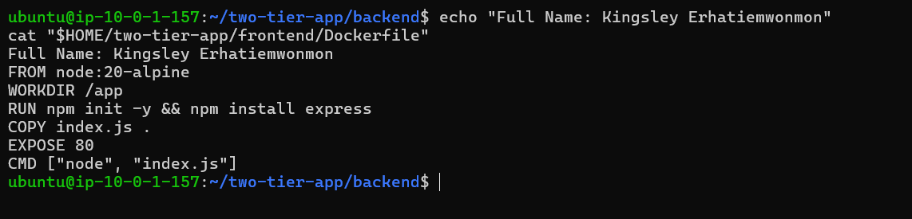

---

#### Screenshot 15 — Frontend Image Build

Add a screenshot of the terminal showing successful completion of the `frontend-app:latest` image build.

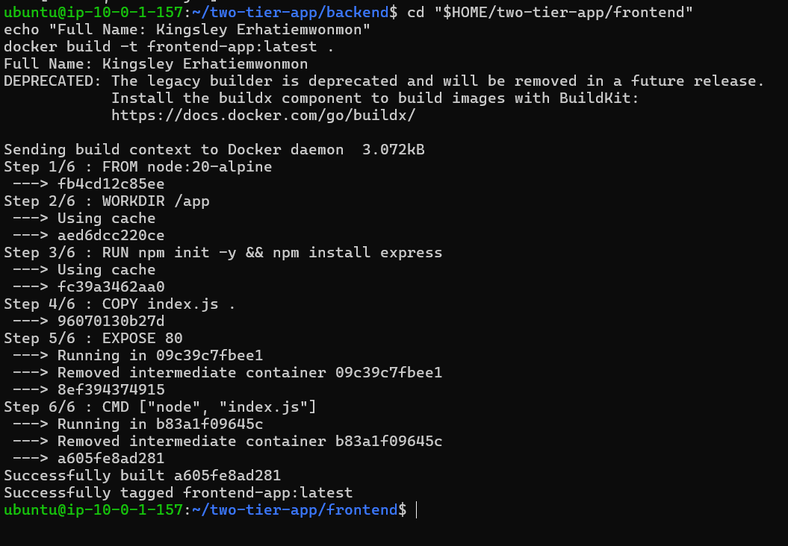

---

#### Screenshot 16 — Running Backend and Frontend Containers

Add a screenshot of the terminal showing:

```bash
docker ps
```

The output must show both `backend` and `frontend` containers running. Only `frontend` must have the published port mapping:

```text
0.0.0.0:80->80/tcp
```

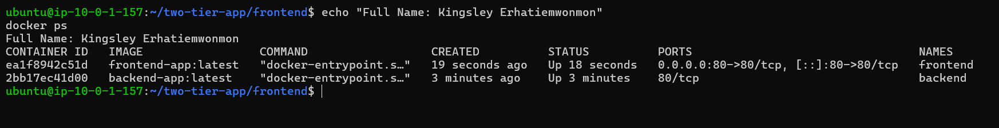

---

#### Screenshot 17 — Backend Write Operation

Add a screenshot of the terminal showing a successful backend write operation to the shared Docker Volume.

The output must include:

```text
Data written: Hello from Backend!
```

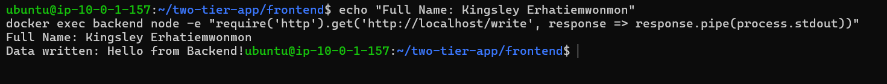

---

#### Screenshot 18 — Frontend Reads Shared Data

Add a browser screenshot showing:

```text
Hello from Backend!
```

Add your full name as a clear caption directly below the screenshot.

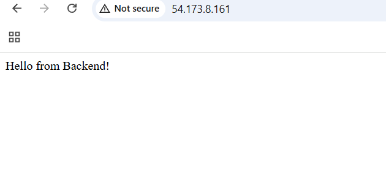

---

#### Screenshot 19 — First Shared-Data Update

Add a browser screenshot showing:

```text
Test Data 1
```

Add your full name as a clear caption directly below the screenshot.

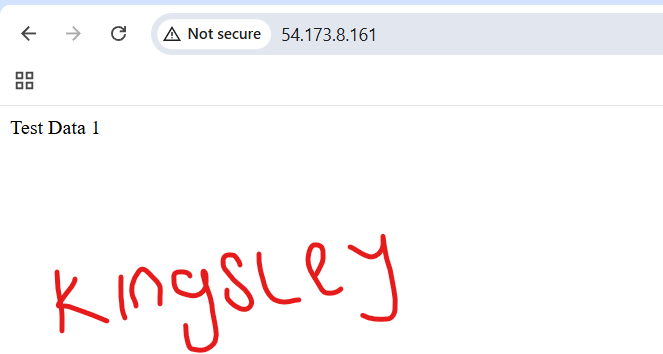

---

#### Screenshot 20 — Second Shared-Data Update

Add a browser screenshot showing:

```text
Test Data 2 - New Update
```

Add your full name as a clear caption directly below the screenshot.

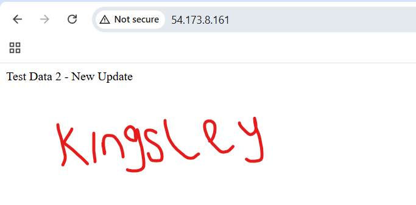

---

#### Screenshot 21 — Container Removal and Recreation

Add a screenshot of the terminal showing the `frontend` and `backend` containers removed and recreated using the same `shared-data` Docker Volume.

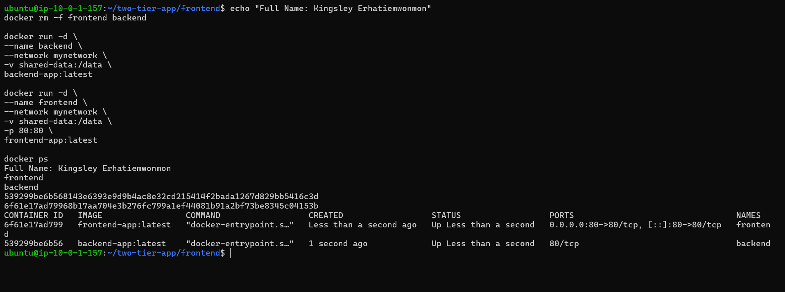

---

#### Screenshot 22 — Data Persists After Recreation

Add a browser screenshot showing:

```text
Test Data 2 - New Update
```

This proves that the `shared-data` Docker Volume outlived both application containers.

Add your full name as a clear caption directly below the screenshot.

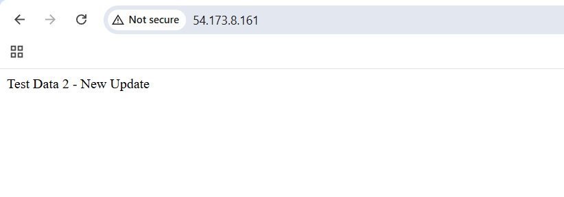

---

# Storage Persistence Notes

Write a short explanation covering:

- The difference between a Bind Mount and a Docker Volume
- How Task 1 proved Bind Mount persistence
- How Task 2 proved Docker Volume persistence
- Why Docker Volumes are commonly used for application data

Bind Mount vs. Docker Volume

A Bind Mount maps a specific directory on the host machine directly into a container. I choose the exact host path (in this assignment, $HOME/nginx-logs), and the container reads and writes to that location. The data lives in a normal folder on the host that I manage myself.

A Docker Volume is storage created and managed by Docker itself. Docker decides where the data is kept on the host (under /var/lib/docker/volumes/), and I refer to it by name (in this assignment, shared-data). Volumes can be created, inspected, and removed with Docker commands, and they don't depend on the host's directory layout.

How Task 1 Proved Bind Mount Persistence

I ran an Nginx container named myweb with $HOME/nginx-logs mounted to /var/log/nginx. After I opened the server's public IP in a browser, Nginx wrote access.log and error.log to the host directory, and the access log recorded my request. I then stopped and removed the container with docker stop myweb and docker rm myweb. When I checked $HOME/nginx-logs afterward, both log files were still there and the access log still contained the same request entries. This showed that the data was stored on the host, outside the container's lifecycle.

How Task 2 Proved Docker Volume Persistence

I created a Docker Volume named shared-data and mounted it at /data in both a backend and a frontend container. The backend wrote a message to /data/message.txt, and the frontend read and displayed it in the browser, first as "Hello from Backend!" and later as "Test Data 1" and "Test Data 2 - New Update" after I updated the file. This showed that two containers can share data through one volume. I then removed both containers and recreated them with the same volume attached. The browser still displayed "Test Data 2 - New Update", which proved the data lived in the volume rather than in either container.

Why Docker Volumes Are Commonly Used for Application Data

Docker Volumes are the preferred choice for application data for several reasons:

Managed by Docker: They are created, listed, inspected, and removed with Docker commands, so they are easy to manage and back up.
Independent of host layout: They don't rely on a specific host folder path, which makes applications more portable between machines and environments.
Safer isolation: Containers only access the volume they are given, rather than arbitrary host directories.
Easy sharing: Multiple containers can mount the same volume, as the frontend and backend did in Task 2.
Survive container removal: The data remains after containers are deleted or replaced, which allows updating, redeploying, or recreating containers without losing data such as databases and uploaded files.

Bind Mounts are still useful when the host needs direct access to the files, such as reading logs or editing source code during development. Volumes are the better fit for data that the application owns and must preserve.

---

# Public Application URL

**Application URL:** http://54.173.8.161/

---

# LinkedIn Requirement

## Goal

Create a LinkedIn post about Docker Volumes and Bind Mounts, including one difference between them, how you verified persistent storage, and your key learning outcomes.

### Evidence

#### LinkedIn Post URL

Paste your LinkedIn post URL here:

https://www.linkedin.com/posts/kingsley-erhatiemwonmon_docker-devops-aws-ugcPost-7510411169992536064-iP2X/?utm_source=share&utm_medium=member_desktop&rcm=ACoAAClDkSEBa4Zo6dTWVIEEl8FJLczvH_zPHtY

---

#### LinkedIn Post Screenshot

Add a screenshot of the published LinkedIn post here. Include a screenshot of the application displaying shared data.


---

# Submission Instructions

- Complete all tasks in sequence.
- Include Screenshots 1–22 exactly as specified.
- Include the Storage Persistence Notes section.
- Include the public application URL.
- Include the LinkedIn post URL and screenshot.
- Ensure that your full name is visible in all terminal screenshots.
- Add your full name as a clear caption below every browser screenshot.
- Do not expose private keys, passwords, access keys, tokens, account IDs, or other sensitive information.

---

# Completion Checklist

- [ ] Nginx image pulled successfully
- [ ] Host log directory created
- [ ] Bind Mount configured successfully
- [ ] Nginx logs remain after container removal
- [ ] Custom Docker network created
- [ ] Docker Volume created
- [ ] Backend Dockerfile and image created
- [ ] Frontend Dockerfile and image created
- [ ] Both containers mount `shared-data`
- [ ] Backend writes data to the Docker Volume
- [ ] Frontend reads the same data from the Docker Volume
- [ ] Updated data appears after browser refresh
- [ ] Data remains after frontend and backend containers are removed and recreated
- [ ] All required screenshots included
- [ ] Storage Persistence Notes completed
- [ ] Public application URL included
- [ ] LinkedIn post URL and screenshot included
- [ ] Full name visible in terminal screenshots
- [ ] Browser screenshots have full-name captions
- [ ] No sensitive information exposed

---

## 📌 About DMI & CloudAdvisory

DevOps Micro Internship (DMI) is a project-based DevOps program run by Pravin Mishra (The CloudAdvisory) focused on real-world execution, systems thinking, and career readiness.

It helps learners build strong DevOps foundations with hands-on experience.

---

## 📌 Resources

- 🌐 DMI Official Website: https://dmi.pravinmishra.com?utm_source=github&utm_medium=readme  
- 🎓 University: https://university.pravinmishra.com?utm_source=github&utm_medium=readme  
- 💬 Discord Community: https://discord.pravinmishra.com?utm_source=github&utm_medium=readme  
- 📝 Blog: https://dmi.pravinmishra.com/blog?utm_source=github&utm_medium=readme  
- ▶️ YouTube Playlist: https://www.youtube.com/playlist?list=PLFeSNDtI4Cho  
- 🔗 Pravin Mishra (LinkedIn): https://www.linkedin.com/in/pravin-mishra-aws-trainer/  
- 🏢 CloudAdvisory (LinkedIn): https://www.linkedin.com/company/thecloudadvisory/

---

*This submission is part of DevOps Micro Internship (DMI) — Agentic AI Track.*
