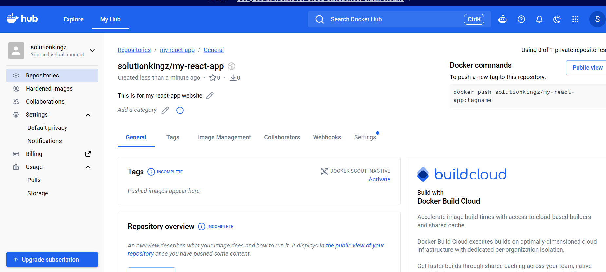
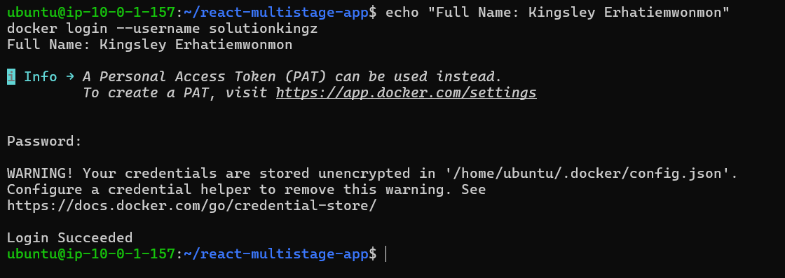
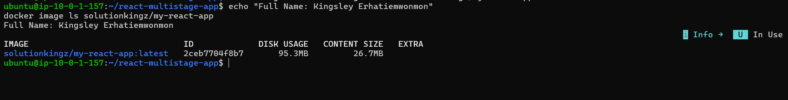
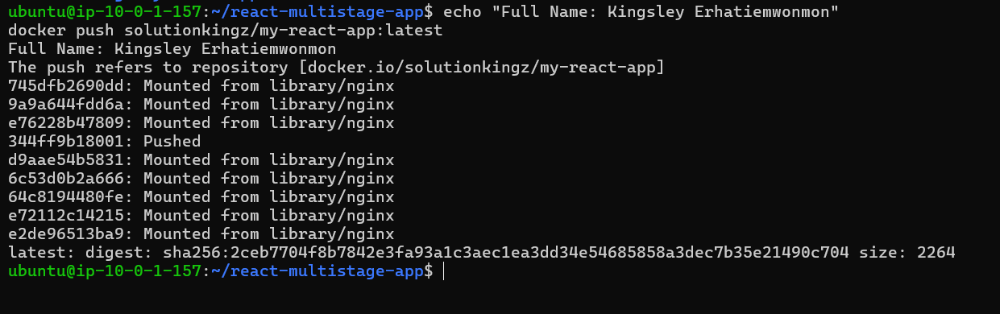
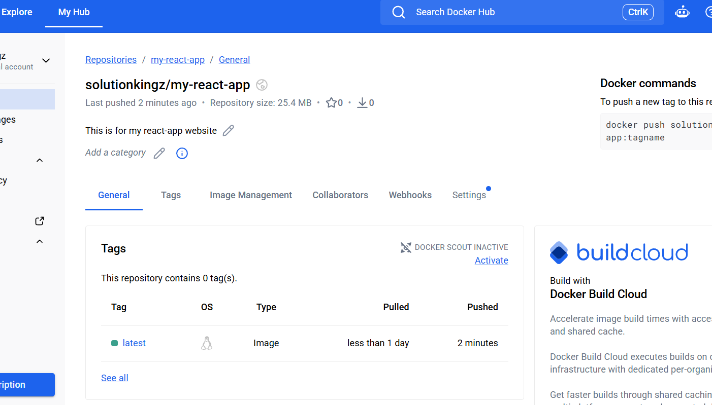
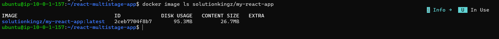
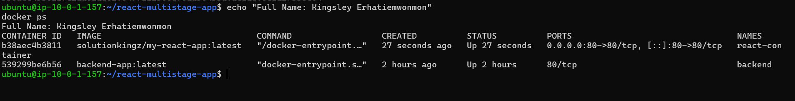
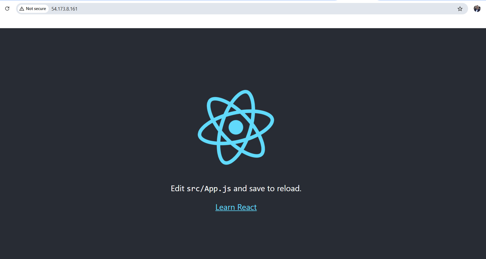

# Assignment 5 — Publish a Docker Container on Docker Hub

Part of the DevOps Micro Internship (DMI) with Agentic AI

---

## Purpose

In this assignment, you will publish a Dockerized React application to Docker Hub, remove the local image tags, pull the image again from Docker Hub, and run it to verify that it can be downloaded and deployed from a container registry.

---

# Task 1 — Publish a Docker Image to Docker Hub

## Goal

Tag a locally built React image, publish it to Docker Hub, remove the local copy, pull it again from Docker Hub, and run it successfully.

### Evidence

#### Screenshot 1 — Public Docker Hub Repository

Add a screenshot of Docker Hub showing your newly created public repository:

```text
my-react-app
```



---

#### Screenshot 2 — Successful Docker Login

Add a screenshot of the terminal showing:

```text
Login Succeeded
```

Ensure that your full name is visible and that no password, Personal Access Token, or device code is exposed.



---

#### Screenshot 3 — Correctly Tagged Image

Add a screenshot of the terminal showing:

```bash
docker image ls <YOUR_DOCKERHUB_USERNAME>/my-react-app
```

The output must show the `latest` tag.



---

#### Screenshot 4 — Successful Docker Push

Add a screenshot of the terminal showing successful completion of:

```bash
docker push <YOUR_DOCKERHUB_USERNAME>/my-react-app:latest
```

The output must include a pushed status or image digest.



---

#### Screenshot 5 — Published `latest` Tag in Docker Hub

Add a screenshot of your Docker Hub repository showing the uploaded `latest` image tag.



---

#### Screenshot 6 — Local Image Removed and Pulled Again

Add a screenshot of the terminal showing:

- The targeted local image tags removed
- Successful `docker pull` output
- `docker image ls` showing the pulled image



---

#### Screenshot 7 — Running Pulled Image

Add a screenshot of the terminal showing:

```bash
docker ps
```

The output must show the running `react-container` with:

```text
0.0.0.0:80->80/tcp
```



---

#### Screenshot 8 — React Application in Browser

Add a browser screenshot showing the React application at:

```text
http://54.173.8.161/
```

Ensure that the VM public IP is visible in the address bar. Add your full name as a clear caption directly below the screenshot.



---

# Docker Hub Repository URL

**Repository URL:** https://hub.docker.com/repository/docker/solutionkingz/my-react-app/general

---

# Registry and Image Tagging Notes

Write a short explanation covering:

- Why image tagging is required before pushing to Docker Hub
- Why a container registry is useful in DevOps workflows
- Why production deployments should use versioned image tags instead of relying only on `latest`

Why Image Tagging Is Required Before Pushing to Docker Hub

Docker Hub organizes images by a strict naming convention: <username or organization>/<repository>:<tag>. A locally built image, such as react-multistage:latest, has no relationship to any specific Docker Hub account or repository. It's just a name that only makes sense on the machine that built it.

The docker tag command creates a new reference that points to the same underlying image but with the correct destination path, in this case solutionkingz/my-react-app:latest. Without this step, Docker has no way to know which Docker Hub repository the image belongs to, and docker push will fail. Tagging doesn't duplicate the image or use extra disk space; it simply gives the existing image an additional name that matches where it needs to go.

Why a Container Registry Is Useful in DevOps Workflows

A container registry solves the fundamental problem that a Docker image built on one machine only exists on that machine. Without a registry, deploying an app anywhere else would require manually copying image files or rebuilding the image from scratch on every server, which is slow, inconsistent, and error-prone.

A registry acts as a central, shareable source of truth for images, similar to how GitHub is a shared source of truth for code. This is what makes several core DevOps practices possible:

Consistency: every environment, whether a developer's laptop, staging, or production, pulls the exact same image, so there is no "it works on my machine" gap.
Automation: CI/CD pipelines can automatically build, tag, and push images after every code change, then automatically pull and deploy them elsewhere.
Collaboration: a developer like solutionkingz can publish an image once, and a DevOps engineer can pull and deploy it without needing the source code or build environment.
Rollback and recovery: if a new image causes problems, an older image can be pulled back down and redeployed quickly.

Why Production Deployments Should Use Versioned Tags, Not Just latest

The latest tag is just a label, and by default it simply points to whichever image was most recently pushed without a specific tag. It is not guaranteed to mean "the newest working version." This creates real risks in production:

No way to know what's actually running. If ten different builds are all pushed as latest, you lose the ability to tell which version is currently live.
No safe rollback. If a new latest breaks production, there is no earlier latest to go back to; it's already been overwritten.
Inconsistent deployments. If latest changes between the time it's pulled on one server versus another (for example, during a rolling deployment), different servers may end up running different code at the same time.

Versioned tags, such as my-react-app:1.0.0, my-react-app:1.1.0, or a Git commit hash like my-react-app:a1b2c3d, solve this by giving every build a permanent, unique identity. This makes it possible to:

Deploy a specific, known version on purpose
Roll back instantly to a previous version by referencing its exact tag
Audit exactly which image version is running in any environment at any time

In practice, latest is useful for quick local testing, but production systems rely on specific version tags to stay predictable, auditable, and safe to roll back.

---

# LinkedIn Requirement

## Goal

Create a LinkedIn post about publishing a Docker container image to Docker Hub.

Include:

- Assignment title: **Publish a Docker Container Image to Docker Hub**
- Your Docker Hub repository URL
- What you published
- How you verified the remote image by pulling and running it
- Key learning outcomes

### Evidence

#### LinkedIn Post URL

Paste your LinkedIn post URL here:

https://www.linkedin.com/posts/kingsley-erhatiemwonmon_docker-devops-aws-ugcPost-7510411169992536064-iP2X/?utm_source=share&utm_medium=member_desktop&rcm=ACoAAClDkSEBa4Zo6dTWVIEEl8FJLczvH_zPHtY

---

#### LinkedIn Post Screenshot


---

# Submission Instructions

- Complete all steps in sequence.
- Include Screenshots 1–8 exactly as specified.
- Include your Docker Hub repository URL.
- Include the Registry and Image Tagging Notes.
- Include the LinkedIn post URL and screenshot.
- Ensure that your full name is visible in all terminal screenshots.
- Add your full name as a clear caption below the browser screenshot.
- Do not expose passwords, Personal Access Tokens, device codes, credentials, or other sensitive information.

---

# Completion Checklist

- [ ] Public `my-react-app` repository created
- [ ] Docker login completed successfully
- [ ] `react-multistage:latest` tagged correctly
- [ ] Image pushed to Docker Hub
- [ ] `latest` tag verified in Docker Hub
- [ ] Targeted local image tags removed
- [ ] Image pulled again from Docker Hub
- [ ] Pulled image runs successfully
- [ ] React application is accessible through the VM public IP
- [ ] Docker Hub repository URL included
- [ ] Registry and image-tagging notes completed
- [ ] LinkedIn post URL and screenshot included
- [ ] All required screenshots included
- [ ] Full name visible in terminal screenshots
- [ ] Browser screenshot has a full-name caption
- [ ] No passwords, tokens, or credentials exposed
---

## 📌 About DMI & CloudAdvisory

DevOps Micro Internship (DMI) is a project-based DevOps program run by Pravin Mishra (The CloudAdvisory) focused on real-world execution, systems thinking, and career readiness.

It helps learners build strong DevOps foundations with hands-on experience.

---

## 📌 Resources

- 🌐 DMI Official Website: https://dmi.pravinmishra.com?utm_source=github&utm_medium=readme  
- 🎓 University: https://university.pravinmishra.com?utm_source=github&utm_medium=readme  
- 💬 Discord Community: https://discord.pravinmishra.com?utm_source=github&utm_medium=readme  
- 📝 Blog: https://dmi.pravinmishra.com/blog?utm_source=github&utm_medium=readme  
- ▶️ YouTube Playlist: https://www.youtube.com/playlist?list=PLFeSNDtI4Cho  
- 🔗 Pravin Mishra (LinkedIn): https://www.linkedin.com/in/pravin-mishra-aws-trainer/  
- 🏢 CloudAdvisory (LinkedIn): https://www.linkedin.com/company/thecloudadvisory/

---

*This submission is part of DevOps Micro Internship (DMI) — Agentic AI Track.*
