# Assignment 7 — Capstone: Deploy a Production-Grade Stack for The EpicBook

Part of the DevOps Micro Internship (DMI) with Agentic AI

---

## Purpose

In this assignment, you will deploy the EpicBook application as a production-oriented Docker Compose stack on a cloud VM. You will use optimized container images, isolated networks, health checks, persistent MySQL storage, a selected reverse proxy, logging, backup and restore testing, and reliability procedures.

---

# Task 0 — App Discovery and Architecture

## Goal

Review the EpicBook repository and design the intended application architecture.

### Evidence

#### Screenshot 1 — EpicBook Project Structure

Add a terminal screenshot showing the EpicBook project structure after cloning the repository.

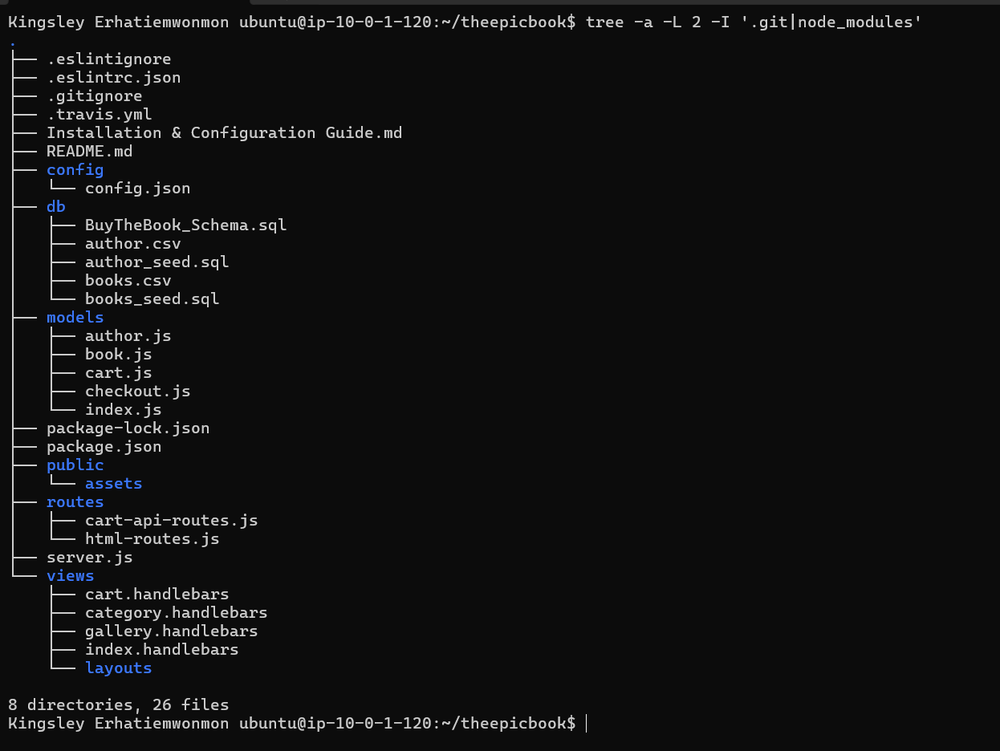

---

#### Screenshot 2 — Architecture Diagram

Add a screenshot of your architecture diagram showing:

- Public user
- Reverse proxy
- Frontend
- Backend
- Database
- Docker networks
- Public and private ports
- Persistent database storage

Add your full name inside the diagram or as a clear caption below it.

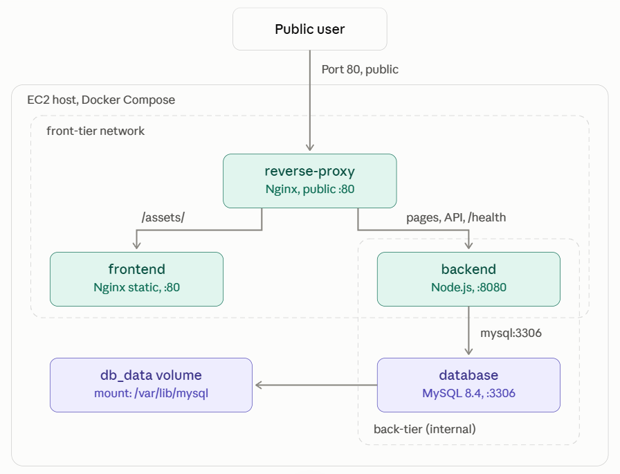

---

#### Screenshot 3 — Environment Variables and Ports Document

Add a screenshot showing the contents of:

```text
docs/02-env-and-ports.md
```

It must document environment-variable names, internal ports, persistent-data details, and the health-check method. Do not expose real credentials or values.

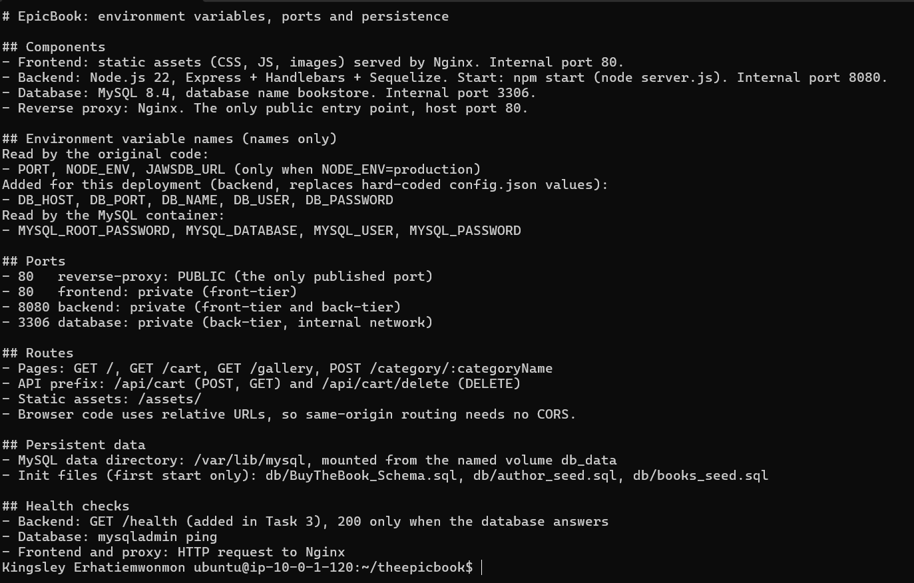

---

# Task 1 — Create Production Docker Images

## Goal

Create optimized production images for the EpicBook backend and frontend.

### Evidence

#### Screenshot 4 — Backend Dockerfile

Add a screenshot showing `backend/Dockerfile`, including:

- Dependency stage
- Minimal runtime stage
- Production startup command
- Internal backend port
- Non-root user configuration

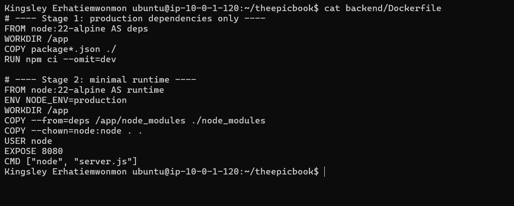

---

#### Screenshot 5 — Frontend Dockerfile

Add a screenshot showing `frontend/Dockerfile`, including:

- Nginx runtime image
- Static frontend files copied to the Nginx web root

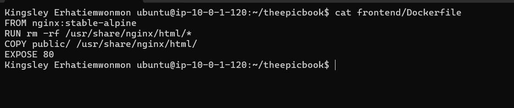

---

#### Screenshot 6 — Docker Ignore Files

Add a screenshot showing both:

```text
backend/.dockerignore
frontend/.dockerignore
```

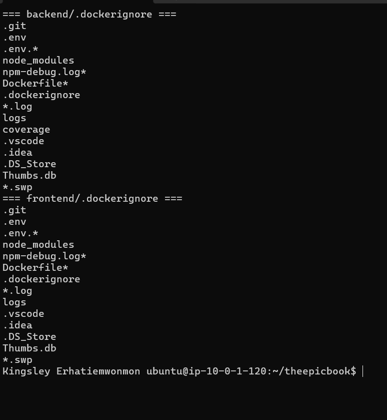

---

#### Screenshot 7 — Docker Image Builds and Size Comparison

Add a terminal screenshot showing successful builds of:

- Baseline backend image
- Optimized backend image
- Frontend image

The screenshot must also show the baseline and optimized backend image-size comparison.

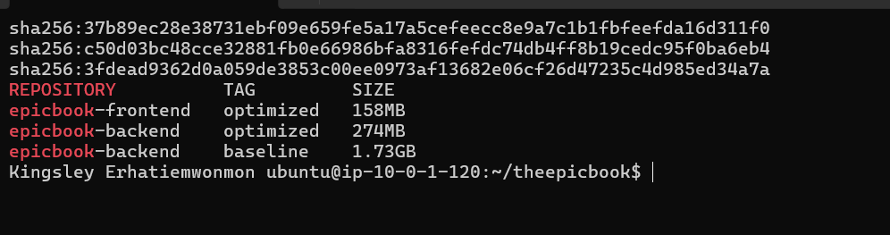

---

#### Screenshot 8 — Backend Running as Non-Root User

Add a terminal screenshot showing the optimized backend container running as a non-root user.

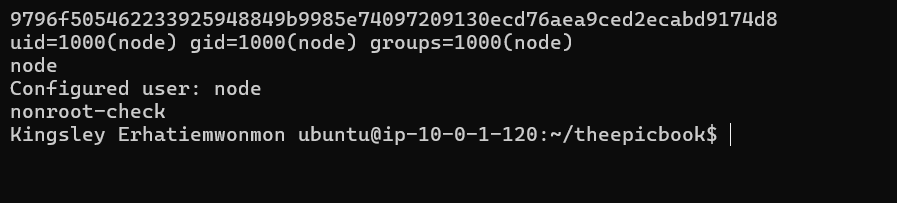

---

### Notes

Write a short note covering:

- Baseline and optimized backend image sizes
- The image-size reduction achieved
- One Docker layer-caching optimization used
- The security benefit of running the backend as a non-root user

- Image sizes: the baseline single-stage backend image is 1651 MB. It is built on the full Debian-based node:22 image, with every dependency installed. The optimized multi-stage image is 261 MB. It is built on node:22-alpine and contains production dependencies only.
- Size reduction: 84.2%, which is about 1390 MB saved. That makes it faster to pull, quicker to deploy and smaller to attack.
- Layer caching: package*.json is copied and npm ci --omit=dev runs before the application source is copied. Docker reuses the cached dependency layer until the dependencies change, so editing application code no longer triggers a full reinstall.
- Non-root security benefit: the container runs as the unprivileged node user (uid 1000), not root. If the application is compromised, the attacker has no root rights inside the container, so it is much harder to change system files, install tools or escalate to the host.

---

# Task 2 — Create the Docker Compose Stack and Networks

## Goal

Create one Docker Compose stack containing the reverse proxy, frontend, backend, and MySQL database.

### Evidence

#### Screenshot 9 — Docker Compose Services

Add a screenshot showing `docker-compose.yml` with all four services:

```text
reverse-proxy
frontend
backend
database
```

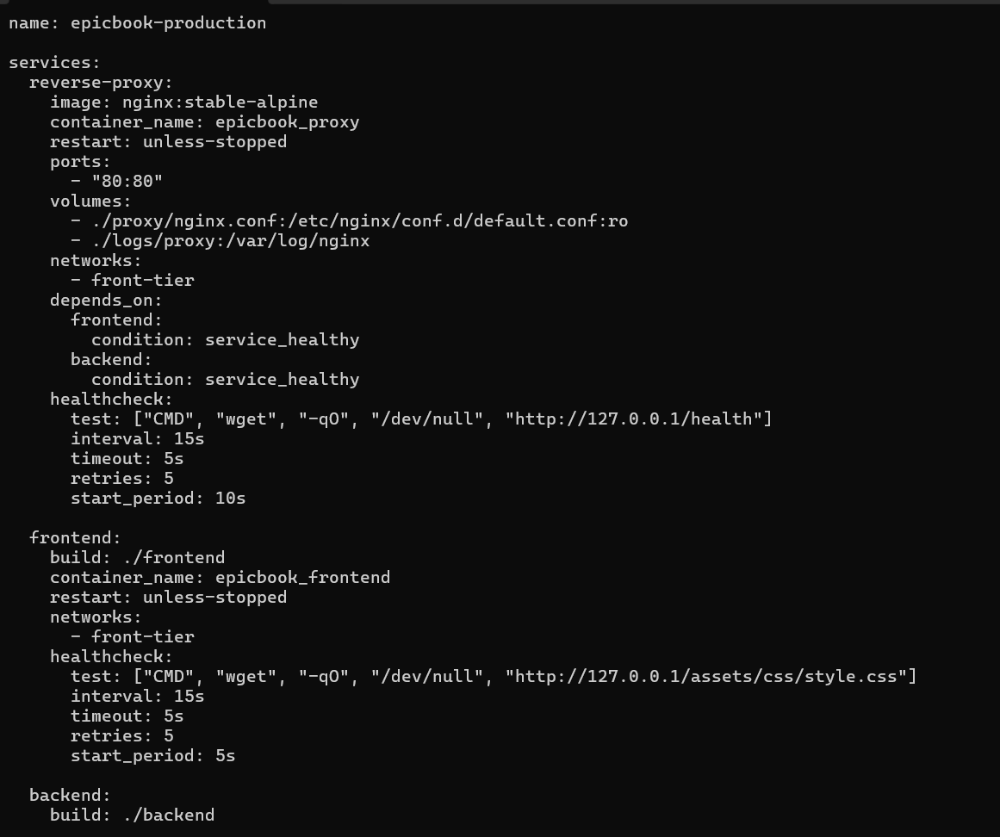

---

#### Screenshot 10 — Networks and Named Volume

Add a screenshot showing:

- `front-tier` network
- `back-tier` network
- `db_data` named volume

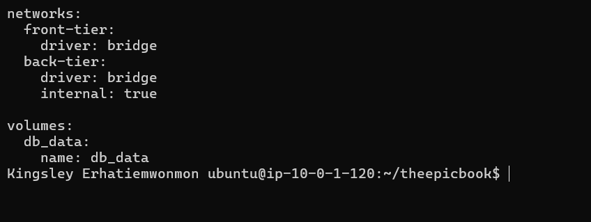

---

#### Screenshot 11 — Docker Compose Validation

Add a terminal screenshot showing successful Docker Compose validation without exposing environment-variable values or secrets.

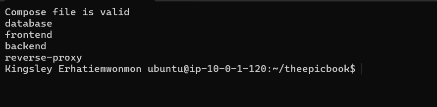

---

# Task 3 — Configure Health Checks and Startup Dependencies

## Goal

Configure health checks and ensure services start only after their dependencies are healthy.

### Evidence

#### Screenshot 12 — Backend Health Endpoint

Add a screenshot showing the backend application configuration for the `/health` endpoint.

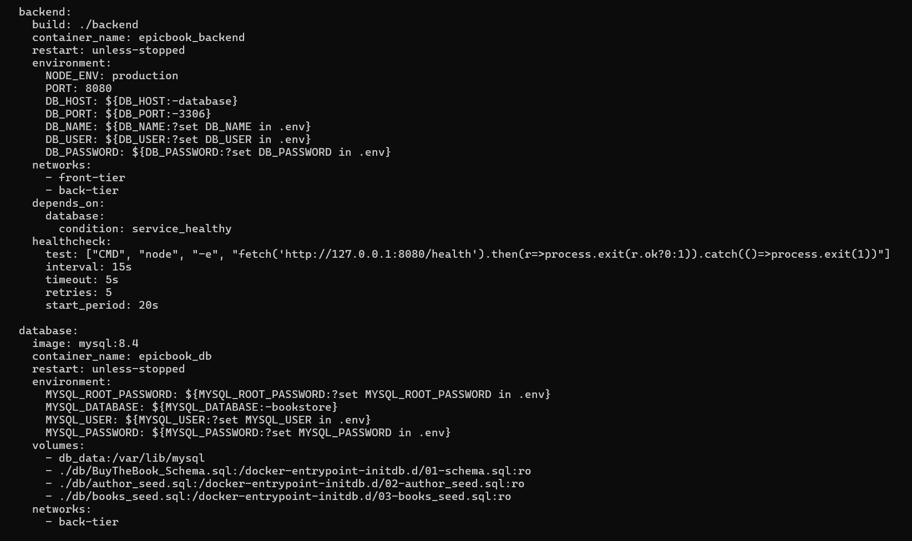

---

#### Screenshot 13 — MySQL and Backend Health Checks

Add a screenshot showing `docker-compose.yml` with health checks for MySQL and the backend.

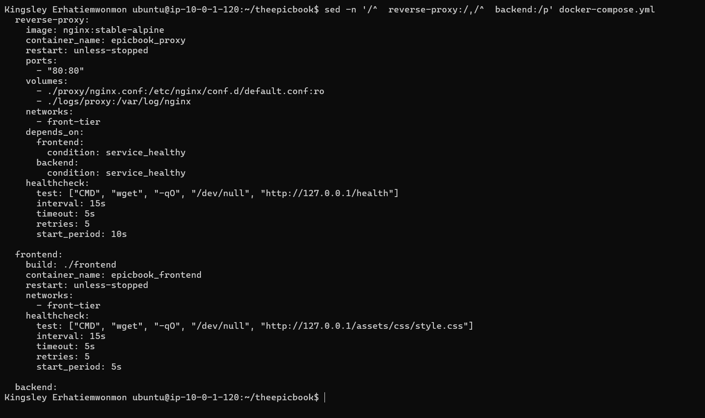

---

#### Screenshot 14 — Frontend and Reverse-Proxy Health Checks

Add a screenshot showing:

- Frontend health check
- Reverse-proxy health check
- `depends_on` conditions using `service_healthy`

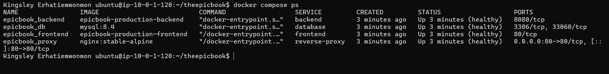

---

#### Screenshot 15 — Running Healthy Services

Add a terminal screenshot showing Docker Compose service status. The database, backend, frontend, and reverse proxy must be running successfully.

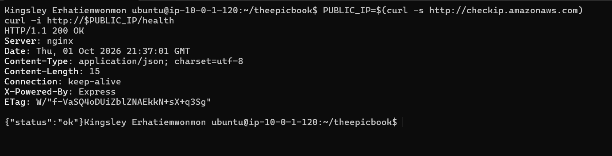

---

#### Screenshot 16 — Public Health Endpoint

Add a terminal screenshot showing a successful response from the public application health endpoint through the reverse proxy.

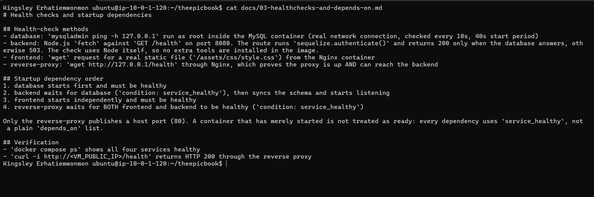

---

#### Screenshot 17 — Health-Check and Startup-Order Document

Add a screenshot showing the contents of:

```text
docs/03-healthchecks-and-depends-on.md
```

Explain the health-check method for each service and the startup dependency order.

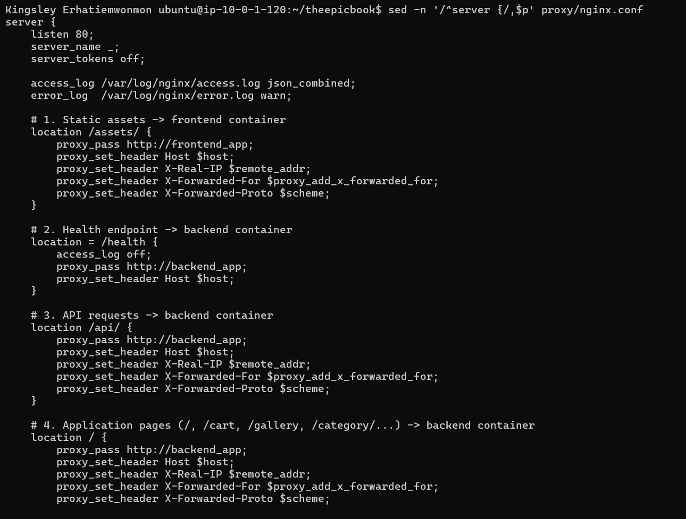

---

# Task 4 — Configure the Reverse Proxy and Same-Origin Routing

## Goal

Use either Nginx or Traefik as the only public entry point for the EpicBook application.

### Evidence

#### Screenshot 18 — Selected Reverse-Proxy Configuration

Add a screenshot showing the configuration for your selected reverse proxy.

It must show routes for:

- Static frontend assets
- Application pages
- API requests
- Health endpoint

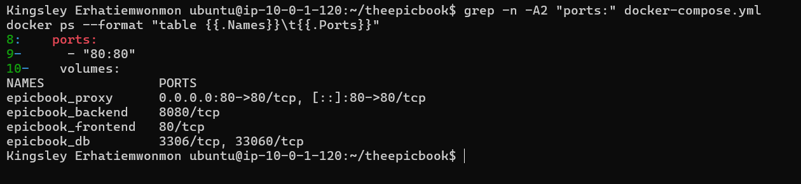

---

#### Screenshot 19 — Only Reverse Proxy Publishes Port 80

Add a screenshot of `docker-compose.yml` showing that only the `reverse-proxy` service publishes port 80.

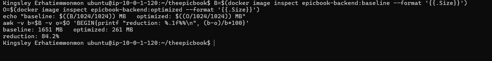

---

#### Screenshot 20 — Reverse-Proxy Route Testing

Add a terminal screenshot showing successful requests through the selected reverse proxy to:

- Application page
- One API endpoint
- One static asset
- Health endpoint

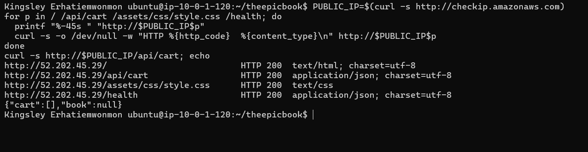

---

#### Screenshot 21 — EpicBook Application Through Public IP

Add a browser screenshot showing the EpicBook application loaded through the VM public IP address.

Add your full name as a clear caption below the screenshot.

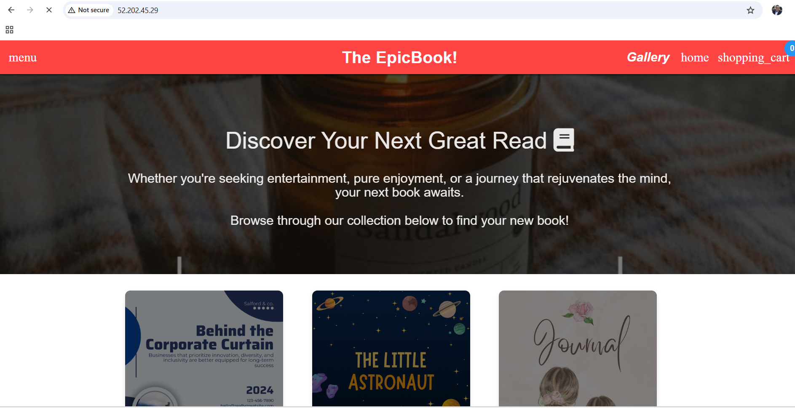

---

#### Screenshot 22 — Proxy Routing and CORS Document

Add a screenshot showing the contents of:

```text
docs/04-proxy-routing-and-cors.md
```

Explain the proxy routes and state whether CORS was required and why.

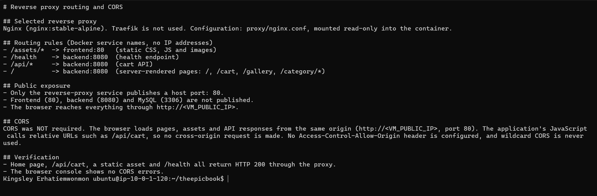

---

# Task 5 — Prove Data Persistence, Backup, and Restore

## Goal

Verify MySQL persistence and perform a controlled backup and restore drill.

### Evidence

#### Screenshot 23 — MySQL Volume Configuration

Add a terminal screenshot showing the `db_data` named volume and its MySQL mount configuration.

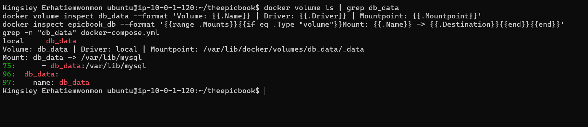

---

#### Screenshot 24 — Test Data Before Backup

Add a terminal screenshot showing the selected test data before the backup and restore drill.

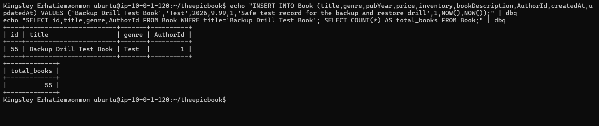

---

#### Screenshot 25 — Successful Backup Creation

Add a terminal screenshot showing successful backup creation and the backup file stored in the host backup directory.

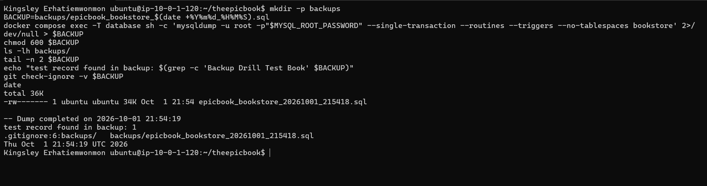

---

#### Screenshot 26 — Controlled Data-Loss Test

Add a terminal screenshot showing that the selected test record was removed during the controlled data-loss test.

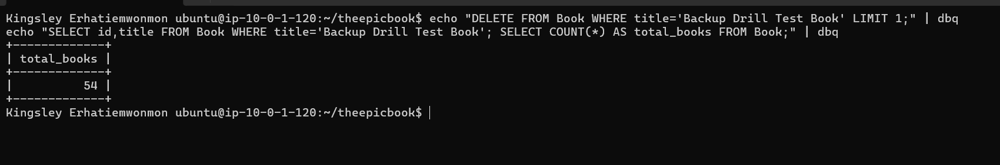

---

#### Screenshot 27 — Restore Verification

Add a terminal screenshot showing successful restore and verification that the deleted test record is available again.

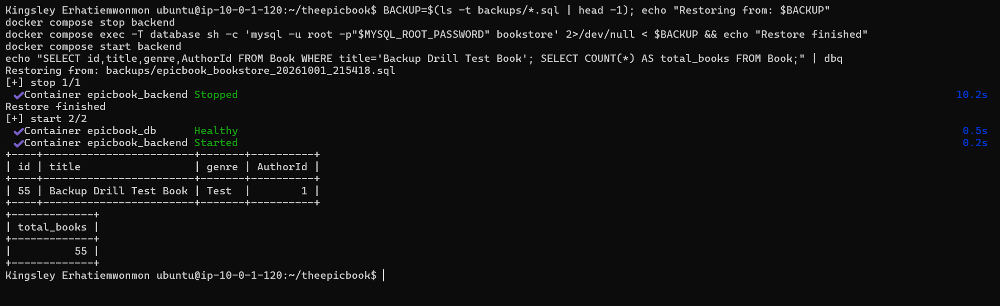

---

#### Screenshot 28 — Persistence After Down/Up Cycle

Add a terminal screenshot showing that database data remains available after a non-destructive Docker Compose down/up cycle.

Do not use `docker compose down -v`.

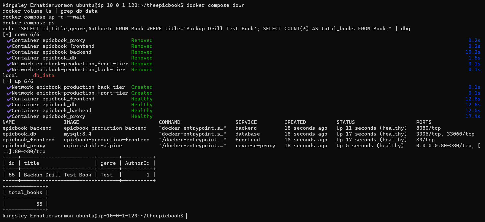

---

#### Screenshot 29 — Persistence and Backup Document

Add a screenshot showing the contents of:

```text
docs/05-persistence-and-backup.md
```

Include the backup plan and restore procedure.

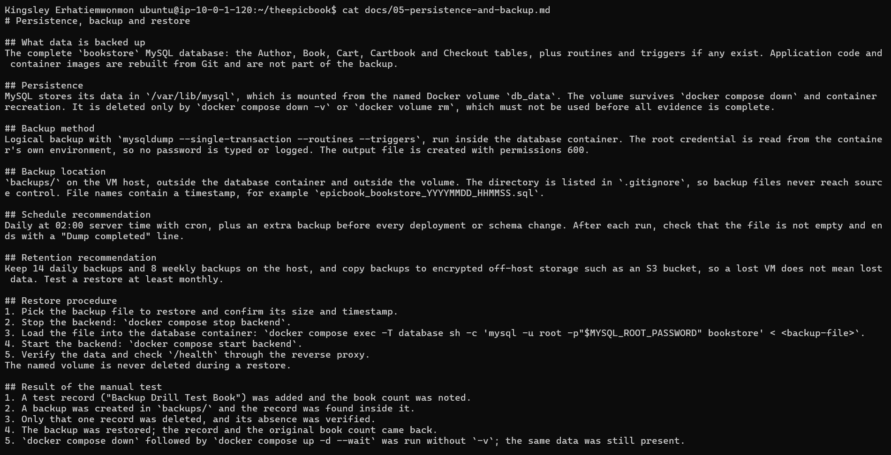

---

# Task 6 — Configure Logging and Observability

## Goal

Configure useful reverse-proxy and backend logs without exposing sensitive information.

### Evidence

#### Screenshot 30 — Logging Configuration

Add a screenshot showing:

- Configuration for the selected reverse proxy
- Proxy log format
- Docker Compose host log-directory bind mount

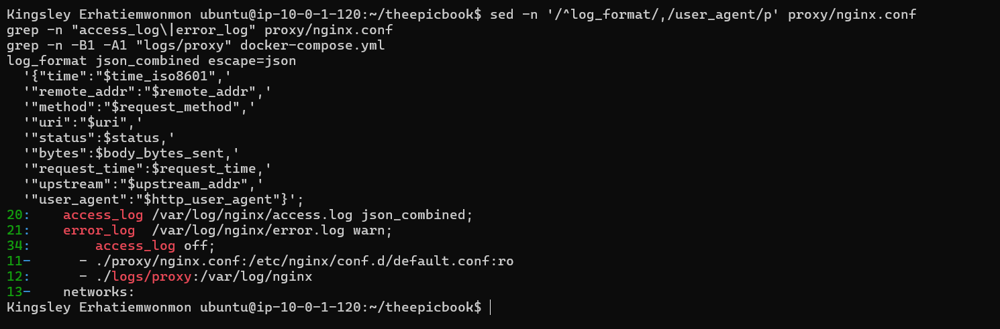

---

#### Screenshot 31 — Persistent Proxy Logs and Backend Logs

Add a terminal screenshot showing:

- Selected reverse-proxy logs available from the host directory after a proxy restart
- Backend logs displayed through Docker Compose

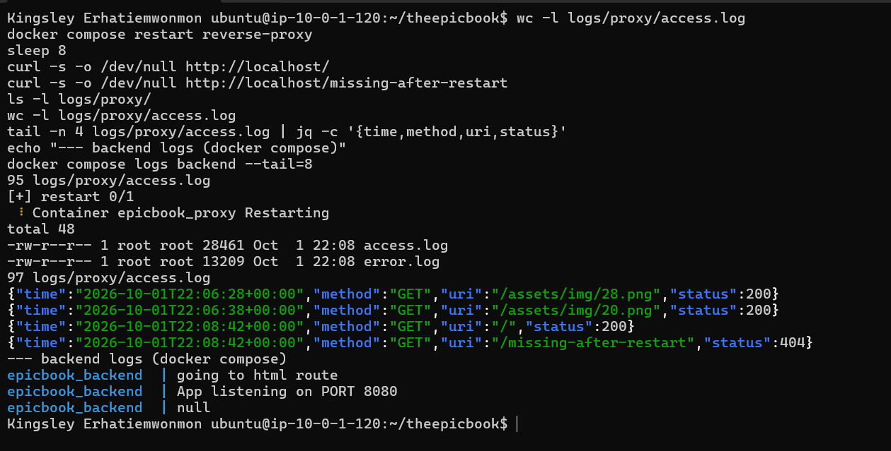

---

### Notes

Write a short note covering:

- The selected reverse proxy
- Host path used for reverse-proxy logs
- How backend logs are viewed
- Whether JSON or standard text logs were used
- Why passwords, tokens, headers, and database connection strings must not appear in logs

**Selected reverse proxy:** Nginx (nginx:stable-alpine). It is the only public entry point, on port 80.

**Host path for reverse-proxy logs:** `logs/proxy/` in the project folder (`~/theepicbook/logs/proxy/` on the VM). It is bind-mounted to `/var/log/nginx` in the proxy container and contains `access.log` and `error.log`. The files stay on the host after the container is restarted or removed.

**How backend logs are viewed:** the backend writes to stdout and stderr, so they are read through Docker Compose with `docker compose logs backend --tail=50`. Adding `-f` follows the log live.

**Log format:** the access log uses structured JSON, one object per line, with time, client address, method, path, status, bytes sent, request time and upstream. The error log uses Nginx's standard timestamped text format.

**Why secrets must not appear in logs:** logs are copied, shipped to other systems, kept for a long time and read by many people, often with weaker access controls than the systems that produced them. A password, token, authorization header or database connection string that reaches a log is effectively leaked, and the log becomes an attractive target. Anyone who can read it could reuse the credential. This deployment logs only the request path, status, size and timing. It does not log headers, cookies, query strings or request bodies.

---

# Task 7 — Deploy and Verify the Stack on a Cloud VM

## Goal

Deploy the completed Docker Compose stack on an AWS or Azure VM and verify public access.

### Evidence

#### Screenshot 32 — VM Public IP and Inbound Rules

Add a cloud-console screenshot showing:

- VM public IP address
- SSH port 22 restricted to your IP address
- HTTP port 80 allowed from Anywhere

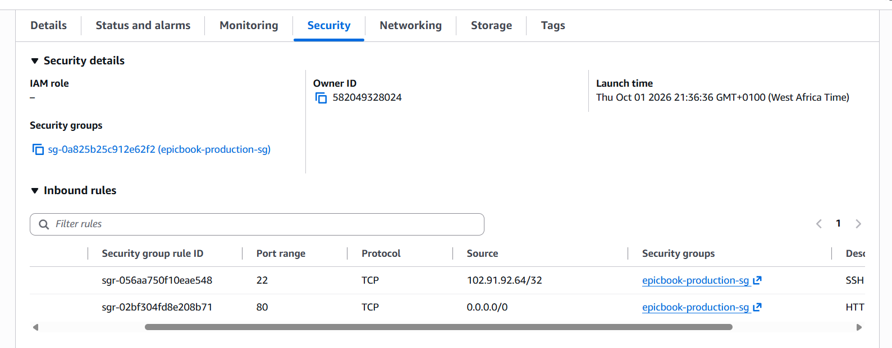

---

#### Screenshot 33 — Cloud VM Stack Verification

Add a VM terminal screenshot showing:

- Docker Compose service status
- Successful public health or API response
- No published database, frontend, or backend ports

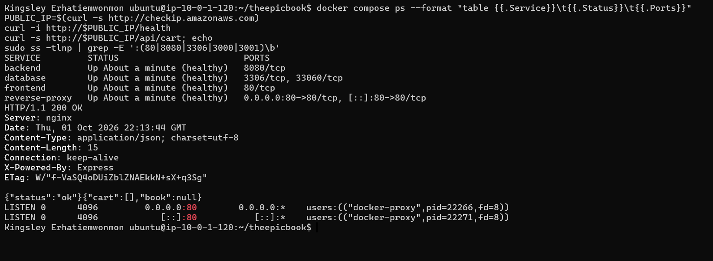

---

#### Screenshot 34 — EpicBook Application on Cloud VM

Add a browser screenshot showing the EpicBook application loaded through the VM public IP address.

Add your full name as a clear caption below the screenshot.

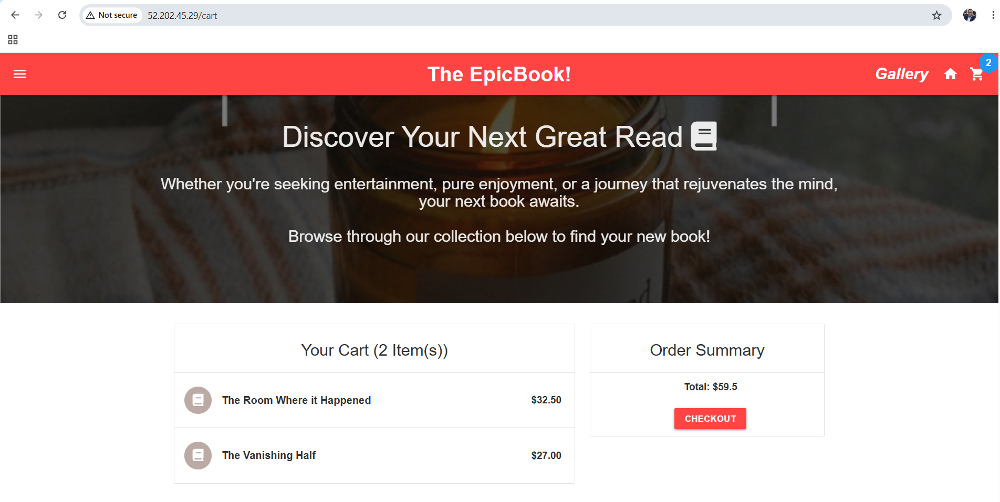

---

### Notes

Write a short note covering:

- Cloud provider used
- VM operating system
- Public port exposed
- Security rules configured
- Confirmation that the application and backend API worked through the reverse proxy

**Cloud provider used:** AWS (Amazon EC2, region us-east-1). The infrastructure was provisioned with Terraform: a VPC, a public subnet, an internet gateway, a security group, an Elastic IP and one `t3.medium` instance.

**VM operating system:** Ubuntu 22.04 LTS, with Docker Engine and Docker Compose v2 installed.

**Public port exposed:** port 80 (HTTP) only, served by the Nginx reverse proxy. It is the only service that publishes a host port.

**Security rules configured:**
- Inbound SSH (22): allowed only from my own IP address (a single /32 address).
- Inbound HTTP (80): allowed from anywhere (0.0.0.0/0).
- No other inbound rules. MySQL (3306), the backend (8080) and the frontend are not published and not allowed in the security group.
- Inside Docker, MySQL sits on the `back-tier` network, which is marked internal, so it has no route to or from the internet.

**Confirmation:** through the reverse proxy at `http://<VM_PUBLIC_IP>`, the home page, a static asset, the `/api/cart` API endpoint and the `/health` endpoint all returned HTTP 200. In the browser, the EpicBook application loaded and a book could be added to the cart, which retrieves data from the backend API and the database. A non-destructive `docker compose down` and `up` cycle brought the stack back with all four services healthy.

---

# Task 8 — Automate Deployment with CI/CD (Optional)

## Goal

Optionally automate image build, image push, and deployment through GitHub Actions or Azure Pipelines.

### Optional Evidence

#### Optional Screenshot — Successful CI/CD Pipeline Run

Add a screenshot showing a successful pipeline run with build, image push, deployment, and verification stages.

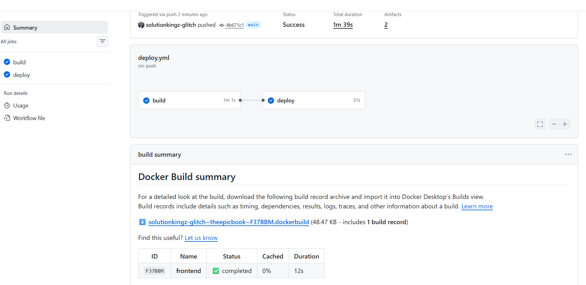

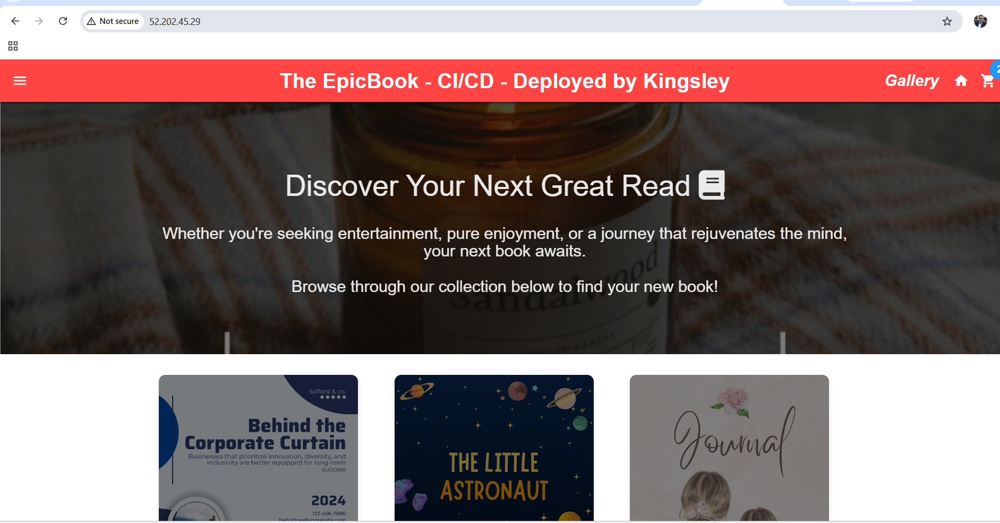

---

### Optional Notes

Write a short note covering:

- CI/CD platform used
- Image-tagging method
- Registry used
- Deployment trigger
- Manual approval or secret-handling approach

* **CI/CD platform:** GitHub Actions was used to automate the build, image push, deployment, and health-check stages.
* **Image-tagging method:** Docker images were tagged with the unique Git commit SHA, providing immutable and traceable image versions.
* **Registry:** GitHub Container Registry (GHCR) was used to store the backend and frontend Docker images.
* **Deployment trigger:** Deployment is automatically triggered when changes are pushed to the `main` branch. A manual `workflow_dispatch` trigger is also available.
* **Approval / secret handling:** No manual approval was required for this deployment. Sensitive credentials such as AWS keys, SSH keys, VM details, and GHCR authentication were stored as GitHub Actions Secrets rather than hard-coded in the workflow.

---

# Task 9 — Perform Reliability Tests and Create an Operations Runbook

## Goal

Test controlled service failures and document safe operating procedures.

### Evidence

#### Screenshot 35 — Backend Failure and Recovery

Add a terminal screenshot showing:

- Backend failure test
- Expected unavailable response through the reverse proxy
- Backend restart
- Successful health-check recovery

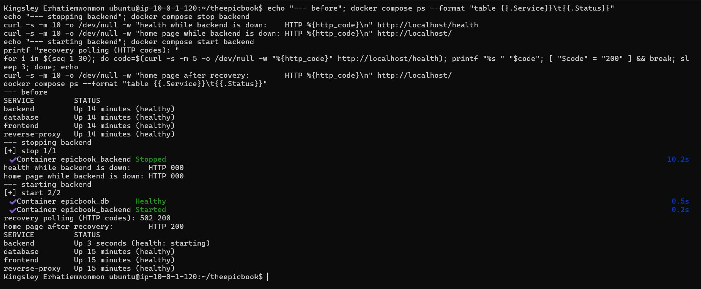

---

#### Screenshot 36 — Database Failure and Recovery

Add a terminal screenshot showing:

- Database outage test
- Failed database-dependent request
- Database restart
- Successful application recovery

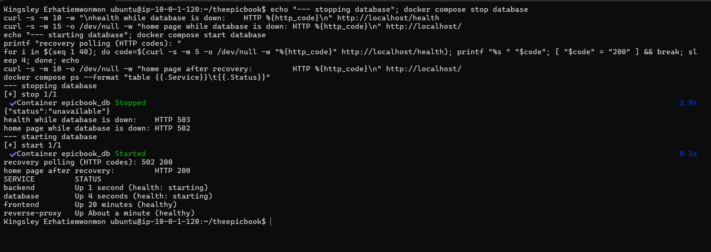

---

### Notes

Write a short operations runbook covering:

- Safe restart procedure for reverse proxy, frontend, backend, and database
- Backup and restore procedure
- Secret-rotation approach
- Database recovery procedure
- What to check when the application returns an error
- Results of backend and database reliability tests

# EpicBook operations runbook

Run all commands from the project folder (`~/theepicbook`). Never use `docker compose down -v` on a live system: it deletes the `db_data` volume and all stored data.

## 1. Safe restart procedure
Restart one service at a time and confirm health before touching the next (`docker compose ps`, then `curl -i http://localhost/health`).
- Reverse proxy: `docker compose restart reverse-proxy`. Access logs stay on the host in `logs/proxy/`.
- Frontend: `docker compose restart frontend`
- Backend: `docker compose restart backend` (wait 10-25 s for the schema sync, then check health)
- Database: `docker compose restart database` (wait for healthy, then confirm the backend is healthy; restart it if not)
- Full restart order: database, backend, frontend, reverse proxy. Nginx resolves service names at startup, so if the proxy returns 502 after another container was recreated, restart the proxy.

## 2. Backup and restore
- Backup: `docker compose exec -T database sh -c 'mysqldump -u root -p"$MYSQL_ROOT_PASSWORD" --single-transaction --routines --triggers --no-tablespaces bookstore' > backups/epicbook_bookstore_$(date +%Y%m%d_%H%M%S).sql`. Confirm the file is not empty and ends with "Dump completed". Backups live in `backups/` on the host (outside the container, ignored by Git).
- Restore: stop the backend (`docker compose stop backend`), load the file with `docker compose exec -T database sh -c 'mysql -u root -p"$MYSQL_ROOT_PASSWORD" bookstore' < backups/<file>.sql`, start the backend, then verify the data and `/health`. The volume is never deleted.
- Recommended: daily backup at 02:00 plus one before every deployment; keep 14 daily and 8 weekly copies, and copy them off the host.

## 3. Secret-rotation approach
1. Generate a new random value (`openssl rand -hex 16`).
2. The `MYSQL_*` variables only apply when the volume is first created, so first change the password inside MySQL (`ALTER USER`), then update `.env` (`DB_PASSWORD` must match `MYSQL_PASSWORD`), then recreate the containers with `docker compose up -d`.
3. Rotate the SSH key pair through Terraform. Keep `.env` out of Git and out of screenshots.
4. Run the checks in section 5 after every rotation.

## 4. Database recovery procedure
1. Check state: `docker compose ps` and `docker compose logs database --tail=50`.
2. If the container is stopped: `docker compose start database`, then wait for `(healthy)`. The `db_data` volume is untouched, so no data is lost.
3. The backend crashes while MySQL is down and its restart policy brings it back. If it stays unhealthy once MySQL is healthy, run `docker compose restart backend`, then `docker compose restart reverse-proxy`.
4. If data is missing or corrupted, follow the restore steps in section 2 using the latest good backup.
5. Verify with the checks in section 5.

## 5. What to check when the application returns an error
- `docker compose ps`: which service is not `(healthy)`?
- `curl -i http://localhost/health`: 200 means proxy, backend and database all answer; 503 means the database is unreachable; 502 means the backend is down or the proxy holds a stale address.
- `docker compose logs backend --tail=50`: application and database errors.
- `tail logs/proxy/error.log` and `logs/proxy/access.log`: upstream failures and status codes.
- 404 means a wrong URL; 500 means a backend error (read the backend logs).
- Confirm that only port 80 is published (`docker ps`) and that the security group is unchanged.

## 6. Reliability test results
- Backend stopped (`docker compose stop backend`): the reverse proxy stayed up and returned HTTP **502** for `/health` and the home page. After `docker compose start backend`, health returned **200** again within about **<N> seconds** and the application worked normally.
- Database stopped (`docker compose stop database`): `/health` returned HTTP **503** with `{"status":"unavailable"}`, and a database-dependent page failed (**<502/500>**). After `docker compose start database`, the backend reconnected and the application recovered after about **<N> seconds**.
- No volume, table or record was deleted in either test, and all four services ended `(healthy)`.

---

# Final Public Application URL

**EpicBook URL:** http://52.202.45.29

Replace the placeholder with your working public URL.

---

# GitHub Repository URL

**Your Fork or Repository URL:** https://github.com/solutionkingz-glitch/epicbook-docker-cicd.git

---

# LinkedIn Requirement

## Goal

Create a professional LinkedIn post of 6–10 lines about your EpicBook capstone deployment.

Your post must include:

- The architectural decision that most improved reliability
- Your biggest image-size reduction, with numbers
- Key production-hardening lessons
- A deployment verification image

### Evidence

**LinkedIn Post URL:** https://www.linkedin.com/posts/kingsley-erhatiemwonmon_devops-cloudengineering-aws-ugcPost-7512235465216008192-Td62/?utm_source=share&utm_medium=member_desktop&rcm=ACoAAClDkSEBa4Zo6dTWVIEEl8FJLczvH_zPHtY

#### LinkedIn Post Screenshot

Add a screenshot of the published LinkedIn post showing the text body and deployment verification image.

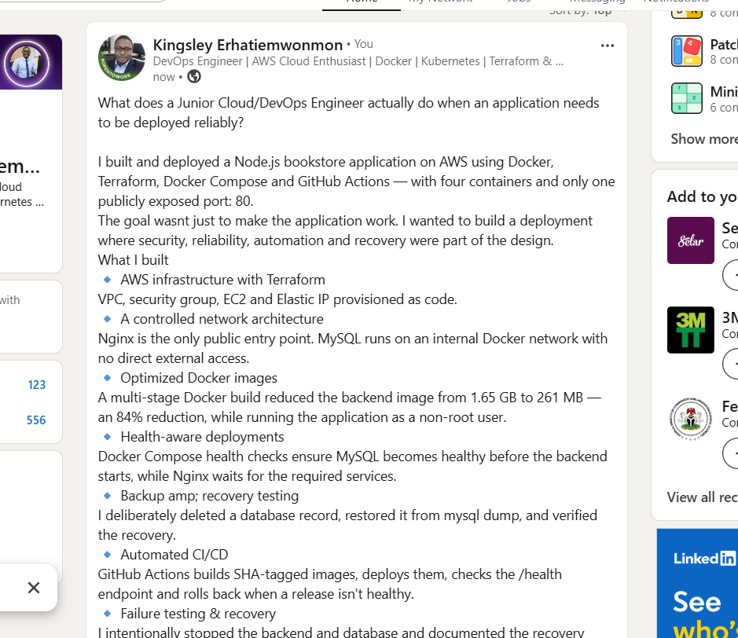

---

# Submission Checklist

- [ ] EpicBook repository reviewed and architecture diagram created
- [ ] Environment variables, ports, persistence, and health-check details documented
- [ ] Backend and frontend production Dockerfiles created
- [ ] Backend runs as a non-root user
- [ ] Docker image-size comparison completed
- [ ] Docker Compose stack includes reverse proxy, frontend, backend, and database
- [ ] `front-tier` and `back-tier` networks configured
- [ ] `db_data` named volume configured
- [ ] MySQL, backend, frontend, and reverse-proxy health checks configured
- [ ] Startup dependencies use `service_healthy`
- [ ] Nginx or Traefik selected as the only public reverse proxy
- [ ] Only reverse-proxy port 80 is publicly published
- [ ] Same-origin routing configured and CORS used only when required
- [ ] Backup, restore, and persistence testing completed
- [ ] Reverse-proxy and backend logs verified
- [ ] Cloud VM deployment verified through the public IP
- [ ] Backend and database reliability tests completed
- [ ] Screenshots 1–36 included
- [ ] Required notes completed
- [ ] LinkedIn post URL and screenshot included
- [ ] Full name visible in required screenshots or captions
- [ ] No passwords, tokens, private keys, account IDs, or other sensitive information exposed

---

## 📌 About DMI & CloudAdvisory

DevOps Micro Internship (DMI) is a project-based DevOps program run by Pravin Mishra (The CloudAdvisory) focused on real-world execution, systems thinking, and career readiness.

It helps learners build strong DevOps foundations with hands-on experience.

---

## 📌 Resources

- 🌐 DMI Official Website: https://dmi.pravinmishra.com?utm_source=github&utm_medium=readme  
- 🎓 University: https://university.pravinmishra.com?utm_source=github&utm_medium=readme  
- 💬 Discord Community: https://discord.pravinmishra.com?utm_source=github&utm_medium=readme  
- 📝 Blog: https://dmi.pravinmishra.com/blog?utm_source=github&utm_medium=readme  
- ▶️ YouTube Playlist: https://www.youtube.com/playlist?list=PLFeSNDtI4Cho  
- 🔗 Pravin Mishra (LinkedIn): https://www.linkedin.com/in/pravin-mishra-aws-trainer/  
- 🏢 CloudAdvisory (LinkedIn): https://www.linkedin.com/company/thecloudadvisory/

---

*This submission is part of DevOps Micro Internship (DMI) — Agentic AI Track.*
